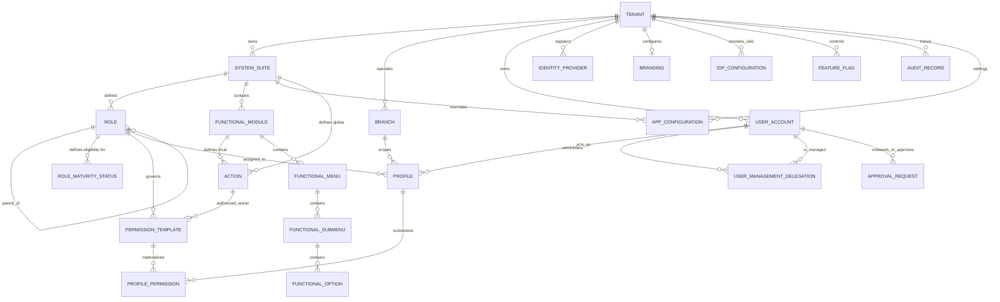
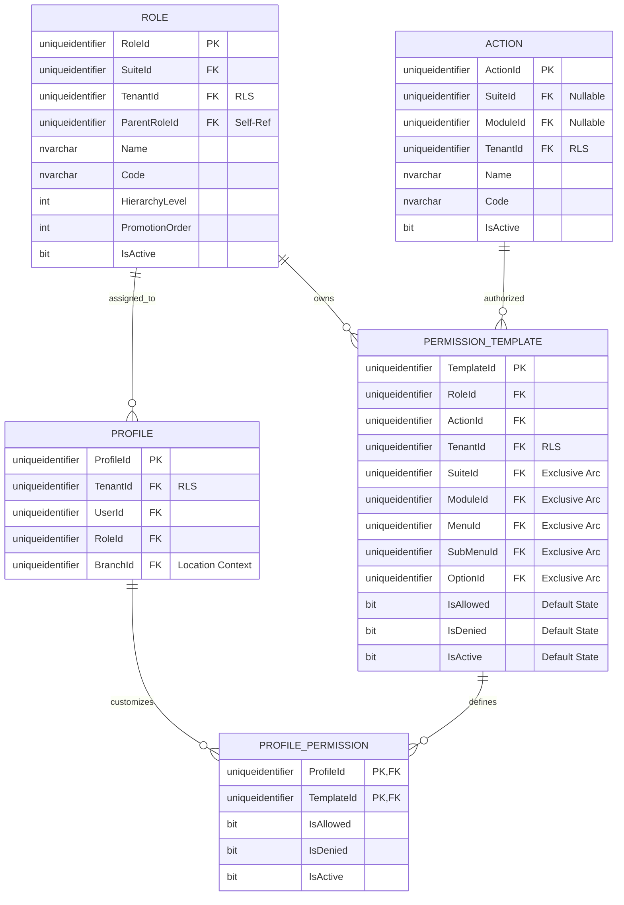
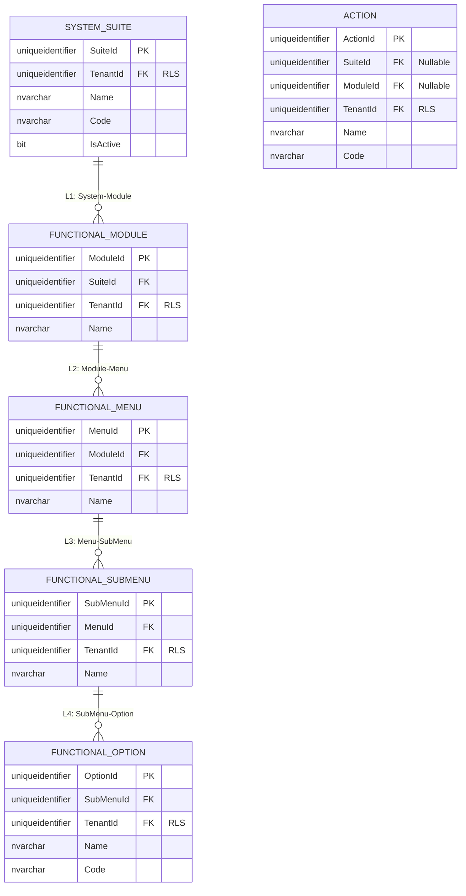
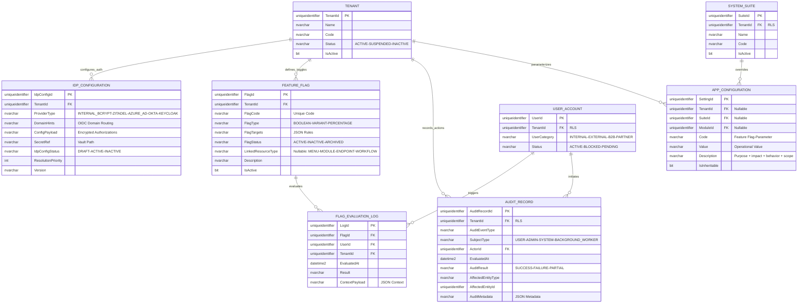

# Entity-Relationship (E/R) Model - SQL Server 2022

**Document Type:** Database Design  
**Status:** Refactored (Role-Scoped & Strict Hierarchy)  
**Architecture:** Hierarchical Master Framework (5-Level Control)  
**Engine:** SQL Server 2022

## 1. Introduction
This document details the **Role-Scoped** authorization model, strictly enforcing the hierarchical chain: **System → Module → Menu → SubMenu → Option**.

> [!NOTE]
> **Ubiquitous Language Mapping:** The schema entity names align with the [Glossary](../../governance/requirements/glossary.md) as follows:
> `SYSTEM_SUITE` = **System** · `FUNCTIONAL_MODULE` = **Module** · `FUNCTIONAL_MENU` = **Menu** · `FUNCTIONAL_SUBMENU` = **SubMenu** · `FUNCTIONAL_OPTION` = **Option**

> [!TIP]
> **Visualization Issues?**  
> If Mermaid diagrams do not render correctly in your IDE, please use the **[ Alternative Export Formats (dbdiagram.io, DDL, D2)](./er-export-formats.md)**. These formats are compatible with professional tools like DBeaver, SSMS, and dbdiagram.io.

---

## 2. Standard Corporate Audit & Traceability
All entities implement the standard 10-column audit schema.

---

## 3. Modular Domain Views

### 3.1 Global High-Level Map
Full Resolution Path: `Tenant -> System -> Role -> Template -> ProfilePermission`.

---

### 3.2 Domain: Role-Centric Authority & Strict Hierarchy
This domain ensures every permission is scoped to a Role and maps exactly to the 5-level functional hierarchy.

---

### 3.3 Domain: Functional Topology (The 5 Levels)
Organizational structure of resources.

---

### 3.4 Domain: Identity Governance & Approvals
Management of user lifecycle, delegated administration, and onboarding workflows for high-risk or external identities.

```mermaid
erDiagram
    TENANT ||--o{ USER_ACCOUNT : "owns"
    TENANT ||--o{ IDENTITY_PROVIDER : "registers"
    TENANT ||--o| BRANDING : "configures"
    USER_ACCOUNT ||--o{ USER_MANAGEMENT_DELEGATION : "admin"
    USER_ACCOUNT ||--o{ USER_MANAGEMENT_DELEGATION : "managed"
    USER_ACCOUNT ||--o{ ROLE_MATURITY_STATUS : "has"
    ROLE ||--o{ ROLE_MATURITY_STATUS : "defines_eligibility"
    APPROVAL_WORKFLOW ||--o{ APPROVAL_REQUEST : "defines_rules_for"
    APPROVAL_WORKFLOW ||--o{ APPROVAL_REQUIRED_DOCUMENT : "mandates"
    APPROVAL_REQUEST ||--o{ USER_DOCUMENT : "evidenced_by"
    APPROVAL_REQUIRED_DOCUMENT ||--o{ DOCUMENT_TYPE : "typed_as"

    USER_ACCOUNT ||--o{ USER_DOCUMENT : "holds"
    DOCUMENT_TYPE ||--o{ USER_DOCUMENT : "classifies"
    DOCUMENT_TYPE ||--o{ NOTIFICATION_RULE : "alerts_for"
    DOCUMENT_TYPE ||--o{ ACCESS_ENFORCEMENT_POLICY : "governs_access"

    USER_ACCOUNT ||--o{ PROMOTION_REQUEST : "initiates"
    ROLE ||--o{ PROMOTION_REQUEST : "target"
    APPROVAL_REQUEST ||--o{ PROMOTION_REQUEST : "authorized_by"
    PROMOTION_REQUEST ||--o{ PROMOTION_IMPACT_ANALYSIS : "evaluates_risk"

    TENANT {
        uniqueidentifier TenantId PK
        nvarchar Name
        nvarchar Code
        nvarchar Status "ACTIVE-SUSPENDED-INACTIVE"
        bit IsActive
    }

    USER_ACCOUNT {
        uniqueidentifier UserId PK
        uniqueidentifier TenantId FK "RLS"
        nvarchar UserCategory "INTERNAL-EXTERNAL-B2B-PARTNER"
        nvarchar Status "ACTIVE-BLOCKED-PENDING"
    }

    IDENTITY_PROVIDER {
        uniqueidentifier IdpId PK
        uniqueidentifier TenantId FK
        nvarchar Code "SAML-OIDC-AZURE_AD"
        nvarchar Name
        nvarchar Description
        nvarchar Strategy "OIDC-SAML2-WS_FED"
        bit IsActive
    }

    BRANDING {
        uniqueidentifier BrandingId PK
        uniqueidentifier TenantId FK "One-to-One RLS"
        nvarchar Logo "URI Storage Path"
        nvarchar LogoFormat "PNG-SVG-JPEG"
        nvarchar PrimaryColor "Hex Code"
        nvarchar BackgroundStyle "Glassmorphism-SleekDark"
        nvarchar HeadlineText
        nvarchar SecondaryText
        nvarchar PrimaryButtonLabel
        nvarchar FooterText
        nvarchar CustomDomain "Nullable"
        nvarchar DnsVerificationStatus "PENDING-VERIFIED-FAILED"
        nvarchar DnsCnameTarget
        bit MagicLinkFallbackEnabled
    }

    ROLE {
        uniqueidentifier RoleId PK
        uniqueidentifier SuiteId FK
        uniqueidentifier TenantId FK "RLS"
        uniqueidentifier ParentRoleId FK "Self-Ref"
        nvarchar Name
        nvarchar Code
        int HierarchyLevel
        int PromotionOrder
        bit IsActive
    }

    ROLE_MATURITY_STATUS {
        uniqueidentifier MaturityStatusId PK
        uniqueidentifier TenantId FK "RLS"
        uniqueidentifier UserId FK
        uniqueidentifier RoleId FK
        nvarchar CurrentLevel "Junior-Intermediate-Senior-Lead-Principal"
        int CompletedCertificationsCount
        int CompletedTrainingsCount
        double PerformanceScore
        bit HasComplianceIssues
        datetime2 LastLevelChangeDate
    }

    USER_MANAGEMENT_DELEGATION {
        uniqueidentifier DelegationId PK
        uniqueidentifier ParentAdminUserId FK
        uniqueidentifier ManagedUserId FK
        uniqueidentifier SuiteId FK "Optional Scope"
    }

    APPROVAL_WORKFLOW {
        uniqueidentifier WorkflowId PK
        uniqueidentifier TenantId FK
        uniqueidentifier SuiteId FK "Nullable"
        nvarchar Code
        nvarchar Value
        nvarchar Description
        nvarchar TargetUserCategory
        bit RequiresApproval
    }

    APPROVAL_REQUIRED_DOCUMENT {
        uniqueidentifier DocumentTypeId PK, FK
        uniqueidentifier WorkflowId FK
        bit IsMandatory
    }

    APPROVAL_REQUEST {
        uniqueidentifier RequestId PK
        uniqueidentifier WorkflowId FK
        uniqueidentifier TargetUserId FK
        uniqueidentifier TargetProfileId FK "Nullable"
        nvarchar RequestStatus "PENDING-APPROVED-REJECTED"
    }

    DOCUMENT_TYPE {
        uniqueidentifier DocumentTypeId PK
        uniqueidentifier TenantId FK
        nvarchar Name
        nvarchar Code
        nvarchar Description
        int ExpirationDays
        nvarchar Criticity "LOW-MEDIUM-HIGH-CRITICAL"
        bit IsActive
    }

    USER_DOCUMENT {
        uniqueidentifier DocumentId PK
        uniqueidentifier UserId FK
        uniqueidentifier DocumentTypeId FK
        datetime2 IssueDate
        datetime2 ExpirationDate
        nvarchar Status "VALID-EXPIRED-PENDING_RENEWAL"
        nvarchar Criticity "LOW-MEDIUM-HIGH-CRITICAL"
        nvarchar FileStoragePath "URI Path to File Server"
    }

    NOTIFICATION_RULE {
        uniqueidentifier RuleId PK
        uniqueidentifier TenantId FK
        uniqueidentifier DocumentTypeId FK
        nvarchar Code
        nvarchar Value
        nvarchar Description
        int DaysBefore
        nvarchar Channel "EMAIL-IN_APP-SMS"
    }

    ACCESS_ENFORCEMENT_POLICY {
        uniqueidentifier PolicyId PK
        uniqueidentifier TenantId FK "Nullable (Global if NULL)"
        nvarchar Code
        nvarchar Value
        nvarchar Description
        uniqueidentifier DocumentTypeId FK
        nvarchar ActionOnExpiration "BLOCK_USER-RESTRICT_PROFILE-LOG_ONLY"
    }

    PROMOTION_REQUEST {
        uniqueidentifier PromotionRequestId PK
        uniqueidentifier TenantId FK
        uniqueidentifier TargetRoleId FK
        uniqueidentifier InitiatedByUserId FK
        nvarchar Status "DRAFT-SUBMITTED-APPROVED-EXECUTED-VERIFIED"
    }

    PROMOTION_IMPACT_ANALYSIS {
        uniqueidentifier ImpactAnalysisId PK
        uniqueidentifier PromotionRequestId FK
        nvarchar RiskLevel "LOW-MEDIUM-HIGH"
        nvarchar AnalysisDetails "JSON"
        bit ViolatesSoD
    }
```

---

### 3.5 Domain: Platform Configuration & System Auditing
This domain covers system-wide configuration, OIDC Identity Provider integrations, multi-dimensional Feature Flag controls, and the immutable append-only ledger for all system actions.

---

## 4. Business Rules & Technical Constraints
1.  **Row-Level Security (RLS)**: `TenantId` is denormalized across all functional entities (Module, Option, Template, Action, Role) to allow O(1) isolation checks via SQL Server RLS.
2.  **Exclusive Arc (Template Integrity)**: `PermissionTemplate` implements 5 nullable FKs pointing to the resource hierarchy. A `CHECK` constraint guarantees exactly ONE is populated, enforcing strict database referential integrity over polymorphism.
3.  **Strict XOR Action Ownership**: An Action must belong to a System OR a Module, but never both: `CHECK ((SuiteId IS NOT NULL AND ModuleId IS NULL) OR (SuiteId IS NULL AND ModuleId IS NOT NULL))`.
4.  **Hierarchy Integrity**: Access must be traced through `System > Module > Menu > SubMenu > Option` (schema: `SYSTEM_SUITE → FUNCTIONAL_MODULE → FUNCTIONAL_MENU → FUNCTIONAL_SUBMENU → FUNCTIONAL_OPTION`).
5.  **Delegated Administration (Many-to-Many)**: A user's scope of administration is defined via the `USER_MANAGEMENT_DELEGATION` table. This allows multiple administrators to manage the same user pool, optionally restricted by `SuiteId`.
6.  **Approval Mandates**: External/B2B users MUST pass through an `APPROVAL_WORKFLOW` before reaching an `ACTIVE` status or being assigned high-risk profiles. Supporting documents defined in `APPROVAL_REQUIRED_DOCUMENT` must be uploaded to `USER_DOCUMENT` before workflow advancement.
7.  **Automated Compliance Enforcement**: Background workers scan `USER_DOCUMENT`. Upon expiration, the `ACCESS_ENFORCEMENT_POLICY` is triggered. Critical documents will automatically transition the `USER_ACCOUNT` to a `BLOCKED` status or restrict specific `PROFILE` context.
8.  **Parametric Notifications**: `NOTIFICATION_RULE` allows configuring N-step alerts (e.g., 30, 15, 5 days before expiration) per Tenant and Document Type.
9.  **Mandatory Parametric Catalog Standard**: Every parameter/configuration/catalog entity MUST include `Code`, `Value`, and `Description`. `Description` must document purpose, functional impact, expected behavior, and applicable scope. All such entities must additionally define uniqueness by scope, versioning lineage, auditing metadata, traceability events, cache invalidation strategy, and forward extensibility.
