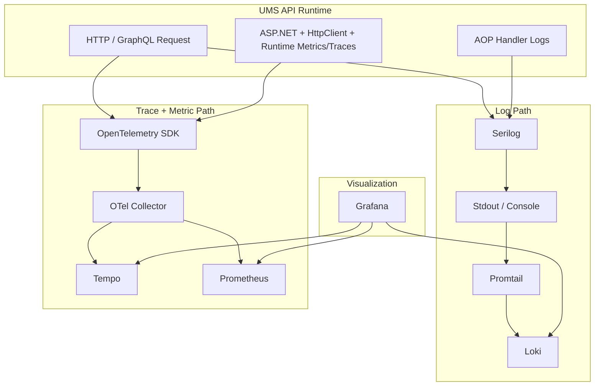

# Observability Architecture Flow

## Purpose

This blueprint shows how UMS propagates `CorrelationId`, `SessionTrackingId`, traces, logs, and metrics across the API pipeline, AOP decorators, runtime instrumentation, and local observability stack.

It complements:
- [Logging and Observability Guide](./logging-observability-guide.md)
- [ADR-0053: OpenTelemetry Observability](../adrs/0053-opentelemetry-observability.md)
- [ADR-0060: AOP Cross-Cutting Concern Strategy](../adrs/0060-aop-cross-cutting-concern-strategy.md)
- [ADR-0061: Execution Context Accessor Pattern](../adrs/0061-execution-context-accessor.md)
- [ADR-0062: PII-Safe Serilog Configuration](../adrs/0062-pii-safe-serilog-configuration.md)

## 1. Logical Flow

```mermaid
flowchart LR
    Client["Client / Browser / API Consumer"]
    Correlation["CorrelationIdMiddleware"]
    Session["SessionTrackingMiddleware"]
    RequestCtx["RequestContextAccessor / IRequestContext"]
    RequestLog["Serilog Request Logging"]
    Endpoint["REST / GraphQL Endpoint"]
    Handler["MediatR Handler"]
    Aop["LoggerAspect(IUmsLogger)"]
    UmsLogger["UmsSerilogLogger"]
    Activity["Activity.Current / OTel Context"]
    Mel["Microsoft ILogger"]
    Serilog["Serilog Pipeline"]
    Stdout["Container Stdout / Console"]
    OTel["OpenTelemetry SDK"]
    Collector["OTel Collector"]
    Tempo["Tempo"]
    Promtail["Promtail"]
    Loki["Loki"]
    Prometheus["Prometheus"]
    Grafana["Grafana"]

    Client -->|"X-Correlation-Id\nX-Session-Tracking-Id"| Correlation
    Correlation --> Session
    Correlation -->|"baggage: correlation.id"| Activity
    Session --> RequestCtx
    Session -->|"baggage/tag: session.tracking_id"| Activity
    Session --> RequestLog
    RequestLog --> Endpoint
    Endpoint --> Handler
    Handler --> Aop
    Aop --> UmsLogger
    UmsLogger -->|"TenantId\nCorrelationId\nSessionTrackingId\nTraceId\nSpanId\nBoundedContext"| Mel
    Mel --> Serilog
    Serilog --> Stdout
    Stdout --> Promtail
    Promtail --> Loki

    Endpoint -. ASP.NET / HttpClient / Runtime .-> OTel
    Activity -. current trace/span .-> OTel
    OTel -->|"OTLP traces + metrics"| Collector
    Collector --> Tempo
    Collector --> Prometheus

    Grafana --> Loki
    Grafana --> Tempo
    Grafana --> Prometheus
```

## 2. Runtime Responsibilities

| Component | Responsibility |
| --- | --- |
| `CorrelationIdMiddleware` | Resolve or generate `X-Correlation-Id`, write it to response, `Activity` baggage, and log scope. |
| `SessionTrackingMiddleware` | Resolve or generate `X-Session-Tracking-Id`, write it to response, `Activity` baggage/tag, and request-scoped execution context. |
| `RequestContextAccessor` | Provide a request-safe snapshot for AOP, exception handling, request logging, and future background handoff. |
| `UseSerilogRequestLogging(...)` | Emit request-level HTTP logs enriched with host, correlation, session, trace, and span identifiers. |
| `LoggerAspect(IUmsLogger)` | Intercept handler entry/exit/exception and delegate to the final UMS observability-aware logger. |
| `UmsSerilogLogger` | Enrich AOP logs with the full UMS envelope and emit through the Serilog-backed `ILogger` pipeline. |
| `OpenTelemetry SDK` | Produce traces and metrics from ASP.NET Core, HttpClient, runtime, and current `Activity`. |
| `Promtail` | Read container stdout logs and ship them to Loki. |
| `OTel Collector` | Fan out OTLP traces/metrics to backend stores. |

## 3. Signal Routing



## 4. End-to-End Correlation Rules

1. The client should send `X-Session-Tracking-Id` on every request.
2. The API must always echo both `X-Correlation-Id` and `X-Session-Tracking-Id`.
3. `CorrelationId` and `SessionTrackingId` must be visible in:
   - request logs
   - AOP handler logs
   - trace tags / baggage
   - exception logs
4. `TenantId` is enriched by `UmsSerilogLogger`, not by middleware.
5. `SessionTrackingId` must not be used as a general metric dimension due to high cardinality.

## 5. Important Clarification

The current UMS implementation uses:

- **Logs**: `Serilog -> stdout -> Promtail -> Loki`
- **Traces / Metrics**: `OpenTelemetry SDK -> OTLP -> OTel Collector -> Tempo / Prometheus`

So the AOP decorator is fully compatible with the observability cycle, but logs are currently shipped through the **Serilog + stdout + Promtail** path rather than a direct OTLP log exporter.

That is intentional and operationally valid for local and containerized environments.

## 6. Background and Async Continuation

The HTTP request path already propagates the execution context correctly.

The remaining architectural target is to ensure the same envelope survives across:
- outbox dispatch
- background services
- downstream message handlers

That continuation should preserve:
- `CorrelationId`
- `SessionTrackingId`
- `TraceId`
- `SpanId`

## 7. Reading Order

1. [Logging and Observability Guide](./logging-observability-guide.md)
2. [ADR-0053: OpenTelemetry Observability](../adrs/0053-opentelemetry-observability.md)
3. [ADR-0061: Execution Context Accessor Pattern](../adrs/0061-execution-context-accessor.md)
4. [ADR-0062: PII-Safe Serilog Configuration](../adrs/0062-pii-safe-serilog-configuration.md)
