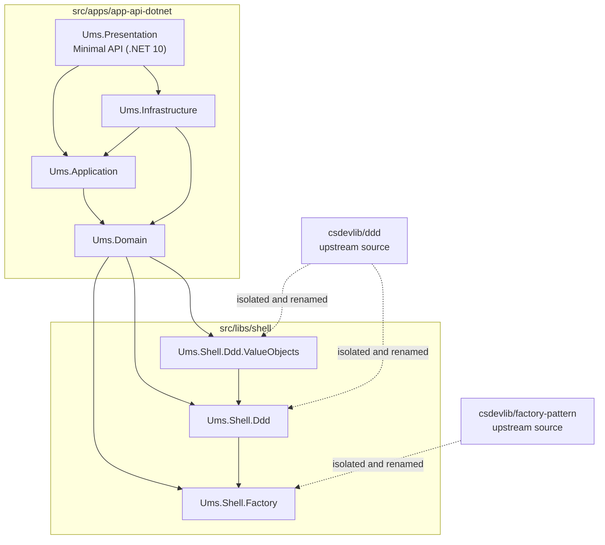

# Shell Library Architecture

**Type:** Architecture Blueprint  
**Status:** Accepted  
**Runtime:** .NET 10 LTS  
**Code location:** `src/libs/shell`

## Purpose

UMS isolates reusable implementation patterns in a dedicated **Shell Library Layer**. This layer wraps and normalizes inherited library code under the UMS namespace so the application can use DDD and Factory patterns without leaking upstream naming, repository structure, or implementation details into the product code.

The shell layer is not a generic utility folder. It is an architectural boundary:

- `Ums.Domain` depends on UMS-owned shell contracts and primitives.
- `Ums.Shell.Ddd` encapsulates tactical DDD patterns such as entities, aggregate support, domain events, specifications, validation, notification, and domain error/result conventions.
- `Ums.Shell.Ddd.ValueObjects` extends the DDD shell with reusable value object patterns.
- `Ums.Shell.Factory` provides creation and resolution patterns used by the DDD shell and domain model.
- Upstream library naming must not appear in application namespaces.

## Dependency Diagram



## Architectural Rules

| Rule | Decision |
|------|----------|
| Namespace ownership | Shell libraries use `Ums.Shell.*`; upstream namespaces are not allowed in UMS application code. |
| Runtime baseline | Shell libraries target the same stable runtime as the API: `net10.0`. |
| Domain dependency | `Ums.Domain` may reference shell libraries, but must not reference Infrastructure, Presentation, persistence providers, brokers, or external SDKs. |
| Pattern encapsulation | DDD and Factory implementation details are centralized in shell libraries instead of being copied into every bounded context. |
| Replacement strategy | If an upstream library changes, UMS adapts it inside `src/libs/shell`; app layers should not change because of upstream implementation movement. |
| Cross-platform requirement | Project references use relative portable paths and .NET SDK-style projects. No OS-specific build paths are allowed. |

## Current Shell Packages

| Library | Responsibility | Consumed by |
|---------|----------------|-------------|
| `Ums.Shell.Factory` | Factory and service resolution pattern support. | `Ums.Shell.Ddd`, `Ums.Domain` |
| `Ums.Shell.Ddd` | Tactical DDD primitives and behavior. | `Ums.Domain`, `Ums.Shell.Ddd.ValueObjects` |
| `Ums.Shell.Ddd.ValueObjects` | Reusable value object patterns built on the DDD shell. | `Ums.Domain` |

## Implementation Reference

`Ums.Domain` references the shell layer directly:

```xml
<ProjectReference Include="../../../libs/shell/ddd/src/Ums.Shell.Ddd/Ums.Shell.Ddd.csproj" />
<ProjectReference Include="../../../libs/shell/ddd/src/Ums.Shell.Ddd.ValueObjects/Ums.Shell.Ddd.ValueObjects.csproj" />
<ProjectReference Include="../../../libs/shell/factory/src/Ums.Shell.Factory/Ums.Shell.Factory.csproj" />
```

This keeps domain implementation concise while preserving the intended dependency direction:

```text
Presentation -> Application -> Domain -> Shell
Infrastructure -> Application / Domain
Shell -> no dependency on app layers
```

## Compliance Checks

- `dotnet build src/apps/app-api-dotnet/Ums.Presentation/Ums.Presentation.csproj`
- `dotnet build src/libs/shell/factory/src/Ums.Shell.Factory.sln`
- `dotnet build src/libs/shell/ddd/src/Ums.Shell.Ddd/Ums.Shell.Ddd.sln`

## Related Decisions

- [ADR-0054: Shell Library Isolation for DDD and Factory Patterns](../adrs/0054-shell-library-isolation.md)
- [DDD Primitives](../../governance/construction/ddd-design/11-ddd-primitives.md)
- [Architecture Portal](../index.md)

