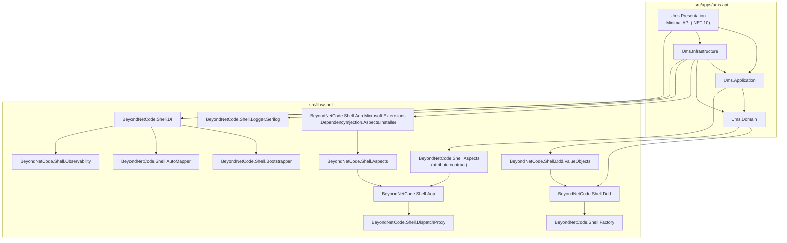

# Shell Library Architecture

**Type:** Architecture Blueprint  
**Status:** Accepted · Amended 2026-05-24 — AOP and Bootstrapper libraries added  
**Runtime:** .NET 10 LTS  
**Code location:** `src/libs/shell`

## Purpose

UMS isolates reusable implementation patterns in a dedicated **Shell Library Layer**. This layer wraps and normalizes inherited library code under the UMS namespace so the application can use DDD, Factory, AOP, and Bootstrapper patterns without leaking upstream naming, repository structure, or implementation details into product code.

The shell layer is not a generic utility folder. It is an architectural boundary with four distinct library groups:

| Group | Responsibility |
|-------|---------------|
| `BeyondNetCode.Shell.Ddd` | Tactical DDD primitives: entities, aggregate roots, domain events, value objects, specifications, result/error conventions |
| `BeyondNetCode.Shell.Ddd.ValueObjects` | Reusable value object patterns built on the DDD shell |
| `BeyondNetCode.Shell.Factory` | Creation and resolution patterns used by the DDD shell and domain model |
| `BeyondNetCode.Shell.Aop` | Attribute-driven cross-cutting concerns via `DispatchProxy`: logging, tracing, metrics, retry |
| `BeyondNetCode.Shell.Bootstrapper` | Application startup orchestration: DI, AutoMapper, observability |

Upstream library naming must not appear in application namespaces.

---

## Dependency Diagram



---

## Library Groups

### BeyondNetCode.Shell.Ddd

Provides core tactical DDD primitives. All domain aggregates, entities, and value objects extend these base types.

**Projects:**
- `BeyondNetCode.Shell.Ddd` — `IAggregateRoot`, `Entity`, `AggregateRoot`, `ValueObject<T>`, `DomainEvent`, `DomainEnumeration`, `BrokenRules`, `TrackingState`
- `BeyondNetCode.Shell.Ddd.ValueObjects` — `AuditValueObject`, `IdValueObject`, and other reusable VO patterns

**Consumed by:** `Ums.Domain` (direct), `BeyondNetCode.Shell.Ddd.ValueObjects` (extends Ddd)

```xml
<!-- Ums.Domain.csproj -->
<ProjectReference Include="../../../libs/shell/ddd/src/BeyondNetCode.Shell.Ddd/BeyondNetCode.Shell.Ddd.csproj" />
<ProjectReference Include="../../../libs/shell/ddd/src/BeyondNetCode.Shell.Ddd.ValueObjects/BeyondNetCode.Shell.Ddd.ValueObjects.csproj" />
```

---

### BeyondNetCode.Shell.Factory

Provides fluent factory/resolution patterns used by the DDD shell internally and optionally by Infrastructure.

**Projects:**
- `BeyondNetCode.Shell.Factory` — `AbstractFactorySetupSource`, `For<TTarget, TService>().Create<TImpl>().When(pred)` DSL, `IFactoryInterceptor`, named factory groups
- `BeyondNetCode.Shell.DI` — `AddFactory()` DI extension, factory group scanning

**Consumed by:** `BeyondNetCode.Shell.Ddd` (transitive — Domain gets it via DDD shell, not directly)

> **Important:** `Ums.Domain.csproj` must **not** reference `BeyondNetCode.Shell.Factory` directly. The reference is transitive through `BeyondNetCode.Shell.Ddd`. See ADR-0054 (2026-05-24 correction).

---

### BeyondNetCode.Shell.Aop

Provides attribute-driven AOP via `System.Reflection.DispatchProxy`. Applies selective, per-method cross-cutting concerns without modifying handler business logic.

**Projects:**
- `BeyondNetCode.Shell.Aop` — `IAspect`, `IJoinPoint`, `IPointCut`, `AspectExecutor`, `AopProxy`
- `BeyondNetCode.Shell.DispatchProxy` — `DispatchProxy` implementation, proxy factory
- `BeyondNetCode.Shell.Aspects` — `OnMethodBoundaryAspect<T>`, `LoggerAspect`, `RetryAspect`, `AdviceAspect`, `ILogger` interface, `[LoggerAspect]` attribute
- `BeyondNetCode.Shell.Logger.Serilog` — `SerilogLogger` adapter (destructured values, opt-in)
- `BeyondNetCode.Shell.DI` — `AddAop()`, `AddAopProxy<TService, TImpl>()`

**Consumed by:**
- `Ums.Application` — attribute contract only (`BeyondNetCode.Shell.Aspects`): handlers declare `[LoggerAspect]` without coupling to proxy infrastructure
- `Ums.Infrastructure` — full DI wiring: `AddAop()`, `AddAopProxy<>()`, `SerilogLogger` adapter

```xml
<!-- Ums.Application.csproj -->
<ProjectReference Include="../../../libs/shell/aop/src/BeyondNetCode.Shell.Aspects/BeyondNetCode.Shell.Aspects.csproj" />

<!-- Ums.Infrastructure.csproj -->
<ProjectReference Include="../../../libs/shell/aop/src/BeyondNetCode.Shell.DI/..." />
<ProjectReference Include="../../../libs/shell/aop/src/BeyondNetCode.Shell.Logger.Serilog/..." />
```

**Async correctness:** `OnMethodBoundaryAspect.Apply` detects `Task`/`Task<TResult>` return types and wraps them in continuation tasks via `ConfigureAwait(false)`. `OnSuccess` and `OnExit` fire *after* the awaited result, not when the `Task` object is returned.

**MelLogger pattern:** `IMelLogger` (marker interface in `Ums.Application.Common.Aop`) extends `BeyondNetCode.Shell.Aspects.ILogger`. `MelLogger` in `Ums.Infrastructure.Aop` implements it via `ILoggerFactory`. PII policy: argument values are **never** logged; only method names and types.

```csharp
// Application layer — attribute declaration (no proxy import)
[LoggerAspect(Type = typeof(IMelLogger), LogDuration = true, LogException = true, LogArguments = [])]
public async Task<Result<CreateTenantResponse>> Handle(CreateTenantCommand request, CancellationToken ct)
{ ... }

// Infrastructure DI wiring
services.AddAop();
services.AddKeyedTransient<BeyondNetCode.Shell.Aspects.ILogger, MelLogger>(typeof(IMelLogger));
services.AddAopProxy<IRequestHandler<CreateTenantCommand, Result<CreateTenantResponse>>,
                     CreateTenantCommandHandler>();
```

---

### BeyondNetCode.Shell.Bootstrapper

Provides composable application startup orchestration. Separates concerns (DI, mapping, observability) into independent bootstrapper units.

**Projects:**
- `BeyondNetCode.Shell.Bootstrapper` — `IBootstrapper<T>`, `CompositeBootstrapper` (fan-out)
- `BeyondNetCode.Shell.DI` — `DependencyInjectionBootstrapper` (registers services from assemblies)
- `BeyondNetCode.Shell.AutoMapper` — `AutoMapperBootstrapper` (profile scanning + `IMapper` registration)
- `BeyondNetCode.Shell.Observability` — `ObservabilityBootstrapper`, `ObservabilityConfiguration` (OTLP endpoint, service name, sampling rate)

**Consumed by:** `Ums.Infrastructure` and `Ums.Presentation` (startup only)

```csharp
// Example composite startup
var bootstrapper = new CompositeBootstrapper<IServiceCollection>(
    new DependencyInjectionBootstrapper(Assembly.GetExecutingAssembly()),
    new AutoMapperBootstrapper(Assembly.GetExecutingAssembly()),
    new ObservabilityBootstrapper(new ObservabilityConfiguration
    {
        ServiceName    = "ums-api",
        OtlpEndpoint   = "http://localhost:4317",
        SamplingRatio  = 1.0
    }));
bootstrapper.Bootstrap(services);
```

---

## Architectural Rules

| Rule | Decision |
|------|----------|
| Namespace ownership | Shell libraries use `BeyondNetCode.Shell.*`; upstream namespaces (`BeyondNet.*`, `csdevlib.*`) are not allowed in UMS application code. |
| Runtime baseline | Shell libraries target the same stable runtime as the API: `net10.0`. |
| Domain purity | `Ums.Domain` must **not** reference `BeyondNetCode.Shell.Aop.*`, `BeyondNetCode.Shell.Bootstrapper.*`, or `BeyondNetCode.Shell.Factory` directly. |
| Application AOP contract | `Ums.Application` references only `BeyondNetCode.Shell.Aspects` (attribute declarations). No proxy, no DI installer, no runtime infrastructure. |
| Infrastructure wiring | `Ums.Infrastructure` owns AOP proxy registration and Bootstrapper startup wiring. |
| Pattern encapsulation | DDD, Factory, AOP, and Bootstrapper implementation details are centralized in shell libraries instead of being copied into bounded contexts. |
| Replacement strategy | If an upstream library changes, UMS adapts it inside `src/libs/shell`; app layers should not change because of upstream implementation movement. |
| Cross-platform | Project references use relative portable paths and .NET SDK-style projects. No OS-specific build paths are allowed. |

### Authorised reference graph (summary)

```
Ums.Domain       → BeyondNetCode.Shell.Ddd, BeyondNetCode.Shell.Ddd.ValueObjects
Ums.Application  → Ums.Domain, BeyondNetCode.Shell.Aspects (attr contract only)
Ums.Infrastructure → Ums.Application, Ums.Domain,
                     BeyondNetCode.Shell.Aop.*.Installer, BeyondNetCode.Shell.Logger.Serilog,
                     BeyondNetCode.Shell.Bootstrapper.*
Ums.Presentation → All layers + BeyondNetCode.Shell.Bootstrapper.* (startup)
```

---

## Compliance Checks

Run after any change to shell library references or aspect registrations:

```bash
# 1. Build full solution
dotnet build src/apps/ums.api/Ums.sln

# 2. Run shell library tests
dotnet test src/libs/shell/aop/src/BeyondNetCode.Shell.Aop.Tests/BeyondNetCode.Shell.Aop.Tests.csproj --verbosity minimal
dotnet test src/libs/shell/factory/src/BeyondNetCode.Shell.Factory.Test/BeyondNetCode.Shell.Factory.Test.csproj --verbosity minimal

# 3. Verify Domain purity — no AOP refs
grep -r "BeyondNetCode.Shell.Aop" src/apps/ums.api/Ums.Domain/ --include="*.csproj"
# Expected: no output

# 4. Verify no direct Factory ref in Domain
grep "BeyondNetCode.Shell.Factory" src/apps/ums.api/Ums.Domain/Ums.Domain.csproj
# Expected: no output
```

---

## Related Decisions and Guides

- [ADR-0054: Shell Library Isolation — DDD, Factory, AOP, Bootstrapper](../adrs/0054-shell-library-isolation.md)
- [ADR-0060: AOP Cross-Cutting Concern Strategy](../adrs/0060-aop-cross-cutting-concern-strategy.md)
- [Shell Library Developer Guides](../shell-libraries/README.md) — DDD · Factory · AOP · Bootstrapper · Combined Usage
- [DDD Primitives](../../governance/construction/ddd-design/11-ddd-primitives.md)
- [Architecture Portal](../index.md)
