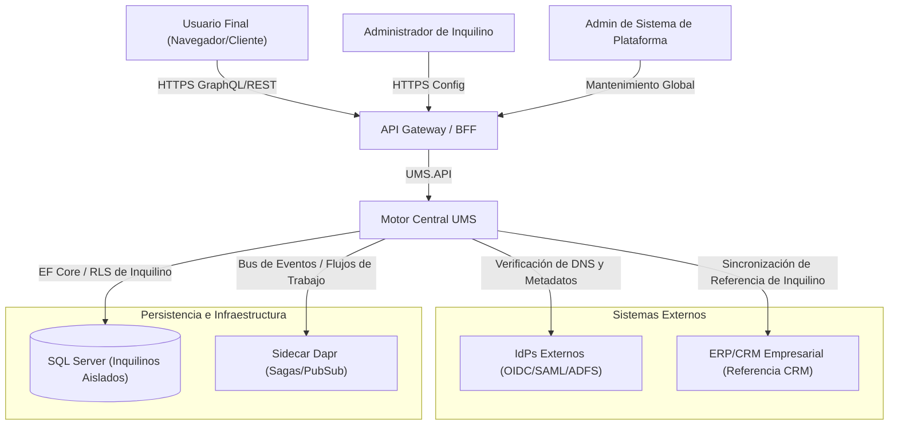
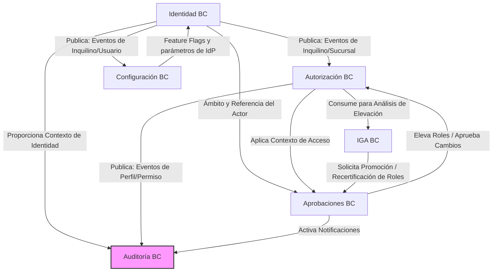

# Visión General de la Arquitectura de UMS

**Estado del Documento:** Producción  
**Alcance Autoritativo:** Arquitectura Global de la Plataforma  
**Referencia del Marco de Trabajo Padre:** [Evolith Architecture Reference](https://github.com/beyondnetcode/evolith_arch32)

---

## 1. Visión Global de la Arquitectura

El Sistema de Gestión de Usuarios (UMS, por sus siglas en inglés) está diseñado como un **Monolito Modular** que se adhiere a los principios de la **Arquitectura Limpia** (Arquitectura Hexagonal), **Diseño Guiado por el Dominio (DDD)** estricto y **Aislamiento de Inquilinos** estricto.

UMS actúa como una pasarela de autorización e identidad que puede funcionar de forma independiente o integrarse con Proveedores de Identidad (IdPs) corporativos externos a través de los protocolos OpenID Connect (OIDC), SAML 2.0 o WS-Federation.

```
       ┌─────────────────────────────────────────────────────────┐
       │                   Capa de Presentación                  │
       │     React 18 + Vite (SPA) / Web API / GraphQL / REST    │
       └────────────┬───────────────────────────────▲────────────┘
                    │ Comandos                      │ Consultas / DTOs
                    ▼                               │
       ┌────────────────────────────────────────────┴────────────┐
       │                    Capa de Aplicación                   │
       │     Manejadores CQRS / Casos de Uso / Pipelines / DTOs  │
       └────────────┬───────────────────────────────▲────────────┘
                    │ Invoca                        │ Implementa
                    ▼                               │
       ┌────────────────────────────────────────────┴────────────┐
       │                     Capa de Dominio                     │
       │     POCOs Puros de Agregados / Objetos de Valor / Event │
       └────────────▲───────────────────────────────┬────────────┘
                    │ Implementa                    │ Integra
                    │                               ▼
       ┌────────────┴────────────────────────────────────────────┐
       │                 Capa de Infraestructura                 │
       │      SQL Server (EF Core) / Dapr / Outbox / Outbound    │
       └─────────────────────────────────────────────────────────┘
```

### Principios Arquitectónicos Compartidos
1. **Pureza del Dominio**: La capa de dominio (`{BoundedContext}.Domain`) consta de objetos C# puros (POCOs) con cero referencias a bibliotecas externas, asegurando que la lógica de negocio permanezca incontaminada.
2. **Límites Explícitos**: Las interacciones entre contextos están estrictamente desacopladas utilizando comunicación basada en eventos (Transactional Outbox) o Capas Anticorrupción (ACL) explícitas en la capa de Aplicación. Las uniones de bases de datos directas entre contextos están estrictamente prohibidas.
3. **Aislamiento de Inquilinos (Tenancy)**: El aislamiento de inquilinos de alta seguridad se aplica de forma nativa en la capa de Aplicación, utilizando la Seguridad a Nivel de Fila (RLS) de SQL Server como un mecanismo secundario a nivel de infraestructura (R-10).
4. **Segregación de Responsabilidades de Consulta y Comando (CQRS)**: Los modelos de lectura están altamente optimizados y separados de los modelos de escritura. Las escrituras son estrictamente transaccionales, mientras que las lecturas aprovechan proyecciones planas eficientes o la ejecución directa de GraphQL.

---

## 2. Mapa del Contexto del Sistema

UMS conecta a múltiples actores y suites externas para proporcionar una gestión de acceso unificada.



---

## 3. Mapa de Contextos Delimitados de Alto Nivel

UMS se divide en seis Contextos Delimitados altamente cohesivos:
1. **Contexto de Identidad (Identity BC)**: Gobierna el registro de inquilinos, las sucursales organizacionales, el branding de marca blanca, los proveedores de identidad y el ciclo de vida físico de las cuentas de usuario.
2. **Contexto de Autorización (Authorization BC)**: Gestiona las suites de aplicaciones, los módulos funcionales, las opciones granulares, los perfiles/roles y las matrices de permisos dinámicas.
3. **Contexto de Configuración (Configuration BC)**: Controla el comportamiento dinámico de la aplicación mediante feature flags y detalles técnicos de configuración de proveedores de identidad.
4. **Contexto de Aprobaciones (Approvals BC)**: Coordina los flujos de trabajo interactivos que requieren intervención humana para la elevación de accesos, verificación de documentos y transiciones de inquilinos.
5. **Contexto IGA (Identity Governance & Administration BC)**: Evalúa la madurez de los roles, el impacto de las solicitudes de promoción y la segregación de funciones.
6. **Contexto de Auditoría (Audit BC)**: Recopila registros inmutables y no repudiables de todas las transiciones críticas de la plataforma.



### Resumen del Mapa de Relaciones

| Contexto Aguas Arriba (Upstream) | Contexto Aguas Abajo (Downstream) | Tipo de Relación | Patrón de Integración |
|---|---|---|---|
| **Identidad** | **Configuración** | Aguas Arriba - Aguas Abajo | Cliente-Proveedor (El registro del inquilino siembra la config) |
| **Identidad** | **Autorización** | Aguas Arriba - Aguas Abajo | Cliente-Proveedor (La sucursal/usuario define el ámbito) |
| **Identidad** | **Aprobaciones** | Aguas Arriba - Aguas Abajo | Núcleo Compartido (Shared Kernel - Identidades) |
| **Configuración** | **Identidad** | Aguas Arriba - Aguas Abajo | Conformista (Las flags dinámicas regulan funciones) |
| **Autorización** | **IGA** | Aguas Arriba - Aguas Abajo | Asociación (Partnership - IGA evalúa estructuras de roles) |
| **IGA** | **Aprobaciones** | Aguas Arriba - Aguas Abajo | Cliente-Proveedor (Promociones activan aprobaciones) |
| **Todos los Contextos** | **Auditoría** | Aguas Abajo | Publicación-Suscripción (Eventos de Transactional Outbox) |

---

## 4. Catálogo e Índice de Agregados

Todas las reglas de negocio, invariantes y diagramas arquitectónicos se consolidan estrictamente dentro del documento dedicado de cada agregado.

```
/docs/domain/ (Traducciones en /docs/domain-es/)
├── identity/
│   ├── tenant.md               - Unidad organizacional de nivel superior y jerarquía
│   ├── branch.md               - Sucursales que delimitan usuarios y perfiles
│   ├── branding.md             - Perfiles visuales de marca blanca por inquilino
│   ├── identity-provider.md    - Mapeos de IdP externos OIDC/SAML
│   ├── user-account.md         - Perfiles de login y ciclos de vida de usuarios
│   ├── password-credential.md  - Hashes de contraseñas seguros y políticas
│   └── mfa-enrollment.md       - Factores de MFA (SMS, Email, TOTP)
│
├── authorization/
│   ├── system-suite.md         - Aplicaciones principales y opciones del sistema
│   ├── module.md               - Zonas funcionales dinámicas
│   ├── menu.md                 - Estructura de menús navegables
│   ├── sub-menu.md             - Submenús anidados
│   ├── option.md               - Interfaces e interfaces de acceso del usuario
│   ├── action.md               - Tokens granulares de operación (Read/Write/Delete)
│   ├── permission-template.md  - Grupos de permisos preestablecidos
│   ├── permission-template-item.md - Mapeos individuales dentro de un template
│   ├── profile.md              - Roles dinámicos (Global, Inquilino, Sucursal)
│   └── profile-permission.md   - Permisos y acciones asignadas a perfiles
│
├── configuration/
│   ├── app-configuration.md    - Configuración del entorno del inquilino
│   ├── feature-flag.md         - Interruptores operativos
│   ├── flag-evaluation-log.md  - Registro de evaluaciones para pruebas A/B
│   └── idp-configuration.md    - Secretos técnicos del cliente y llaves de IdPs
│
├── approvals/
│   ├── approval-workflow.md    - Flujo de aprobaciones por humanos
│   ├── approval-required-document.md - Lista de documentos requeridos
│   ├── approval-request.md     - Ciclo de vida de solicitudes de aprobación
│   ├── document-type.md        - Definiciones estructuradas de tipos de archivos
│   ├── notification-rule.md    - Alertas de notificaciones automatizadas
│   ├── user-document.md        - Documentos de usuario cargados para validación
│   ├── access-notification.md  - Alertas de seguridad por elevación
│   └── access-enforcement-policy.md - Políticas de restricción y límites
│
├── iga/
│   ├── promotion-request.md    - Propuestas de elevación de acceso empresarial
│   ├── promotion-impact-analysis.md - Análisis de colisiones y riesgos SoD
│   └── role-maturity-status.md - Análisis dinámico de asignación de perfiles
│
└── audit/
    └── audit-record.md         - Bitácora inmutable de eventos de seguridad
```

---

## 5. Principios de Integración Entre Contextos

Para preservar la pureza de los contextos delimitados de DDD al tiempo que se mantiene la cohesión del sistema, se deben seguir estrictamente los siguientes estándares:

### 1. El Patrón Transactional Outbox
Cada operación que cambie el estado dentro de un agregado debe publicar eventos en una tabla local outbox **dentro de la misma transacción de base de datos**. Un despachador asíncrono lee estas entradas y las reenvía a Dapr PubSub para su entrega entre contextos. Esto garantiza una consistencia eventual confiable sin transacciones distribuidas de dos fases (2PC).

### 2. Integración mediante Identificadores Centrales
Los agregados en contextos aguas abajo NUNCA deben tener referencias directas a entidades de contextos aguas arriba. En su lugar, hacen referencia únicamente a su identificador global (`TenantId`, `UserId`, `BranchId`, etc.) almacenado como un Objeto de Valor.

### 3. Capas Anticorrupción (ACL)
Cuando un contexto se integra con directorios de identidad externos o sistemas de Recursos Humanos heredados, se construye una Capa Anticorrupción explícita (con Adaptadores, Traductores y Fachadas) dentro de la capa de infraestructura para evitar que los conceptos externos contaminen el modelo de dominio puro.

---

## 6. Reglas Arquitectónicas Compartidas

- **Cero Referencias NuGet en el Dominio**: El proyecto de Dominio es 100% C# puro.
- **Patrón Result**: Los flujos de aplicación no lanzan excepciones para el control de flujo. Todas las validaciones de negocio devuelven un objeto `Result<T>` que mapea claramente los casos de falla.
- **Única Fuente de la Verdad**: Las invariantes de negocio y los esquemas de entidades pertenecen estrictamente a sus respectivos archivos de agregado listados en la Sección 4. No duplique diagramas ni esquemas ER en ningún otro índice.

---

**[Volver al Índice Maestro](../MASTER_INDEX.es.md)** | **[Ir al Índice de Dominio](../domain-es/index.md)**
