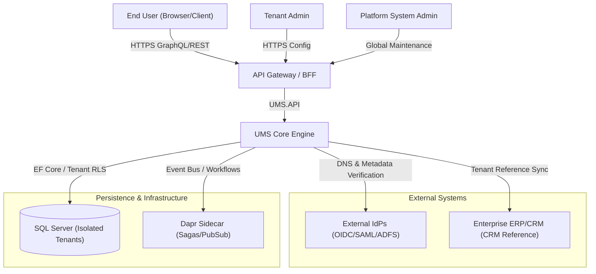
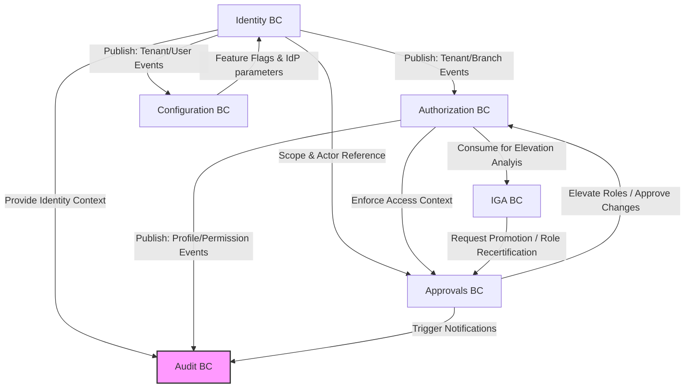

# UMS Architecture Overview

**Document Status:** Production  
**Authoritative Scope:** Global Platform Architecture  
**Parent Framework Reference:** [arc32 Progressive Monolith Reference](https://github.com/beyondnetcode/arc32_progresive_monolith)

---

## 1. Global Architecture Vision

The User Management System (UMS) is designed as a **Modular Monolith** adhering to the principles of **Clean Architecture** (Hexagonal Architecture), strict **Domain-Driven Design (DDD)**, and strict **Tenant Isolation**.

UMS serves as an authorization and identity gateway that can either function as a standalone system or integrate with external corporate Identity Providers (IdPs) via OpenID Connect (OIDC), SAML 2.0, or WS-Federation protocols.

```
       ┌─────────────────────────────────────────────────────────┐
       │                   Presentation Layer                    │
       │     React 18 + Vite (SPA) / Web API / GraphQL / REST    │
       └────────────┬───────────────────────────────▲────────────┘
                    │ Commands                      │ Queries / DTOs
                    ▼                               │
       ┌────────────────────────────────────────────┴────────────┐
       │                    Application Layer                    │
       │       CQRS Handlers / Use Cases / Pipelines / DTOs      │
       └────────────┬───────────────────────────────▲────────────┘
                    │ Invokes                       │ Implements
                    ▼                               │
       ┌────────────────────────────────────────────┴────────────┐
       │                      Domain Layer                       │
       │     Pure POCO Aggregates / Value Objects / Events       │
       └────────────▲───────────────────────────────┬────────────┘
                    │ Implements                    │ Integrates
                    │                               ▼
       ┌────────────┴────────────────────────────────────────────┐
       │                   Infrastructure Layer                  │
       │      SQL Server (EF Core) / Dapr / Outbox / Outbound    │
       └─────────────────────────────────────────────────────────┘
```

### Shared Architectural Principles
1. **Domain Purity**: The Domain layer (`{BoundedContext}.Domain`) consists of pure C# objects (POCOs) with zero external library references, ensuring business logic remains unpolluted.
2. **Explicit Boundaries**: Cross-context interactions are strictly decoupled using event-driven communication (Transactional Outbox) or explicit Application-layer Anti-Corruption Layers (ACLs). Direct cross-context database joins are strictly prohibited.
3. **Tenant Isolation**: High-security multi-tenancy is enforced natively in the Application layer, with SQL Server Row-Level Security (RLS) serving as an infrastructure-level secondary failsafe (R-10).
4. **Command-Query Responsibility Segregation (CQRS)**: Read models are highly optimized and separated from write models. Writes are strictly transaction-safe, while reads leverage efficient flat projections or direct GraphQL execution.

---

## 2. System Context Map

UMS connects multiple actors and external suites to provide unified access management.



---

## 3. High-Level Bounded Context Map

UMS is partitioned into **nine Bounded Contexts** (seven with owned entities, plus Cache and Console support contexts). Two contexts — Approvals and Compliance — are unified under `Ums.Domain.Approvals` in the codebase for implementation simplicity:

1. **Identity BC** (`ums_identity`): Governs tenant registration, organizational branches, white-label branding, identity providers, and user account lifecycles.
2. **Authorization BC** (`ums_authz`): Manages application suites, functional modules, granular options, profiles/roles, and dynamic permission matrices.
3. **Configuration BC** (`ums_config`): Controls application behavior dynamically via feature flags and custom Identity Provider configuration.
4. **Approvals BC** (`ums_approval`): Coordinates multi-step human-in-the-loop workflows for access elevation and tenant transitions.
5. **Compliance BC** (`ums_compliance`, unified with Approvals in code): Enforces document-based access policies, expiration notifications, and automated enforcement.
6. **IGA BC** (`ums_iga`): Evaluates role maturity, promotion request impacts, and separation of duties.
7. **Audit BC** (`ums_audit`): Collects immutable, non-repudiable logs of all critical platform transitions.
8. **Cache BC** (`ums_cache`): Distributed caching layer for configuration, session data, and feature flags.
9. **Console BC** (`ums_console`): Administrative console context for platform-level operations.

See [Bounded Context Map](../governance/construction/ddd-design/01-bounded-context-map.md) for full relationship detail.



### Relationship Map Summary

| Upstream Context | Downstream Context | Relationship Type | Integration Pattern |
|---|---|---|---|
| **Identity** | **Configuration** | Upstream-Downstream | Customer-Supplier (Tenant registration seeds Config) |
| **Identity** | **Authorization** | Upstream-Downstream | Customer-Supplier (Branch/User creation scopes profiles) |
| **Identity** | **Approvals** | Upstream-Downstream | Shared Kernel (User / Tenant identities) |
| **Configuration** | **Identity** | Upstream-Downstream | Conformist (Dynamic flags regulate features) |
| **Authorization** | **IGA** | Upstream-Downstream | Partnership (IGA evaluates role structures) |
| **IGA** | **Approvals** | Upstream-Downstream | Customer-Supplier (Promotion requests trigger approvals) |
| **All Contexts** | **Audit** | Downstream | Publish-Subscribe (Transactional Outbox events) |

---

## 4. Aggregate Root Catalog

All domain rules, invariants, and architectural diagrams are consolidated within each Aggregate Root's dedicated documentation file. Owned child entities are documented within their parent AR's page — they do not have separate top-level entries.

See [Domain Aggregate Index](../domain/index.md) for the full inventory.

| BC | Aggregate Root | Owned Entities (documented within AR) |
|---|---|---|
| **Identity** | [Tenant](../domain/identity/tenant.md) | Branch · Branding · IdentityProvider |
| **Identity** | [UserAccount](../domain/identity/user-account.md) | PasswordCredential · MfaEnrollment |
| **Authorization** | [SystemSuite](../domain/authorization/system-suite.md) | FunctionalModule · FunctionalMenu · FunctionalSubMenu · FunctionalOption · Action |
| **Authorization** | [PermissionTemplate](../domain/authorization/permission-template.md) | PermissionTemplateItem |
| **Authorization** | [Profile](../domain/authorization/profile.md) | ProfilePermission |
| **Configuration** | [IdpConfiguration](../domain/configuration/idp-configuration.md) | *(none)* |
| **Configuration** | [AppConfiguration](../domain/configuration/app-configuration.md) | *(none)* |
| **Configuration** | [FeatureFlag](../domain/configuration/feature-flag.md) | FlagEvaluationLog |
| **Approvals** | [ApprovalWorkflow](../domain/approvals/approval-workflow.md) | ApprovalRequiredDocument |
| **Approvals** | [ApprovalRequest](../domain/approvals/approval-request.md) | ApprovalLog |
| **Compliance** | [DocumentType](../domain/approvals/document-type.md) | NotificationRule · AccessEnforcementPolicy |
| **Compliance** | [UserDocument](../domain/approvals/user-document.md) | AccessNotification |
| **IGA** | [PromotionRequest](../domain/iga/promotion-request.md) | PromotionImpactAnalysis |
| **IGA** | [RoleMaturityStatus](../domain/iga/role-maturity-status.md) | *(none)* |
| **Audit** | [AuditRecord](../domain/audit/audit-record.md) | *(none — append-only)* |

---

## 5. Cross-Context Integration Principles

To preserve DDD bounded context purity while maintaining system cohesion, the following integration standards must be strictly followed:

### 1. The Transactional Outbox Pattern
Every state-changing operation within an aggregate must publish events to a local outbox table **in the same database transaction**. An asynchronous dispatcher reads these entries and forwards them to Dapr PubSub for cross-context delivery. This ensures reliable eventual consistency without distributed 2PC transactions.

### 2. Integration via Core Identifiers
Aggregates in downstream contexts must NEVER reference entities of upstream contexts directly. Instead, they reference only their global identifier (`TenantId`, `UserId`, `BranchId`, etc.) stored as strong Value Objects.

### 3. Anti-Corruption Layers (ACL)
When a context integrates with external directories or Legacy HR Systems, an explicit Anti-Corruption Layer (consisting of Adapters, Translators, and Facades) is built inside the infrastructure layer to prevent external concepts from bleeding into the pure Domain model.

---

## 6. Shared Architectural Rules

- **Zero NuGet References in Domain**: The Domain project is 100% pure C#. 
- **Result Pattern**: Application flows do not throw control exceptions. All business validations return a `Result<T>` structure mapping out failure cases clearly.
- **Single Source of Truth**: Business invariants and entity schemas belong strictly in their respective aggregate files listed in Section 4. Do not copy ER schemas or diagrams into any other architectural indexes.

---

**[Back to Master Index](../MASTER_INDEX.md)** | **[Go to Domain Index](../domain/index.md)**
