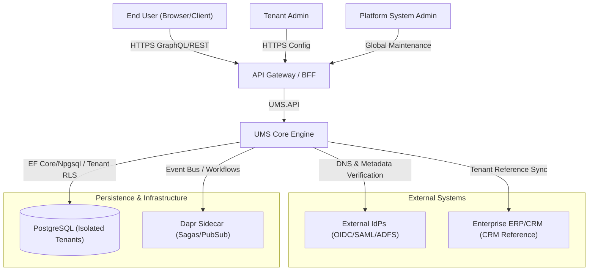
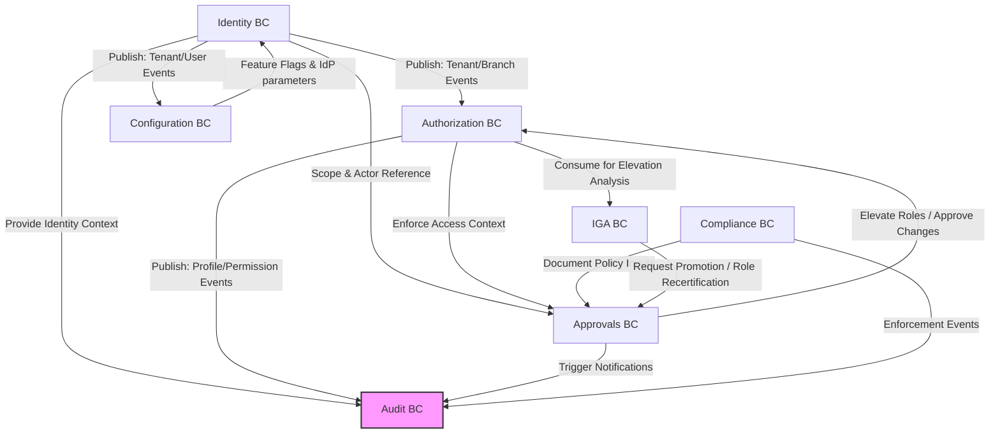

# UMS Architecture Overview

**Document Status:** Production  
**Authoritative Scope:** Global Platform Architecture  
**Parent Framework Reference:** [Evolith Architecture Reference](https://github.com/beyondnetcode/evolith_arch32)

---

## 1. Global Architecture Vision

The User Management System (UMS) is designed as a **Modular Monolith** adhering to the principles of **Clean Architecture** (Hexagonal Architecture), strict **Domain-Driven Design (DDD)**, and strict **Tenant Isolation**.

UMS serves as an authorization and identity gateway that can either function as a standalone system or integrate with external corporate Identity Providers (IdPs) via OpenID Connect (OIDC), SAML 2.0, or WS-Federation protocols.

```
       ┌─────────────────────────────────────────────────────────┐
       │                   Presentation Layer                    │
       │     React 18 + Vite (SPA) / Web API / GraphQL / REST    │
       └────────────┬───────────────────────────────▲────────────┘
                    │ Commands                      │ Queries / DTOs
                    ▼                               │
       ┌────────────────────────────────────────────┴────────────┐
       │                    Application Layer                    │
       │       CQRS Handlers / Use Cases / Pipelines / DTOs      │
       └────────────┬───────────────────────────────▲────────────┘
                    │ Invokes                       │ Implements
                    ▼                               │
       ┌────────────────────────────────────────────┴────────────┐
       │                      Domain Layer                       │
       │  Pure DDD Model: Aggregates / Entities / VOs / Events   │
       └────────────▲───────────────────────────────┬────────────┘
                    │ Implements                    │ Integrates
                    │                               ▼
       ┌────────────┴────────────────────────────────────────────┐
       │                   Infrastructure Layer                  │
       │      PostgreSQL (EF Core/Npgsql) / Dapr / Outbox / Outbound    │
       └─────────────────────────────────────────────────────────┘
```

### Shared Architectural Principles

1. **Domain Purity**: The Domain layer (`{BoundedContext}.Domain`) contains the pure DDD model — Aggregate Roots, Entities, Value Objects, Domain Events, invariants, and domain services — with zero external framework references.
2. **Explicit Boundaries**: Cross-context interactions are strictly decoupled using event-driven communication (Transactional Outbox) or explicit Application-layer Anti-Corruption Layers (ACLs). Direct cross-context database joins are strictly prohibited.
3. **Tenant Isolation**: High-security multi-tenancy is enforced natively in the Application layer, with PostgreSQL row-level security and database policies serving as infrastructure-level secondary failsafes (R-10).
4. **Command-Query Responsibility Segregation (CQRS)**: Read models are highly optimized and separated from write models. Writes are strictly transaction-safe, while reads leverage efficient flat projections or direct GraphQL execution.

---

## 2. System Context Map

UMS connects multiple actors and external suites to provide unified access management.



---

## 3. High-Level Bounded Context Map

UMS is partitioned into **nine logical Bounded Contexts**. Seven own domain entities directly; Cache and Console are support contexts. The Compliance logical context is implemented under the Approvals namespace for implementation simplicity, but remains conceptually distinct for business language and governance.

| Logical Bounded Context | Persistence / Schema | Implementation Namespace | Notes |
|---|---|---|---|
| Identity | `ums_identity` | `Ums.Domain.Identity` | Tenant, branch, branding, IdP, user lifecycle. |
| Authorization | `ums_authz` | `Ums.Domain.Authorization` | Suites, modules, menus, options, roles, profiles, permission templates. |
| Configuration | `ums_config` | `Ums.Domain.Configuration` | IdP config, app configuration, feature flags, parameterization. |
| Approvals | `ums_approval` | `Ums.Domain.Approvals` | Human-in-the-loop workflow and approval request lifecycle. |
| Compliance | `ums_compliance` | `Ums.Domain.Approvals` | Logical compliance model implemented inside Approvals: document types, user documents, enforcement policies. |
| IGA | `ums_iga` | `Ums.Domain.IGA` | Promotion request analysis, role maturity, separation of duties. |
| Audit | `ums_audit` | `Ums.Domain.Audit` | Immutable audit records. |
| Cache | `ums_cache` | Infrastructure / support | Distributed caching layer for configuration, session data, and feature flags. |
| Console | `ums_console` | Presentation / support | Administrative console for platform-level operations. |

See [Bounded Context Map](../governance/construction/ddd-design/01-bounded-context-map.md) for full relationship detail.



### Relationship Map Summary

| Upstream Context | Downstream Context | Relationship Type | Integration Pattern |
|---|---|---|---|
| **Identity** | **Configuration** | Upstream-Downstream | Customer-Supplier (Tenant registration seeds Config) |
| **Identity** | **Authorization** | Upstream-Downstream | Customer-Supplier (Branch/User creation scopes profiles) |
| **Identity** | **Approvals** | Upstream-Downstream | Shared Kernel (User / Tenant identities) |
| **Configuration** | **Identity** | Upstream-Downstream | Conformist (Dynamic flags regulate features) |
| **Authorization** | **IGA** | Upstream-Downstream | Partnership (IGA evaluates role structures) |
| **IGA** | **Approvals** | Upstream-Downstream | Customer-Supplier (Promotion requests trigger approvals) |
| **Compliance** | **Approvals** | Upstream-Downstream | Customer-Supplier (document policy feeds approval and access workflows) |
| **All Contexts** | **Audit** | Downstream | Publish-Subscribe (Transactional Outbox events) |

---

## 4. Aggregate Root Catalog

The authoritative aggregate-root inventory is maintained in the [Domain Aggregate Index](../domain/index.md). This overview intentionally summarizes rather than duplicating all entity detail.

| Bounded Context | Aggregate Roots |
|---|---|
| **Identity** | [Tenant](../domain/identity/tenant.md), [UserAccount](../domain/identity/user-account.md), [UserManagementDelegation](../domain/identity/user-management-delegation.md) |
| **Authorization** | [SystemSuite](../domain/authorization/system-suite.md), [Role](../domain/authorization/role.md), [PermissionTemplate](../domain/authorization/permission-template.md), [Profile](../domain/authorization/profile.md) |
| **Configuration** | [IdpConfiguration](../domain/configuration/idp-configuration.md), [AppConfiguration](../domain/configuration/app-configuration.md), [FeatureFlag](../domain/configuration/feature-flag.md) |
| **Approvals / Compliance** | [ApprovalWorkflow](../domain/approvals/approval-workflow.md), [ApprovalRequest](../domain/approvals/approval-request.md), [DocumentType](../domain/approvals/document-type.md), [UserDocument](../domain/approvals/user-document.md), [AccessEnforcementPolicy](../domain/approvals/access-enforcement-policy.md) |
| **IGA** | [PromotionRequest](../domain/iga/promotion-request.md), [RoleMaturityStatus](../domain/iga/role-maturity-status.md) |
| **Audit** | [AuditRecord](../domain/audit/audit-record.md) |

> **Counting rule:** The Domain Aggregate Index is the source of truth for aggregate count and ownership. Architecture summaries must not define independent aggregate totals.

---

## 5. Cross-Context Integration Principles

To preserve DDD bounded context purity while maintaining system cohesion, the following integration standards must be strictly followed:

### 1. The Transactional Outbox Pattern

Every state-changing operation within an aggregate must publish events to a local outbox table **in the same database transaction**. An asynchronous dispatcher reads these entries and forwards them to Dapr PubSub for cross-context delivery. This ensures reliable eventual consistency without distributed 2PC transactions.

### 2. Integration via Core Identifiers

Aggregates in downstream contexts must NEVER reference entities of upstream contexts directly. Instead, they reference only their global identifier (`TenantId`, `UserId`, `BranchId`, etc.) stored as strong Value Objects.

### 3. Anti-Corruption Layers (ACL)

When a context integrates with external directories or legacy HR systems, an explicit Anti-Corruption Layer (consisting of Adapters, Translators, and Facades) is built inside the infrastructure layer to prevent external concepts from bleeding into the pure Domain model.

---

## 6. Data Model Governance

UMS has three complementary data-model views:

| View | Source | Purpose |
|---|---|---|
| Conceptual | [Conceptual Data Model](../governance/requirements/conceptual-data-model.md) | Business-readable language and early requirements validation. |
| Domain | [Domain Aggregate Index](../domain/index.md) | DDD Aggregate Roots, owned entities, invariants, and behavioral model. |
| Physical | [Database Design ER](./blueprints/database-design-er.md) | Authoritative PostgreSQL / EF Core Npgsql-aligned physical entity-relationship model. |

Use [Data Model Consistency Review](./blueprints/data-model-consistency-review.md) when validating alignment across conceptual names, DDD aggregates, ER diagrams, and EF Core persistence records.

---

## 7. Shared Architectural Rules

- **Zero Framework References in Domain**: The Domain project is pure C# and must not reference EF Core, ASP.NET, HotChocolate, Dapr, or infrastructure libraries.
- **DDD-first Language**: Architecture documents should use Aggregate Root, Entity, Value Object, Domain Event, Invariant, and Bounded Context as the dominant vocabulary. Technical .NET terms may be used only when clarifying implementation constraints.
- **Result Pattern**: Application flows do not throw control exceptions. All business validations return a `Result<T>` structure mapping out failure cases clearly.
- **Single Source of Truth**: Business invariants and domain entity schemas belong in their respective aggregate files listed in the Domain Aggregate Index. Physical schema belongs in the Database Design ER.

---

**[Back to Master Index](../MASTER_INDEX.md)** | **[Go to Domain Index](../domain/index.md)**
