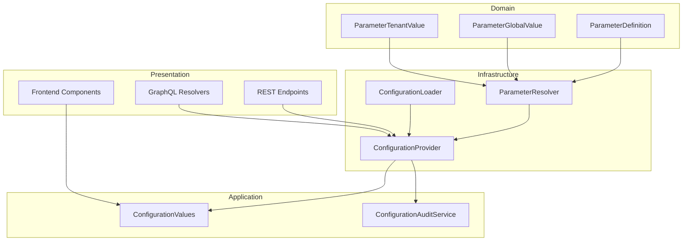

# Parameter System Redesign - UMS

## 1. Overview

The parameter system in UMS has been redesigned to ensure that all tenants and global configuration always have the complete set of parameters that correspond to them, even if they have not been explicitly modified.

### Problem Statement

Previously, parameters were stored as flat records with scope (Global/Tenant/Suite/Module) embedded in each record. This caused inconsistencies:
- Some tenants had 2 parameters, others had 3, etc.
- No clear separation between "parameter doesn't exist" and "parameter uses default"
- No master catalog defining all available parameters and their characteristics

### Solution

A three-tier model with:
1. **Master Parameter Catalog** - defines all parameters, their defaults, and allowed scopes
2. **Global Values** - effective values at global level
3. **Tenant Overrides** - tenant-specific modifications

---

## 2. Data Model

### 2.1 ParameterDefinitions (Master Catalog)

Central table defining all system parameters.

| Column | Type | Constraints | Description |
|--------|------|-------------|-------------|
| Id | UUID | PK | Unique identifier |
| Code | VARCHAR(100) | UNIQUE, NOT NULL | Parameter code (e.g., SESSION_TIMEOUT_MINUTES) |
| Name | VARCHAR(200) | NOT NULL | Human-readable name |
| Description | VARCHAR(1000) | NOT NULL | Detailed description |
| DataTypeId | INT | NOT NULL | 1=String, 2=Number, 3=Boolean, 4=Json |
| DefaultValue | VARCHAR(4000) | NOT NULL | Default value |
| ScopeId | INT | NOT NULL | 1=GlobalOnly, 2=TenantOnly, 3=GlobalAndTenant |
| IsActive | BOOLEAN | NOT NULL | Whether parameter is active |
| Version | VARCHAR(50) | NOT NULL | Semantic version |
| CreatedBy | VARCHAR(100) | NOT NULL | Actor who created |
| CreatedAtUtc | DATETIME | NOT NULL | Creation timestamp |
| UpdatedBy | VARCHAR(100) | NULL | Last modifier |
| UpdatedAtUtc | DATETIME | NULL | Last modification |
| AuditTimeSpan | VARCHAR(100) | NOT NULL | Audit context |
| RowVersion | BINARY(8) | NULL | Optimistic concurrency |

### 2.2 ParameterGlobalValues

Stores effective values for parameters at global scope.

| Column | Type | Constraints | Description |
|--------|------|-------------|-------------|
| Id | UUID | PK | Unique identifier |
| ParameterDefinitionId | UUID | FK, UNIQUE | Reference to ParameterDefinitions |
| EffectiveValue | VARCHAR(4000) | NOT NULL | The effective value |
| StatusId | INT | NOT NULL | 1=Draft, 2=Published, 3=Archived |
| Version | VARCHAR(50) | NOT NULL | Semantic version |
| CreatedBy | VARCHAR(100) | NOT NULL | Actor who created |
| CreatedAtUtc | DATETIME | NOT NULL | Creation timestamp |
| UpdatedBy | VARCHAR(100) | NULL | Last modifier |
| UpdatedAtUtc | DATETIME | NULL | Last modification |
| AuditTimeSpan | VARCHAR(100) | NOT NULL | Audit context |
| RowVersion | BINARY(8) | NULL | Optimistic concurrency |

### 2.3 ParameterTenantValues

Stores tenant-specific overrides.

| Column | Type | Constraints | Description |
|--------|------|-------------|-------------|
| Id | UUID | PK | Unique identifier |
| TenantId | UUID | FK, NOT NULL | Reference to tenant |
| ParameterDefinitionId | UUID | FK, NOT NULL | Reference to ParameterDefinitions |
| OverrideValue | VARCHAR(4000) | NOT NULL | Tenant-specific override |
| StatusId | INT | NOT NULL | 1=Draft, 2=Published, 3=Archived |
| Version | VARCHAR(50) | NOT NULL | Semantic version |
| CreatedBy | VARCHAR(100) | NOT NULL | Actor who created |
| CreatedAtUtc | DATETIME | NOT NULL | Creation timestamp |
| UpdatedBy | VARCHAR(100) | NULL | Last modifier |
| UpdatedAtUtc | DATETIME | NULL | Last modification |
| AuditTimeSpan | VARCHAR(100) | NOT NULL | Audit context |
| RowVersion | BINARY(8) | NULL | Optimistic concurrency |

**Unique Index**: (TenantId, ParameterDefinitionId)

---

## 3. Scope Applicability Rules

### 3.1 Scope Values

| ScopeId | Name | Description |
|---------|------|-------------|
| 1 | GlobalOnly | Parameter can only have global values |
| 2 | TenantOnly | Parameter can only have tenant-specific values |
| 3 | GlobalAndTenant | Parameter can have global default AND tenant override |

### 3.2 Applicability Rules

| Scope | Appears in Global Admin | Appears in Tenant Admin | Behavior |
|-------|------------------------|------------------------|----------|
| GlobalOnly | Yes (editable) | No | Global value or default |
| TenantOnly | No | Yes (editable) | Tenant override or default |
| GlobalAndTenant | Yes (view/edit global) | Yes (view/edit override) | Tenant override > Global > Default |

---

## 4. Value Resolution Precedence

### 4.1 Resolution Algorithm

```
Function GetEffectiveValue(tenantId, parameterCode):
    definition = GetDefinition(parameterCode)
    if definition is null:
        throw "Parameter not found"

    // Check tenant override (if applicable)
    if tenantId is not null AND definition.Scope.SupportsTenant():
        tenantValue = GetTenantOverride(tenantId, definition.Id)
        if tenantValue is not null AND tenantValue.Status == Published:
            return tenantValue.OverrideValue

    // Check global value (if applicable)
    if definition.Scope.SupportsGlobal():
        globalValue = GetGlobalValue(definition.Id)
        if globalValue is not null AND globalValue.Status == Published:
            return globalValue.EffectiveValue

    // Fall back to default
    return definition.DefaultValue
```

### 4.2 Resolution Examples

| Parameter | Scope | Tenant | Resolution |
|-----------|-------|--------|------------|
| SESSION_TIMEOUT_MINUTES | GlobalAndTenant | RANSA | RANSA override: 45 |
| SESSION_TIMEOUT_MINUTES | GlobalAndTenant | UNIMAR | No override → Global: 30 |
| ACCESS_TOKEN_DURATION_MS | GlobalOnly | Any | Global: 3600000 |
| UI_CUSTOM_BRANDING_ENABLED | GlobalAndTenant | RANSA | RANSA override: true |
| UI_CUSTOM_BRANDING_ENABLED | GlobalAndTenant | APM | No override → Global: false |

---

## 5. Master Parameter Catalog

| Code | Name | DataType | Default | Scope | Description |
|------|------|----------|---------|-------|-------------|
| SESSION_TIMEOUT_MINUTES | Session Timeout | Number | 30 | GlobalAndTenant | Idle session timeout in minutes |
| MAX_LOGIN_ATTEMPTS | Max Login Attempts | Number | 5 | GlobalAndTenant | Maximum login attempts before lockout |
| ACCESS_TOKEN_DURATION_MS | Access Token Duration | Number | 3600000 | GlobalOnly | Access token lifetime in ms (1 hour) |
| REFRESH_TOKEN_DURATION_MS | Refresh Token Duration | Number | 604800000 | GlobalOnly | Refresh token lifetime in ms (7 days) |
| MIN_PASSWORD_LENGTH | Min Password Length | Number | 12 | GlobalAndTenant | Minimum required password length |
| MAX_PASSWORD_AGE_DAYS | Max Password Age | Number | 90 | GlobalAndTenant | Maximum days before password expires |
| MFA_REQUIRED_FOR_ADMIN | MFA Required for Admin | Boolean | false | GlobalAndTenant | Tenant-scoped toggle that requires verified MFA at login when enabled |
| MFA_ALLOWED_METHODS | MFA Allowed Methods | String | Totp,WebAuthn,SmsOtp,EmailOtp | GlobalAndTenant | Comma-separated list of enabled MFA methods for the tenant |
| UI_CUSTOM_BRANDING_ENABLED | Custom Branding Enabled | Boolean | false | GlobalAndTenant | Enable custom tenant branding |
| UI_THEME | UI Theme | String | light | GlobalAndTenant | UI theme preference |
| MAX_VALIDITY_PERIOD_DAYS | Max Validity Period Days | Number | 365 | GlobalAndTenant | Maximum user account validity period |
| FRONTEND_CONFIG_TRANSPORT | Frontend Config Transport | String | rest | GlobalOnly | Transport mode: graphql or rest |
| ENABLE_GRAPHQL_INTROSPECTION | Enable GraphQL Introspection | Boolean | false | GlobalOnly | Allow GraphQL schema introspection |

---

## 6. ER Diagram

```mermaid
erDiagram
    ParameterDefinition ||--o{ ParameterGlobalValue : "defines global value"
    ParameterDefinition ||--o{ ParameterTenantValue : "has tenant override"
    Tenant ||--o{ ParameterTenantValue : "customizes"

    ParameterDefinition {
        uuid Id PK
        string Code UK
        string Name
        string Description
        int DataTypeId
        string DefaultValue
        int ScopeId
        bool IsActive
        string Version
        string CreatedBy
        datetime CreatedAtUtc
    }

    ParameterGlobalValue {
        uuid Id PK
        uuid ParameterDefinitionId FK UK
        string EffectiveValue
        int StatusId
        string Version
        string CreatedBy
        datetime CreatedAtUtc
    }

    ParameterTenantValue {
        uuid Id PK
        uuid TenantId FK
        uuid ParameterDefinitionId FK
        string OverrideValue
        int StatusId
        string Version
        string CreatedBy
        datetime CreatedAtUtc
    }

    Tenant {
        uuid Id PK
        string Code
        string Name
    }
```

---

## 7. Architecture

### 7.1 Component Diagram



### 7.2 ParameterResolver Service

```csharp
public interface IParameterResolver
{
    // Get all parameters for global scope with resolved values
    Task<IReadOnlyList<ResolvedParameter>> GetGlobalParametersAsync();

    // Get all parameters for a specific tenant with resolved values
    Task<IReadOnlyList<ResolvedParameter>> GetTenantParametersAsync(Guid tenantId);

    // Get effective value for a single parameter
    Task<string> GetEffectiveValueAsync(Guid? tenantId, string parameterCode);
}

public record ResolvedParameter(
    Guid DefinitionId,
    string Code,
    string Name,
    string Description,
    ParameterDataType DataType,
    string EffectiveValue,      // The resolved value
    string DefaultValue,        // The default from catalog
    ParameterScope Scope,
    bool IsOverride,            // True if tenant/global override exists
    string Status);             // "Default", "Draft", "Published", "Archived"
```

### 7.3 ConfigurationProvider

The ConfigurationProvider loads all parameters at startup and caches them in memory.

```csharp
public interface IConfigurationProvider
{
    // Get global parameter value
    string GetGlobal(string code);

    // Get tenant parameter value (with precedence)
    string GetForTenant(Guid tenantId, string code);

    // Get value with precedence (tenant > global > default)
    string GetWithPrecedence(Guid? tenantId, string code);

    // Get value as specific type
    T GetValueAs<T>(string code, T defaultValue);
}
```

---

## 8. Behavior Across Data Modes

### 8.1 Data Mocks Mode

- Master catalog loaded from in-memory mock data
- Global values from mock data
- Tenant overrides from mock data
- Resolution works identically to other modes

### 8.2 Local Database Mode

- Master catalog seeded from `ParameterCatalogSeeder`
- Global values seeded with defaults
- Tenant overrides seeded for demo tenants
- SQLite database in `Ums.Presentation/umsdev.db`

### 8.3 Production Mode

- Master catalog managed via admin UI
- Global values managed via global config screen
- Tenant values managed via tenant config screen
- SQL Server database

---

## 9. Audit Trail

All parameter modifications are logged:

| Field | Description |
|-------|-------------|
| User | Actor who made the change |
| Scope | "Global" or "Tenant:{tenantCode}" |
| TenantId | Tenant affected (if applicable) |
| ParameterCode | Parameter that was modified |
| OldValue | Previous value |
| NewValue | New value |
| Timestamp | When the change occurred |
| OperationType | Create, Update, Delete, Publish |

---

## 10. API Changes

### 10.1 GET /api/v1/parameters

Returns all parameters with their resolved effective values.

Query Parameters:
- `scope`: "global" | "tenant" | "all"
- `tenantId`: UUID (required for tenant scope)

Response:
```json
{
  "items": [
    {
      "code": "SESSION_TIMEOUT_MINUTES",
      "name": "Session Timeout",
      "description": "Idle session timeout in minutes",
      "dataType": "Number",
      "effectiveValue": "45",
      "defaultValue": "30",
      "scope": "GlobalAndTenant",
      "isOverride": true,
      "status": "Published",
      "tenantId": "3FA85F64-5717-4562-B3FC-2C963F66AFA6"
    }
  ],
  "totalItems": 13,
  "page": 1,
  "pageSize": 20
}
```

### 10.2 PUT /api/v1/parameters/{code}/global

Update global parameter value.

### 10.3 PUT /api/v1/parameters/{code}/tenant/{tenantId}

Update tenant parameter override.

---

## 11. Frontend Changes

### 11.1 Global Configuration Screen

- Shows only parameters with `Scope = GlobalOnly` or `Scope = GlobalAndTenant`
- Edit mode for global values
- Shows "Default" badge when using default value
- Shows "Custom" badge when using custom global value

### 11.2 Tenant Configuration Screen

- Shows only parameters with `Scope = TenantOnly` or `Scope = GlobalAndTenant`
- For GlobalAndTenant parameters, shows resolved value (override or global default)
- Edit mode creates/updates tenant override
- Visual indicator showing whether value is "Override", "Global Default", or "System Default"

### 11.3 Type Inference

| DataType | UI Control | Example |
|----------|------------|---------|
| String | TextField | "rest" |
| Number | TextField (type=number) | 3600000 |
| Boolean | Switch | true/false |
| Json | CodeBadge | {"key": "value"} |

---

## 12. Migration Strategy

### Phase 1: Shadow Mode
- New tables created alongside existing AppConfigurations
- New services operational but not affecting existing flow
- Validate data integrity

### Phase 2: Parallel Read
- Read operations use new model
- Write operations still use old model
- Ensure consistency

### Phase 3: Full Cutover
- All operations use new model
- Old AppConfigurations table deprecated (retained for audit)
- Remove shadow mode code

---

## 13. Remaining Implementation Tasks

1. **Repository Implementations**: Create SqlServer implementations for new repositories
2. **DI Registration**: Register new services in DependencyInjection.cs
3. **ConfigurationLoader Update**: Update to load new model at startup
4. **Database Migration**: Create EF Core migration for new tables
5. **API Endpoint Updates**: Modify existing endpoints to use new model
6. **GraphQL Resolver Updates**: Update GraphQL resolvers
7. **Frontend Updates**: Update components to use new API
8. **Testing**: Unit and integration tests for new model

---

## 14. Glossary

| Term | Definition |
|------|------------|
| Master Catalog | ParameterDefinitions table containing all parameter metadata |
| Global Value | Effective value at system-wide level |
| Tenant Override | Tenant-specific modification of a parameter |
| Resolved Value | The value that will be used after applying precedence rules |
| Scope Applicability | Rules determining where a parameter can be configured |
