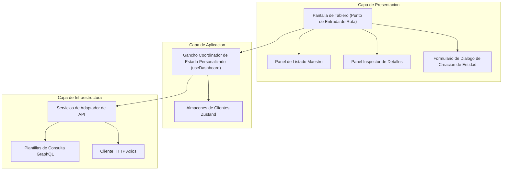

# Reporte de Auditoria de SoC Arquitectonico y Codigo Limpio

Este reporte presenta una revision minuciosa y verificacion arquitectonica del codigo fuente del portal web React en el monorepo del Sistema de Gestion de Usuarios (UMS). Evalua como las vistas implementadas respaldan nuestras pautas de Material Design 3, la separacion de responsabilidades (SoC), la reutilizacion de componentes y los principios de codigo limpio.

---

## 1. Consistencia Arquitectonica y Separacion de Responsabilidades (SoC)

El codigo fuente del frontend impone estrictamente los limites de la Arquitectura Limpia (Hexagonal). Existe una separacion completa y limpia entre las capas de presentacion de UI, coordinacion de aplicaciones y acceso a datos:

### Evidencias de Separacion Arquitectonica

- **Vistas de UI (Presentacion):** Los componentes como `TenantDashboardScreen.tsx` o `FeatureFlagDashboardScreen.tsx` no realizan solicitudes de datos, no manejan limites de cache ni contienen logica de esquemas de bases de datos. Actuan puramente como orquestadores que mapean paneles de UI a ganchos personalizados.
- **Coordinadores de Estado (Aplicacion):** Los ganchos personalizados (como `useTenantDashboard`, `useUserAccountDashboard` y `useFeatureFlagDashboard`) administran los conmutadores visuales, los parametros de consulta y coordinan las mutaciones. No contienen etiquetas de estilo ni estructuras de diseno, lo que garantiza que sigan siendo controladores comerciales puros.
- **Adaptadores de Datos (Infraestructura):** Los servicios como `tenantService.ts` y `userAccountService.ts` se comunican con el backend a traves de Axios (REST) o consultas GraphQL, analizando y validando las cargas utiles de red en el limite utilizando esquemas estrictos de Zod antes de devolver los datos a la capa de aplicacion.

---

## 2. Reutilizacion de Componentes y Controles Comunes

UMS mantiene una base de codigo de UI altamente orientada a la reutilizacion. En lugar de implementar estilos ad-hoc en cada vista, los modulos aprovechan componentes estandarizados definidos en `@shared/components` y `@shared/layouts`:

### 2.1. Disenos Estructurales
- **`PageShell`:** Estandariza los limites de la vista de pagina, los parametros de viewport consistentes, los comportamientos de desplazamiento y los margenes responsivos en todos los tableros.
- **`MasterDetailLayout` / `PageDashboardShell`:** Divide los viewports en un listado maestro a la izquierda y un panel de inspeccion de detalles a la derecha. Ambos disenos implementan transiciones CSS suaves y un divisor responsivo de arrastrar para cambiar el tamano.

### 2.2. Catalogo de Componentes Estandar M3
- **`M3TextField`:** Implementa el diseno de etiqueta flotante con muesca de borde nativo utilizando etiquetas semanticas HTML `<fieldset>` y `<legend>`, evitando superposiciones de color de fondo.
- **`M3Button`:** Consolida todos los botones interactivos bajo estilos predefinidos (Lleno, Contorneado, Texto, Destructivo) y admite indicadores de enfoque consistentes en `focus-visible`.
- **`DataGrid`:** Centraliza los disenos de listado de tablas, la representacion de celdas densas y comodas, los indicadores de paginacion, los estados vacios y los encabezados visuales.
- **`M3Dialog` / `ConfirmDialog` / `M3FormDialog`:** Estandariza los fondos superpuestos, las trampas de enfoque y las estructuras de accion visuales.

---

## 3. Evaluacion de Codigo Limpio y Mantenibilidad

La base de codigo cumple en gran medida con los principios de diseno SOLID y los paradigmas de codigo limpio:

- **Principio de Responsabilidad Unica (SRP):**
  - Las pantallas solo compilan paneles de diseno.
  - Las listas administran celdas de columna, barras de herramientas y parametros de busqueda.
  - Los detalles presentan atributos, activadores de accion y campos de estado.
  - Los ganchos orquestan las transiciones de estado de datos y las validaciones.
- **No te Repitas (DRY):** No existe logica duplicada para barras de busqueda, tablas de datos, cargadores o dialogos superpuestos. Todas las configuraciones (opciones de ordenacion, parametros de filtrado) se declaran como matrices estaticas simples y se pasan a adaptadores genericos.
- **Pureza del Diseno Guiado por el Dominio (DDD):** Los modelos y esquemas de frontend estan completamente desacoplados de los componentes cliente de terceros, lo que garantiza que las reglas de negocio esten a salvo de las dependencias de UI.

---

## 4. Matriz de Verificacion y Cumplimiento

| Vista de Tablero | Usa `PageShell` | Usa Master-Detail | Emplea Ganchos Personalizados | Valida Limites | Cumple con M3 |
|---|---|---|---|---|---|
| `TenantDashboardScreen` | Si | Si | Si (`useTenantDashboard`) | Si (Zod parsing) | Si |
| `UserAccountDashboardScreen` | Si | Si | Si (`useUserAccountDashboard`) | Si (Zod parsing) | Si |
| `DelegationDashboardScreen` | Si | Si | Si (`useDelegationDashboard`) | Si (Zod parsing) | Si |
| `PermissionTemplateDashboardScreen` | Si | Si | Si (`usePermissionTemplateDashboard`) | Si (Zod parsing) | Si |
| `SystemSuiteDashboardScreen` | Si | Si | Si (`useSystemSuiteDashboard`) | Si (Zod parsing) | Si |
| `FeatureFlagDashboardScreen` | Si | Si | Si (`useFeatureFlagDashboard`) | Si (Zod parsing) | Si |

---

## 5. Resumen del Estado de Cumplimiento
El portal frontend de UMS ha **aprobado** nuestra auditoria visual, de codigo limpio y de consistencia arquitectonica. Cada vista implementada respeta estrictamente la separacion de responsabilidades (SoC), promueve la maxima reutilizacion de componentes y se asigna a definiciones semanticas unificadas de Material Design 3.
