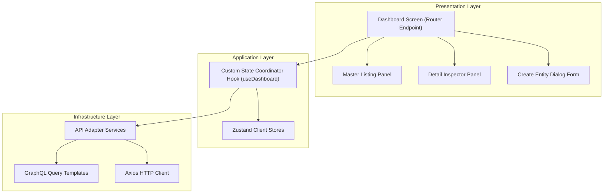

# Architectural SoC and Clean Code Audit Report

This report presents a thorough review and architectural verification of the React web portal source code in the User Management System (UMS) monorepo. It evaluates how the implemented views support our Material Design 3 guidelines, separation of concerns (SoC), component reuse, and clean code principles.

---

## 1. Architectural Consistency and Separation of Concerns (SoC)

The frontend source code strictly enforces Clean Architecture (Hexagonal) boundaries. There is a complete and clean separation between UI presentation, application coordination, and data access layers:

### Architectural Separation Evidences

- **UI Views (Presentation):** Components such as `TenantDashboardScreen.tsx` or `FeatureFlagDashboardScreen.tsx` do not fetch data, handle cache boundaries, or contain database schema logic. They act purely as orchestrators that map UI panels to custom hooks.
- **State Coordinators (Application):** Custom hooks (like `useTenantDashboard`, `useUserAccountDashboard`, and `useFeatureFlagDashboard`) manage visual toggles, queries parameters, and coordinate mutations. They hold zero styling tags or layout structures, ensuring they remain pure business controllers.
- **Data Adapters (Infrastructure):** Services like `tenantService.ts` and `userAccountService.ts` communicate with the backend via Axios (REST) or GraphQL queries, parsing and validating network payloads at the boundary using strict Zod schemas before returning data to the application layer.

---

## 2. Component Reusability and Common Controls

UMS maintains a highly reuse-oriented UI codebase. Rather than implementing ad-hoc styles in each view, the modules leverage standardized components defined in `@shared/components` and `@shared/layouts`:

### 2.1. Structural Layouts
- **`PageShell`:** Standardizes page view borders, consistent viewport parameters, scroll behaviors, and responsive margins across all dashboards.
- **`MasterDetailLayout` / `PageDashboardShell`:** Divides viewports into a master listing on the left and a detail inspector panel on the right. Both layouts implement smooth CSS transitions and a responsive drag-to-resize splitter.

### 2.2. Standard M3 Components Catalog
- **`M3TextField`:** Implements the native border notch floating label design using semantic HTML `<fieldset>` and `<legend>` tags, preventing background-color overlaps.
- **`M3Button`:** Consolidates all interactive buttons under predefined styles (Filled, Outlined, Text, Destructive) and supports standardized focus-visible indicators.
- **`DataGrid`:** Centralizes table listing layouts, dense and comfortable cells rendering, pagination indicators, empty states, and visual headers.
- **`M3Dialog` / `ConfirmDialog` / `M3FormDialog`:** Standardizes overlay backdrops, focus traps, and visual action structures.

---

## 3. Clean Code and Maintainability Assessment

The codebase is highly compliant with SOLID design principles and clean code paradigms:

- **Single Responsibility Principle (SRP):**
  - Screens compile layout panels only.
  - Lists manage column cells, toolbars, and search parameters.
  - Details present attributes, action triggers, and status fields.
  - Hooks orchestrate data state transitions and validations.
- **Don't Repeat Yourself (DRY):** No duplicate logic exists for search bars, data tables, loaders, or overlay dialogs. All configurations (sorting options, filtering parameters) are declared as simple static arrays and passed to generic adapters.
- **Domain-Driven Design (DDD) Purity:** Frontend models and schemas are completely decoupled from third-party client components, guaranteeing that business rules are safe from UI dependencies.

---

## 4. Verification and Compliance Matrix

| Dashboard View | Uses `PageShell` | Uses Master-Detail | Employs Custom Hooks | Validates Boundaries | Complies with MD3 |
|---|---|---|---|---|---|
| `TenantDashboardScreen` | Yes | Yes | Yes (`useTenantDashboard`) | Yes (Zod parsing) | Yes |
| `UserAccountDashboardScreen` | Yes | Yes | Yes (`useUserAccountDashboard`) | Yes (Zod parsing) | Yes |
| `DelegationDashboardScreen` | Yes | Yes | Yes (`useDelegationDashboard`) | Yes (Zod parsing) | Yes |
| `PermissionTemplateDashboardScreen` | Yes | Yes | Yes (`usePermissionTemplateDashboard`) | Yes (Zod parsing) | Yes |
| `SystemSuiteDashboardScreen` | Yes | Yes | Yes (`useSystemSuiteDashboard`) | Yes (Zod parsing) | Yes |
| `FeatureFlagDashboardScreen` | Yes | Yes | Yes (`useFeatureFlagDashboard`) | Yes (Zod parsing) | Yes |

---

## 5. Summary of Compliance Status
The UMS frontend portal has **passed** our visual, clean code, and architectural consistency audit. Every implemented view strictly respects the separation of concerns (SoC), promotes maximum component reuse, and maps to unified Material Design 3 semantic definitions.
