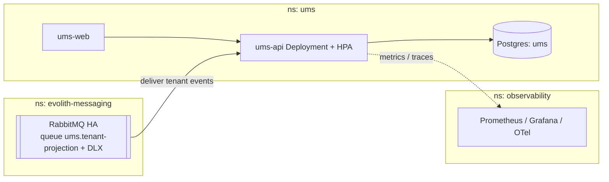

# UMS — Deployment Topology (single-cluster Kubernetes)

> UMS deploys into the **single Evolith Kubernetes cluster** (Core **ADR-0107**), in namespace
> `ums`, with its own PostgreSQL, **consuming** tenant events from the shared RabbitMQ in
> `evolith-messaging` (ADR-0106 / [ADR-0083](../architecture/adrs/0083-consume-mms-tenant-projection.md)).
> UMS already ships `infra/ums-helm` — it is the reference chart the other products replicate,
> and it must be **extended with the RabbitMQ consumer wiring**.

## Chart gaps to close (Phase 2)
- **ums-helm today has no RabbitMQ template** and no consumer config — add the queue binding
  (via the shared Topology Operator), the `ConnectionStrings:RabbitMq` Secret, and switch the
  app from `UsingInMemory` → `UsingRabbitMq` (ADR-0083).
- NetworkPolicy: `ums-api` egress to `evolith-messaging` + its own DB only.
- ResourceQuota/LimitRange on `ns: ums`; PDB for `ums-api`.

See Core **ADR-0107** (suite topology) and the canonical
[tenant-master-data-projection.md](../../../mms/docs/architecture/tenant-master-data-projection.md).
