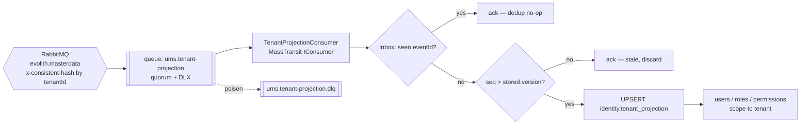
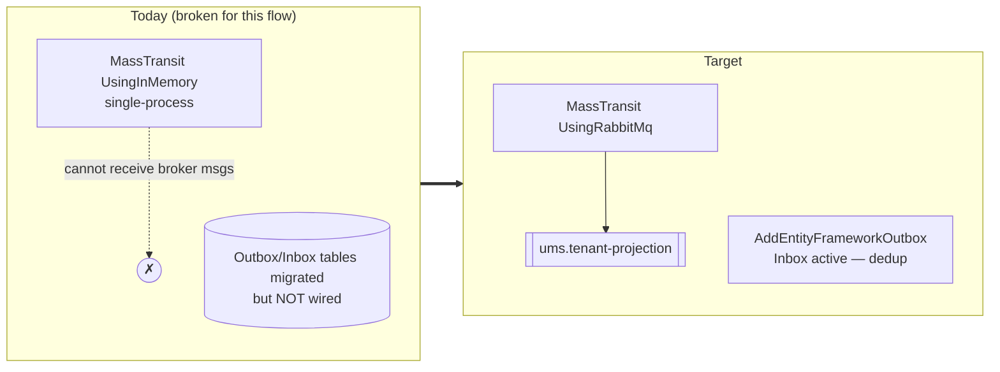

# UMS — Tenant Projection (from MMS)

> UMS consumes the master Tenant from MMS (ADR-0106 / [ADR-0083](../architecture/adrs/0083-consume-mms-tenant-projection.md))
> and projects it into a local read model used as the authorization boundary.
> Canonical design: [`mms/docs/architecture/tenant-master-data-projection.md`](../../../mms/docs/architecture/tenant-master-data-projection.md).

## Consumer flow

## Transport correction (critical)

## Notes
- Switch `UsingInMemory` → `UsingRabbitMq`; wire `AddEntityFrameworkOutbox` (activates Inbox).
- UMS already **authors** a `Tenant` aggregate → **demote to read-only projection** + backfill
  to avoid two writers.
- Instrument the consumer with OpenTelemetry + Prometheus (lag, retries, DLQ).
