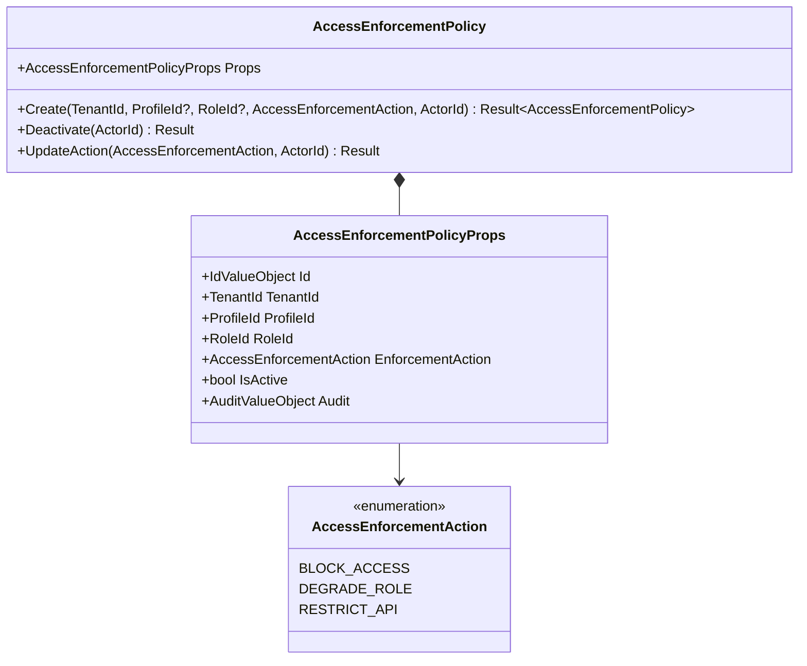
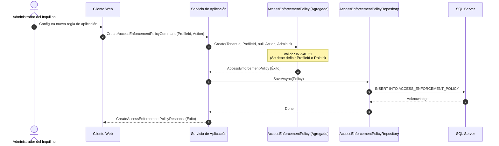
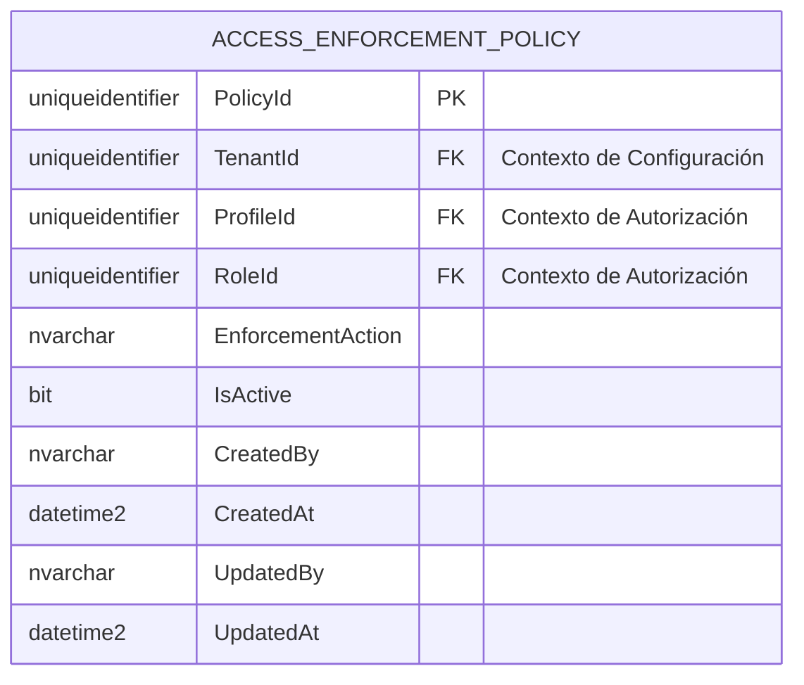
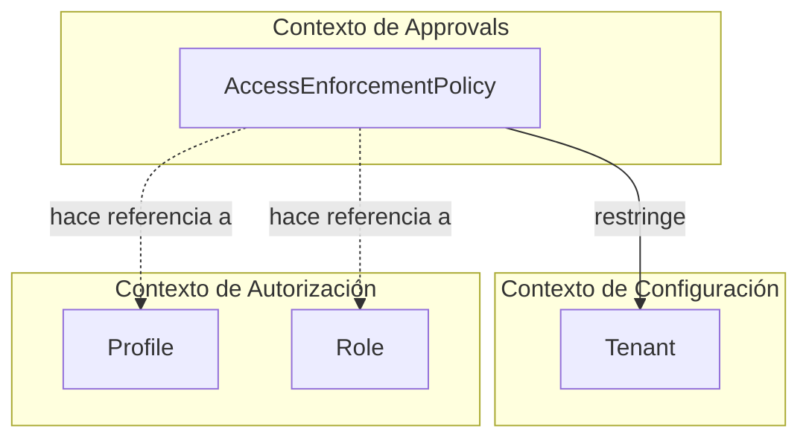

# AccessEnforcementPolicy — Arquitectura del Agregado

**Contexto Acotado:** Approvals  
**Raíz del Agregado:** Sí  
**Módulo:** `Ums.Domain.Approvals.AccessEnforcementPolicy`  
**Estado:** Producción

---

## 1. Vista General del Agregado

### Propósito
El agregado raíz `AccessEnforcementPolicy` establece reglas generales de restricción de acceso a nivel de inquilino (tenant). Determina qué privilegios de acceso (como un perfil o mapeo de rol) se bloquean, degradan o restringen cuando un usuario entra en estado de incumplimiento (por ejemplo, falta de credenciales válidas obligatorias o documentos críticos vencidos).

### Responsabilidad de Negocio
- Definir bloqueos de acceso específicos asignados a componentes de autorización (perfiles o roles).
- Administrar la segregación multi-inquilino de las reglas de política específicas de cada inquilino.
- Mantener el control del ciclo de vida (activo frente a inactivo) sobre las ejecuciones de políticas.
- Forzar una validación estricta al cambiar los comportamientos de aplicación.

### Raíz del Agregado
`AccessEnforcementPolicy` actúa como una raíz de agregado independiente de `DocumentType` para separar las definiciones de credenciales de las reglas de reacción de seguridad.

### Invariantes y Reglas de Consistencia
1. **INV-AEP1 (Restricción del Alcance de la Política):** Una política debe apuntar a un `ProfileId` o a un `RoleId` (o a ambos). Está prohibido crear una política sin especificar al menos un objetivo (`DomainErrors.Approvals.PolicyRequiresProfileOrRole`).
2. **INV-AEP2 (Desactivación del Ciclo de Vida):** Una política no se puede desactivar si ya está inactiva (`DomainErrors.Approvals.PolicyAlreadyInactive`).
3. **INV-AEP3 (Integridad del Inquilino):** Las políticas deben asignarse explícitamente a un `TenantId` para garantizar la seguridad de la partición de inquilinos.

### Entidades Relacionadas / Objetos de Valor
| Entidad / VO | Tipo | Descripción |
|---|---|---|
| `AccessEnforcementPolicyId` | Objeto de Valor | Identificador único del agregado |
| `TenantId` | Objeto de Valor | Identificador del inquilino propietario |
| `ProfileId` | Objeto de Valor | Perfil de autorización de destino (opcional) |
| `RoleId` | Objeto de Valor | Rol de autorización de destino (opcional) |
| `AccessEnforcementAction` | Enumerado/VO | `BLOCK_ACCESS` · `DEGRADE_ROLE` · `RESTRICT_API` |
| `AuditValueObject` | Objeto de Valor | Historial de auditoría multiusuario |

---

## 2. Modelo de Dominio

### Clases / Entidades / Objetos de Valor
```
AccessEnforcementPolicy (Aggregate Root)
└── Props: AccessEnforcementPolicyProps
    ├── Id: AccessEnforcementPolicyId
    ├── TenantId: TenantId
    ├── ProfileId: ProfileId?
    ├── RoleId: RoleId?
    ├── EnforcementAction: AccessEnforcementAction
    ├── IsActive: bool
    └── Audit: AuditValueObject
```

---

## 3. Diagramas del Modelo de Objetos



---

## 4. Diagramas de Secuencia

### Crear Política de Aplicación de Acceso



---

## 5. Modelo ER



### Reglas de Aislamiento de Inquilinos (Tenancy)
- Las políticas se particionan estrictamente por `TenantId`. Los filtros de inquilino deben aplicarse a todas las lecturas y escrituras para garantizar las fronteras operativas.

---

## 6. Integración del Contexto Acotado



---

## 7. Capa de Aplicación

### Comandos y Consultas
- **CreateAccessEnforcementPolicyCommand:** Configura una nueva política de cumplimiento bajo el contexto del inquilino activo.
- **DeactivateAccessEnforcementPolicyCommand:** Deshabilita una política activa, liberando las restricciones de acceso para los actores objetivo.
- **GetAccessEnforcementPolicyByIdQuery:** Recupera detalles de la política.
- **GetAllAccessEnforcementPoliciesQuery:** Enumera las políticas activas bajo el inquilino del administrador.

---

## 8. Infraestructura/Persistencia

### Configuración del Mapeo de EF Core
```csharp
public class AccessEnforcementPolicyConfiguration : IEntityTypeConfiguration<AccessEnforcementPolicy>
{
    public void Configure(EntityTypeBuilder<AccessEnforcementPolicy> builder)
    {
        builder.ToTable("ACCESS_ENFORCEMENT_POLICY");
        builder.HasKey(e => e.Id);
        
        builder.OwnsOne(e => e.Props, props =>
        {
            props.Property(p => p.Id).HasColumnName("PolicyId");
            props.Property(p => p.TenantId).HasColumnName("TenantId");
            props.Property(p => p.ProfileId).HasColumnName("ProfileId");
            props.Property(p => p.RoleId).HasColumnName("RoleId");
            props.Property(p => p.EnforcementAction).HasConversion<string>().HasColumnName("EnforcementAction");
            props.Property(p => p.IsActive).HasColumnName("IsActive");
            props.OwnsOne(p => p.Audit);
        });
    }
}
```

---

## 9. Seguridad y Cumplimiento

- **Aislamiento de Inquilinos:** La aplicación del inquilino opera como la salvaguarda principal; SQL Server RLS actúa como una medida secundaria de respaldo.
- **Separación de Privilegios:** La modificación de las políticas de acceso está estrictamente restringida a los administradores de seguridad de la plataforma o del inquilino.

---

## 10. Decisiones Técnicas

- **Arquitectura Desacoplada:** Aislar las políticas de cumplimiento de acceso de los metadatos de los documentos de usuario permite a los administradores de seguridad configurar fácilmente penalizaciones de cumplimiento globales o a nivel de rol sin necesidad de reescribir plantillas de documentos individuales.

---

**[Volver al Índice de Approvals](./index.md)**
