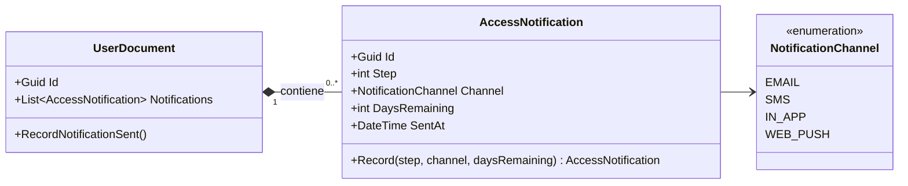
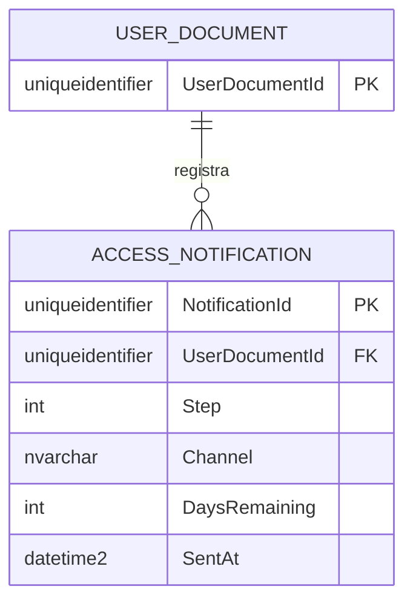

# AccessNotification — Arquitectura de la Entidad

**Contexto Acotado:** Approvals  
**Raíz del Agregado:** `UserDocument`  
**Módulo:** `Ums.Domain.Approvals.UserDocument.AccessNotification`  
**Estado:** Producción

---

## 1. Vista General de la Entidad

### Propósito
La entidad `AccessNotification` registra la transmisión individual de una alerta enviada a un usuario con relación al próximo vencimiento de un documento o a un requisito de cumplimiento. Sirve como un registro cronológico inmutable de alertas generadas por el sistema.

### Responsabilidad de Negocio
- Registrar el momento exacto en que se envió una alerta al usuario.
- Capturar el canal de comunicación utilizado (por ejemplo, correo electrónico, SMS, notificación push).
- Registrar el índice del paso cronológico y la ventana de validez restante (días restantes) al momento de la transmisión.

### Raíz del Agregado
Esta es una entidad de propiedad que pertenece a la raíz del agregado `UserDocument`. Se crea, actualiza y almacena estrictamente bajo la coordinación del ciclo de vida de su parent `UserDocument`.

### Invariantes y Reglas de Consistencia
1. **INV-AN1 (Historial Inmutable):** Una vez registrado un `AccessNotification`, sus propiedades no pueden ser modificadas.
2. **INV-AN2 (Días Restantes Positivos):** `DaysRemaining` debe ser un entero positivo o cero, que represente la ventana de validez restante.
3. **INV-AN3 (Coordinación de la Secuencia de Pasos):** El índice `Step` debe corresponder a una fase de advertencia activa configurada en las reglas del tipo de documento.

### Entidades Relacionadas / Objetos de Valor
| Entidad / VO | Tipo | Propiedad |
|---|---|---|
| `AccessNotificationId` | Objeto de Valor | Identificador único de la entidad |
| `NotificationChannel` | Enumerado | EMAIL · SMS · IN_APP · WEB_PUSH |
| `Step` | Primitivo | Contador del índice de paso |

---

## 2. Modelo de Dominio

### Clases / Entidades / Objetos de Valor
```
AccessNotification (Entity)
└── Props: AccessNotificationProps
    ├── Id: IdValueObject
    ├── Step: int
    ├── Channel: NotificationChannel
    ├── DaysRemaining: int
    └── SentAt: DateTime
```

---

## 3. Diagramas del Modelo de Objetos



---

## 4. Diagramas de Secuencia
- Las modificaciones de estado y secuencias de entrada se coordinan exclusivamente a través de la raíz del agregado [UserDocument](./user-document.md#4-sequence-diagrams).

---

## 5. Modelo ER



### Reglas de Aislamiento de Inquilinos (Tenancy)
- Delimitado mediante su agregado padre `UserDocument`. La seguridad multi-inquilino está garantizada de forma implícita.

---

## 6. Integración del Contexto Acotado
- Mapeado internamente dentro del contexto de `Approvals`. Estos registros históricos son leídos por el motor de cumplimiento de seguridad para verificar si se cumplieron los protocolos de notificación correctos antes de invocar bloqueos de acceso.

---

## 7. Capa de Aplicación
- Gestionado a través del comando padre `RecordNotificationSent` en `UserDocument`.

---

## 8. Infraestructura/Persistencia
- Persistido como una tabla dependiente mapeada por EF Core con una regla de eliminación en cascada que hace referencia a su padre `UserDocument`.

---

## 9. Seguridad y Cumplimiento
- Los registros son estrictamente de solo lectura después de su creación para evitar la alteración de las rutas de auditoría de seguridad.

---

## 10. Decisiones Técnicas
- Persistir los registros de notificación como entidades propias en lugar de despacharlos a un motor de auditoría externo garantiza la autosuficiencia del agregado y un alto rendimiento durante las comprobaciones de cumplimiento.

---

**[Volver al Índice de Approvals](./index.md)**
