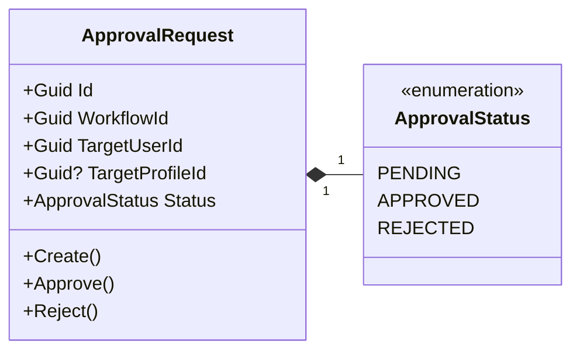
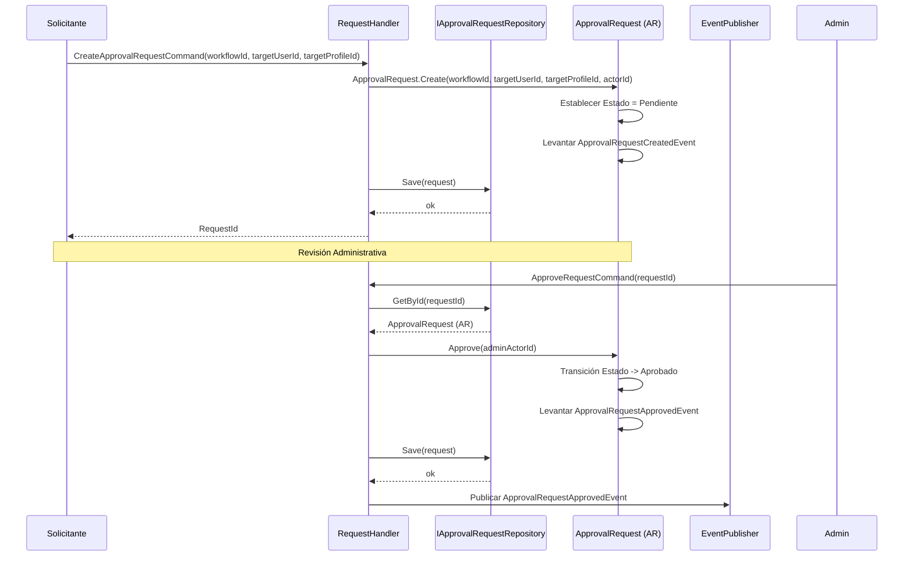
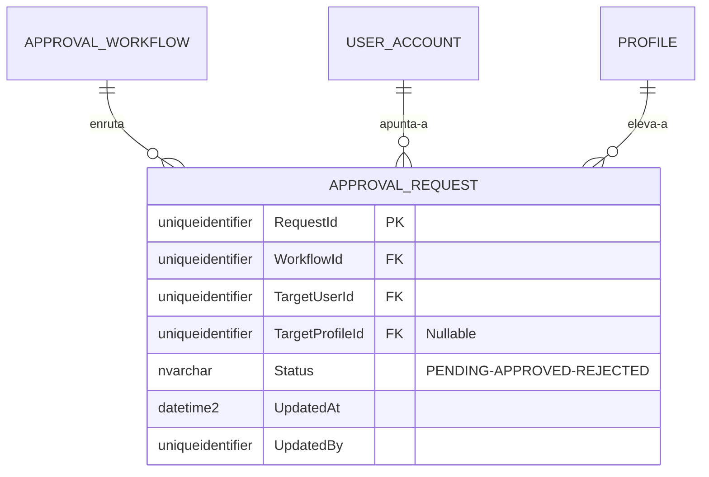

# ApprovalRequest — Arquitectura de Agregados

**Contexto Delimitado:** Aprobaciones  
**Raíz de Agregado:** `ApprovalRequest`  
**Módulo:** `Ums.Domain.Approvals.ApprovalRequest`  
**Estado:** Producción

---

## 1. Visión General del Agregado

### Propósito
El agregado `ApprovalRequest` representa una ejecución concreta en tiempo de ejecución de un proceso de aprobación. Cuando un usuario solicita una acción administrativa de altos privilegios (como una promoción de perfil o una modificación de configuración de seguridad), UMS instancia una `ApprovalRequest` vinculada a un `ApprovalWorkflow` específico para rastrear el estado, las aprobaciones, los rechazos y los detalles de auditoría de esa decisión operativa.

### Responsabilidad de Negocio
- Registrar y rastrear las solicitudes de aprobación dinámicas.
- Prevenir la doble ejecución o transiciones de estado una vez resueltas.
- Autorizar transiciones de `Pending` a `Approved` o `Rejected` mediante firmas autenticadas.
- Vincular la cuenta del usuario de destino y el perfil de destino.

### Raíz de Agregado
`ApprovalRequest` es la raíz del agregado. Todas las transiciones de estado (Aprobación, Rechazo) deben fluir a través de él para garantizar el cumplimiento de las restricciones.

### Invariantes y Reglas de Consistencia
1. Una solicitud nace en el estado `Pending` (Pendiente).
2. El estado solo puede pasar de `Pending` a `Approved` (Aprobado) o `Rejected` (Rechazado). Una vez que una solicitud se ha finalizado, su estado se bloquea permanentemente y no se puede editar.
3. Debe contener referencias válidas a `WorkflowId` y `TargetUserId`.
4. Un usuario no puede aprobar su propia solicitud de promoción (aplicado en la barrera de comandos de la aplicación/dominio para evitar colusión).

### Entidades Relacionadas / Objetos de Valor
| Entidad / VO | Tipo | Propietario |
|---|---|---|
| `ApprovalRequestId` | Objeto de Valor | Identificador de raíz de agregado basado en Guid |
| `ApprovalStatus` | Enumerado | PENDING · APPROVED · REJECTED |
| `AuditValueObject` | Objeto de Valor | Rastrea metadatos de creación y modificación |

### Eventos de Dominio
| Evento | Desencadenante |
|---|---|
| `ApprovalRequestCreatedEvent` | Se registra una nueva solicitud de aprobación y se establece en Pendiente |
| `ApprovalRequestApprovedEvent` | La solicitud se marca como Aprobada, activando despliegues aguas abajo |
| `ApprovalRequestRejectedEvent` | La solicitud se marca como Rechazada, abortando los despliegues aguas abajo |

### Comandos / Casos de Uso
| Comando | Descripción |
|---|---|
| `CreateApprovalRequestCommand` | Instanciar una solicitud de aprobación para una acción del usuario |
| `ApproveRequestCommand` | Aprobar una solicitud pendiente con el identificador del actor autorizado |
| `RejectRequestCommand` | Rechazar una solicitud pendiente y cancelar la elevación propuesta |

### Límites de Repositorio / Servicio
- `IApprovalRequestRepository` — Gestiona el ciclo de vida de las solicitudes.
- Particionado estrictamente por la sesión de `TenantId` del llamador (heredado a través del flujo de trabajo y las configuraciones de usuario de destino).

---

## 2. Modelo de Dominio

### Clases / Entidades / Objetos de Valor
```
ApprovalRequest (Raíz de Agregado)
└── Props: ApprovalRequestProps
    ├── Id: ApprovalRequestId
    ├── WorkflowId: ApprovalWorkflowId
    ├── TargetUserId: UserId
    ├── TargetProfileId?: ProfileId
    ├── Status: ApprovalStatus
    └── Audit: AuditValueObject
```

---

## 3. Diagramas de Modelo de Objetos



---

## 4. Diagramas de Secuencia

### Ciclo de Vida Completo de la Solicitud de Aprobación


---

## 5. Modelo ER



### Reglas de Aislamiento de Inquilinos
- Evaluado mediante la cuenta del usuario de destino y los alcances del flujo de trabajo. Las operaciones se filtran por el límite del inquilino activo en la capa de repositorio.

---

## 6. Integración de Contexto Delimitado
- **Aguas Arriba**: Orquestado por flujos de trabajo del contexto de `Aprobaciones`. Se dirige directamente a identificadores de usuario de `Identidad` y perfiles de `Autorización`.
- **Aguas Abajo**: Las aprobaciones exitosas activan promociones de perfil de usuario dentro del contexto `IGA`.

---

## 7. Capa de Aplicación
- `CreateApprovalRequestCommand` -> Entradas: `WorkflowId, TargetUserId, TargetProfileId?` -> Retorna: `Guid`
- `ApproveRequestCommand` -> Entradas: `RequestId` -> Retorna: `void`
- `RejectRequestCommand` -> Entradas: `RequestId` -> Retorna: `void`

---

## 8. Infraestructura/Persistencia
- Índice: Clave primaria agrupada en `RequestId`, con índice compuesto no agrupado en `TargetUserId, Status`.

---

## 9. Seguridad y Cumplimiento
- Las acciones de aprobación requieren credenciales administrativas distintas del iniciador de la solicitud (cumplimiento contra colusión).
- Auditoría: Las solicitudes finalizadas representan firmas digitales vinculantes y se almacenan permanentemente para auditorías de seguridad.

---

## 10. Decisiones Técnicas
- Mantener un esquema plano simple para las transiciones de estado de las solicitudes garantiza una latencia de persistencia extremadamente baja durante ejecuciones administrativas de alta velocidad.

---

**[Volver al Índice de Aprobaciones](./index.md)**
