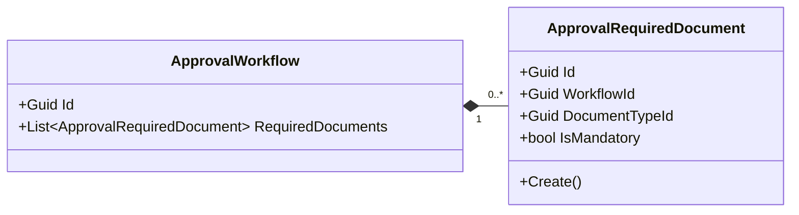
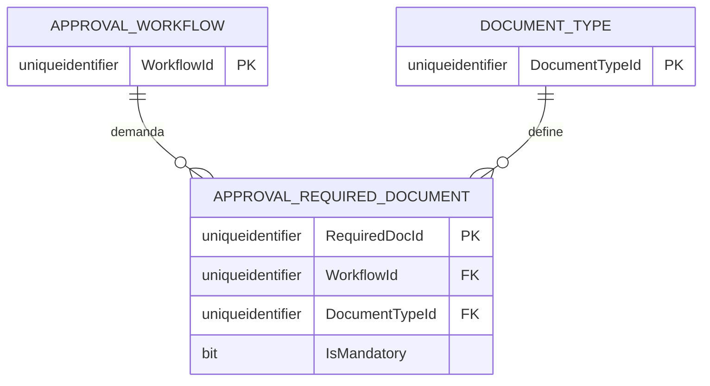

# ApprovalRequiredDocument — Arquitectura de Entidades

**Contexto Delimitado:** Aprobaciones  
**Raíz de Agregado:** `ApprovalWorkflow`  
**Módulo:** `Ums.Domain.Approvals.ApprovalWorkflow.ApprovalRequiredDocument`  
**Estado:** Producción

---

## 1. Visión General de la Entidad

### Propósito
La entidad `ApprovalRequiredDocument` especifica las asignaciones de una clasificación de documento particular (ej., Prueba de Identidad, Contrato) que se declaran como requisitos obligatorios bajo un `ApprovalWorkflow`.

### Responsabilidad de Negocio
- Identificar el `DocumentTypeId` explícito obligatorio para el contexto de un flujo de trabajo.
- Definir si completar la carga es un requisito de bloqueo (`IsMandatory = true`).

### Raíz de Agregado
Esta es una entidad propia que pertenece al agregado `ApprovalWorkflow`. No puede existir ni modificarse fuera del alcance de su agregado padre `ApprovalWorkflow`.

### Invariantes y Reglas de Consistencia
1. Debe contener un `WorkflowId` y un `DocumentTypeId` válidos.
2. Debe tener un `Id` válido (basado en Guid `ApprovalRequiredDocumentId`).
3. El ciclo de vida está ligado al `ApprovalWorkflow` padre.

### Entidades Relacionadas / Objetos de Valor
| Entidad / VO | Tipo | Propietario |
|---|---|---|
| `ApprovalRequiredDocumentId` | Objeto de Valor | Identificador único de la entidad |
| `ApprovalWorkflowId` | Objeto de Valor | Referencia de Guid al agregado padre |
| `DocumentTypeId` | Objeto de Valor | Referencia de Guid a la clasificación del documento |

---

## 2. Modelo de Dominio

### Clases / Entidades / Objetos de Valor
```
ApprovalRequiredDocument (Entidad)
└── Props: ApprovalRequiredDocumentProps
    ├── Id: ApprovalRequiredDocumentId
    ├── WorkflowId: ApprovalWorkflowId
    ├── DocumentTypeId: DocumentTypeId
    ├── IsMandatory: bool
    └── Audit: AuditValueObject
```

---

## 3. Diagramas de Modelo de Objetos



---

## 4. Diagramas de Secuencia
- Los flujos de creación y eliminación son orquestados por el agregado padre [ApprovalWorkflow](./approval-workflow.md#4-diagramas-de-secuencia).

---

## 5. Modelo ER



### Reglas de Aislamiento de Inquilinos
- Reconoce las reglas de delimitación de inquilinos a nivel del padre. Hereda las reglas de aislamiento de base de datos de `APPROVAL_WORKFLOW`.

---

## 6. Integración de Contexto Delimitado
- Mapeado internamente dentro del contexto de `Aprobaciones`. Se dirige directamente a las configuraciones de `DocumentType`.

---

## 7. Capa de Aplicación
- Gestionado a través de los comandos de aplicación del padre: `AddRequiredDocumentToWorkflowCommand` y `RemoveRequiredDocumentFromWorkflowCommand`.

---

## 8. Infraestructura/Persistencia
- Índice: Clave primaria agrupada en `RequiredDocId` e índice compuesto en `WorkflowId, DocumentTypeId`.

---

## 9. Seguridad y Cumplimiento
- Las reglas de seguridad se heredan del `ApprovalWorkflow` padre. Solo los usuarios autorizados a diseñar flujos de trabajo pueden configurar estos mapeos.

---

## 10. Decisiones Técnicas
- Mantener la entidad sin estado, aparte de los atributos relacionales, evita una sobrecarga de carga excesiva durante las evaluaciones de flujos de trabajo.

---

**[Volver al Índice de Aprobaciones](./index.md)**
