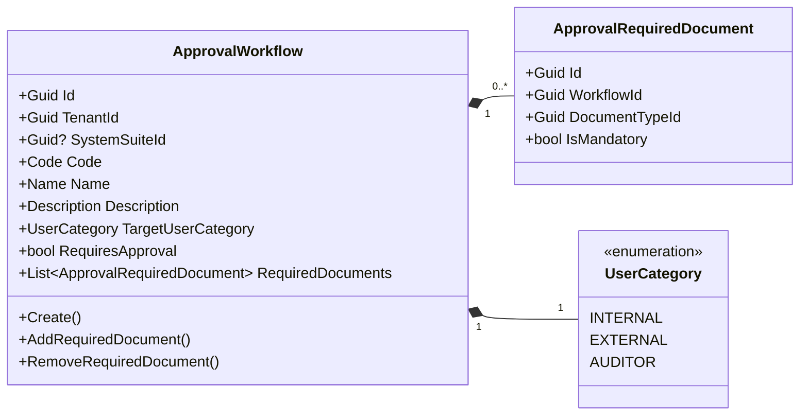
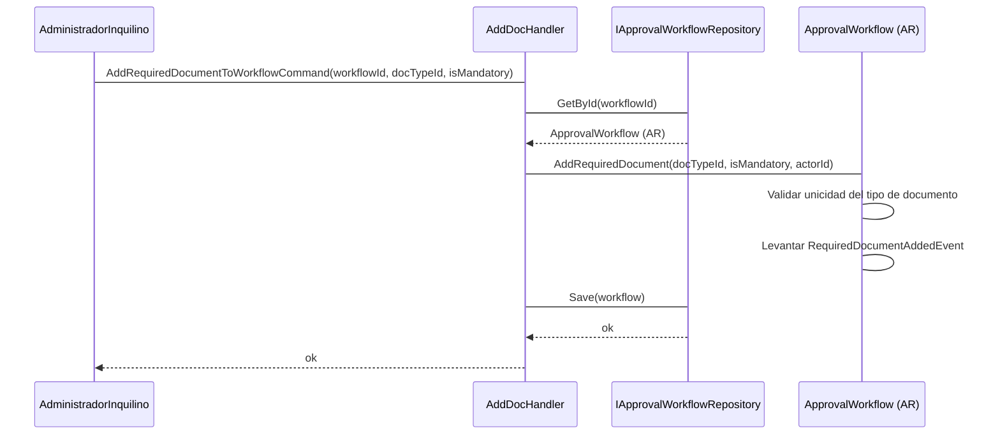
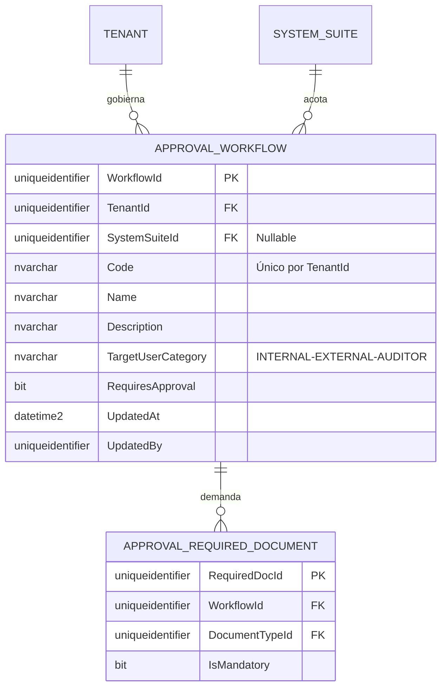

# ApprovalWorkflow — Arquitectura de Agregados

**Contexto Delimitado:** Aprobaciones  
**Raíz de Agregado:** `ApprovalWorkflow`  
**Módulo:** `Ums.Domain.Approvals.ApprovalWorkflow`  
**Estado:** Producción

---

## 1. Visión General del Agregado

### Propósito
El agregado `ApprovalWorkflow` establece las reglas de enrutamiento dinámico y las listas de verificación de documentos para operaciones que requieren supervisión administrativa. Garantiza que ciertas acciones de usuario (como solicitar promociones de perfiles o subir archivos sensibles) desencadenen flujos correspondientes de autorización humana y definan qué archivos de respaldo son obligatorios.

### Responsabilidad de Negocio
- Registrar y coordinar esquemas de aprobación delimitados por inquilino.
- Orientar los flujos de trabajo a suites o clasificaciones de usuarios específicas.
- Declarar una lista de verificación de documentos de soporte requeridos.
- Determinar si la aprobación dinámica está activa.

### Raíz de Agregado
`ApprovalWorkflow` es la raíz del agregado. Agregar o quitar documentos requeridos debe fluir a través de él para mantener la integridad del modelo.

### Invariantes y Reglas de Consistencia
1. Cada `ApprovalWorkflow` debe cumplir con la plantilla corporativa de código-nombre-descripción.
2. El parámetro `Code` debe ser único dentro del `TenantId` activo.
3. Si `RequiresApproval` es verdadero, el flujo de trabajo debe tener al menos un grupo de aprobadores o criterio de lista de verificación válido.
4. Cada mapeo de tipo de documento requerido debe ser único; un flujo de trabajo no puede duplicar tipos de documentos requeridos.

### Entidades Relacionadas / Objetos de Valor
| Entidad / VO | Tipo | Propietario |
|---|---|---|
| `ApprovalWorkflowId` | Objeto de Valor | Identificador de raíz de agregado basado en Guid |
| `ApprovalRequiredDocument` | Entidad | Propia (ver [approval-required-document.md](./approval-required-document.md)) |
| `UserCategory` | Enumerado | INTERNAL · EXTERNAL · AUDITOR |
| `AuditValueObject` | Objeto de Valor | Rastrea metadatos de creación y modificación |

### Eventos de Dominio
| Evento | Desencadenante |
|---|---|
| `ApprovalWorkflowCreatedEvent` | Se registra una nueva definición de flujo de aprobación |
| `RequiredDocumentAddedEvent` | Se añade un mapeo de requisito de documento a la lista de verificación |
| `RequiredDocumentRemovedEvent` | Se elimina un mapeo de requisito de documento de la lista |

### Comandos / Casos de Uso
| Comando | Descripción |
|---|---|
| `CreateApprovalWorkflowCommand` | Inicializar un nuevo mapeo de flujo de aprobación |
| `AddRequiredDocumentToWorkflowCommand` | Vincular un DocumentType como mandato para completar el flujo |
| `RemoveRequiredDocumentFromWorkflowCommand` | Eliminar una restricción de DocumentType de la lista de verificación |

### Límites de Repositorio / Servicio
- `IApprovalWorkflowRepository` — Persiste y carga flujos de trabajo.
- Las consultas están estrictamente aisladas y filtradas por la sesión de `TenantId` actual.

---

## 2. Modelo de Dominio

### Clases / Entidades / Objetos de Valor
```
ApprovalWorkflow (Raíz de Agregado)
├── Props: ApprovalWorkflowProps
│   ├── Id: ApprovalWorkflowId
│   ├── TenantId: TenantId
│   ├── SystemSuiteId?: SystemSuiteId
│   ├── Code: Code
│   ├── Name: Name
│   ├── Description: Description
│   ├── TargetUserCategory: UserCategory
│   ├── RequiresApproval: bool
│   └── Audit: AuditValueObject
└── Hijos
    └── IReadOnlyCollection<ApprovalRequiredDocument>
```

---

## 3. Diagramas de Modelo de Objetos



---

## 4. Diagramas de Secuencia

### Flujo para Agregar Documento Requerido


---

## 5. Modelo ER



### Reglas de Aislamiento de Inquilinos
- Todos los registros de `APPROVAL_WORKFLOW` están particionados por `TenantId`. Las consultas directas a la base de datos requieren filtrado en los repositorios de la aplicación (R-10).

---

## 6. Integración de Contexto Delimitado
- **Aguas Arriba**: Obtiene un `SystemSuiteId` opcional del contexto de Autorización.
- **Aguas Abajo**: Consultado por `ApprovalRequest` para verificar las listas de verificación presentadas y por `PromotionRequest` en el contexto IGA para verificar los mandatos de autorización.

---

## 7. Capa de Aplicación
- `CreateApprovalWorkflowCommand` -> Entradas: `TenantId, Code, Name, Description, UserCategory, RequiresApproval, SystemSuiteId?` -> Retorna: `Guid`
- `AddRequiredDocumentCommand` -> Entradas: `WorkflowId, DocumentTypeId, IsMandatory` -> Retorna: `void`

---

## 8. Infraestructura/Persistencia
- Índice: Índice único en `TenantId, Code` para evitar códigos duplicados.
- Transacción: Las modificaciones en la lista de verificación del flujo de trabajo se guardan de forma atómica en una única transacción de DbContext.

---

## 9. Seguridad y Cumplimiento
- Diseñar flujos de trabajo: Restringido a los roles de `Tenant:Admin` o superiores.
- Cumplimiento: Cualquier cambio en una lista de verificación de aprobación desencadena bitácoras de auditoría para asegurar los caminos procedimentales.

---

## 10. Decisiones Técnicas
- Declarar tablas de unión de documentos requeridos independientes garantiza relaciones modulares entre los flujos de trabajo y los documentos sin bloquear las tablas principales.

---

**[Volver al Índice de Aprobaciones](./index.md)**
