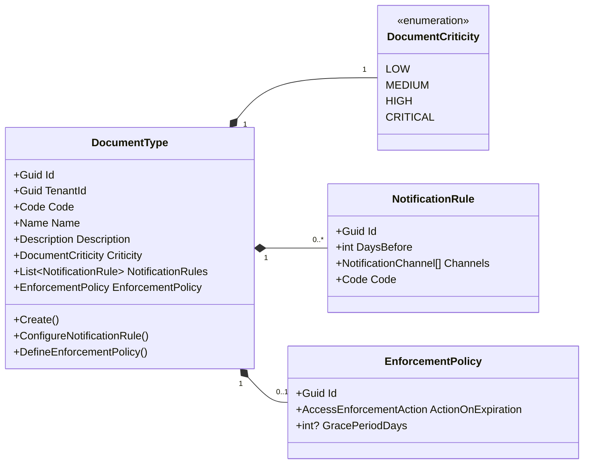
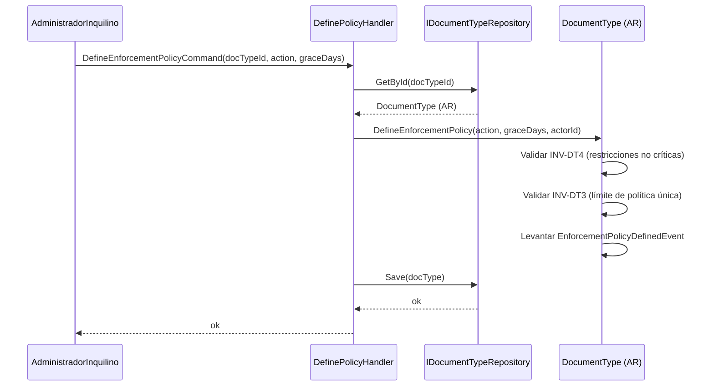
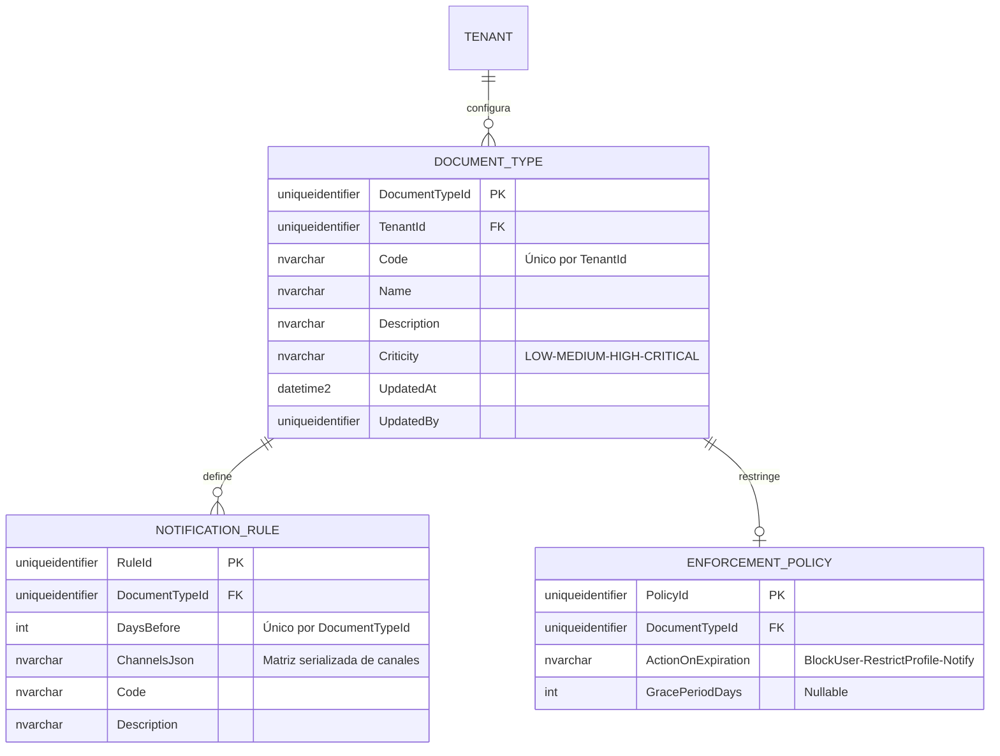

# DocumentType — Arquitectura de Agregados

**Contexto Delimitado:** Aprobaciones  
**Raíz de Agregado:** `DocumentType`  
**Módulo:** `Ums.Domain.Approvals.DocumentType`  
**Estado:** Producción

---

## 1. Visión General del Agregado

### Propósito
El agregado `DocumentType` gobierna las clasificaciones, reglas y esquemas de políticas para los documentos subidos por los usuarios (ej., Pasaportes, Documentos de certificación). Declara umbrales críticos (`Criticity`), vincula intervalos de notificación recurrentes (entidades `NotificationRule`) y configura acciones proactivas de cumplimiento de seguridad (entidad `EnforcementPolicy`) para ejecutarse automáticamente cuando un documento obligatorio expira o se elimina.

### Responsabilidad de Negocio
- Registrar y clasificar documentos de verificación corporativa.
- Establecer pautas de criticidad (Baja, Media, Alta, Crítica).
- Mantener intervalos dinámicos de notificación para alertar previamente a los usuarios antes de que expire un documento.
- Definir bloqueos automáticos de cumplimiento (ej., Bloqueo de acceso, restricción de perfiles) cuando fallan los elementos críticos de cumplimiento.

### Raíz de Agregado
`DocumentType` es la raíz del agregado. Definir acciones de cumplimiento o configurar alertas de notificación debe realizarse a través de él para aplicar las invariantes.

### Invariantes y Reglas de Consistencia
1. Cada `DocumentType` debe poseer un `Code` único dentro de su espacio de nombres de `TenantId`.
2. **Unicidad de DaysBefore (INV-DT2)**: Los umbrales de alerta (`DaysBefore`) en las `NotificationRules` propias deben ser únicos en la lista de reglas.
3. **Mandatos Críticos (INV-DT1)**: Si un `DocumentType` se establece en `Critical`, debe tener exactamente una `EnforcementPolicy` activa definida para garantizar el cumplimiento del sistema.
4. **Política Única (INV-DT3)**: Solo se permite una `EnforcementPolicy` activa por `DocumentType`.
5. **Coincidencia de Criticidad (INV-DT4)**: Los tipos de documentos que no son críticos/altos no pueden aplicar acciones de cumplimiento como `BlockUser` o `RestrictProfile`.

### Entidades Relacionadas / Objetos de Valor
| Entidad / VO | Tipo | Propietario |
|---|---|---|
| `DocumentTypeId` | Objeto de Valor | Identificador de raíz de agregado basado en Guid |
| `DocumentCriticity` | Enumerado | LOW · MEDIUM · HIGH · CRITICAL |
| `NotificationRule` | Entidad | Propia (ver [notification-rule.md](./notification-rule.md)) |
| `EnforcementPolicy` | Entidad | Entidad hija propia que detalla períodos de gracia y bloqueos |
| `AuditValueObject` | Objeto de Valor | Rastrea metadatos de creación y modificación |

### Eventos de Dominio
| Evento | Desencadenante |
|---|---|
| `DocumentTypeRegisteredEvent` | Se registra con éxito una nueva categoría de documento |
| `NotificationRuleConfiguredEvent` | Se configura una regla de pre-alerta de vencimiento |
| `NotificationRuleRemovedEvent` | Se elimina una regla de pre-alerta |
| `EnforcementPolicyDefinedEvent` | Se define un bloqueo de cumplimiento |
| `EnforcementPolicyUpdatedEvent` | Se actualizan los parámetros de cumplimiento |

### Comandos / Casos de Uso
| Comando | Descripción |
|---|---|
| `CreateDocumentTypeCommand` | Registrar un nuevo tipo de documento con parámetros por defecto |
| `ConfigureNotificationRuleCommand` | Configurar un nuevo umbral de alerta y sus canales |
| `RemoveNotificationRuleCommand` | Eliminar una regla de pre-alerta de notificación existente |
| `DefineEnforcementPolicyCommand` | Añadir una política de cumplimiento de bloqueo o degradación de perfil |
| `UpdateEnforcementPolicyCommand` | Modificar las acciones o períodos de gracia de una política |

### Límites de Repositorio / Servicio
- `IDocumentTypeRepository` — Persiste los esquemas de clasificación.
- Acotado estrictamente por `TenantId` para evitar cruces de configuración entre inquilinos.

---

## 2. Modelo de Dominio

### Clases / Entidades / Objetos de Valor
```
DocumentType (Raíz de Agregado)
├── Props: DocumentTypeProps
│   ├── Id: DocumentTypeId
│   ├── TenantId: TenantId
│   ├── Code: Code
│   ├── Name: Name
│   ├── Description: Description
│   ├── Criticity: DocumentCriticity
│   └── Audit: AuditValueObject
├── Hijos
│   └── IReadOnlyCollection<NotificationRule>
└── Hijo (Anulable)
    └── EnforcementPolicy
```

---

## 3. Diagramas de Modelo de Objetos



---

## 4. Diagramas de Secuencia

### Flujo para Definir Política de Cumplimiento


---

## 5. Modelo ER



### Reglas de Aislamiento de Inquilinos
- Los esquemas clasificados están particionados estrictamente por `TenantId`. Todas las consultas de enrutamiento de verificación imponen límites de aislamiento.

---

## 6. Integración de Contexto Delimitado
- **Aguas Arriba**: Hereda las reglas de contexto de `Identidad` (validando registros de inquilinos).
- **Aguas Abajo**: Consultado por `UserDocument` para verificar los umbrales de alerta, y por `AccessEnforcementPolicy` durante los pases de verificación de cumplimiento.

---

## 7. Capa de Aplicación
- `CreateDocumentTypeCommand` -> Entradas: `TenantId, Code, Name, Description, Criticity` -> Retorna: `Guid`
- `DefineEnforcementPolicyCommand` -> Entradas: `DocumentTypeId, Action, GracePeriodDays?` -> Retorna: `void`

---

## 8. Infraestructura/Persistencia
- Índice: Índice único en `TenantId, Code`.
- Transacción: Las actualizaciones de hijos (políticas y entradas de reglas de pre-alerta) se almacenan de forma atómica dentro de la transacción de base de datos del padre `DOCUMENT_TYPE`.

---

## 9. Seguridad y Cumplimiento
- Ajustar la clasificación o reglas críticas: Restringido estrictamente a los roles de `Tenant:Admin`.
- Cumplimiento: Alterar las reglas de cumplimiento representa un alto impacto de seguridad y desencadena un registro de auditoría de alta gravedad.

---

## 10. Decisiones Técnicas
- Consolidar los modelos de `NotificationRule` pre-alerta y `EnforcementPolicy` como elementos secundarios dentro del agregado `DocumentType` protege los límites del dominio contra restricciones divididas.

---

**[Volver al Índice de Aprobaciones](./index.md)**
