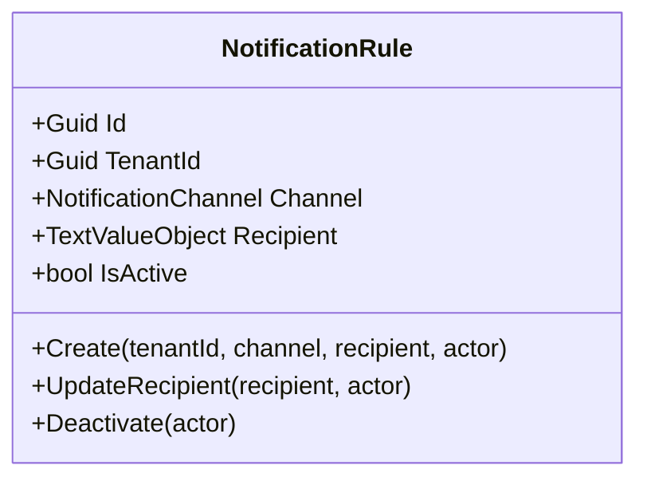
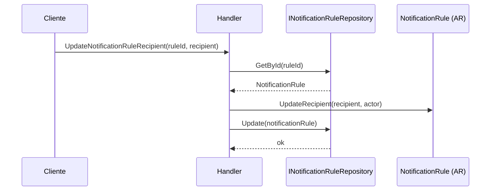
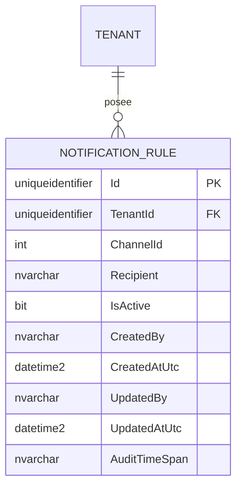

# NotificationRule — Arquitectura de Agregado

**Contexto Delimitado:** Aprobaciones  
**Raíz de Agregado:** `NotificationRule`
**Módulo:** `Ums.Domain.Approvals.NotificationRule`
**Estado:** Producción

---

## 1. Visión General del Agregado

### Propósito
El agregado `NotificationRule` representa una regla operativa de destino de notificaciones usada por el proceso de aprobaciones/cumplimiento. Almacena quién debe recibir una notificación, por qué canal y si la regla está activa.

### Responsabilidad de Negocio
- Registrar destinos de notificación por tenant.
- Definir el canal de entrega.
- Almacenar el destinatario objetivo.
- Permitir desactivación del ciclo de vida y actualización del destinatario.

### Raíz de Agregado
`NotificationRule` es una raíz de agregado independiente en la implementación actual. No está modelada como entidad hija de `DocumentType`.

### Invariantes y Reglas de Consistencia
1. `TenantId` es obligatorio.
2. `Recipient` debe existir y no puede estar vacío.
3. Las nuevas reglas nacen activas.
4. Una regla ya inactiva no puede desactivarse de nuevo.

### Entidades Relacionadas / Objetos de Valor
| Entidad / VO | Tipo | Propiedad |
|---|---|---|
| `NotificationRuleId` | Objeto de Valor | Identificador del agregado |
| `TenantId` | Objeto de Valor | Límite de pertenencia del tenant |
| `NotificationChannel` | Enumeración | Canal de entrega |
| `TextValueObject` | Objeto de Valor | Destino o dirección del destinatario |
| `AuditValueObject` | Objeto de Valor | Rastro de auditoría |

### Eventos de Dominio
- En la implementación actual este agregado no emite eventos de dominio propios.

---

## 2. Modelo de Dominio

```text
NotificationRule (Raíz de Agregado)
└── Props: NotificationRuleProps
    ├── Id: IdValueObject
    ├── TenantId: TenantId
    ├── Channel: NotificationChannel
    ├── Recipient: TextValueObject
    ├── IsActive: bool
    └── Audit: AuditValueObject
```

---

## 3. Diagramas del Modelo de Objetos



---

## 4. Diagramas de Secuencia

### Flujo de Actualización de Destinatario


---

## 5. Modelo ER



### Reglas de Aislamiento por Tenant
- Pertenece estrictamente al tenant mediante `TenantId`.

---

## 6. Integración entre Contextos Delimitados
- Es usado por la orquestación de aprobaciones y cumplimiento para resolver destinos de notificación en runtime.

---

## 7. Capa de Aplicación
- `CreateNotificationRuleCommand` -> Entradas: `TenantId, Channel, Recipient` -> Retorna: `Guid`
- `DeactivateNotificationRuleCommand` -> Entradas: `RuleId` -> Retorna: `void`
- Trabajo pendiente en API: exponer actualizaciones de destinatario y semánticas más ricas de programación/configuración.

---

## 8. Infraestructura / Persistencia
- La implementación del repositorio sigue siendo transicional (`in-memory`) para este agregado.

---

## 9. Seguridad y Cumplimiento
- Los destinos de notificación pueden contener datos sensibles de ruteo operativo y deben aislarse por tenant y auditarse.

---

## 10. Decisiones Técnicas
- `NotificationRule` fue elevada a raíz de agregado en la base de código actual.
- Esto reemplaza documentación anterior que la modelaba como hija de `DocumentType`.

---

**[Volver al Índice de Aprobaciones](./index.md)**
