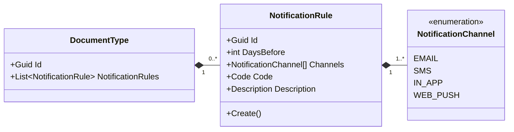
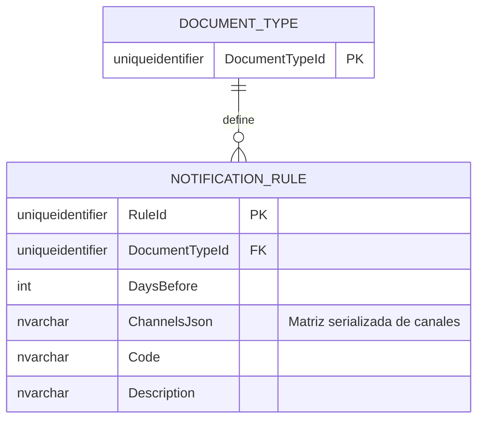

# NotificationRule — Arquitectura de Entidades

**Contexto Delimitado:** Aprobaciones  
**Raíz de Agregado:** `DocumentType`  
**Módulo:** `Ums.Domain.Approvals.DocumentType.NotificationRule`  
**Estado:** Producción

---

## 1. Visión General de la Entidad

### Propósito
La entidad `NotificationRule` define un umbral de advertencia reactivo para el cumplimiento de documentos. Especifica cuántos días antes de la expiración (`DaysBefore`) se debe alertar al usuario y qué canales de comunicación (ej., Correo electrónico, SMS, Notificación push) están autorizados para transmitir el mensaje de alerta.

### Responsabilidad de Negocio
- Mapear reglas de advertencia de vencimiento a categorías de documentos específicas.
- Definir canales de transmisión de alertas.

### Raíz de Agregado
Esta es una entidad propia que pertenece al agregado `DocumentType`. No puede existir ni realizar transiciones de estado fuera de las restricciones de ciclo de vida de su `DocumentType` padre.

### Invariantes y Reglas de Consistencia
1. `DaysBefore` debe ser un número entero positivo estrictamente mayor que cero.
2. La colección `Channels` debe contener al menos un canal de notificación válido (Email, SMS, WebPortal) y no puede ser nula ni vacía.
3. El ciclo de vida está completamente controlado por el `DocumentType` padre.

### Entidades Relacionadas / Objetos de Valor
| Entidad / VO | Tipo | Propietario |
|---|---|---|
| `NotificationRuleId` | Objeto de Valor | Identificador único de la entidad |
| `NotificationChannel` | Enumerado | EMAIL · SMS · IN_APP · WEB_PUSH |
| `Code` | Objeto de Valor | Identificador de tipo de notificación alfanumérico en camelCase |

---

## 2. Modelo de Dominio

### Clases / Entidades / Objetos de Valor
```
NotificationRule (Entidad)
└── Props: NotificationRuleProps
    ├── Id: NotificationRuleId
    ├── DaysBefore: int
    ├── Channels: NotificationChannel[]
    ├── Code: Code
    └── Description: Description
```

---

## 3. Diagramas de Modelo de Objetos



---

## 4. Diagramas de Secuencia
- Las secuencias de adición y eliminación se coordinan a través de la raíz del agregado [DocumentType](./document-type.md#4-diagramas-de-secuencia).

---

## 5. ER Model



### Reglas de Aislamiento de Inquilinos
- Acotado a través de su agregado padre `DocumentType`. Hereda todas las restricciones de filtrado de base de datos multi-inquilino de la plataforma.

---

## 6. Integración de Contexto Delimitado
- Mapeado internamente dentro del contexto de `Aprobaciones`. Las alertas activadas son procesadas por ejecutores de cumplimiento en segundo plano para notificar a los usuarios desde el contexto de `Identidad`.

---

## 7. Capa de Aplicación
- Gestionado a través de los comandos de aplicación del padre: `ConfigureNotificationRuleCommand` y `RemoveNotificationRuleCommand`.

---

## 8. Infraestructura/Persistencia
- Índice: Índice compuesto en `DocumentTypeId, DaysBefore` para asegurar la unicidad del umbral.

---

## 9. Seguridad y Cumplimiento
- Las configuraciones de reglas se heredan del `DocumentType` padre. Solo los usuarios autorizados a diseñar estructuras de documentos pueden modificar estos canales de notificación.

---

## 10. Decisiones Técnicas
- Almacenar los canales de comunicación permitidos como una matriz serializada (`ChannelsJson`) dentro de una sola columna de la base de datos garantiza la flexibilidad de la base de datos sin sobrecargar de consultas complejas.

---

**[Volver al Índice de Aprobaciones](./index.md)**
