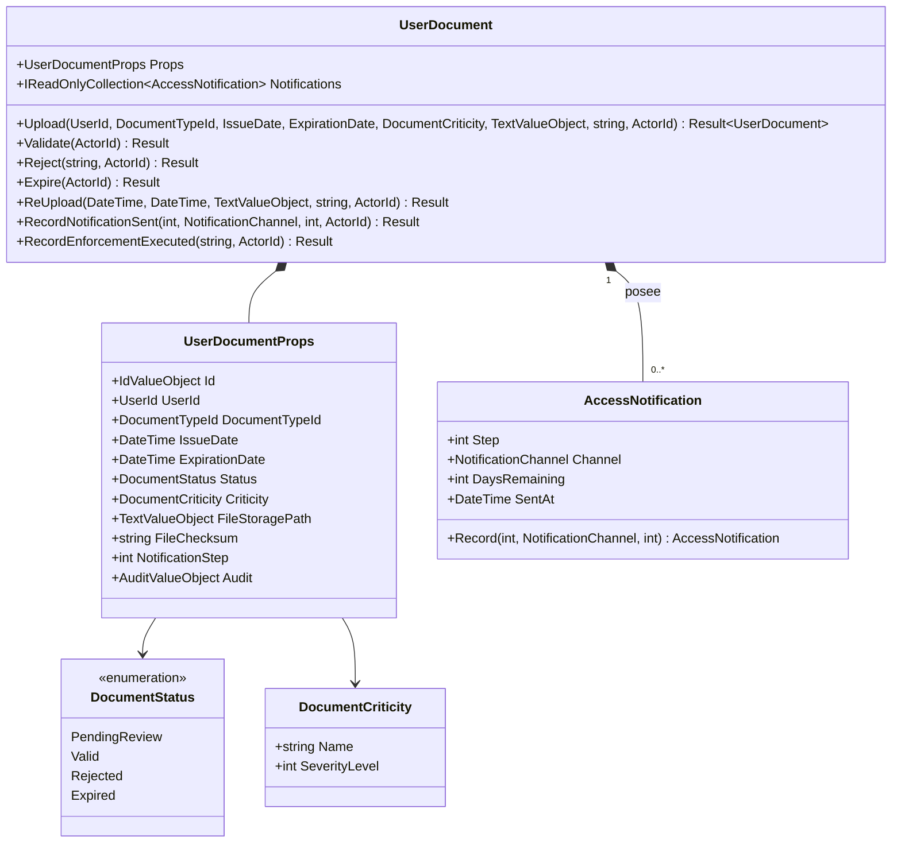
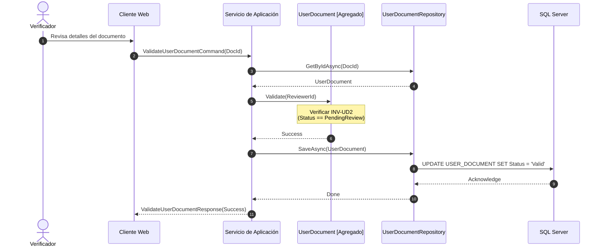
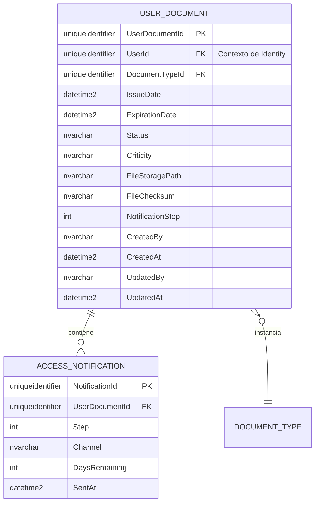

# UserDocument — Arquitectura del Agregado

**Contexto Acotado:** Approvals  
**Raíz del Agregado:** Sí  
**Módulo:** `Ums.Domain.Approvals.UserDocument`  
**Estado:** Producción

---

## 1. Vista General del Agregado

### Propósito
El agregado `UserDocument` representa una credencial digital o documento de cumplimiento cargado por un usuario (por ejemplo, verificación de identidad, certificaciones). Gestiona el ciclo de vida de verificación del documento, su estado de validez, estado de cumplimiento y el historial de notificaciones de vencimiento enviadas al usuario.

### Responsabilidad de Negocio
- Encapsular los metadatos del documento, incluyendo fecha de emisión, fecha de vencimiento, ubicación de almacenamiento físico y suma de comprobación criptográfica (checksum).
- Controlar las transiciones de estado a lo largo del ciclo de vida del documento (Pending Review $\rightarrow$ Valid / Rejected / Expired $\rightarrow$ Re-uploaded).
- Albergar y administrar el historial de envíos de alertas (`AccessNotification`) como entidades de propiedad exclusiva.
- Garantizar el mapeo estricto del contexto multi-inquilino.

### Raíz del Agregado
`UserDocument` es una raíz de agregado soberana dentro del contexto de Approvals. Controla su estado interno y garantiza que todos los hijos (como `AccessNotification`) sean modificados exclusivamente a través de los métodos del dominio raíz.

### Invariantes y Reglas de Consistencia
1. **INV-UD1 (Validez de la Secuencia de Fechas):** La fecha de vencimiento del documento (`ExpirationDate`) debe ser cronológicamente mayor que su fecha de emisión (`IssueDate`).
2. **INV-UD2 (Transiciones del Ciclo de Vida):** Las transiciones de estado deben seguir las reglas estrictas de la máquina de estados finitos (FSM):
   - El estado inicial es siempre `PendingReview`.
   - `PendingReview` puede transicionar a `Valid` (a través de `Validate`) o `Rejected` (a través de `Reject`).
   - `Valid` puede transicionar a `Expired` (a través de `Expire`) cuando la fecha del calendario supera la fecha de vencimiento.
   - Solo los documentos en estado `Expired` y `Rejected` pueden activar la recarga (`ReUpload`), lo que restablece el estado a `PendingReview` y reinicia el contador de pasos de notificación a cero.
   - `Rejected` no puede transicionar directamente a `Valid` sin pasar por un nuevo ciclo de carga/verificación.
3. **INV-UD3 (Verificación de Integridad):** Cada documento cargado debe proporcionar un hash criptográfico válido (`FileChecksum`) y hacer referencia a una estructura de tipo de documento (`DocumentTypeId`) existente.

### Entidades Relacionadas / Objetos de Valor
| Entidad / VO | Tipo | Descripción |
|---|---|---|
| `UserDocumentId` | Objeto de Valor | Identificador único del agregado |
| `UserId` | Objeto de Valor | Referencia al propietario, vinculando con el Contexto de Identity |
| `DocumentTypeId` | Objeto de Valor | Referencia al agregado de definición de plantilla |
| `DocumentStatus` | Enumerado | `PendingReview` · `Valid` · `Rejected` · `Expired` |
| `DocumentCriticity` | Objeto de Valor | Clasificación de severidad de cumplimiento |
| `TextValueObject` | Objeto de Valor | Ruta de almacenamiento validada en el sistema de archivos |
| `AccessNotification` | Entidad | Entidad hija propiedad del agregado que registra el historial de alertas |

---

## 2. Modelo de Dominio

### Clases / Entidades / Objetos de Valor
```
UserDocument (Aggregate Root)
├── Props: UserDocumentProps
│   ├── Id: UserDocumentId
│   ├── UserId: UserId (Ref Externa)
│   ├── DocumentTypeId: DocumentTypeId (Ref Externa)
│   ├── IssueDate: DateTime
│   ├── ExpirationDate: DateTime
│   ├── Status: DocumentStatus
│   ├── Criticity: DocumentCriticity
│   ├── FileStoragePath: TextValueObject
│   ├── FileChecksum: string
│   ├── NotificationStep: int
│   └── Audit: AuditValueObject
└── Notifications: AccessNotification[] (Colección Hija)
```

---

## 3. Diagramas del Modelo de Objetos



---

## 4. Diagramas de Secuencia

### Ciclo de Vida de Verificación del Documento



---

## 5. Modelo ER



### Reglas de Aislamiento de Inquilinos (Tenancy)
- Los documentos de usuario heredan la estructura de inquilino de la cuenta de usuario propietaria. Las lecturas entre inquilinos están prohibidas mediante filtros a nivel de capa de aplicación en el `UserId`.

---

## 6. Integración del Contexto Acotado

```mermaid
flowchart TD
    subgraph IdentityContext [Contexto de Identity]
        U[UserAccount]
    end

    subgraph ApprovalsContext [Contexto de Approvals]
        DT[DocumentType]
        UD[UserDocument]
        AN[AccessNotification]
    end

    UD -.->|hace referencia a UserId| U
    UD -->|instancia| DT
    UD *--|posee| AN
```

---

## 7. Capa de Aplicación

### Comandos y Consultas
- **UploadUserDocumentCommand:** Maneja el registro de un nuevo documento de usuario. Valida la secuencia de fechas de expiración y comprueba la plantilla del tipo de documento.
- **ValidateUserDocumentCommand:** Autorizado para que los Verificadores marquen los documentos como `Valid`.
- **RejectUserDocumentCommand:** Marca un documento como `Rejected`, incorporando los motivos del rechazo para su posterior corrección.
- **ReUploadUserDocumentCommand:** Reemplaza archivos inválidos o vencidos, devolviendo el estado de cumplimiento del documento a `PendingReview`.
- **GetUserDocumentByIdQuery:** Retorna los metadatos de un único documento.
- **GetAllUserDocumentsQuery:** Consulta orientada a auditorías de cumplimiento, filtrable por estado y userId.

---

## 8. Infraestructura/Persistencia

### Configuración del Mapeo de EF Core
```csharp
public class UserDocumentConfiguration : IEntityTypeConfiguration<UserDocument>
{
    public void Configure(EntityTypeBuilder<UserDocument> builder)
    {
        builder.ToTable("USER_DOCUMENT");
        builder.HasKey(e => e.Id);
        
        builder.OwnsOne(e => e.Props, props =>
        {
            props.Property(p => p.Id).HasColumnName("UserDocumentId");
            props.Property(p => p.UserId).HasColumnName("UserId");
            props.Property(p => p.DocumentTypeId).HasColumnName("DocumentTypeId");
            props.Property(p => p.IssueDate).HasColumnName("IssueDate");
            props.Property(p => p.ExpirationDate).HasColumnName("ExpirationDate");
            props.Property(p => p.Status).HasConversion<string>().HasColumnName("Status");
            props.Property(p => p.Criticity).HasConversion(c => c.Name, n => DocumentCriticity.FromName(n)).HasColumnName("Criticity");
            props.Property(p => p.FileStoragePath).HasConversion(p => p.GetValue(), s => TextValueObject.Create(s).Value).HasColumnName("FileStoragePath");
            props.Property(p => p.FileChecksum).HasColumnName("FileChecksum");
            props.Property(p => p.NotificationStep).HasColumnName("NotificationStep");
            props.OwnsOne(p => p.Audit);
        });

        builder.HasMany(e => e.Notifications)
               .WithOne()
               .HasForeignKey("UserDocumentId")
               .OnDelete(DeleteBehavior.Cascade);
    }
}
```

---

## 9. Seguridad y Cumplimiento

- **Control de Acceso Basado en Roles (RBAC):** Solo los usuarios con el rol `Role.User` pueden cargar o volver a cargar documentos. Solo `Role.Reviewer` puede validar o rechazar.
- **Protección de Datos:** Los archivos físicos almacenados (`FileStoragePath`) deben residir en directorios protegidos. La validación criptográfica de `FileChecksum` protege contra alteraciones en el almacenamiento físico subyacente.

---

## 10. Decisiones Técnicas

- **Notificaciones Anidadas:** Modelar `AccessNotification` como una colección anidada garantiza trazas de auditoría cronológicas consistentes. Mantener el historial dentro del documento padre proporciona verificaciones rápidas sin requerir costosas consultas cruzadas contra logs generales de mensajería.

---

**[Volver al Índice de Approvals](./index.md)**
