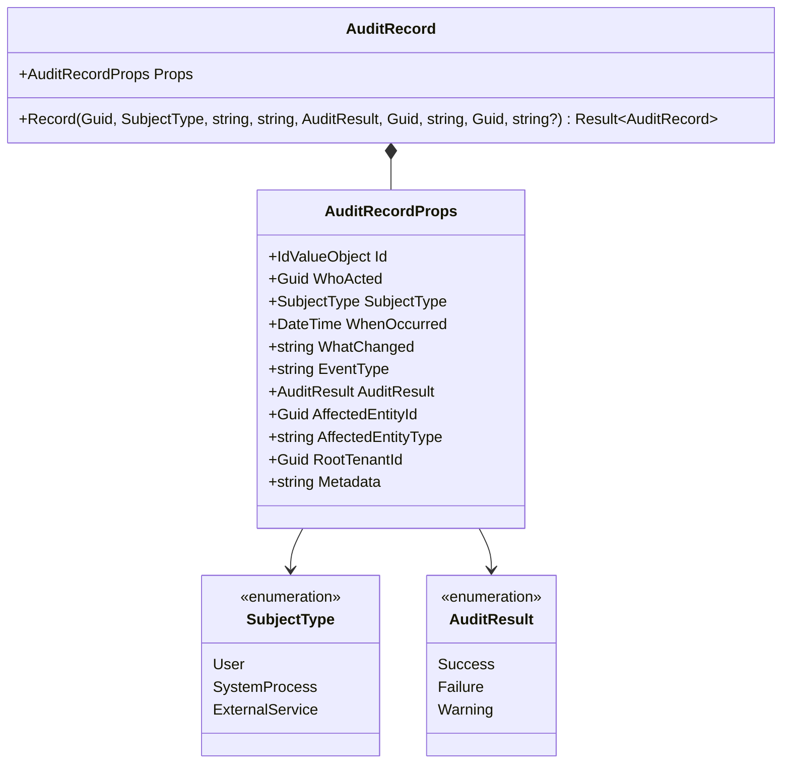
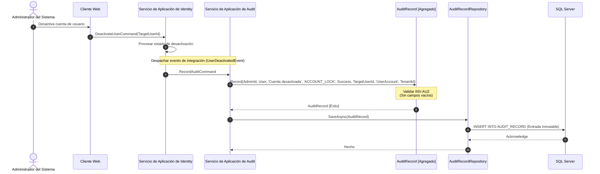
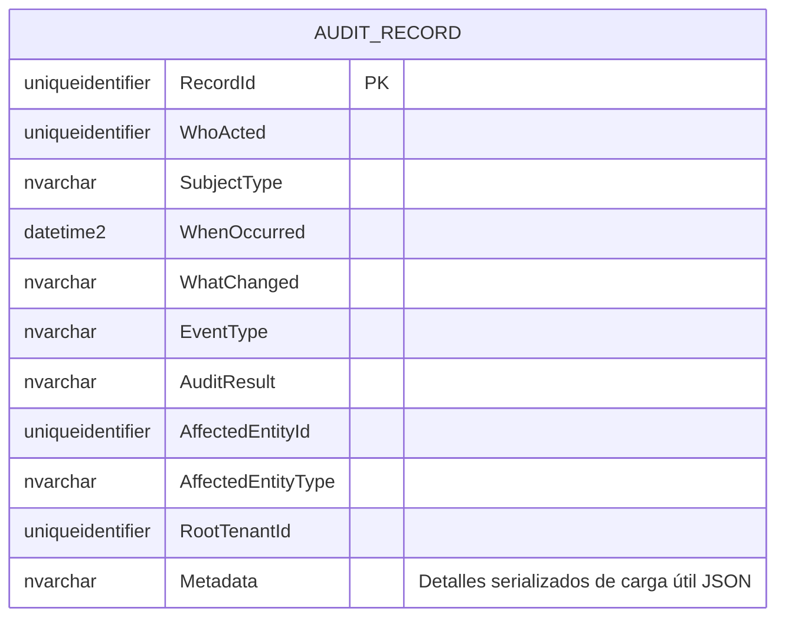
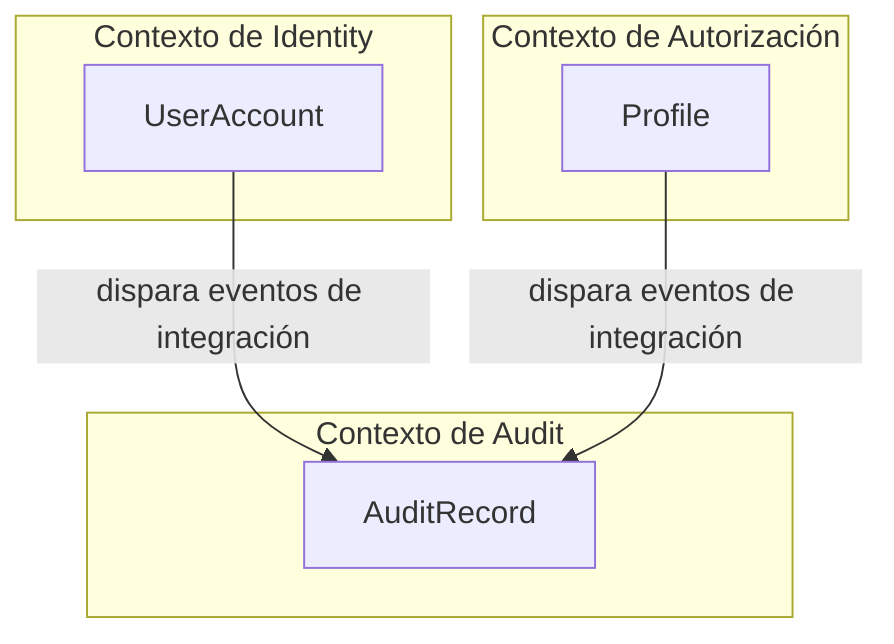

# AuditRecord — Arquitectura del Agregado

**Contexto Acotado:** Audit  
**Raíz del Agregado:** Sí  
**Módulo:** `Ums.Domain.Audit.AuditRecord`  
**Estado:** Producción

---

## 1. Vista General del Agregado

### Propósito
El agregado raíz `AuditRecord` modela una entrada de registro cronológico inmutable y con marca de tiempo de un evento crítico del sistema, actualización de configuración, cambio de límites de seguridad o transición de estado transaccional. Proporciona visibilidad y trazabilidad absolutas para auditorías de cumplimiento normativo y detección de amenazas.

### Responsabilidad de Negocio
- Registrar una traza completa y a prueba de alteraciones de las acciones administrativas y solicitudes de los usuarios.
- Rastrear las entidades afectadas, los identificadores de actores, los alcances del proceso y las cargas útiles de transición.
- Mantener un esquema de persistencia transaccional estricto e incremental (append-only).

### Raíz del Agregado
`AuditRecord` es una raíz de agregado soberana y autocontenida. Debido a su importancia para la seguridad, no posee colecciones hijas y no expone mecanismos de edición o eliminación.

### Invariantes y Reglas de Consistencia
1. **INV-AU1 (Almacenamiento Estricto Incremental):** Un registro de auditoría es completamente de solo lectura una vez guardado. El agregado de dominio no define métodos de establecimiento públicos (setters) ni mutadores de transición de estado.
2. **INV-AU2 (Validación de Integridad de la Traza):** Para garantizar el no repudio, las siguientes propiedades obligatorias deben establecerse y no pueden ser valores predeterminados durante la creación:
   - `WhoActed` no puede estar vacío (`Guid.Empty`).
   - `WhatChanged` debe ser una cadena de texto válida y no vacía (`DomainErrors.Audit.WhatChangedRequired`).
   - `AffectedEntityId` no puede estar vacío.
   - `AffectedEntityType` debe ser una cadena de texto válida y no vacía (`DomainErrors.Audit.AffectedEntityRequired`).
   - `RootTenantId` debe asignarse a un identificador de inquilino válido.

### Entidades Relacionadas / Objetos de Valor
| Entidad / VO | Tipo | Descripción |
|---|---|---|
| `AuditRecordId` | Objeto de Valor | Identificador único del agregado |
| `SubjectType` | Enumerado | `User` · `SystemProcess` · `ExternalService` |
| `AuditResult` | Enumerado | `Success` · `Failure` · `Warning` |

---

## 2. Modelo de Dominio

### Clases / Entidades / Objetos de Valor
```
AuditRecord (Aggregate Root)
└── Props: AuditRecordProps
    ├── Id: AuditRecordId
    ├── WhoActed: Guid
    ├── SubjectType: SubjectType
    ├── WhenOccurred: DateTime
    ├── WhatChanged: string
    ├── EventType: string
    ├── AuditResult: AuditResult
    ├── AffectedEntityId: Guid
    ├── AffectedEntityType: string
    ├── RootTenantId: Guid
    └── Metadata: string? (Carga útil JSON serializada)
```

---

## 3. Diagramas del Modelo de Objetos



---

## 4. Diagramas de Secuencia

### Registro y Archivado de Cambios de Seguridad



---

## 5. Modelo ER



### Reglas de Aislamiento de Inquilinos (Tenancy)
- Delimitado estrictamente por `RootTenantId`. La lectura entre inquilinos está estrictamente bloqueada. Los inquilinos no pueden consultar las huellas de seguridad de otros inquilinos.

---

## 6. Integración del Contexto Acotado



---

## 7. Capa de Aplicación

### Comandos y Consultas
- **RecordAuditCommand:** Comando de adición inmutable (append-only) que procesa mensajes de eventos de seguridad y los registra en la base de datos.
- **GetAllAuditRecordsQuery:** Proporciona listas legibles filtrables de eventos de seguridad, delimitadas por el `RootTenantId`.
- **GetAuditRecordByIdQuery:** Recupera un registro de traza inmutable para su posterior análisis de seguridad.

---

## 8. Infraestructura/Persistencia

### Configuración del Mapeo de EF Core
```csharp
public class AuditRecordConfiguration : IEntityTypeConfiguration<AuditRecord>
{
    public void Configure(EntityTypeBuilder<AuditRecord> builder)
    {
        builder.ToTable("AUDIT_RECORD");
        builder.HasKey(e => e.Id);
        
        builder.OwnsOne(e => e.Props, props =>
        {
            props.Property(p => p.Id).HasColumnName("RecordId");
            props.Property(p => p.WhoActed).HasColumnName("WhoActed");
            props.Property(p => p.SubjectType).HasConversion<string>().HasColumnName("SubjectType");
            props.Property(p => p.WhenOccurred).HasColumnName("WhenOccurred");
            props.Property(p => p.WhatChanged).HasColumnName("WhatChanged");
            props.Property(p => p.EventType).HasColumnName("EventType");
            props.Property(p => p.AuditResult).HasConversion<string>().HasColumnName("AuditResult");
            props.Property(p => p.AffectedEntityId).HasColumnName("AffectedEntityId");
            props.Property(p => p.AffectedEntityType).HasColumnName("AffectedEntityType");
            props.Property(p => p.RootTenantId).HasColumnName("RootTenantId");
            props.Property(p => p.Metadata).HasColumnName("Metadata");
        });
    }
}
```

---

## 9. Seguridad y Cumplimiento

- **Garantía de No Repudio:** La capa de la base de datos impone que los privilegios de actualización (`UPDATE`) y eliminación (`DELETE`) se denieguen en la tabla `AUDIT_RECORD` para las cadenas de conexión estándar de la aplicación, restringiéndolos únicamente a las llaves de seguridad de emergencia.
- **Desinfección de Cargas Útiles:** Los datos serializados dentro de `Metadata` deben desinfectarse y eliminar información sensible del usuario (como hashes de contraseñas, PIN o llaves criptográficas sin cifrar) antes de su serialización.

---

## 10. Decisiones Técnicas

- **Carga Útil Dinámica de Metadatos:** El uso de una columna JSON `nvarchar(max)` para `Metadata` permite al motor de registro capturar métricas detalladas y específicas del contexto de cada acción (por ejemplo, propiedades anteriores y posteriores de perfiles de seguridad) sin forzar una estructura de unión de esquemas de bases de datos pesada y en constante evolución.

---

**[Volver al Índice de Audit](./index.md)**
