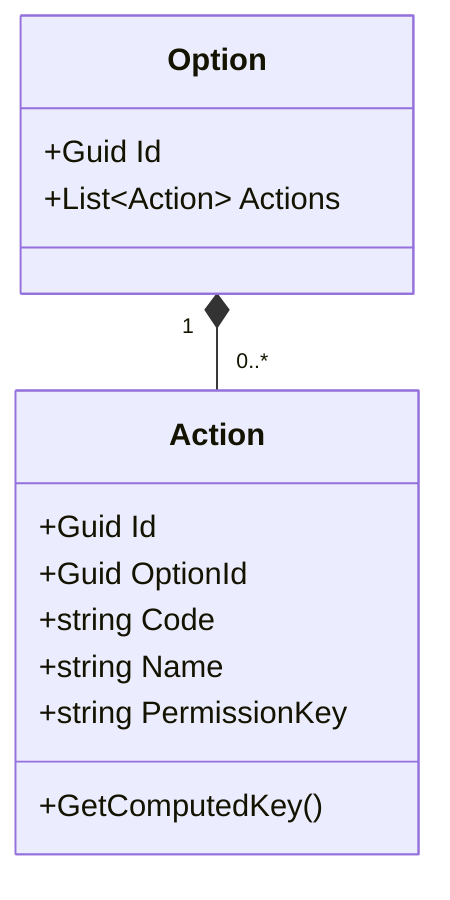
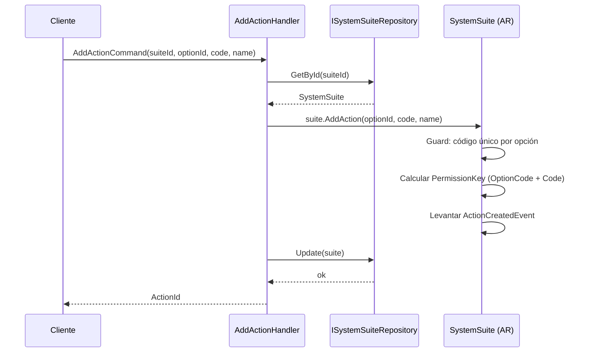
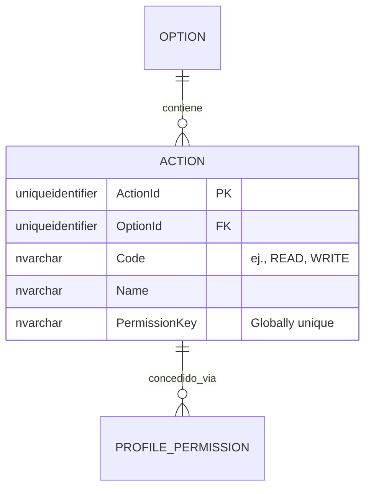

# Action — Arquitectura de Entidad Propia

**Contexto Delimitado:** Autorización  
**Raíz de Agregado:** `SystemSuite` (Action es una entidad propia dentro de la estructura del agregado SystemSuite)  
**Módulo:** `Ums.Domain.Authorization.SystemSuite.Module.Menu.SubMenu.Option.Action`  
**Estado:** Producción

---

## 1. Visión General del Agregado

### Propósito
Una `Action` representa el token de ejecución más granular dentro del subsistema de autorización de UMS. Define comportamientos permitidos específicos en una pantalla o recurso (ej. `READ`, `WRITE`, `DELETE`, `EXPORT`, `APPROVE`). Se compila en claves de permiso de usuario y se mapea dinámicamente a las políticas de Perfiles para autorizar solicitudes de Web API y límites de representación de elementos de la interfaz de usuario.

### Responsabilidad de Negocio
- Hacer cumplir el control de operaciones discretas en las opciones de aplicación.
- Servir como el token de seguridad definitivo para la protección de rutas de API.
- Participar en los permisos asignados a Perfiles.

### Raíz de Agregado
`SystemSuite` (a través de Option). Todas las modificaciones de estado se realizan a través del agregado raíz `SystemSuite` padre.

### Invariantes y Reglas de Consistencia
1. El `Code` debe ser único dentro de la `Option` propietaria (ej. una Opción no puede tener dos acciones "WRITE").
2. La combinación de Option Code + Action Code produce una clave de permiso globalmente única `Suite:Module:Option:Action` (ej. `UMS:IDENTITY:TENANT:WRITE`).
3. Una Acción no puede existir sin su `Option` padre.

### Entidades Relacionadas / Objetos de Valor
| Entidad / VO | Tipo | Propietario |
|---|---|---|
| `OptionId` | Objeto de Valor | Referencia FK a la Opción padre |
| `Code` | Objeto de Valor | Código de operación (ej. READ) |
| `PermissionKey` | Objeto de Valor | Cadena de caracteres única calculada |

### Eventos de Dominio
Los eventos se levantan en el administrador de eventos del agregado padre `SystemSuite`:
- `ActionCreatedEvent`
- `ActionUpdatedEvent`
- `ActionRemovedEvent`

---

## 2. Modelo de Dominio

### Clases / Entidades / Objetos de Valor
```
SystemSuite (Raíz de Agregado)
└── Module (Entidad Propia)
    └── Menu (Entidad Propia)
        └── SubMenu (Entidad Propia)
            └── Option (Entidad Propia)
                └── Action (Entidad Propia)
                    ├── Props: ActionProps
                    │   ├── Id: IdValueObject
                    │   ├── OptionId: OptionId
                    │   ├── Code: string
                    │   ├── Name: string
                    │   └── PermissionKey: string
                    └── Servicios de Dominio
                        └── PermissionKeyGenerator
```

---

## 3. Diagramas de Modelo de Objetos



---

## 4. Diagramas de Secuencia

### Flujo para Agregar una Acción


---

## 5. Modelo ER



### Reglas de Aislamiento de Inquilinos
- Tabla de catálogo de sistema global. Libre de RLS.

---

## 6. Integración de Contexto Delimitado
- **Aguas Abajo**: Mapeo a `ProfilePermission` en el Contexto de Autorización y `AuditRecord` en el Contexto de Auditoría.
- `PermissionKey` es consumido directamente por el Middleware de Autorización y los API Gateways.

---

## 7. Capa de Aplicación
- `AddActionCommand` -> Entradas: `SuiteId, OptionId, Code, Name` -> Retorna: `Guid`

---

## 8. Infraestructura/Persistencia
- Índice: Índice único en `OptionId, Code` e índice globalmente único en `PermissionKey`.
- Transacción: Guardado como parte del contexto de persistencia `SystemSuite`.

---

## 9. Seguridad y Cumplimiento
- Las operaciones requieren credenciales de `Platform:Admin`.
- Cumplimiento: Cualquier cambio de permiso debe invalidar instantáneamente los perfiles de sesión almacenados en caché para las sesiones autorizadas activas.

---

## 10. Decisiones Técnicas
- El generador de `PermissionKey` limpia estrictamente los caracteres de entrada y convierte las cadenas a mayúsculas, evitando que los errores de configuración comprometan la barrera de seguridad.

---

**[Volver al Índice de Autorización](./index.md)**
