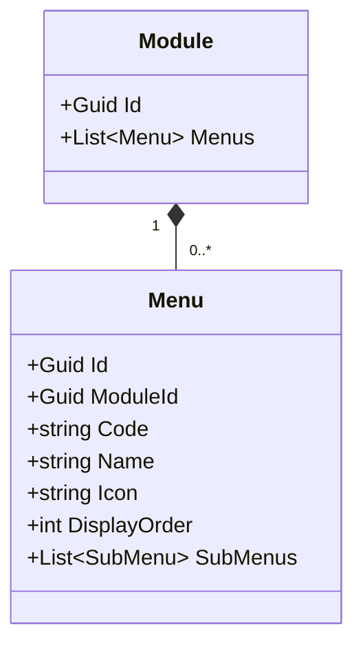
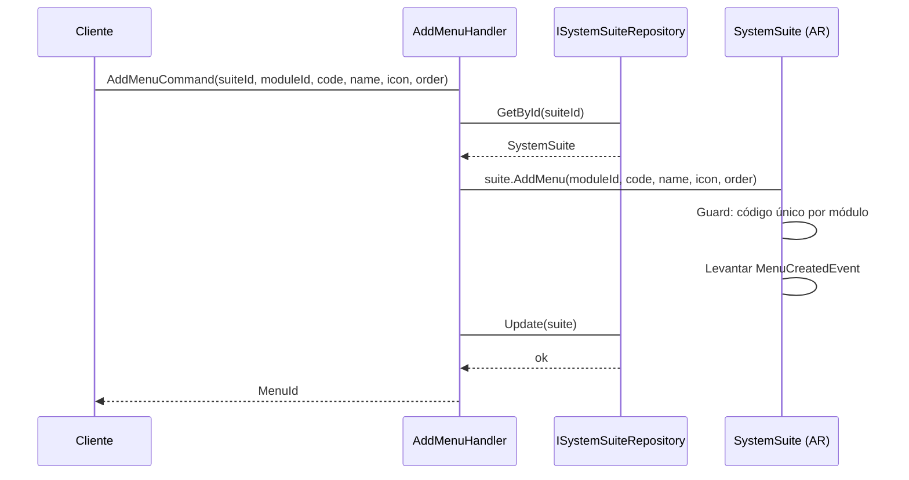
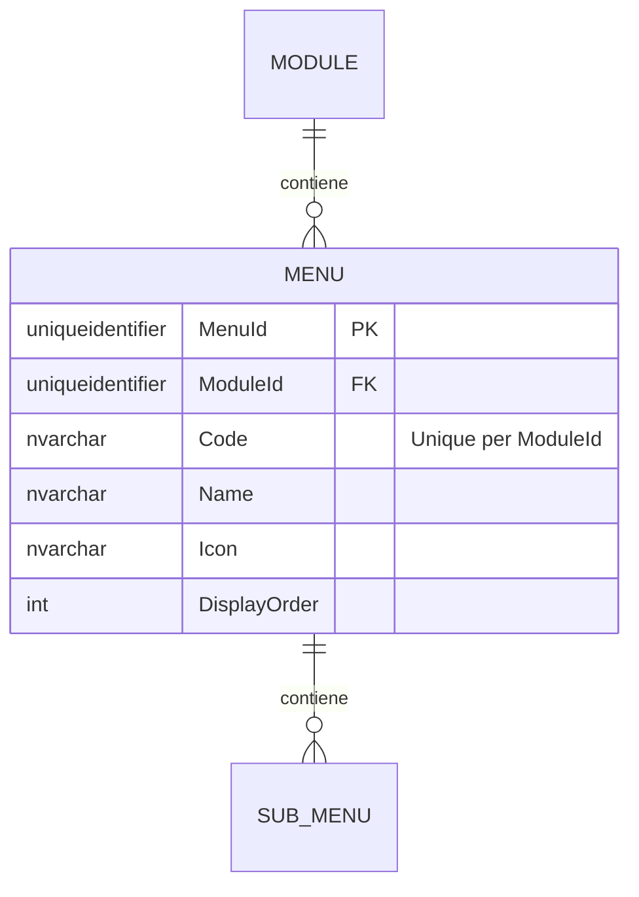

# Menu — Arquitectura de Entidad Propia

**Contexto Delimitado:** Autorización  
**Raíz de Agregado:** `SystemSuite` (Menu es una entidad propia dentro de la estructura del agregado SystemSuite)  
**Módulo:** `Ums.Domain.Authorization.SystemSuite.Module.Menu`  
**Estado:** Producción

---

## 1. Visión General del Agregado

### Propósito
Un `Menu` representa un elemento de diseño de menú gráfico bajo un Módulo. Proporciona categorización de IU de alto nivel y contiene elementos secundarios SubMenus u Opciones directas. Se utiliza para representar las estructuras de navegación de la barra lateral responsivas.

### Responsabilidad de Negocio
- Actuar como encabezados estructurales gráficos en los portales de aplicación.
- Albergar SubMenús para configuraciones de árboles jerárquicos complejos.
- Alternar dinámicamente los estados de representación visual.

### Raíz de Agregado
`SystemSuite` (a través de Module). Todas las mutaciones ocurren a través de la raíz del agregado `SystemSuite`.

### Invariantes y Reglas de Consistencia
1. El `Code` debe ser único dentro del `Module` propietario.
2. Un Menú debe tener una referencia a su `Module` padre.
3. El estado de representación visual depende de los estados de activación de los elementos padres.

### Entidades Relacionadas / Objetos de Valor
| Entidad / VO | Tipo | Propietario |
|---|---|---|
| `ModuleId` | Objeto de Valor | Referencia FK al Módulo padre |
| `Code` | Objeto de Valor | Identificador del Menú |
| `Name` | Objeto de Valor | Etiqueta de visualización |
| `SubMenu` | Entidad | Propia (ver [sub-menu.md](./sub-menu.md)) |

### Eventos de Dominio
Los eventos se levantan en el administrador de eventos del agregado padre `SystemSuite`:
- `MenuCreatedEvent`
- `MenuUpdatedEvent`
- `MenuRemovedEvent`

---

## 2. Modelo de Dominio

### Clases / Entidades / Objetos de Valor
```
SystemSuite (Raíz de Agregado)
└── Module (Entidad Propia)
    └── Menu (Entidad Propia)
        ├── Props: MenuProps
        │   ├── Id: IdValueObject
        │   ├── ModuleId: ModuleId
        │   ├── Code: string
        │   ├── Name: string
        │   ├── Icon: string
        │   └── DisplayOrder: int
        └── Hijos
            └── IReadOnlyList<SubMenu>
```

---

## 3. Diagramas de Modelo de Objetos



---

## 4. Diagramas de Secuencia

### Flujo para Agregar un Menú


---

## 5. Modelo ER



### Reglas de Aislamiento de Inquilinos
- Catálogo de configuración global. Libre de RLS.

---

## 6. Integración de Contexto Delimitado
- Referenciado para renderizar menús en el frontend.

---

## 7. Capa de Aplicación
- `AddMenuCommand` -> Entradas: `SuiteId, ModuleId, Code, Name, Icon, DisplayOrder` -> Retorna: `Guid`

---

## 8. Infraestructura/Persistencia
- Índice: Índice único en `ModuleId, Code`.
- Transacción: Guardado como parte del contexto de persistencia del agregado `SystemSuite`.

---

## 9. Seguridad y Cumplimiento
- Las modificaciones requieren credenciales de `Platform:Admin`.

---

## 10. Decisiones Técnicas
- Almacenar el `Icon` como metadato evita dependencias externas de bibliotecas de recursos específicas.

---

**[Volver al Índice de Autorización](./index.md)**
