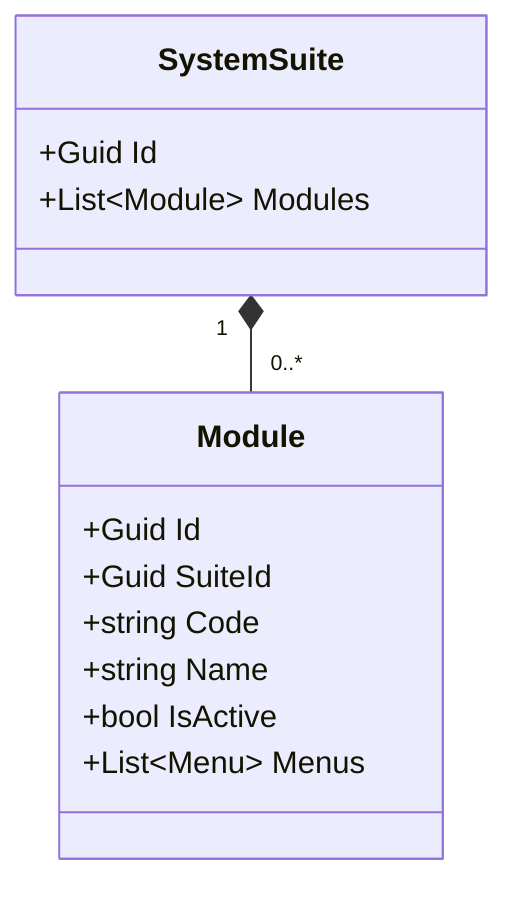
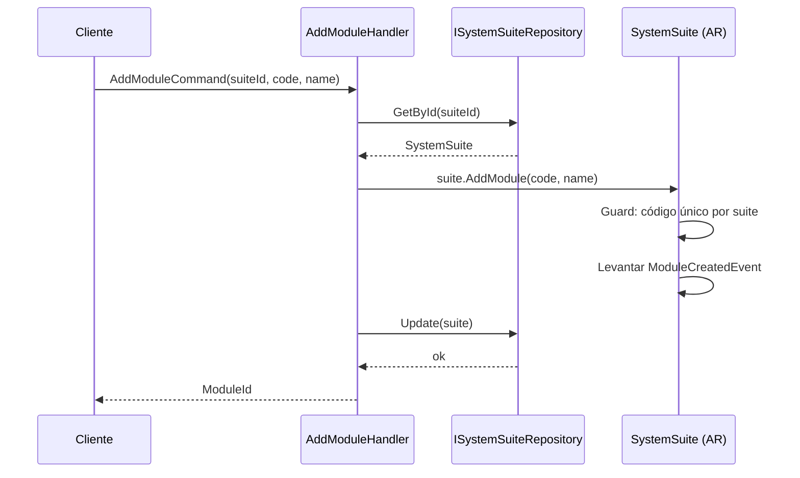
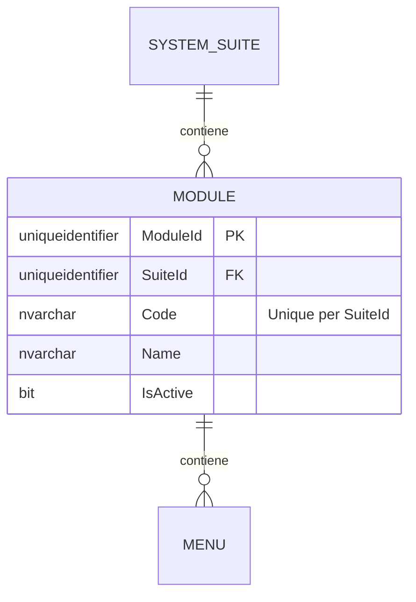

# Module — Arquitectura de Entidad Propia

**Contexto Delimitado:** Autorización  
**Raíz de Agregado:** `SystemSuite` (Module es una entidad propia dentro del agregado SystemSuite)  
**Módulo:** `Ums.Domain.Authorization.SystemSuite.Module`  
**Estado:** Producción

---

## 1. Visión General del Agregado

### Propósito
Un `Module` representa un subsistema funcional o un área lógica dentro de una `SystemSuite` (ej. "Gestión de Usuarios", "Facturación", "Configuración del Sistema"). Sirve para agrupar menús de navegación, pantallas y permisos lógicamente para la generación de la interfaz de usuario y la definición de alcances de seguridad granulares.

### Responsabilidad de Negocio
- Estructurar las capacidades funcionales de una suite en distintas zonas de alto nivel.
- Actuar como el contenedor primario para los Menús de navegación.
- Facilitar la activación/desactivación masiva de características a nivel de módulo.

### Raíz de Agregado
`SystemSuite` es el agregado raíz. Todos los cambios dinámicos en los módulos deben realizarse a través de comandos de `SystemSuite`.

### Invariantes y Reglas de Consistencia
1. El `Code` debe ser único dentro de la suite padre `SystemSuite`.
2. Un Módulo no puede existir sin su suite padre `SystemSuite`.
3. Si la suite padre `SystemSuite` se desactiva, el Módulo queda implícitamente no disponible.

### Entidades Relacionadas / Objetos de Valor
| Entidad / VO | Tipo | Propietario |
|---|---|---|
| `SuiteId` | Objeto de Valor | Referencia FK al suite padre |
| `Code` | Objeto de Valor | Identificador único de módulo |
| `Name` | Objeto de Valor | Título amigable para el usuario |
| `Menu` | Entidad | Propia (ver [menu.md](./menu.md)) |

### Eventos de Dominio
Los eventos se levantan en el administrador de eventos del agregado padre `SystemSuite`:
- `ModuleCreatedEvent`
- `ModuleRemovedEvent`
- `ModuleUpdatedEvent`

### Comandos / Casos de Uso
- `AddModuleCommand` -> Agrega un módulo a una suite.
- `RemoveModuleCommand` -> Remueve un módulo.
- `UpdateModuleCommand` -> Modifica los detalles de un módulo.

---

## 2. Modelo de Dominio

### Clases / Entidades / Objetos de Valor
```
SystemSuite (Raíz de Agregado)
└── Module (Entidad Propia)
    ├── Props: ModuleProps
    │   ├── Id: IdValueObject
    │   ├── SuiteId: SuiteId
    │   ├── Code: string
    │   ├── Name: string
    │   └── IsActive: bool
    └── Hijos
        └── IReadOnlyList<Menu>
```

### Atributos Principales
- `Id` (Guid, PK)
- `SuiteId` (Guid, FK)
- `Code` (string, único por suite)
- `Name` (string)
- `IsActive` (bool)

---

## 3. Diagramas de Modelo de Objetos



---

## 4. Diagramas de Secuencia

### Flujo para Agregar un Módulo


---

## 5. Modelo ER



### Reglas de Aislamiento de Inquilinos
- Tabla de configuración global. Libre de RLS.

---

## 6. Integración de Contexto Delimitado
- Actúa como mapeo de catálogo para las interfaces de navegación de la interfaz de usuario.

---

## 7. Capa de Aplicación
- `AddModuleCommand` -> Entradas: `SuiteId, Code, Name` -> Retorna: `Guid`
- `GetSuiteModulesQuery` -> Retorna lista de módulos.

---

## 8. Infraestructura/Persistencia
- Guardado como parte del contexto de persistencia del agregado `SystemSuite`.
- Índice: Índice único en `SuiteId, Code`.

---

## 9. Seguridad y Cumplimiento
- Las modificaciones requieren credenciales de `Platform:Admin`.

---

## 10. Decisiones Técnicas
- Almacenar los módulos en una jerarquía estricta evita la fragmentación de configuración.

---

**[Volver al Índice de Autorización](./index.md)**
