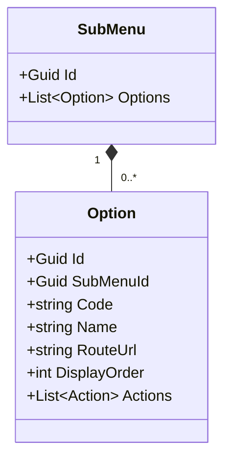
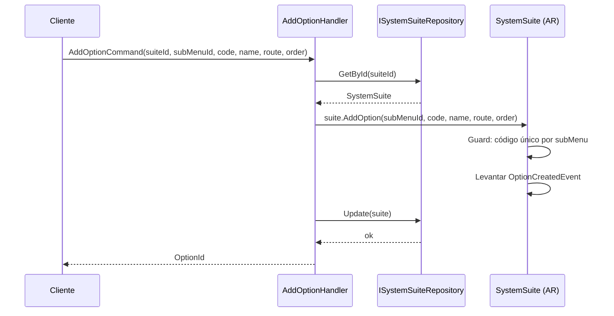
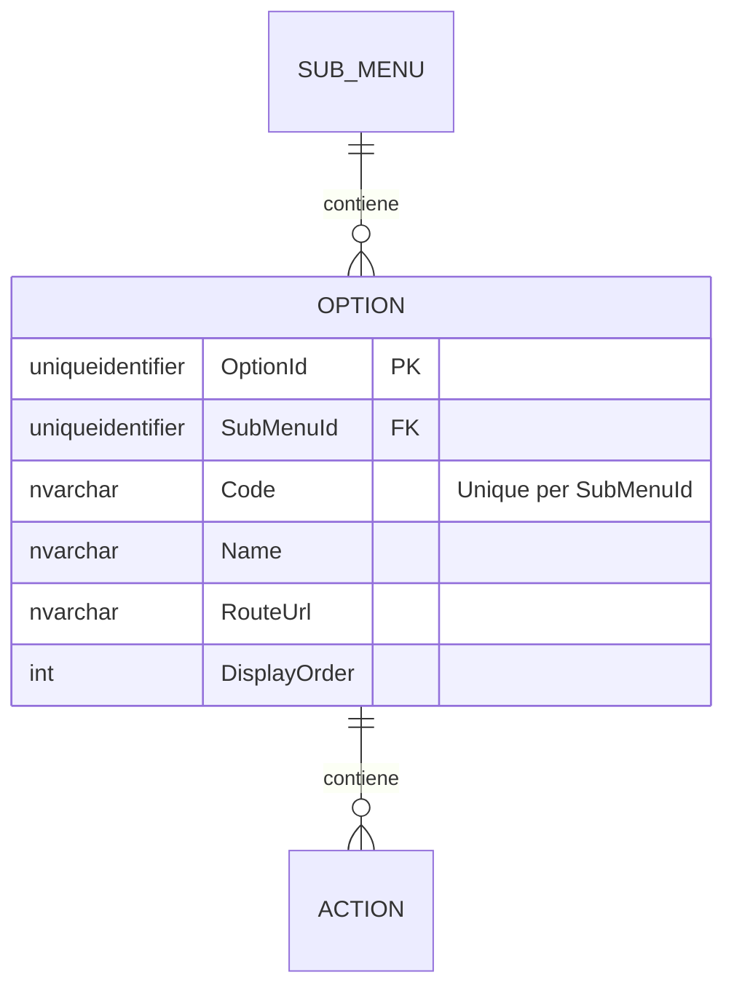

# Option — Arquitectura de Entidad Propia

**Contexto Delimitado:** Autorización  
**Raíz de Agregado:** `SystemSuite` (Option es una entidad propia dentro de la estructura del agregado SystemSuite)  
**Módulo:** `Ums.Domain.Authorization.SystemSuite.Module.Menu.SubMenu.Option`  
**Estado:** Producción

---

## 1. Visión General del Agregado

### Propósito
Una `Option` representa una opción accionable mapeada a una ruta o pantalla/vista específica dentro de la interfaz de usuario de la aplicación (ej. "Gestión de Cuentas de Usuario", "Auditoría de Seguridad"). Sirve para anclar Acciones de seguridad granulares y vincular componentes de interfaz a compuertas de políticas de autorización.

### Responsabilidad de Negocio
- Mapear las rutas/componentes físicos de la interfaz del cliente a las estructuras administrativas.
- Actuar como la compuerta de seguridad para ver las interfaces funcionales.
- Ser contenedor jerárquico de las Acciones estructurales.

### Raíz de Agregado
`SystemSuite` (a través de SubMenu). Gestionado exclusivamente a través de la raíz del agregado `SystemSuite`.

### Invariantes y Reglas de Consistencia
1. El `Code` debe ser único dentro del `SubMenu` padre.
2. `RouteUrl` debe seguir patrones relativos de URI válidos.
3. Si los contenedores padres (Módulo/Menú/SubMenú) están inactivos, la Opción queda automáticamente inaccesible.

### Entidades Relacionadas / Objetos de Valor
| Entidad / VO | Tipo | Propietario |
|---|---|---|
| `SubMenuId` | Objeto de Valor | Referencia FK al SubMenú padre |
| `Code` | Objeto de Valor | Identificador único alfanumérico |
| `RouteUrl` | Objeto de Valor | Cadena de ruta de la interfaz de usuario |
| `Action` | Entidad | Propia (ver [action.md](./action.md)) |

### Eventos de Dominio
Los eventos se levantan en el administrador de eventos del agregado padre `SystemSuite`:
- `OptionCreatedEvent`
- `OptionUpdatedEvent`
- `OptionRemovedEvent`

---

## 2. Modelo de Dominio

### Clases / Entidades / Objetos de Valor
```
SystemSuite (Raíz de Agregado)
└── Module (Entidad Propia)
    └── Menu (Entidad Propia)
        └── SubMenu (Entidad Propia)
            └── Option (Entidad Propia)
                ├── Props: OptionProps
                │   ├── Id: IdValueObject
                │   ├── SubMenuId: SubMenuId
                │   ├── Code: string
                │   ├── Name: string
                │   ├── RouteUrl: string
                │   └── DisplayOrder: int
                └── Hijos
                    └── IReadOnlyList<Action>
```

---

## 3. Diagramas de Modelo de Objetos



---

## 4. Diagramas de Secuencia

### Flujo para Agregar una Opción


---

## 5. Modelo ER



### Reglas de Aislamiento de Inquilinos
- Tabla de configuración global. Libre de RLS.

---

## 6. Integración de Contexto Delimitado
- Utilizado por el middleware de autorización para interceptar rutas de interfaz.

---

## 7. Capa de Aplicación
- `AddOptionCommand` -> Entradas: `SuiteId, SubMenuId, Code, Name, RouteUrl, DisplayOrder` -> Retorna: `Guid`

---

## 8. Infrastructure/Persistencia
- Índice: Índice único en `SubMenuId, Code`.
- Transacción: Guardado como parte del contexto de persistencia del agregado `SystemSuite`.

---

## 9. Seguridad y Cumplimiento
- Las modificaciones requieren credenciales de `Platform:Admin`.

---

## 10. Decisiones Técnicas
- Estandarizar la `RouteUrl` dentro del dominio permite a los clientes de plataformas múltiples (Web, Móvil) mapear sus menús de forma dinámica utilizando consultas REST estándar.

---

**[Volver al Índice de Autorización](./index.md)**
