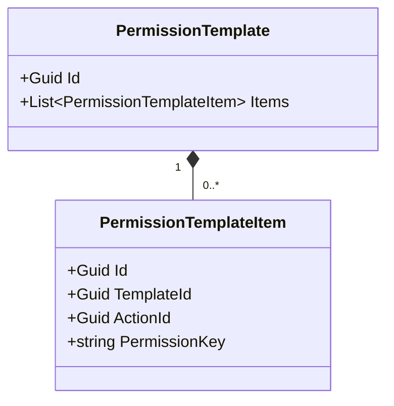
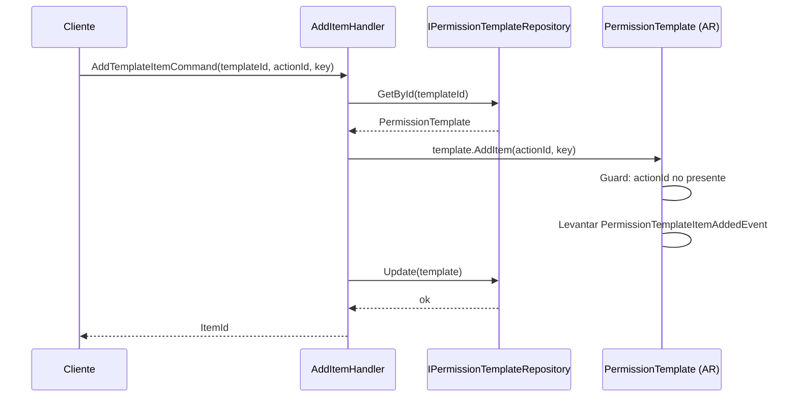
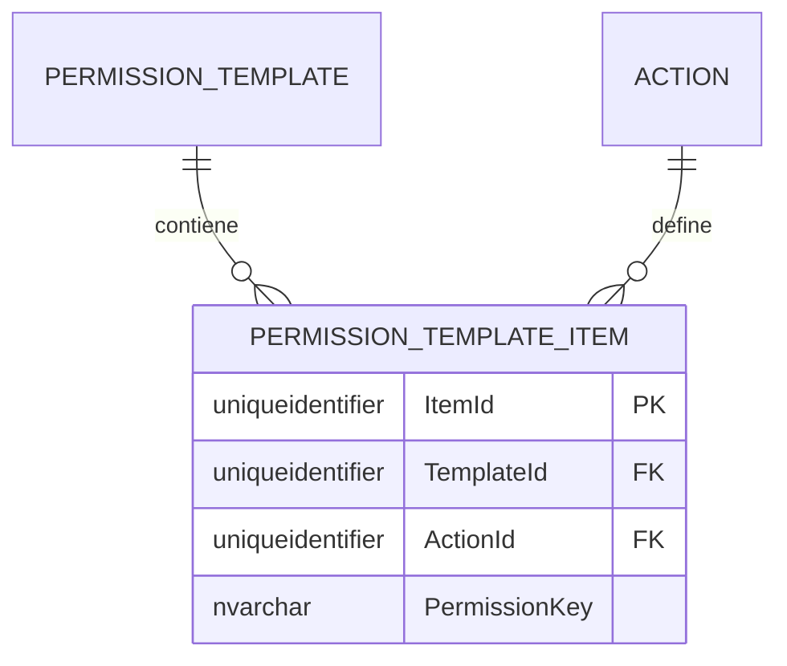

# PermissionTemplateItem — Arquitectura de Entidad Propia

**Contexto Delimitado:** Autorización  
**Raíz de Agregado:** `PermissionTemplate` (PermissionTemplateItem es una entidad propia dentro del agregado PermissionTemplate)  
**Módulo:** `Ums.Domain.Authorization.PermissionTemplate.PermissionTemplateItem`  
**Estado:** Producción

---

## 1. Visión General del Agregado

### Propósito
Un `PermissionTemplateItem` representa un mapeo de operación permitida específico dentro de un `PermissionTemplate` reutilizable. Mapea una `Action` granular externa (referenciada a través de `ActionId` y una `PermissionKey` optimizada para caché) al contenedor de la plantilla.

### Responsabilidad de Negocio
- Vincular operaciones de suite concretas a plantillas estándar.
- Actuar como nodos de mapeo durante la inicialización de perfiles masivos.

### Raíz de Agregado
`PermissionTemplate`. Administrado estrictamente a través del agregado raíz `PermissionTemplate` padre.

### Invariantes y Reglas de Consistencia
1. Una plantilla no puede contener mapeos duplicados de `ActionId`.
2. La `PermissionKey` debe coincidir exactamente con la clave calculada dentro del catálogo `Action` en el momento de la validación.

### Entidades Relacionadas / Objetos de Valor
| Entidad / VO | Tipo | Propietario |
|---|---|---|
| `TemplateId` | Objeto de Valor | Referencia FK al Template padre |
| `ActionId` | Objeto de Valor | Referencia FK a la Action del sistema |
| `PermissionKey` | Objeto de Valor | Clave de caché copiada |

### Eventos de Dominio
Los eventos se levantan en el administrador de eventos de la plantilla padre `PermissionTemplate`:
- `PermissionTemplateItemAddedEvent`
- `PermissionTemplateItemRemovedEvent`

---

## 2. Modelo de Dominio

### Clases / Entidades / Objetos de Valor
```
PermissionTemplate (Raíz de Agregado)
└── PermissionTemplateItem (Entidad Propia)
    └── Props: ItemProps
        ├── Id: IdValueObject
        ├── TemplateId: TemplateId
        ├── ActionId: Guid
        └── PermissionKey: string
```

---

## 3. Diagramas de Modelo de Objetos



---

## 4. Diagramas de Secuencia

### Flujo para Agregar un Elemento


---

## 5. Modelo ER



### Reglas de Aislamiento de Inquilinos
- Hereda el alcance de aislamiento del agregado padre `PermissionTemplate`.

---

## 6. Integración de Contexto Delimitado
- Mapea identificadores dinámicos de `Action`.

---

## 7. Capa de Aplicación
- `AddTemplateItemCommand` -> Entradas: `TemplateId, ActionId, PermissionKey` -> Retorna: `Guid`

---

## 8. Infraestructura/Persistencia
- Guardado como parte del límite de transacción de `PermissionTemplate`.
- Índice: Índice único en `TemplateId, ActionId`.

---

## 9. Seguridad y Cumplimiento
- El alcance coincide con las reglas administrativas de la plantilla padre `PermissionTemplate`.

---

## 10. Decisiones Técnicas
- Duplicar la `PermissionKey` calculada directamente dentro de la tabla sirve como una optimización del rendimiento de caché desnormalizada para cálculos de permisos de alta velocidad.

---

**[Volver al Índice de Autorización](./index.md)**
