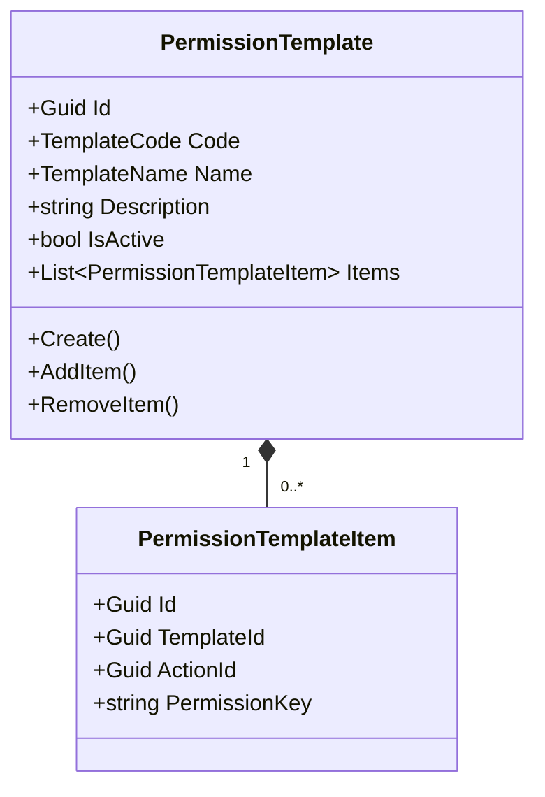
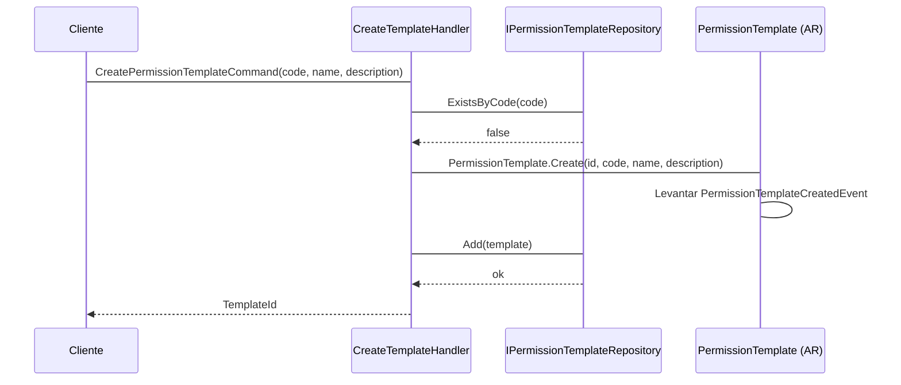
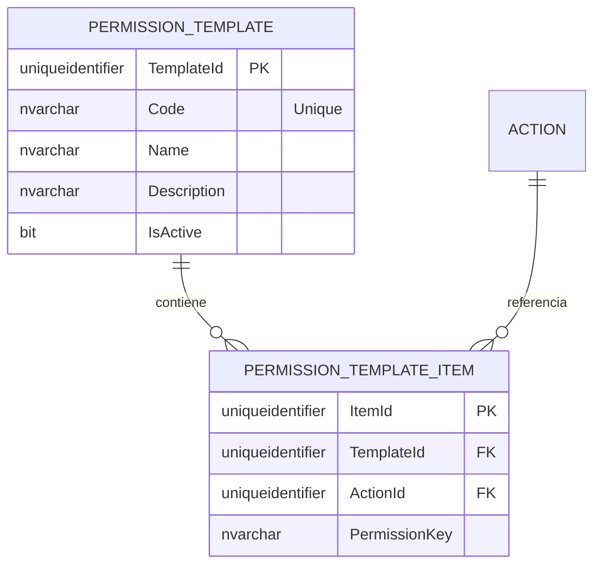

# PermissionTemplate — Arquitectura de Agregados

**Contexto Delimitado:** Autorización  
**Raíz de Agregado:** `PermissionTemplate`  
**Módulo:** `Ums.Domain.Authorization.PermissionTemplate`  
**Estado:** Producción

---

## 1. Visión General del Agregado

### Propósito
El agregado `PermissionTemplate` define paquetes de derechos de acceso (permisos) estándar y reutilizables mapeados a varios roles del sistema (ej. "Empleado Estándar", "Administrador de Sucursal", "Administrador Financiero del Inquilino"). Actúa como un plano estandarizado que simplifica y automatiza el aprovisionamiento de perfiles (roles) dinámicos cuando se registran nuevos inquilinos o se incorporan nuevos usuarios.

### Responsabilidad de Negocio
- Crear y mantener plantillas de seguridad preempaquetadas.
- Vincular las Acciones de suite granulares a una plantilla con nombre.
- Facilitar configuraciones de seguridad consistentes y reproducibles entre inquilinos.

### Raíz de Agregado
`PermissionTemplate` es la raíz del agregado. Los detalles de configuración de elementos secundarios se administran dentro de la colección de entidades propias `PermissionTemplateItem`.

### Invariantes y Reglas de Consistencia
1. El `Code` de la plantilla debe ser único en todo el sistema.
2. Una plantilla debe contener al menos un `PermissionTemplateItem` para estar activa.
3. Si una `Action` subyacente en `SystemSuite` se elimina, el `PermissionTemplateItem` correspondiente se elimina automáticamente en cascada.

### Entidades Relacionadas / Objetos de Valor
| Entidad / VO | Tipo | Propietario |
|---|---|---|
| `PermissionTemplateItem` | Entidad | Propia (ver [permission-template-item.md](./permission-template-item.md)) |
| `TemplateCode` | Objeto de Valor | Código de plantilla alfanumérico |
| `TemplateName` | Objeto de Valor | Descripción y etiqueta de visualización |

### Eventos de Dominio
- `PermissionTemplateCreatedEvent`
- `PermissionTemplateUpdatedEvent`
- `PermissionTemplateDeletedEvent`

---

## 2. Modelo de Dominio

### Clases / Entidades / Objetos de Valor
```
PermissionTemplate (Raíz de Agregado)
├── Props: PermissionTemplateProps
│   ├── Id: IdValueObject
│   ├── Code: TemplateCode
│   ├── Name: TemplateName
│   ├── Description: string
│   └── IsActive: bool
└── Hijos
    └── IReadOnlyList<PermissionTemplateItem>
```

---

## 3. Diagramas de Modelo de Objetos



---

## 4. Diagramas de Secuencia

### Flujo para Crear una Plantilla


---

## 5. Modelo ER



### Reglas de Aislamiento de Inquilinos
- Las plantillas se pueden configurar como **Globales** (disponibles en toda la plataforma para todos los inquilinos) o **Delimitadas por Inquilino** (disponibles solo para el inquilino que las creó). Las tablas delimitadas por inquilino incluyen una columna `TenantId` que admite valores nulos.

---

## 6. Integración de Contexto Delimitado
- Consume metadatos de `Action` del agregado `SystemSuite`.
- Los perfiles de seguridad aguas abajo consumen estas plantillas para inicializar permisos de perfiles predeterminados.

---

## 7. Capa de Aplicación
- `CreatePermissionTemplateCommand` -> Entradas: `Code, Name, Description` -> Retorna: `Guid`

---

## 8. Infraestructura/Persistencia
- Índice: Índice único en `Code` e índice en `TenantId`.

---

## 9. Seguridad y Cumplimiento
- La edición de plantillas globales está restringida al rol `Platform:Admin`.
- La creación de plantillas delimitadas por inquilino está restringida al rol `Tenant:Admin`.

---

## 10. Decisiones Técnicas
- El uso de plantillas de inicialización estándar evita la fatiga de configuración manual durante el registro de nuevas organizaciones.

---

**[Volver al Índice de Autorización](./index.md)**
