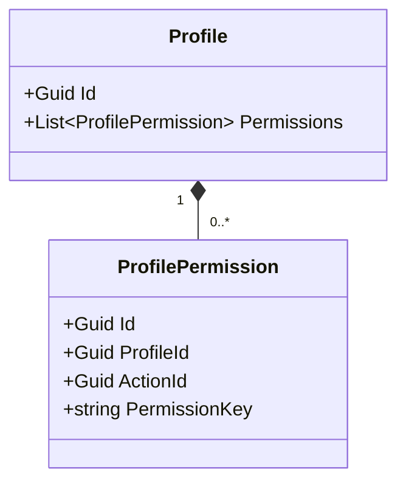
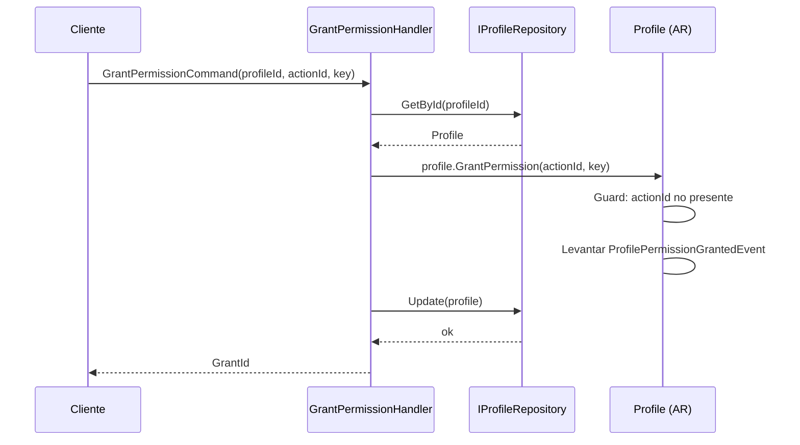
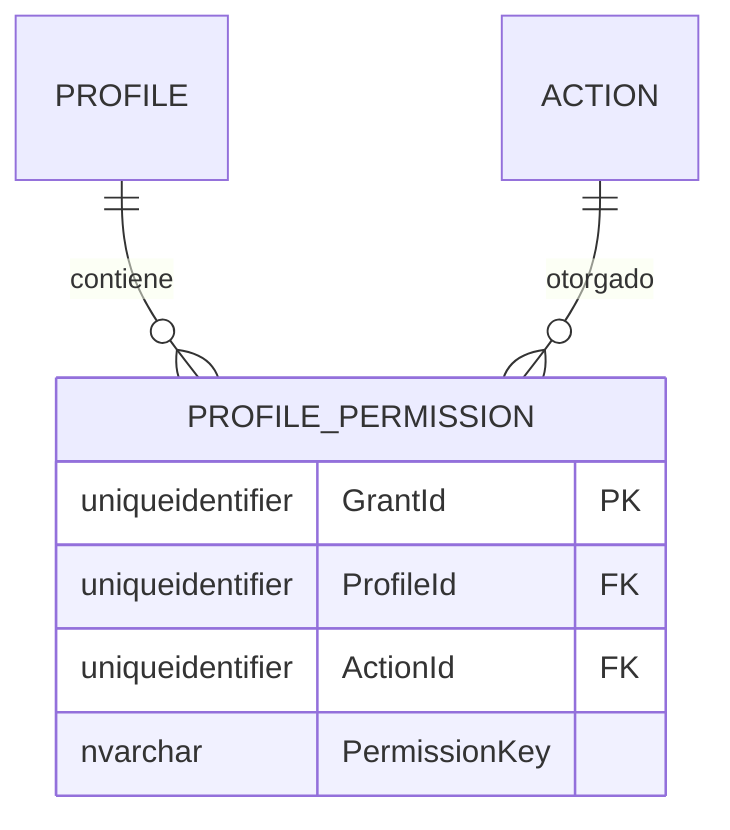

# ProfilePermission — Arquitectura de Entidad Propia

**Contexto Delimitado:** Autorización  
**Raíz de Agregado:** `Profile` (ProfilePermission es una entidad propia dentro del agregado Profile)  
**Módulo:** `Ums.Domain.Authorization.Profile.ProfilePermission`  
**Estado:** Producción

---

## 1. Visión General del Agregado

### Propósito
Un `ProfilePermission` representa un permiso individual otorgado (acción) dentro de un `Profile`. Vincula una `Action` granular del sistema (referenciada a través de `ActionId` y una `PermissionKey` optimizada para caché) al rol padre.

### Responsabilidad de Negocio
- Vincular operaciones de suite concretas a perfiles de usuario estándar.
- Participar en comprobaciones de seguridad de sesión de alta velocidad.

### Raíz de Agregado
`Profile`. Administrado estrictamente a través del agregado raíz `Profile` padre.

### Invariantes y Reglas de Consistencia
1. Un perfil no puede contener mapeos duplicados de `ActionId`.
2. La `PermissionKey` debe coincidir exactamente con la clave calculada dentro del catálogo `Action` en el momento de la validación de la asignación.

### Entidades Relacionadas / Objetos de Valor
| Entidad / VO | Tipo | Propietario |
|---|---|---|
| `ProfileId` | Objeto de Valor | Referencia FK al Perfil padre |
| `ActionId` | Objeto de Valor | Referencia FK a la Action del sistema |
| `PermissionKey` | Objeto de Valor | Clave de caché copiada |

### Eventos de Dominio
Los eventos se levantan en el administrador de eventos de la raíz del agregado padre `Profile`:
- `ProfilePermissionGrantedEvent`
- `ProfilePermissionRevokedEvent`

---

## 2. Modelo de Dominio

### Clases / Entidades / Objetos de Valor
```
Profile (Raíz de Agregado)
└── ProfilePermission (Entidad Propia)
    └── Props: PermissionProps
        ├── Id: IdValueObject
        ├── ProfileId: ProfileId
        ├── ActionId: Guid
        └── PermissionKey: string
```

---

## 3. Diagramas de Modelo de Objetos



---

## 4. Diagramas de Secuencia

### Flujo para Otorgar un Permiso


---

## 5. Modelo ER



### Reglas de Aislamiento de Inquilinos
- Hereda el alcance de aislamiento del agregado padre `Profile` (el cual está estrictamente particionado por inquilino a menos que sea global).

---

## 6. Integración de Contexto Delimitado
- Mapea identificadores de `Action` dinámicos desde agregados `SystemSuite`.

---

## 7. Capa de Aplicación
- `GrantPermissionCommand` -> Entradas: `ProfileId, ActionId, PermissionKey` -> Retorna: `Guid`

---

## 8. Infraestructura/Persistencia
- Guardado como parte del límite de transacción de `Profile`.
- Índice: Índice único en `ProfileId, ActionId`.

---

## 9. Seguridad y Cumplimiento
- Las operaciones requieren credenciales administrativas que coincidan con las reglas del agregado padre `Profile`.

---

## 10. Decisiones Técnicas
- Desnormalizar `PermissionKey` directamente en `PROFILE_PERMISSION` permite consultas de seguridad inmediatas y de alto rendimiento que omiten los joins de base de datos a los esquemas de SystemSuite al calcular los permisos de sesión activos.

---

**[Volver al Índice de Autorización](./index.md)**
