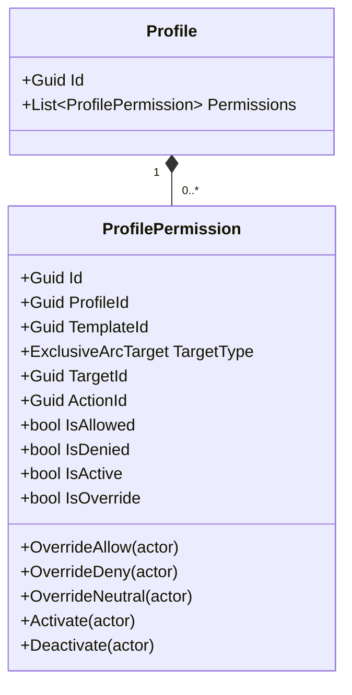
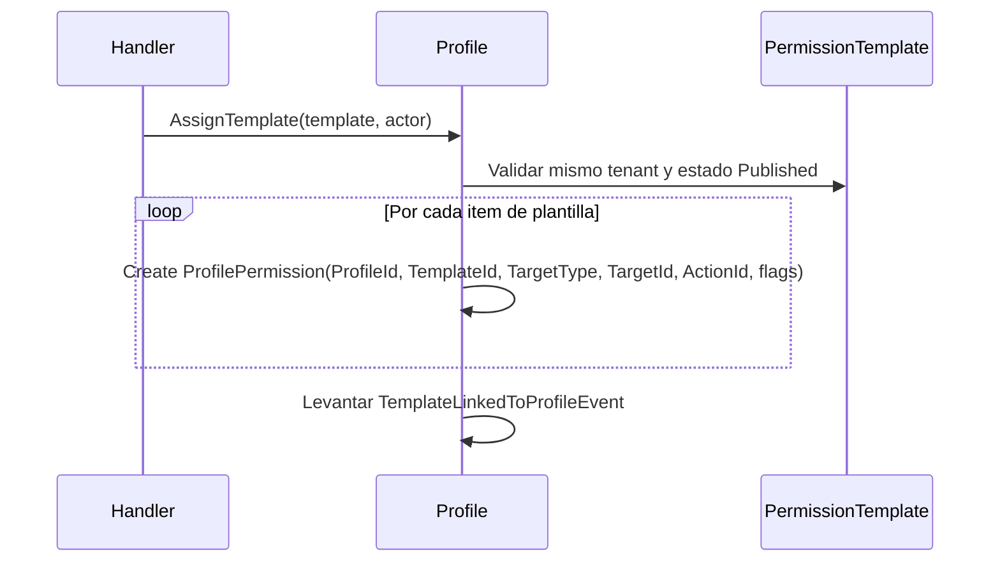
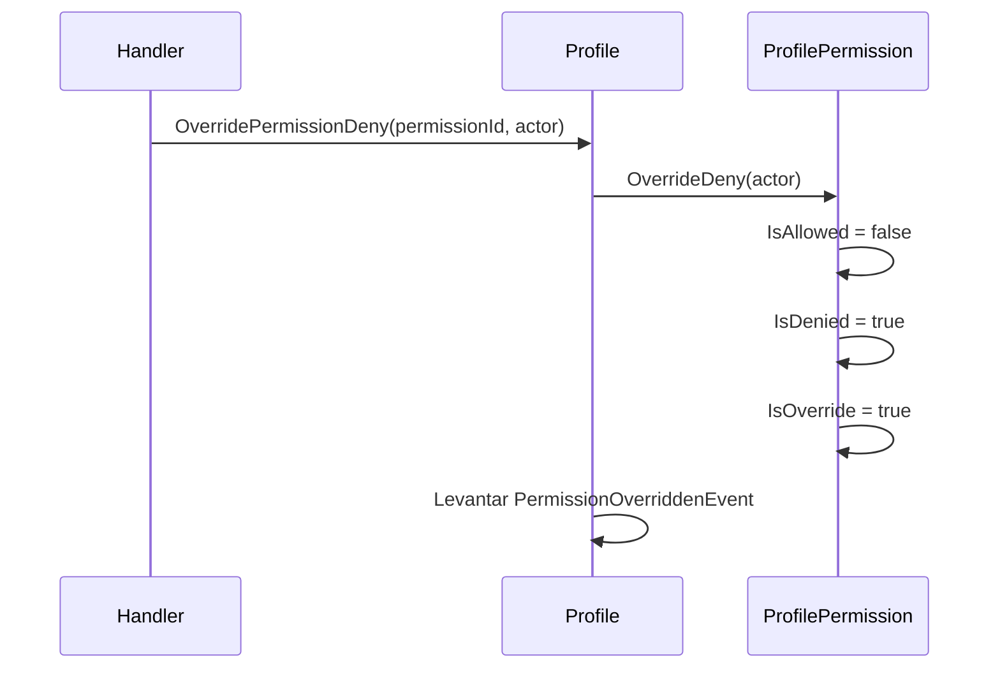
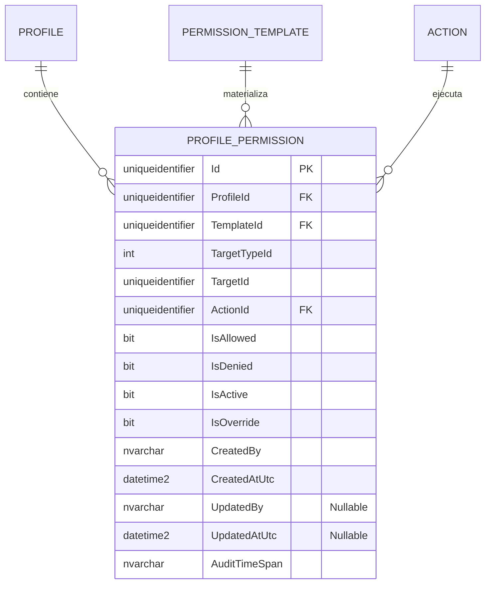

# ProfilePermission — Arquitectura de Entidad Propia

**Contexto Delimitado:** Autorización  
**Raíz de Agregado:** `Profile` (`ProfilePermission` es una entidad propia dentro del agregado `Profile`)
**Módulo:** `Ums.Domain.Authorization.Profile.ProfilePermission`  
**Estado:** Producción

---

## 1. Visión General del Agregado

### Propósito
`ProfilePermission` representa un ítem de permiso efectivo dentro de un `Profile`. Se materializa a partir de un elemento publicado de `PermissionTemplate` y luego puede anularse a nivel de perfil sin modificar la plantilla fuente.

### Responsabilidad de Negocio
- Preservar el resultado efectivo de autorización asignado a un perfil de usuario.
- Mantener trazabilidad hacia la plantilla origen mediante `TemplateId`.
- Almacenar el nivel objetivo del recurso y la `ActionId` concreta.
- Soportar anulaciones operativas como allow, deny, neutral, activate y deactivate.

### Raíz de Agregado
`Profile`. Se administra estrictamente a través del agregado padre.

### Invariantes y Reglas de Consistencia
1. Todo `ProfilePermission` pertenece exactamente a un `Profile`.
2. Todo `ProfilePermission` conserva trazabilidad hacia un `TemplateId` de origen.
3. Las operaciones de override deben marcar `IsOverride = true`.
4. La semántica efectiva del permiso surge de la combinación de `IsAllowed`, `IsDenied`, `IsActive` e `IsOverride`.

### Entidades Relacionadas / Objetos de Valor
| Entidad / VO | Tipo | Propiedad |
|---|---|---|
| `ProfileId` | Objeto de Valor | FK hacia `Profile` |
| `TemplateId` | Objeto de Valor | Trazabilidad hacia la plantilla origen |
| `ExclusiveArcTarget` | Enumeración | Nivel objetivo (`SystemSuite`, `Module`, `Submodule`, `Option`) |
| `TargetId` | Objeto de Valor | Objetivo concreto dentro de la topología funcional |
| `ActionId` | Objeto de Valor | Acción a ejecutar |

### Eventos de Dominio
Los eventos se elevan desde el agregado padre `Profile`:
- `TemplateLinkedToProfileEvent`
- `PermissionOverriddenEvent`

---

## 2. Modelo de Dominio

### Clases / Entidades / Objetos de Valor
```text
Profile (Raíz de Agregado)
└── ProfilePermission (Entidad Propia)
    └── Props: ProfilePermissionProps
        ├── Id: IdValueObject
        ├── ProfileId: ProfileId
        ├── TemplateId: TemplateId
        ├── TargetType: ExclusiveArcTarget
        ├── TargetId: IdValueObject
        ├── ActionId: ActionId
        ├── IsAllowed: bool
        ├── IsDenied: bool
        ├── IsActive: bool
        ├── IsOverride: bool
        └── Audit: AuditValueObject
```

---

## 3. Diagramas del Modelo de Objetos



---

## 4. Diagramas de Secuencia

### Materialización de Permisos desde Plantilla


### Override de Permiso Efectivo


---

## 5. Modelo ER



### Reglas de Aislamiento por Tenant
- `ProfilePermission` hereda la pertenencia al tenant desde su `Profile` padre.
- No porta `TenantId` propio; el aislamiento fluye mediante `ProfileId`.

---

## 6. Integración entre Contextos Delimitados
- Consume `TemplateId` desde `PermissionTemplate`.
- Consume `ActionId` y la topología objetivo desde `SystemSuite`.
- Es consumido por la compilación del grafo de autorización y por validadores de acceso en runtime.

---

## 7. Capa de Aplicación
- No existe una superficie de comandos independiente para `ProfilePermission`; todas las operaciones viajan a través de `Profile`.
- Trabajo pendiente en API: exponer el enlace de plantillas y las anulaciones mediante handlers y endpoints de aplicación.

---

## 8. Infraestructura / Persistencia
- Se guarda dentro del mismo límite transaccional que `Profile`.
- Tabla actual en SQL Server: `[ums_authorization].[ProfilePermissions]`
- Índices actuales: `ProfileId`, `(ProfileId, TemplateId, ActionId, TargetId)`
- La metadata de auditoría se persiste en cada fila.

---

## 9. Seguridad y Cumplimiento
- Los overrides a nivel de perfil permiten endurecer acceso sin mutar la plantilla autoritativa.
- Los permisos inactivos deben ignorarse en evaluadores de acceso en runtime.
- `IsOverride` distingue ajustes manuales frente a permisos sembrados por plantilla para auditoría y reconstrucción.

---

## 10. Decisiones Técnicas
- `ProfilePermission` es un registro materializado de permiso efectivo, no solo una concesión cruda de acción.
- `TargetTypeId` + `TargetId` implementan el patrón de arco exclusivo heredado desde los items de plantilla.
- Mantener `TemplateId` en cada fila preserva procedencia y habilita reconstrucciones futuras.

---

**[Volver al Índice de Autorización](./index.md)**
