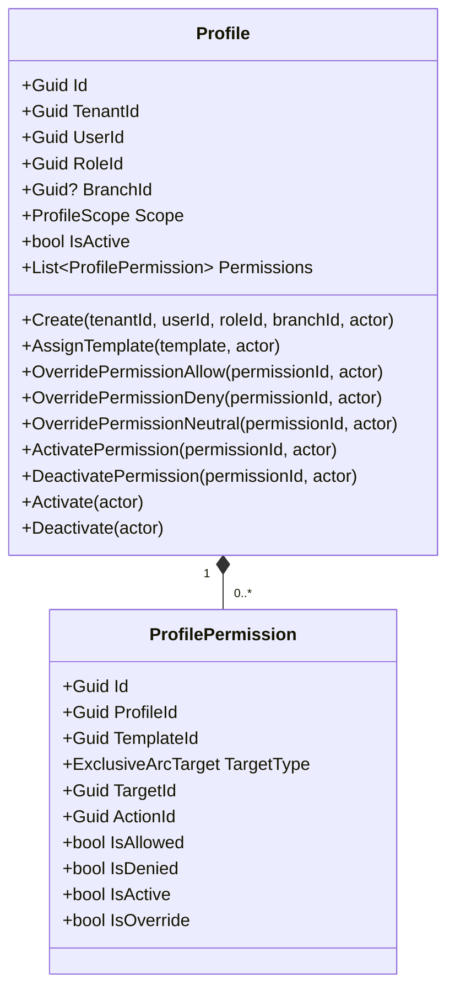
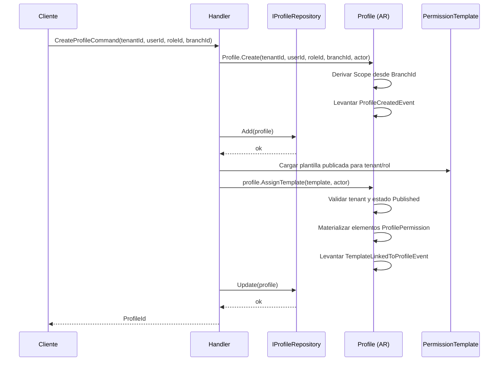
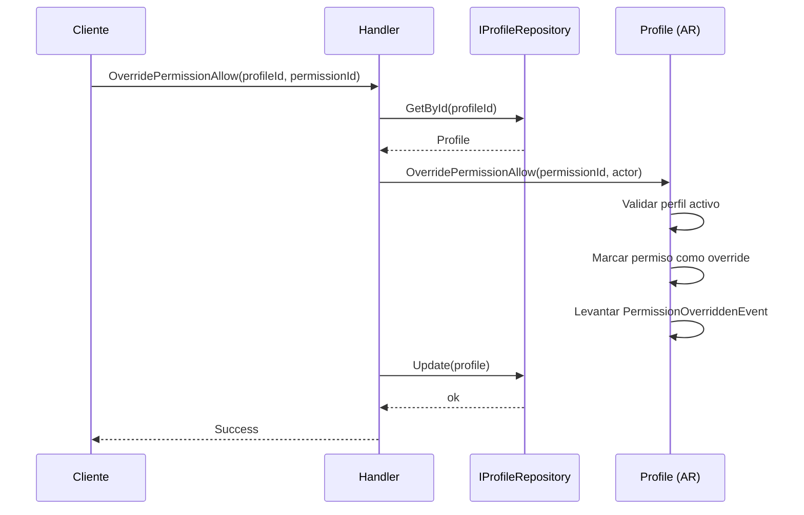
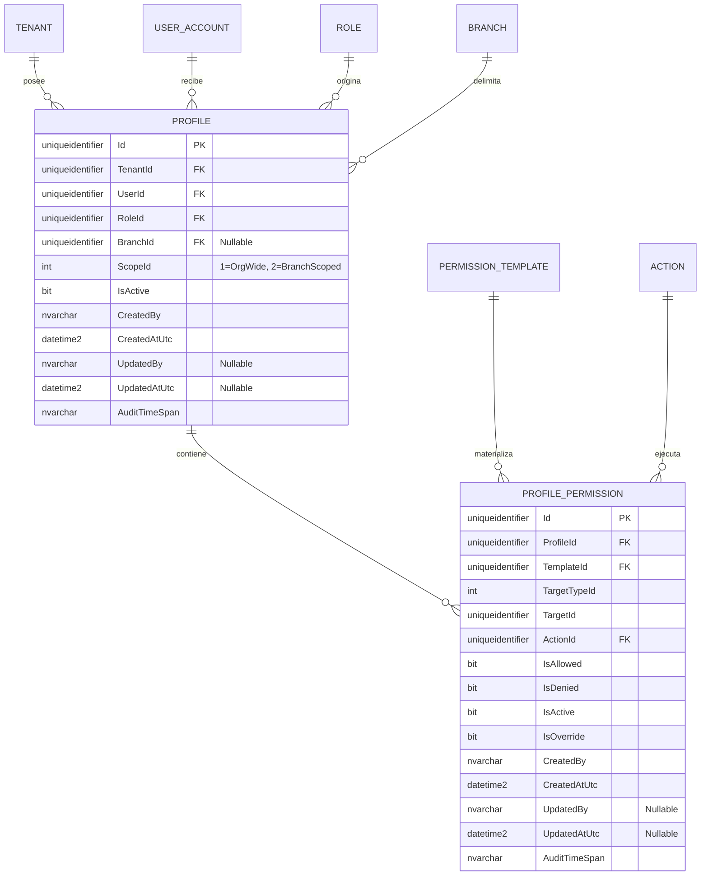

# Profile — Arquitectura de Agregado

**Contexto Delimitado:** Autorización  
**Raíz de Agregado:** `Profile`  
**Módulo:** `Ums.Domain.Authorization.Profile`  
**Estado:** Producción

---

## 1. Visión General del Agregado

### Propósito
El agregado `Profile` representa una asignación efectiva de autorización para un usuario dentro de un tenant. Vincula un `UserId` con un `RoleId` y opcionalmente con un `BranchId`, y luego materializa permisos efectivos a partir de definiciones publicadas de `PermissionTemplate`. Es el contenedor padre de las entidades propias `ProfilePermission` y la fuente operativa usada por los validadores de acceso aguas abajo.

### Responsabilidad de Negocio
- Representar la huella de autorización activa de un usuario en un tenant.
- Hacer cumplir los límites de alcance entre acceso organizacional y acceso por sucursal.
- Materializar elementos de plantillas publicadas en permisos efectivos `ProfilePermission`.
- Permitir anulaciones controladas por permiso sin mutar la plantilla fuente.
- Controlar el ciclo de vida completo del perfil (`Active` / `Inactive`).

### Raíz de Agregado
`Profile` es la raíz del agregado. El enlace de plantillas, las anulaciones de permisos, la activación/desactivación de permisos y los cambios de estado del agregado deben pasar por `Profile`.

### Invariantes y Reglas de Consistencia
1. `TenantId`, `UserId` y `RoleId` son obligatorios para todo `Profile`.
2. `Scope` se deriva de `BranchId`: sin sucursal es `OrgWide`; con sucursal es `BranchScoped`.
3. Un `Profile` solo puede enlazar instancias de `PermissionTemplate` del mismo tenant.
4. Un `Profile` solo puede enlazar plantillas que ya estén en estado `Published`.
5. Un `Profile` no puede enlazar dos veces la misma plantilla.
6. Las anulaciones y cambios de estado de permisos solo son válidos mientras el `Profile` padre esté activo.
7. La identidad de `ProfilePermission` se materializa por cada elemento de plantilla y conserva trazabilidad mediante `TemplateId`.

### Entidades Relacionadas / Objetos de Valor
| Entidad / VO | Tipo | Propiedad | Descripción |
|---|---|---|---|
| `ProfilePermission` | Entidad | Propia | Permiso efectivo materializado desde un elemento de plantilla |
| `ProfileScope` | Enumeración | - | `OrgWide` o `BranchScoped` |
| `TenantId` | Objeto de Valor | - | Límite de pertenencia del tenant |
| `UserId` | Objeto de Valor | - | Usuario que recibe el perfil efectivo |
| `RoleId` | Objeto de Valor | - | Fuente del rol para seleccionar plantillas |
| `BranchId` | Objeto de Valor | - | Segmentación opcional por sucursal |
| `TemplateId` | Objeto de Valor | - | Trazabilidad hacia la plantilla origen |

### Eventos de Dominio
| Evento | Disparador |
|---|---|
| `ProfileCreatedEvent` | Nuevo perfil creado |
| `TemplateLinkedToProfileEvent` | Plantilla publicada enlazada y materializada en permisos |
| `PermissionOverriddenEvent` | Se aplica allow / deny / neutral / activate / deactivate sobre un permiso |
| `ProfileDeactivatedEvent` | Perfil desactivado |
| `ProfileActivatedEvent` | Perfil reactivado |

---

## 2. Modelo de Dominio

### Clases / Entidades / Objetos de Valor
```text
Profile (Raíz de Agregado)
├── Props: ProfileProps
│   ├── Id: IdValueObject
│   ├── TenantId: TenantId
│   ├── UserId: UserId
│   ├── RoleId: RoleId
│   ├── BranchId?: BranchId
│   ├── Scope: ProfileScope
│   ├── IsActive: bool
│   └── Audit: AuditValueObject
└── Hijos
    └── IReadOnlyCollection<ProfilePermission>
        └── Props: ProfilePermissionProps
            ├── Id: IdValueObject
            ├── ProfileId: ProfileId
            ├── TemplateId: TemplateId
            ├── TargetType: ExclusiveArcTarget
            ├── TargetId: IdValueObject
            ├── ActionId: ActionId
            ├── IsAllowed: bool
            ├── IsDenied: bool
            ├── IsActive: bool
            ├── IsOverride: bool
            └── Audit: AuditValueObject
```

---

## 3. Diagramas del Modelo de Objetos



---

## 4. Diagramas de Secuencia

### Flujo de Creación de Perfil y Asignación de Plantilla


### Flujo de Anulación de Permiso


---

## 5. Modelo ER



### Reglas de Aislamiento por Tenant
- `Profile` siempre pertenece a un tenant en la implementación actual; `TenantId` es obligatorio.
- El comportamiento organizacional se modela con `ScopeId = OrgWide`, no con `TenantId` nulo.
- `PROFILE_PERMISSION` hereda el aislamiento desde su `Profile` padre.

---

## 6. Integración entre Contextos Delimitados
- **Aguas arriba**: consume `TenantId`, `UserId` y `BranchId` del Contexto de Identidad.
- Consume `RoleId` y definiciones publicadas de `PermissionTemplate` dentro del contexto de Autorización.
- Consume `ActionId` y la topología objetivo desde `SystemSuite`.
- Es consumido por Aprobaciones, IGA y evaluadores de autorización en runtime.

---

## 7. Capa de Aplicación
- `CreateProfileCommand` -> Entradas: `TenantId, UserId, RoleId, BranchId?` -> Retorna: `Guid`
- Trabajo pendiente en API: la asignación de plantillas y las anulaciones de permisos ya existen en dominio, pero todavía no están expuestas completamente en endpoints.

---

## 8. Infraestructura / Persistencia
- Se guarda dentro del límite transaccional de `Profile`.
- Tabla actual en SQL Server: `[ums_authorization].[Profiles]`
- Tabla hija actual en SQL Server: `[ums_authorization].[ProfilePermissions]`
- Índices actuales de `Profile`: `TenantId`, `UserId`, `(TenantId, UserId, RoleId, BranchId)`
- Índices actuales de `ProfilePermission`: `ProfileId`, `(ProfileId, TemplateId, ActionId, TargetId)`
- La metadata de auditoría se persiste tanto en la raíz como en cada permiso.

---

## 9. Seguridad y Cumplimiento
- La mutación de perfiles es una operación sensible y actualiza la metadata de auditoría del agregado en cada cambio.
- La autorización efectiva puede endurecerse mediante overrides `deny` o `neutral` sin cambiar la plantilla fuente.
- Los evaluadores aguas abajo deben tratar perfiles y permisos inactivos como no efectivos.

---

## 10. Decisiones Técnicas
- `Profile` representa una asignación efectiva de autorización, no un catálogo de roles nombrados.
- `Scope` se persiste como identificador de enumeración (`ScopeId`) y se deriva desde `BranchId` al crear el agregado.
- Los permisos efectivos conservan trazabilidad mediante `TemplateId`, habilitando reevaluación, auditoría y reconstrucción futura.
- Los cambios manuales se expresan con `IsOverride` y toggles de estado en `ProfilePermission`, en lugar de mutar `PermissionTemplate`.

---

**[Volver al Índice de Autorización](./index.md)**
