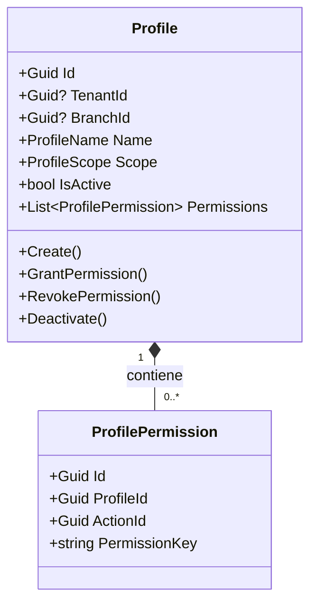
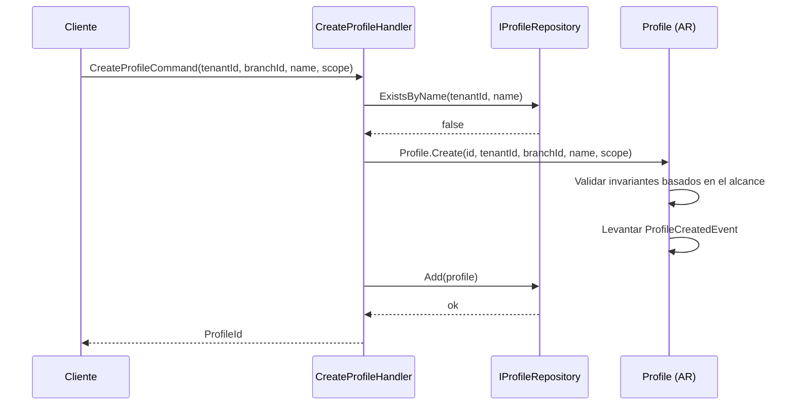
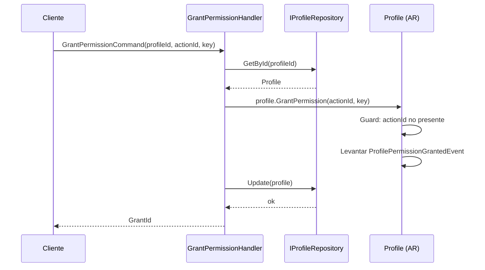
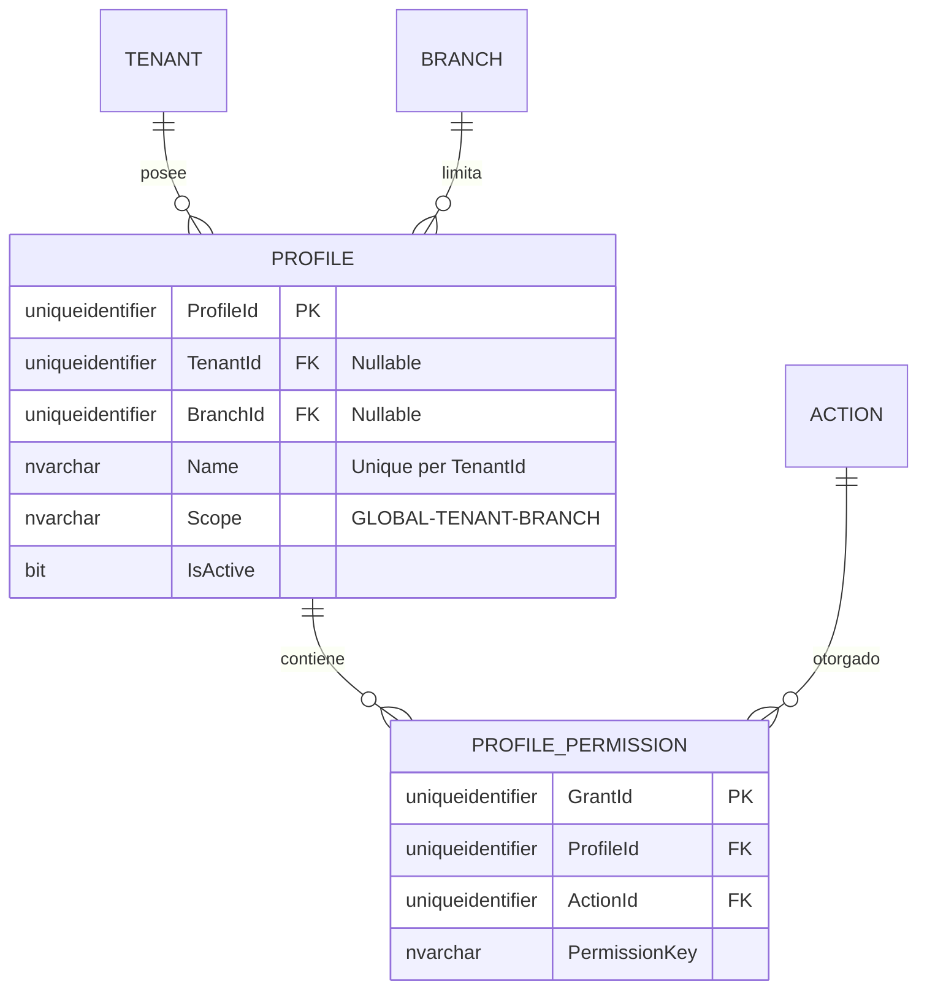

# Profile — Arquitectura de Agregados

**Contexto Delimitado:** Autorización  
**Raíz de Agregado:** `Profile`  
**Módulo:** `Ums.Domain.Authorization.Profile`  
**Estado:** Producción

---

## 1. Visión General del Agregado

### Propósito
El agregado `Profile` representa un rol de seguridad dinámico asignado a los usuarios del sistema. Orquesta las asignaciones de permisos mediante el mapeo de operaciones de suite (acciones) a alcances de acceso específicos (GLOBAL, TENANT o BRANCH). Esto determina qué acciones puede ejecutar un usuario y precisamente qué segmentos de datos (inquilinos/sucursales) tiene permitido ver o modificar.

### Responsabilidad de Negocio
- Actuar como el mecanismo central de roles de autorización.
- Hacer cumplir los límites de los alcances de seguridad (niveles Global vs Inquilino vs Sucursal).
- Gestionar los permisos dinámicos del perfil a través de entidades propias `ProfilePermission`.
- Controlar las reglas de asignación y ciclos de vida de los roles.

### Raíz de Agregado
`Profile` es la raíz del agregado. Todos los ajustes de permisos o transiciones de estado deben pasar por comandos de `Profile`.

### Invariantes y Reglas de Consistencia
1. El `Name` de un perfil debe ser único dentro de su ámbito de `TenantId`.
2. Un perfil marcado con `Scope = GLOBAL` no puede tener una restricción de alcance de `TenantId` o `BranchId`.
3. Un perfil marcado con `Scope = TENANT` debe tener un `TenantId` válido.
4. Un perfil marcado con `Scope = BRANCH` debe tener un `TenantId` y un `BranchId` válidos.
5. Si el inquilino propietario se suspende, todos los perfiles asignados a ese inquilino se suspenden implícitamente (R-10).
6. Un perfil no puede contener mapeos duplicados de `ActionId` en sus `ProfilePermission`.
7. La `PermissionKey` en un `ProfilePermission` debe coincidir exactamente con la clave calculada dentro del catálogo `Action` en el momento de la validación de la asignación.

### Entidades Relacionadas / Objetos de Valor
| Entidad / VO | Tipo | Propietario |
|---|---|---|
| `ProfilePermission` | Entidad | Propia |
| `ProfileScope` | Enum | GLOBAL · TENANT · BRANCH |
| `ProfileName` | Objeto de Valor | Nombre del rol de visualización alfanumérico |

### Eventos de Dominio
| Evento | Desencadenante |
|---|---|
| `ProfileCreatedEvent` | Nuevo perfil creado |
| `ProfileScopeAdjustedEvent` | Alcance del perfil ajustado |
| `ProfilePermissionGrantedEvent` | Permiso (acción) otorgado al perfil |
| `ProfilePermissionRevokedEvent` | Permiso revocado del perfil |
| `ProfileDeactivatedEvent` | Perfil desactivado |

### Comandos / Casos de Uso
| Comando | Descripción |
|---|---|
| `CreateProfileCommand` | Crear un nuevo perfil |
| `GrantPermissionCommand` | Otorga un permiso (acción) al perfil |

---

## 2. Modelo de Dominio

### Clases / Entidades / Objetos de Valor
```
Profile (Raíz de Agregado)
├── Props: ProfileProps
│   ├── Id: IdValueObject
│   ├── TenantId?: TenantId
│   ├── BranchId?: BranchId
│   ├── Name: ProfileName
│   ├── Scope: ProfileScope
│   ├── IsActive: bool
│   └── Audit: AuditValueObject
└── Hijos
    └── IReadOnlyList<ProfilePermission>
        └── ProfilePermission
            ├── Props: PermissionProps
            │   ├── Id: IdValueObject
            │   ├── ProfileId: ProfileId
            │   ├── ActionId: Guid
            │   └── PermissionKey: string
```

### Atributos Principales
| Entidad | Atributo | Tipo | Notas |
|---|---|---|---|
| `Profile` | `Id` | `Guid` | PK |
| `Profile` | `TenantId` | `Guid?` | Nulo si es GLOBAL |
| `Profile` | `BranchId` | `Guid?` | Nulo si es GLOBAL o TENANT |
| `Profile` | `Name` | `string` | Único por TenantId |
| `Profile` | `Scope` | `Enum` | GLOBAL, TENANT, BRANCH |
| `Profile` | `IsActive` | `bool` | Flag de estado |
| `ProfilePermission` | `Id` | `Guid` | PK (GrantId) |
| `ProfilePermission` | `ProfileId` | `Guid` | FK a Profile |
| `ProfilePermission` | `ActionId` | `Guid` | FK a Action del sistema |
| `ProfilePermission` | `PermissionKey`| `string` | Clave de caché copiada |

---

## 3. Diagramas de Modelo de Objetos



---

## 4. Diagramas de Secuencia

### Flujo para Crear un Perfil


### Flujo para Otorgar un Permiso


---

## 5. Modelo ER



### Reglas de Aislamiento de Inquilinos
- Los perfiles globales (`TenantId IS NULL`) se comparten en todo el sistema.
- Los perfiles delimitados por Inquilino y Sucursal se particionan estrictamente por `TenantId`. Todas las consultas de base de datos dirigidas a operaciones de inquilinos deben aplicar el filtro de inquilinos correspondiente.
- `ProfilePermission` hereda el alcance de aislamiento del agregado padre `Profile`.

---

## 6. Integración de Contexto Delimitado
- **Aguas Arriba**: Consume `TenantId` y `BranchId` del Contexto de Identidad (Identity BC).
- Consume `ActionId` de los agregados `SystemSuite`.
- Consumido por los contextos de Aprobaciones e IGA para validar solicitudes de sesión y propuestas de elevación.

---

## 7. Capa de Aplicación
- `CreateProfileCommand` -> Entradas: `TenantId?, BranchId?, Name, Scope` -> Retorna: `Guid`
- `GrantPermissionCommand` -> Entradas: `ProfileId, ActionId, PermissionKey` -> Retorna: `Guid`

---

## 8. Infraestructura/Persistencia
- Índice: Índice único en `TenantId, Name` (para asegurar la unicidad del nombre dentro del inquilino).
- Índice único en `ProfileId, ActionId` para los permisos.
- Transacción: Las modificaciones a `Profile` y sus elementos secundarios `ProfilePermission` se confirman dentro de una sola transacción de unidad de trabajo de EF Core.

---

## 9. Seguridad y Cumplimiento
- Diseñar / crear perfiles globales: Restringido al rol `Platform:Admin`.
- Configuración de perfiles de Inquilino / Sucursal: Restringido al rol `Tenant:Admin` (para su propio inquilino).
- Cumplimiento: La modificación de perfiles es un punto caliente de auditoría de seguridad. Todos los cambios desencadenan de inmediato registros de auditoría e invalidaciones de sesión.

---

## 10. Decisiones Técnicas
- Las restricciones de alcance (Global vs Inquilino vs Sucursal) se evalúan dentro de la lógica del agregado raíz de dominio en lugar de restricciones de base de datos para asegurar la pureza arquitectónica de la capa de DDD.
- Desnormalizar `PermissionKey` directamente en `PROFILE_PERMISSION` permite consultas de seguridad inmediatas y de alto rendimiento que omiten los joins de base de datos a los esquemas de SystemSuite al calcular los permisos de sesión activos.

---

**[Volver al Índice de Autorización](./index.md)**
