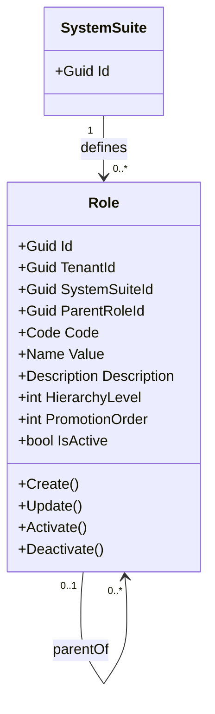

# Role - Arquitectura de Agregado

**Contexto Delimitado:** Autorizacion  
**Raiz de Agregado:** `Role`  
**Modulo:** `Ums.Domain.Authorization.Role`  
**Estado:** Produccion

## Proposito

`Role` es el catalogo maestro de responsabilidades, acotado por tenant y definido por una `SystemSuite`. Proporciona el identificador gobernado que referencian las plantillas de permisos y los perfiles, con jerarquia opcional para promocion y administracion.

## Contrato de Catalogo

| Campo | Regla |
|---|---|
| `Code` | Requerido y unico dentro de `SystemSuiteId`; codigo estable de maquina. |
| `Value` | Valor visible requerido para administradores. |
| `Description` | Explicacion funcional mantenida con el elemento del catalogo. |
| `ParentRoleId` | Rol opcional dentro de la misma suite del sistema. |
| `HierarchyLevel` | La raiz es `0`; un hijo es el nivel del padre mas uno. |
| `PromotionOrder` | Orden no negativo usado por flujos de gobierno del rol. |
| `IsActive` | Estado de ciclo de vida; registros inactivos siguen siendo auditables. |

## Invariantes

1. `TenantId` y `SystemSuiteId` son limites obligatorios de propiedad.
2. Un codigo de rol no puede repetirse dentro de una suite del sistema.
3. Un rol padre debe pertenecer a la misma suite del sistema.
4. Las relaciones de padres no pueden formar ciclos.
5. Las operaciones del rol retornan fallas `Result` para condiciones de negocio; no usan excepciones para control de flujo.

## Modelo

## Contrato de Aplicacion

- Comandos: REST `POST /system-suites/{systemSuiteId}/roles`, `PUT /system-suites/{systemSuiteId}/roles/{roleId}` y endpoints de estado.
- Consulta: GraphQL `rolesBySystemSuite(systemSuiteId)`.
- Interfaz: la pestana `Roles` pertenece al panel de detalle de la Suite del Sistema seleccionada.
- Las fallas aptas para el usuario indican la causa corregible y exponen `ErrorId` para soporte; trazas y detalles de implementacion se registran solamente mediante Serilog/Loki.

## Persistencia y Aislamiento

- Tabla SQL Server: `[ums_authorization].[Roles]`.
- Los filtros de consulta de aplicacion restringen registros por `TenantId`; los resguardos de SQL Server son controles secundarios.
- Las FK aseguran pertenencia a la suite y la relacion propia opcional al padre.

**[Volver al Indice de Autorizacion](./index.md)**
