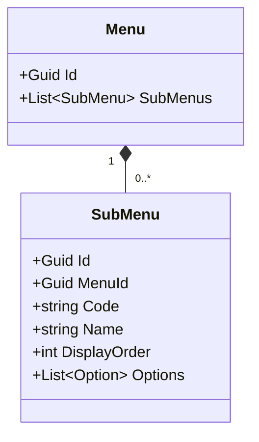
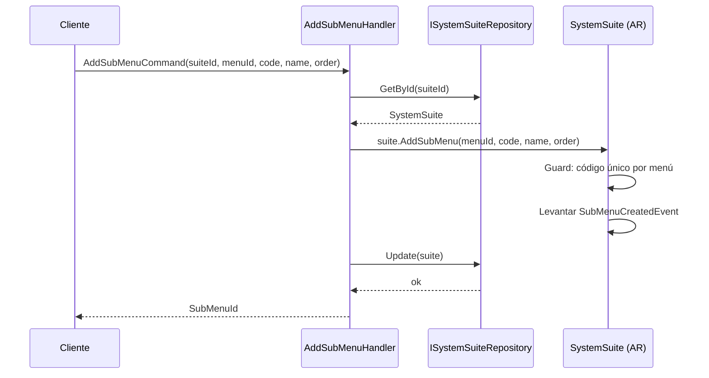
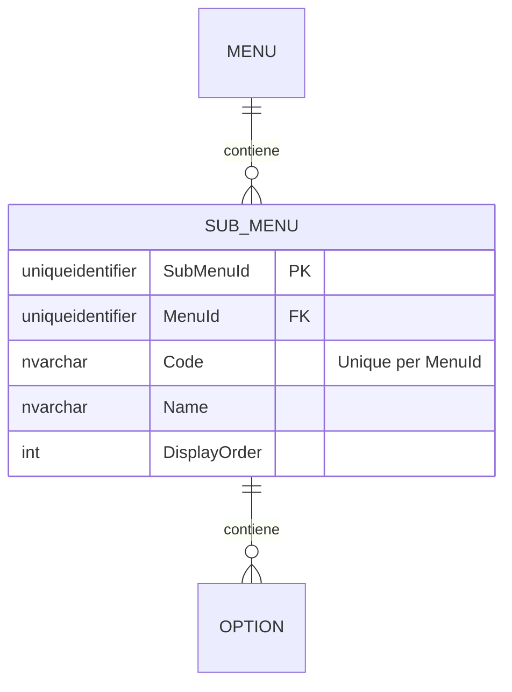

# SubMenu — Arquitectura de Entidad Propia

**Contexto Delimitado:** Autorización  
**Raíz de Agregado:** `SystemSuite` (SubMenu es una entidad propia dentro de la estructura del agregado SystemSuite)  
**Módulo:** `Ums.Domain.Authorization.SystemSuite.Module.Menu.SubMenu`  
**Estado:** Producción

---

## 1. Visión General del Agregado

### Propósito
Un `SubMenu` representa una subcategoría lógica o agrupación de opciones de pantalla dentro de un `Menu` de navegación (ej. "Actividades de Usuario" bajo "Gestión de Usuarios"). Permite anidar bellamente la estructura de diseño de sitios de portales complejos.

### Responsabilidad de Negocio
- Estructurar y agrupar Opciones de pantalla.
- Proporcionar encabezados de sección plegables dentro de los menús.

### Raíz de Agregado
`SystemSuite` (a través de Menu). Todas las mutaciones son gestionadas a través del agregado raíz `SystemSuite`.

### Invariantes y Reglas de Consistencia
1. El `Code` debe ser único dentro del `Menu` propietario.
2. Un SubMenú no puede existir sin su `Menu` padre.

### Entidades Relacionadas / Objetos de Valor
| Entidad / VO | Tipo | Propietario |
|---|---|---|
| `MenuId` | Objeto de Valor | Referencia FK al Menú padre |
| `Code` | Objeto de Valor | Identificador del SubMenu |
| `Name` | Objeto de Valor | Etiqueta de visualización |
| `Option` | Entidad | Propia (ver [option.md](./option.md)) |

### Eventos de Dominio
Los eventos se levantan en el administrador de eventos del agregado padre `SystemSuite`:
- `SubMenuCreatedEvent`
- `SubMenuUpdatedEvent`
- `SubMenuRemovedEvent`

---

## 2. Modelo de Dominio

### Clases / Entidades / Objetos de Valor
```
SystemSuite (Raíz de Agregado)
└── Module (Entidad Propia)
    └── Menu (Entidad Propia)
        └── SubMenu (Entidad Propia)
            ├── Props: SubMenuProps
            │   ├── Id: IdValueObject
            │   ├── MenuId: MenuId
            │   ├── Code: string
            │   ├── Name: string
            │   └── DisplayOrder: int
            └── Hijos
                └── IReadOnlyList<Option>
```

---

## 3. Diagramas de Modelo de Objetos



---

## 4. Diagramas de Secuencia

### Flujo para Agregar un SubMenú


---

## 5. Modelo ER



### Reglas de Aislamiento de Inquilinos
- Catálogo de configuración global. Libre de RLS.

---

## 6. Integración de Contexto Delimitado
- Actúa como metadatos de diseño para el renderizado del menú aguas abajo.

---

## 7. Capa de Aplicación
- `AddSubMenuCommand` -> Entradas: `SuiteId, MenuId, Code, Name, DisplayOrder` -> Retorna: `Guid`

---

## 8. Infraestructura/Persistencia
- Índice: Índice único en `MenuId, Code`.
- Transacción: Guardado como parte del contexto de persistencia del agregado `SystemSuite`.

---

## 9. Seguridad y Cumplimiento
- Las modificaciones requieren credenciales de `Platform:Admin`.

---

## 10. Decisiones Técnicas
- Mantener claves jerárquicas claras garantiza que las cuadrículas de navegación dinámicas se mapeen exactamente con los límites del agregado del dominio.

---

**[Volver al Índice de Autorización](./index.md)**
