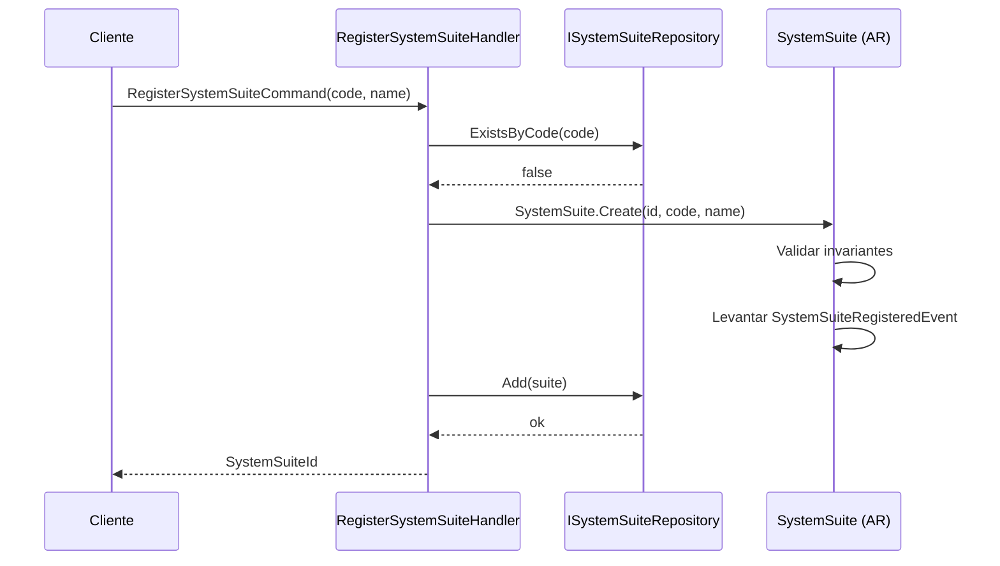
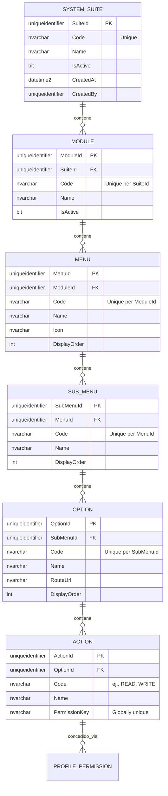
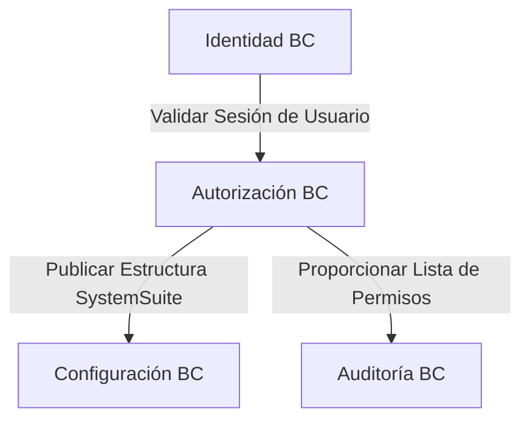

# SystemSuite — Arquitectura de Agregados

**Contexto Delimitado:** Autorización  
**Raíz de Agregado:** `SystemSuite`  
**Módulo:** `Ums.Domain.Authorization.SystemSuite`  
**Estado:** Producción

---

## 1. Visión General del Agregado

### Propósito
El agregado `SystemSuite` representa la suite de aplicaciones de software de nivel superior registrada en la plataforma UMS. Actúa como el contenedor raíz para definir los módulos funcionales, menús jerárquicos, opciones de pantalla y operaciones discretas (acciones) de la aplicación. Gobierna el registro de la aplicación, el alcance de disponibilidad para los inquilinos y sirve como la fuente de verdad arquitectónica para todos los permisos de seguridad.

### Responsabilidad de Negocio
- Registrar aplicaciones en la plataforma (ej. Portal UMS, Suite de Soporte al Cliente).
- Gestionar la topología de diseño dinámico (Modules -> Menus -> SubMenus -> Options -> Actions).
- Controlar los estados activos/inactivos de la aplicación en todo el sistema.
- Proporcionar un catálogo de sistema unificado desde el cual las plantillas de permisos y perfiles puedan seleccionar operaciones.

### Raíz de Agregado
`SystemSuite` es la raíz del agregado. Todas las actualizaciones estructurales de Módulos, Menus, SubMenus, Opciones y Acciones se orquestan a través de comandos de `SystemSuite` para garantizar la integridad estructural.

### Invariantes y Reglas de Consistencia
1. El `Code` de un SystemSuite debe ser único en toda la plataforma.
2. Una suite de aplicaciones debe estar marcada como activa para que sus elementos secundarios se representen o evalúen en las comprobaciones de permisos.
3. La jerarquía es estrictamente lineal: `SystemSuite (1:N) -> Module (1:N) -> Menu (1:N) -> SubMenu (1:N) -> Option (1:N) -> Action`.
4. La desactivación de un `SystemSuite` desactiva automáticamente todos los permisos aguas abajo.
5. Para un `Module`, el `Code` debe ser único dentro de la suite padre. Un Módulo no puede existir sin su suite padre y si la suite se desactiva, el Módulo queda no disponible.
6. Para un `Menu`, el `Code` debe ser único dentro del `Module` propietario. El estado de representación visual depende de la activación de los padres.
7. Para un `SubMenu`, el `Code` debe ser único dentro del `Menu` propietario.
8. Para una `Option`, el `Code` debe ser único dentro del `SubMenu` padre. `RouteUrl` debe seguir patrones de URI válidos y queda inaccesible si los contenedores padres están inactivos.
9. Para una `Action`, el `Code` debe ser único dentro de la `Option` propietaria. La combinación de Option Code + Action Code produce una clave de permiso globalmente única `Suite:Module:Option:Action` (ej. `UMS:IDENTITY:TENANT:WRITE`).

### Entidades Relacionadas / Objetos de Valor
| Entidad / VO | Tipo | Propietario |
|---|---|---|
| `Module` | Entidad | Propia |
| `Menu` | Entidad | Propia |
| `SubMenu` | Entidad | Propia |
| `Option` | Entidad | Propia |
| `Action` | Entidad | Propia |
| `SuiteCode` | Objeto de Valor | Código identificador alfanumérico |
| `SuiteName` | Objeto de Valor | Etiqueta de visualización de la interfaz de usuario |

### Eventos de Dominio
| Evento | Desencadenante |
|---|---|
| `SystemSuiteRegisteredEvent` | Nueva aplicación registrada en la plataforma |
| `SystemSuiteDeactivatedEvent` | Suite de aplicación desactivada |
| `SystemSuiteReactivatedEvent` | Suite de aplicación reactivada |
| `SystemSuiteStructureUpdatedEvent` | Estructura de jerarquía modificada |
| `ModuleCreatedEvent` | Módulo creado en una suite |
| `ModuleRemovedEvent` | Módulo removido de una suite |
| `ModuleUpdatedEvent` | Módulo actualizado |
| `MenuCreatedEvent` | Menú creado en un módulo |
| `MenuUpdatedEvent` | Menú actualizado |
| `MenuRemovedEvent` | Menú removido |
| `SubMenuCreatedEvent` | SubMenú creado en un menú |
| `SubMenuUpdatedEvent` | SubMenú actualizado |
| `SubMenuRemovedEvent` | SubMenú removido |
| `OptionCreatedEvent` | Opción creada en un submenú |
| `OptionUpdatedEvent` | Opción actualizada |
| `OptionRemovedEvent` | Opción removida |
| `ActionCreatedEvent` | Acción creada en una opción |
| `ActionUpdatedEvent` | Acción actualizada |
| `ActionRemovedEvent` | Acción removida |

### Comandos / Casos de Uso
| Comando | Descripción |
|---|---|
| `RegisterSystemSuiteCommand` | Registrar una nueva suite de aplicaciones |
| `DeactivateSystemSuiteCommand` | Desactivar una suite de aplicaciones |
| `ReactivateSystemSuiteCommand` | Reactivar una suite desactivada |
| `ImportSuiteTopologyCommand` | Sembrar o sobrescribir la jerarquía funcional |
| `AddModuleCommand` | Agrega un módulo a una suite |
| `RemoveModuleCommand` | Remueve un módulo |
| `UpdateModuleCommand` | Modifica los detalles de un módulo |
| `AddMenuCommand` | Agrega un menú a un módulo |
| `AddSubMenuCommand` | Agrega un submenú a un menú |
| `AddOptionCommand` | Agrega una opción a un submenú |
| `AddActionCommand` | Agrega una acción a una opción |

### Límites de Repositorio / Servicio
- `ISystemSuiteRepository` — Persiste toda la estructura del agregado `SystemSuite` en una sola transacción.
- No hay repositorios directos para entidades secundarias como Module, Menu, SubMenu, Option, o Action.

---

## 2. Modelo de Dominio

### Clases / Entidades / Objetos de Valor
```
SystemSuite (Raíz de Agregado)
├── Props: SystemSuiteProps
│   ├── Id: IdValueObject
│   ├── Code: SuiteCode
│   ├── Name: SuiteName
│   ├── IsActive: bool
│   └── Audit: AuditValueObject
└── Hijos
    └── IReadOnlyList<Module>
        └── Module
            ├── Props: ModuleProps
            │   ├── Id: IdValueObject
            │   ├── SuiteId: SuiteId
            │   ├── Code: string
            │   ├── Name: string
            │   └── IsActive: bool
            └── Hijos
                └── IReadOnlyList<Menu>
                    └── Menu
                        ├── Props: MenuProps
                        │   ├── Id: IdValueObject
                        │   ├── ModuleId: ModuleId
                        │   ├── Code: string
                        │   ├── Name: string
                        │   ├── Icon: string
                        │   └── DisplayOrder: int
                        └── Hijos
                            └── IReadOnlyList<SubMenu>
                                └── SubMenu
                                    ├── Props: SubMenuProps
                                    │   ├── Id: IdValueObject
                                    │   ├── MenuId: MenuId
                                    │   ├── Code: string
                                    │   ├── Name: string
                                    │   └── DisplayOrder: int
                                    └── Hijos
                                        └── IReadOnlyList<Option>
                                            └── Option
                                                ├── Props: OptionProps
                                                │   ├── Id: IdValueObject
                                                │   ├── SubMenuId: SubMenuId
                                                │   ├── Code: string
                                                │   ├── Name: string
                                                │   ├── RouteUrl: string
                                                │   └── DisplayOrder: int
                                                └── Hijos
                                                    └── IReadOnlyList<Action>
                                                        └── Action
                                                            ├── Props: ActionProps
                                                            │   ├── Id: IdValueObject
                                                            │   ├── OptionId: OptionId
                                                            │   ├── Code: string
                                                            │   ├── Name: string
                                                            │   └── PermissionKey: string
                                                            └── Servicios de Dominio
                                                                └── PermissionKeyGenerator
```

### Atributos Principales
| Entidad | Atributo | Tipo | Notas |
|---|---|---|---|
| `SystemSuite` | `Id` | `Guid` | PK |
| `SystemSuite` | `Code` | `string` | Identificador único |
| `SystemSuite` | `Name` | `string` | Nombre legible por humanos |
| `SystemSuite` | `IsActive` | `bool` | Flag de estado |
| `Module` | `Id` | `Guid` | PK |
| `Module` | `SuiteId` | `Guid` | FK a SystemSuite |
| `Module` | `Code` | `string` | Único por suite |
| `Menu` | `Id` | `Guid` | PK |
| `Menu` | `ModuleId` | `Guid` | FK a Module |
| `Menu` | `Icon` | `string` | Ícono visual |
| `SubMenu` | `Id` | `Guid` | PK |
| `SubMenu` | `MenuId` | `Guid` | FK a Menu |
| `Option` | `RouteUrl` | `string` | Ruta de UI |
| `Action` | `PermissionKey`| `string` | Clave calculada (Global única) |

### Campos de Ciclo de Vida / Estado
```
Active (IsActive = true) ◄──► Inactive (IsActive = false)
```

### Reglas de Validación
- `Code`: Requerido, único, en mayúsculas, alfanumérico + guiones bajos, máx 50 caracteres.
- `Name`: Requerido, máx 100 caracteres.

---

## 3. Diagramas de Modelo de Objetos

```mermaid
classDiagram
    direction TB
    class SystemSuite {
        +Guid Id
        +SuiteCode Code
        +SuiteName Name
        +bool IsActive
        +AuditValueObject Audit
        +List~Module~ Modules
        +Register()
        +Deactivate()
        +Reactivate()
    }
    class Module {
        +Guid Id
        +Guid SuiteId
        +string Code
        +string Name
        +bool IsActive
        +List~Menu~ Menus
    }
    class Menu {
        +Guid Id
        +Guid ModuleId
        +string Code
        +string Name
        +string Icon
        +int DisplayOrder
        +List~SubMenu~ SubMenus
    }
    class SubMenu {
        +Guid Id
        +Guid MenuId
        +string Code
        +string Name
        +int DisplayOrder
        +List~Option~ Options
    }
    class Option {
        +Guid Id
        +Guid SubMenuId
        +string Code
        +string Name
        +string RouteUrl
        +int DisplayOrder
        +List~Action~ Actions
    }
    class Action {
        +Guid Id
        +Guid OptionId
        +string Code
        +string Name
        +string PermissionKey
        +GetComputedKey()
    }

    SystemSuite "1" *-- "0..*" Module : contiene
    Module "1" *-- "0..*" Menu : contiene
    Menu "1" *-- "0..*" SubMenu : contiene
    SubMenu "1" *-- "0..*" Option : contiene
    Option "1" *-- "0..*" Action : contiene
```



---

## 4. Diagramas de Secuencia

### Flujo de Creación (Complejo)


---

## 5. Modelo ER



### Reglas de Aislamiento de Inquilinos
- `SYSTEM_SUITE` y sus elementos secundarios estructurales son catálogos globales de toda la plataforma. NO están aislados por inquilino porque definen las capacidades universales de la plataforma de software. Las asignaciones aguas abajo (como los Perfiles) están aisladas por inquilino mediante el campo estándar `TenantId`.

---

## 6. Integración de Contexto Delimitado



- **Aguas Arriba**: Ninguno.
- **Aguas Abajo**: Configuración, Aprobaciones, Auditoría.

---

## 7. Capa de Aplicación

### Comandos y Consultas
- `RegisterSystemSuiteCommand` -> Entrada: `Code, Name, ActorId` -> Retorna: `Guid`
- `GetSystemSuiteByIdQuery` -> Entrada: `SuiteId` -> Retorna: `SuiteDetailDto`
- `ListSystemSuitesQuery` -> Retorna: `List<SuiteSummaryDto>`
- Comandos estructurales: `AddModuleCommand`, `AddMenuCommand`, `AddSubMenuCommand`, `AddOptionCommand`, `AddActionCommand` y comandos de actualización/remoción respectivos.

---

## 8. Infraestructura/Persistencia

### Contrato de Repositorio
```csharp
public interface ISystemSuiteRepository {
    Task<SystemSuite?> GetByIdAsync(Guid id);
    Task<bool> ExistsByCodeAsync(string code);
    Task AddAsync(SystemSuite suite);
    Task UpdateAsync(SystemSuite suite);
}
```

### Índices y Límite de Transacción
- Índice: Índice único en `Code` para SystemSuite, y sus equivalentes jerárquicos (`SuiteId, Code`, etc.).
- Transacción: Toda la jerarquía (Módulos, Menús, Opciones, Acciones) se persiste dentro de una única transacción SQL como parte del agregado.

---

## 9. Seguridad y Cumplimiento

### Reglas de Autorización
- Registrar / Editar / Desactivar: Restringido exclusivamente al rol `Platform:Admin`.

### Datos Sensibles y Auditoría
- Este agregado no contiene datos sensibles de usuarios.
- Los cambios de estado (Registro, Desactivación, Adiciones Jerárquicas) producen entradas auditadas en las bitácoras centrales.
- Cumplimiento: Cualquier cambio de permiso (Action) debe invalidar instantáneamente los perfiles de sesión almacenados en caché para las sesiones autorizadas activas.

---

## 10. Decisiones Técnicas

### Justificación del Límite
Un Monolito Modular requiere un registro limpio de su propia estructura. La consolidación de la estructura dinámica (Módulos, Menús, Opciones, Acciones) bajo `SystemSuite` permite la carga dinámica de menús y la validación de autorización sin matrices de rutas codificadas de forma rígida en la interfaz de usuario o en el API Gateway. 
Mantener claves jerárquicas claras garantiza que las cuadrículas de navegación dinámicas se mapeen exactamente con los límites del agregado del dominio.

---

**[Volver al Índice de Autorización](./index.md)**
