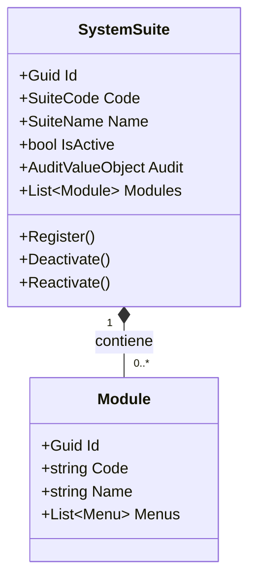
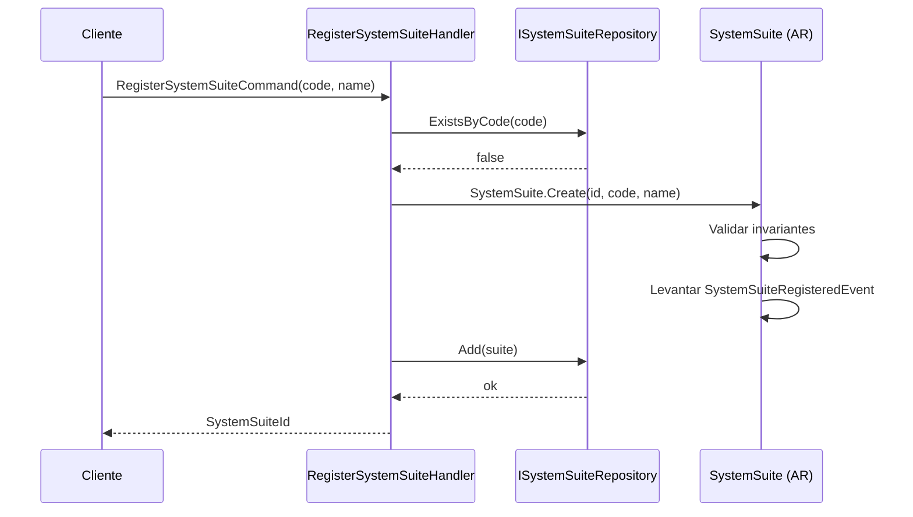
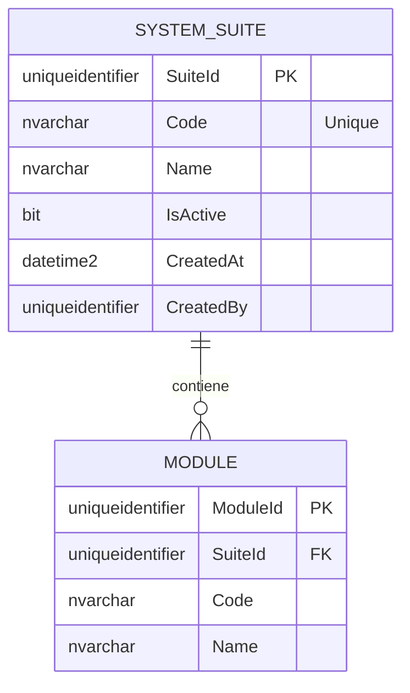
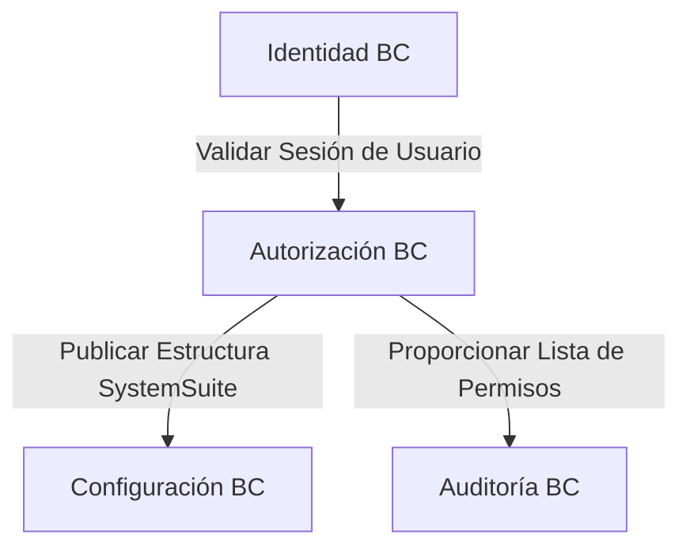

# SystemSuite — Arquitectura de Agregados

**Contexto Delimitado:** Autorización  
**Raíz de Agregado:** `SystemSuite`  
**Módulo:** `Ums.Domain.Authorization.SystemSuite`  
**Estado:** Producción

---

## 1. Visión General del Agregado

### Propósito
El agregado `SystemSuite` representa la suite de aplicaciones de software de nivel superior registrada en la plataforma UMS. Actúa como el contenedor raíz para definir los módulos funcionales, menús jerárquicos, opciones de pantalla y operaciones discretas (acciones) de la aplicación. Gobierna el registro de la aplicación, el alcance de disponibilidad para los inquilinos y sirve como la fuente de verdad arquitectónica para todos los permisos de seguridad.

### Responsabilidad de Negocio
- Registrar aplicaciones en la plataforma (ej. Portal UMS, Suite de Soporte al Cliente).
- Gestionar la topología de diseño dinámico (Modules -> Menus -> SubMenus -> Options -> Actions).
- Controlar los estados activos/inactivos de la aplicación en todo el sistema.
- Proporcionar un catálogo de sistema unificado desde el cual las plantillas de permisos y perfiles puedan seleccionar operaciones.

### Raíz de Agregado
`SystemSuite` es la raíz del agregado. Todas las actualizaciones estructurales de Módulos, Menus, Opciones y Acciones se orquestan a través de comandos de `SystemSuite` para garantizar la integridad estructural.

### Invariantes y Reglas de Consistencia
1. El `Code` de un SystemSuite debe ser único en toda la plataforma.
2. Una suite de aplicaciones debe estar marcada como activa para que sus elementos secundarios se representen o evalúen en las comprobaciones de permisos.
3. La jerarquía es estrictamente lineal: `SystemSuite (1:N) -> Module (1:N) -> Menu (1:N) -> SubMenu (1:N) -> Option (1:N) -> Action`.
4. La desactivación de un `SystemSuite` desactiva automáticamente todos los permisos aguas abajo.

### Entidades Relacionadas / Objetos de Valor
| Entidad / VO | Tipo | Propietario |
|---|---|---|
| `Module` | Entidad | Propia (ver [module.md](./module.md)) |
| `Menu` | Entidad | Propia (ver [menu.md](./menu.md)) |
| `SubMenu` | Entidad | Propia (ver [sub-menu.md](./sub-menu.md)) |
| `Option` | Entidad | Propia (ver [option.md](./option.md)) |
| `Action` | Entidad | Propia (ver [action.md](./action.md)) |
| `SuiteCode` | Objeto de Valor | Código identificador alfanumérico |
| `SuiteName` | Objeto de Valor | Etiqueta de visualización de la interfaz de usuario |

### Eventos de Dominio
| Evento | Desencadenante |
|---|---|
| `SystemSuiteRegisteredEvent` | Nueva aplicación registrada en la plataforma |
| `SystemSuiteDeactivatedEvent` | Suite de aplicación desactivada |
| `SystemSuiteReactivatedEvent` | Suite de aplicación reactivada |
| `SystemSuiteStructureUpdatedEvent` | Estructura de jerarquía modificada |

### Comandos / Casos de Uso
| Comando | Descripción |
|---|---|
| `RegisterSystemSuiteCommand` | Registrar una nueva suite de aplicaciones |
| `DeactivateSystemSuiteCommand` | Desactivar una suite de aplicaciones |
| `ReactivateSystemSuiteCommand` | Reactivar una suite desactivada |
| `ImportSuiteTopologyCommand` | Sembrar o sobrescribir la jerarquía funcional |

### Límites de Repositorio / Servicio
- `ISystemSuiteRepository` — Persiste toda la estructura del agregado `SystemSuite` en una sola transacción.
- No hay repositorios directos para entidades secundarias como Module o Menu.

---

## 2. Modelo de Dominio

### Clases / Entidades / Objetos de Valor
```
SystemSuite (Raíz de Agregado)
├── Props: SystemSuiteProps
│   ├── Id: IdValueObject
│   ├── Code: SuiteCode
│   ├── Name: SuiteName
│   ├── IsActive: bool
│   └── Audit: AuditValueObject
└── Hijos
    └── IReadOnlyList<Module>
```

### Atributos Principales
| Atributo | Tipo | Notas |
|---|---|---|
| `Id` | `Guid` | PK |
| `Code` | `string` | Identificador único |
| `Name` | `string` | Nombre legible por humanos |
| `IsActive` | `bool` | Flag de estado |

### Campos de Ciclo de Vida / Estado
```
Active (IsActive = true) ◄──► Inactive (IsActive = false)
```

### Reglas de Validación
- `Code`: Requerido, único, en mayúsculas, alfanumérico + guiones bajos, máx 50 caracteres.
- `Name`: Requerido, máx 100 caracteres.

---

## 3. Diagramas de Modelo de Objetos



---

## 4. Diagramas de Secuencia

### Flujo de Creación


---

## 5. Modelo ER



### Reglas de Aislamiento de Inquilinos
- `SYSTEM_SUITE` y sus elementos secundarios estructurales son catálogos globales de toda la plataforma. NO están aislados por inquilino porque definen las capacidades universales de la plataforma de software. Las asignaciones aguas abajo (como los Perfiles) están aisladas por inquilino mediante el campo estándar `TenantId`.

---

## 6. Integración de Contexto Delimitado



- **Aguas Arriba**: Ninguno.
- **Aguas Abajo**: Configuración, Aprobaciones, Auditoría.

---

## 7. Capa de Aplicación

### Comandos y Consultas
- `RegisterSystemSuiteCommand` -> Entrada: `Code, Name, ActorId` -> Retorna: `Guid`
- `GetSystemSuiteByIdQuery` -> Entrada: `SuiteId` -> Retorna: `SuiteDetailDto`
- `ListSystemSuitesQuery` -> Retorna: `List<SuiteSummaryDto>`

---

## 8. Infraestructura/Persistencia

### Contrato de Repositorio
```csharp
public interface ISystemSuiteRepository {
    Task<SystemSuite?> GetByIdAsync(Guid id);
    Task<bool> ExistsByCodeAsync(string code);
    Task AddAsync(SystemSuite suite);
    Task UpdateAsync(SystemSuite suite);
}
```

### Índices y Límite de Transacción
- Índice: Índice único en `Code`.
- Transacción: Toda la jerarquía (Módulos, Menús, Opciones, Acciones) se persiste dentro de una única transacción SQL.

---

## 9. Seguridad y Cumplimiento

### Reglas de Autorización
- Registrar / Editar / Desactivar: Restringido exclusivamente al rol `Platform:Admin`.

### Datos Sensibles y Auditoría
- Este agregado no contiene datos sensibles de usuarios.
- Los cambios de estado (Registro, Desactivación) producen entradas auditadas en las bitácoras centrales.

---

## 10. Decisiones Técnicas

### Justificación del Límite
Un Monolito Modular requiere un registro limpio de su propia estructura. La consolidación de la estructura dinámica (Módulos, Menús, Opciones, Acciones) bajo `SystemSuite` permite la carga dinámica de menús y la validación de autorización sin matrices de rutas codificadas de forma rígida en la interfaz de usuario o en el API Gateway.

---

**[Volver al Índice de Autorización](./index.md)**
