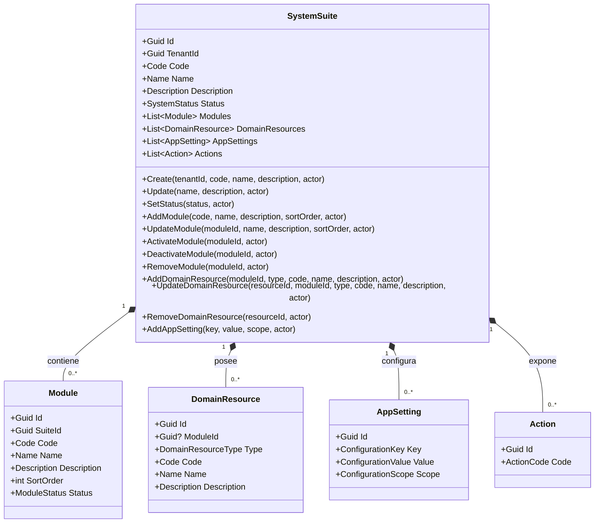
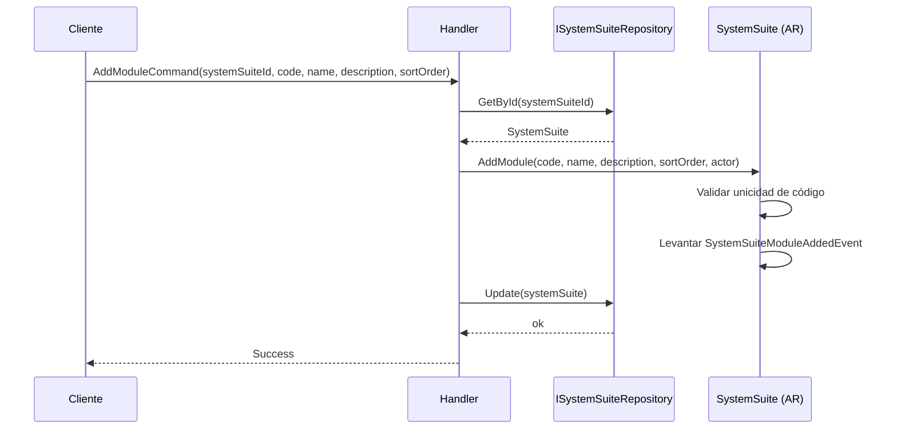
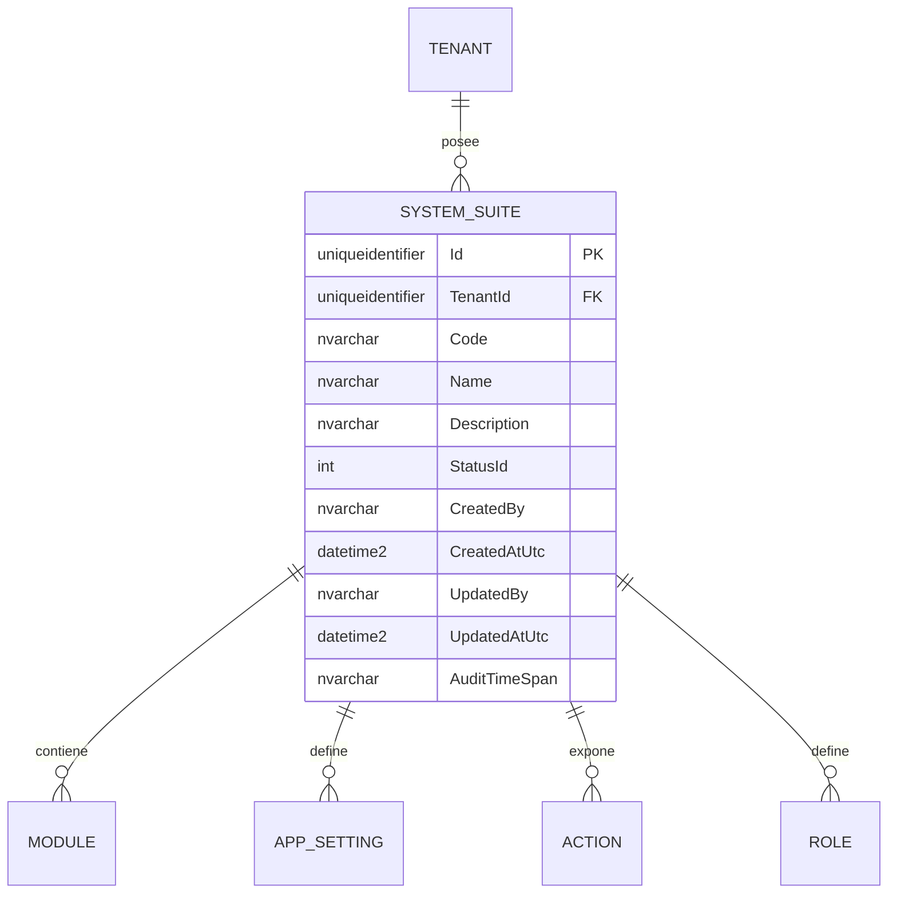

# SystemSuite — Arquitectura de Agregado

**Contexto Delimitado:** Autorización  
**Raíz de Agregado:** `SystemSuite`  
**Módulo:** `Ums.Domain.Authorization.SystemSuite`  
**Estado:** Producción

---

## 1. Visión General del Agregado

### Propósito
El agregado `SystemSuite` representa una superficie de aplicacion perteneciente a un tenant y registrada en UMS. Define la topologia funcional consumida por los modelos de autorizacion aguas abajo y almacena configuraciones operativas a nivel de suite. En la implementacion actual, posee `Module`, topologia de menus, `DomainResource` (Agregados y Entidades), `AppSetting` y `Action`. El agregado independiente `Role` se mantiene en el contexto de la suite seleccionada y la referencia mediante `SystemSuiteId`. Durante el bootstrap, `UMS` es la suite base canonica para la superficie de gestion del tenant.

### Responsabilidad de Negocio
- Registrar una suite de software asociada a un tenant.
- Mantener la identidad de la suite: `Code`, `Name`, `Description`, `Status`.
- Poseer módulos funcionales, recursos de dominio (Entidades/Agregados) y configuraciones operativas de la suite.
- Exponer la superficie de acciones consumida por `PermissionTemplate` y por los flujos de autorización efectiva.
- Definir el limite propietario del catalogo de roles mantenido por Autorizacion.
- Controlar el estado de activación mediante `SystemStatus`.

### Raíz de Agregado
`SystemSuite` es la raíz del agregado. Los cambios sobre identidad, módulos, recursos de dominio, configuraciones y estado deben pasar por la raíz.

### Invariantes y Reglas de Consistencia
1. `TenantId`, `Code`, `Name` y `Description` son obligatorios.
2. `Code` debe ser único dentro del tenant propietario.
3. `Module.Code` debe ser único dentro de la suite.
4. Las configuraciones no pueden duplicar la misma `ConfigurationKey` para el mismo `ConfigurationScope`.
5. La activación y desactivación de módulos se controla desde el agregado padre.
6. Las acciones referenciadas por plantillas de permisos aguas abajo deben pertenecer a la topología de la suite gobernada por este agregado.

### Entidades Relacionadas / Objetos de Valor
| Entidad / VO | Tipo | Propiedad | Descripción |
|---|---|---|---|
| `Module` | Entidad | Propia | Subsistema funcional dentro de la suite |
| `AppSetting` | Entidad | Propia | Configuración a nivel de suite |
| `Action` | Entidad | Propia / catalogada | Tokens de acción expuestos para targeting de autorización |
| `Role` | Raiz de Agregado | Relacionada por `SystemSuiteId` | Catalogo de responsabilidades y jerarquia definido para la suite |
| `TenantId` | Objeto de Valor | - | Límite de pertenencia del tenant |
| `Code` | Objeto de Valor | - | Identificador técnico |
| `Name` | Objeto de Valor | - | Etiqueta visible |
| `Description` | Objeto de Valor | - | Descripción funcional |
| `SystemStatus` | Enumeración | - | `Active`, `Inactive`, `Beta`, etc. |

### Eventos de Dominio
| Evento | Disparador |
|---|---|
| `SystemSuiteRegisteredEvent` | Nueva suite creada |
| `SystemSuiteStatusChangedEvent` | Cambio de estado de la suite |
| `SystemSuiteModuleAddedEvent` | Módulo agregado |
| `SystemSuiteModuleRemovedEvent` | Módulo eliminado |
| `SystemSuiteModuleStatusChangedEvent` | Módulo activado o desactivado |

---

## 2. Modelo de Dominio

```text
SystemSuite (Raíz de Agregado)
├── Props: SystemSuiteProps
│   ├── Id: IdValueObject
│   ├── TenantId: TenantId
│   ├── Code: Code
│   ├── Name: Name
│   ├── Description: Description
│   ├── Status: SystemStatus
│   └── Audit: AuditValueObject
├── Hijos
│   ├── IReadOnlyCollection<Module>
│   └── IReadOnlyCollection<AppSetting>
└── Superficie de Catálogo
    └── IReadOnlyCollection<Action>
```

---

## 3. Diagramas del Modelo de Objetos



---

## 4. Diagramas de Secuencia

### Flujo de Alta de Módulo


---

## 5. Modelo ER



### Reglas de Aislamiento por Tenant
- `SystemSuite` pertenece a un tenant en la implementación actual.
- Módulos, configuraciones y acciones heredan la pertenencia a través del límite del agregado.

---

## 6. Integración entre Contextos Delimitados
- Aguas arriba: contexto de tenant desde Identity.
- Aguas abajo: consumido por `PermissionTemplate` y por la resolución de autorización efectiva.
- Las acciones expuestas por la suite son referenciadas por plantillas y perfiles.

---

## 7. Capa de Aplicación
- `CreateSystemSuiteCommand` -> Entradas: `TenantId, Code, Name, Description` -> Retorna: `Guid`
- `UpdateSystemSuiteCommand` -> Entradas: `SystemSuiteId, Name, Description` -> Retorna: `void`
- `SetSystemSuiteStatusCommand` -> Entradas: `SystemSuiteId, Status` -> Retorna: `void`
- `CreateRoleCommand`, `UpdateRoleCommand` y `SetRoleStatusCommand` operan sobre roles bajo la suite seleccionada.
- GraphQL expone `rolesBySystemSuite(systemSuiteId)` para la pestana Roles del detalle.

---

## 8. Infraestructura / Persistencia
- Existen implementaciones de repositorio SQL Server e in-memory para modos de desarrollo y ejecucion de suite y roles.
- `[ums_authorization].[Roles]` referencia `[ums_authorization].[SystemSuites]` y soporta una FK nullable al rol padre.
- El filtrado de tenant en la aplicacion es el mecanismo primario de aislamiento.

---

## 9. Seguridad y Cumplimiento
- La definición de suites es una capacidad administrativa.
- Los cambios de módulos y estado afectan el comportamiento de autorización aguas abajo y deben auditarse.

---

## 10. Decisiones Técnicas
- `SystemSuite` pertenece a un tenant en el modelo de dominio actual, aunque documentación previa lo describiera como catálogo global.
- El agregado actual prioriza gestión de módulos, configuraciones y una superficie plana de acciones por encima de la narrativa anterior del árbol profundo de menús.

---

**[Volver al Índice de Autorización](./index.md)**
