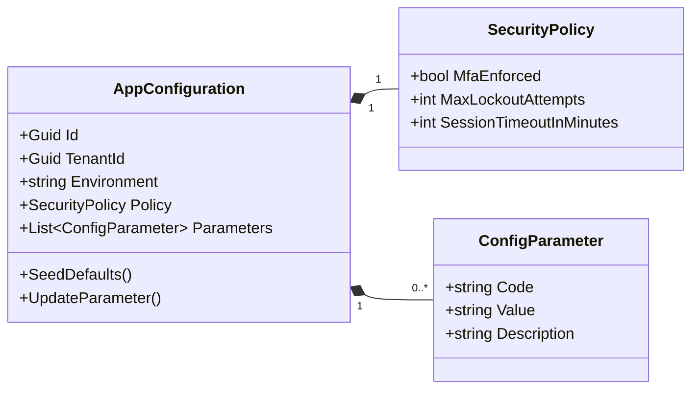
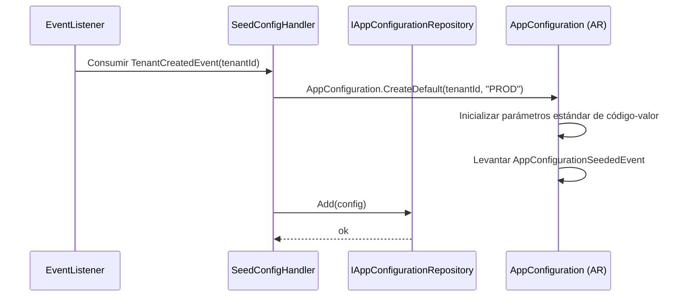
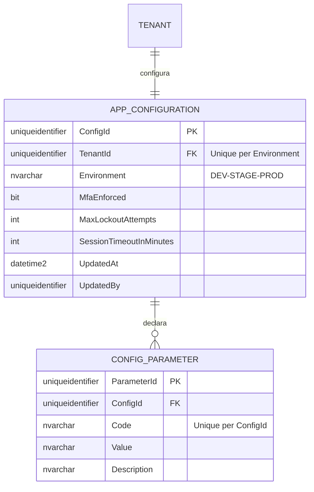

# AppConfiguration — Arquitectura de Agregados

**Contexto Delimitado:** Configuración  
**Raíz de Agregado:** `AppConfiguration`  
**Módulo:** `Ums.Domain.Configuration.AppConfiguration`  
**Estado:** Producción

---

## 1. Visión General del Agregado

### Propósito
El agregado `AppConfiguration` gobierna las configuraciones operativas y políticas específicas del inquilino en UMS. Almacena elementos de configuración como tuplas de código-valor-descripción (cumpliendo con los estándares corporativos) y controla comportamientos en tiempo de ejecución, como la duración de las sesiones de usuario, límites de bloqueo de contraseñas, parámetros de complejidad de contraseñas y reglas de cumplimiento de autenticación multifactor (MFA).

### Responsabilidad de Negocio
- Registrar y actualizar parámetros operativos personalizados para inquilinos individuales.
- Configurar políticas de seguridad corporativas (niveles de MFA, bloqueos, reglas de contraseña).
- Inicializar configuraciones predeterminadas de inquilinos de manera dinámica tras el registro de un nuevo inquilino.
- Proporcionar un catálogo estructurado y validado de flags de tiempo de ejecución y variables de entorno.

### Raíz de Agregado
`AppConfiguration` es la raíz del agregado. Todas las operaciones de parámetros de configuración deben coordinarse a través de los comandos de la raíz del agregado.

### Invariantes y Reglas de Consistencia
1. Cada parámetro de configuración debe seguir los estándares estrictos de formato `Code`, `Value` y `Description`.
2. Un Inquilino solo puede tener una hoja de configuración activa por entorno activo (ej. Desarrollo, Staging, Producción).
3. Si MFA se establece en `ENFORCED` (obligatorio), al menos un canal de MFA debe estar activo en el perfil de autenticación del inquilino.
4. `SessionTimeoutInMinutes` debe ser un número entero positivo entre 5 y 1440 (24 horas).
5. Todas las operaciones requieren un `TenantId` válido y activo.

### Entidades Relacionadas / Objetos de Valor
| Entidad / VO | Tipo | Propietario |
|---|---|---|
| `ConfigurationCode` | Objeto de Valor | Clave de parámetro alfanumérica en camelCase |
| `ConfigurationValue` | Objeto de Valor | Valor de parámetro dinámico |
| `SecurityPolicy` | Objeto de Valor | Aplica reglas de MFA, bloqueo y contraseñas |
| `AuditValueObject` | Objeto de Valor | CreatedAt/By, UpdatedAt/By |

### Eventos de Dominio
| Evento | Desencadenante |
|---|---|
| `AppConfigurationSeededEvent` | Configuraciones predeterminadas creadas para un nuevo inquilino |
| `ConfigurationParameterUpdatedEvent` | Parámetro de configuración específico modificado |
| `SecurityPolicyChangedEvent` | Ajuste de reglas de bloqueo o MFA |

### Comandos / Casos de Uso
| Comando | Descripción |
|---|---|
| `SeedDefaultTenantConfigCommand` | Inicializar valores predeterminados al registrar un inquilino |
| `UpdateConfigurationParameterCommand` | Establecer o modificar un valor de configuración |
| `UpdateSecurityPolicyCommand` | Modificar políticas de bloqueo o autenticación |

### Límites de Repositorio / Servicio
- `IAppConfigurationRepository` — Persiste la configuración delimitada por el inquilino. Todas las consultas se filtran por `TenantId`.
- No se permiten modificaciones entre diferentes inquilinos.

---

## 2. Modelo de Dominio

### Clases / Entidades / Objetos de Valor
```
AppConfiguration (Raíz de Agregado)
├── Props: AppConfigurationProps
│   ├── Id: IdValueObject
│   ├── TenantId: TenantId
│   ├── Environment: string (DEV|STAGE|PROD)
│   ├── SecurityPolicy: SecurityPolicy
│   └── Audit: AuditValueObject
└── Hijos
    └── IReadOnlyList<ConfigParameter>
```

### Reglas de Validación
- `Code`: Requerido, único por inquilino, alfanumérico en minúsculas + puntos (ej., `security.session.timeout`).
- `Value`: Validado contra las reglas del esquema de parámetros.

---

## 3. Diagramas de Modelo de Objetos



---

## 4. Diagramas de Secuencia

### Flujo de Inicialización Predeterminada


---

## 5. Modelo ER



### Reglas de Aislamiento de Inquilinos
- Todos los registros de `APP_CONFIGURATION` y `CONFIG_PARAMETER` están particionados por `TenantId`. Las consultas directas a la tabla son interceptadas por la capa de repositorios de la Aplicación para aplicar el aislamiento (R-10).

---

## 6. Integración de Contexto Delimitado
- **Aguas Arriba**: Consume `TenantCreatedEvent` del Contexto de Identidad para activar la siembra dinámica.
- **Aguas Abajo**: Los componentes de seguridad y el middleware de Autorización consultan las políticas de sesión durante la autenticación de usuarios.

---

## 7. Capa de Aplicación
- `UpdateConfigurationParameterCommand` -> Entradas: `TenantId, Code, Value, ActorId` -> Retorna: `void`

---

## 8. Infraestructura/Persistencia
- Índice: Índice único en `TenantId, Environment` y `ConfigId, Code`.
- Transacción: Las modificaciones de parámetros son atómicas dentro de la hoja de configuración del inquilino.

---

## 9. Seguridad y Cumplimiento
- Ajustar políticas de aplicación: Restringido a los roles de `Tenant:Admin`.
- Cumplimiento: Los cambios en parámetros críticos de seguridad (como las desactivaciones de MFA) requieren bitácoras de aprobación con doble firma (a través del Contexto de Aprobaciones).

---

## 10. Decisiones Técnicas
- Estandarizar las propiedades de configuración dentro de un esquema dinámico de `Code-Value` evita rígidas migraciones de esquemas de bases de datos cuando se introducen nuevas características del cliente de interfaz de usuario.

---

**[Volver al Índice de Configuración](./index.md)**
