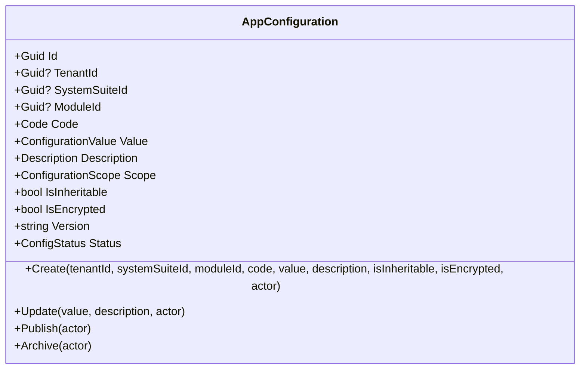
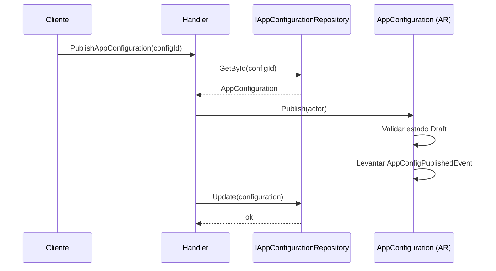
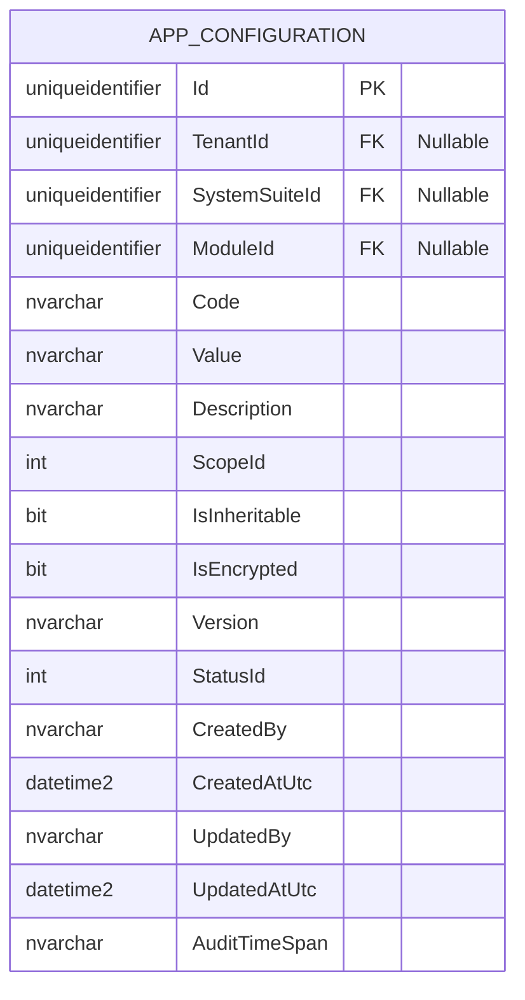

# AppConfiguration — Arquitectura de Agregado

**Contexto Delimitado:** Configuración  
**Raíz de Agregado:** `AppConfiguration`  
**Módulo:** `Ums.Domain.Configuration.AppConfiguration`  
**Estado:** Producción

---

## 1. Visión General del Agregado

### Propósito
El agregado `AppConfiguration` representa una entrada individual de configuración jerárquica en UMS. Sigue el patrón corporativo obligatorio `code / value / description` y puede quedar acotado globalmente, por tenant, por suite o por módulo.

### Responsabilidad de Negocio
- Persistir entradas de configuración con significado explícito de negocio.
- Resolver y preservar el alcance de configuración.
- Soportar banderas de herencia y cifrado.
- Controlar el ciclo de vida desde draft a published y archived.
- Versionar cambios de configuración a lo largo del tiempo.

### Raíz de Agregado
`AppConfiguration` es una raíz de agregado independiente. Cada fila de configuración se administra de forma autónoma.

### Invariantes y Reglas de Consistencia
1. Toda entrada debe contener `Code`, `Value` y `Description`.
2. El alcance se deriva de la presencia de `TenantId`, `SystemSuiteId` y `ModuleId`.
3. Las nuevas configuraciones nacen en `Draft`.
4. Solo las configuraciones draft pueden actualizarse o publicarse.
5. Solo las configuraciones published pueden archivarse.
6. Las actualizaciones incrementan la versión semántica.

### Entidades Relacionadas / Objetos de Valor
| Entidad / VO | Tipo | Propiedad |
|---|---|---|
| `AppConfigurationId` | Objeto de Valor | Identificador del agregado |
| `TenantId` | Objeto de Valor | Alcance opcional por tenant |
| `SystemSuiteId` | Objeto de Valor | Alcance opcional por suite |
| `IdValueObject` | Objeto de Valor | Alcance opcional por módulo |
| `Code` | Objeto de Valor | Clave técnica |
| `ConfigurationValue` | Objeto de Valor | Valor operacional |
| `Description` | Objeto de Valor | Significado funcional |
| `ConfigurationScope` | Enumeración | `Global`, `Tenant`, `Suite`, `Module` |
| `ConfigStatus` | Enumeración | `Draft`, `Published`, `Archived` |

### Eventos de Dominio
| Evento | Disparador |
|---|---|
| `AppConfigCreatedEvent` | Nueva configuración creada |
| `AppConfigUpdatedEvent` | Configuración draft actualizada |
| `AppConfigPublishedEvent` | Configuración publicada |
| `AppConfigArchivedEvent` | Configuración archivada |

---

## 2. Modelo de Dominio

```text
AppConfiguration (Raíz de Agregado)
└── Props: AppConfigurationProps
    ├── Id: IdValueObject
    ├── TenantId?: TenantId
    ├── SystemSuiteId?: SystemSuiteId
    ├── ModuleId?: IdValueObject
    ├── Code: Code
    ├── Value: ConfigurationValue
    ├── Description: Description
    ├── Scope: ConfigurationScope
    ├── IsInheritable: bool
    ├── IsEncrypted: bool
    ├── Version: string
    ├── Status: ConfigStatus
    └── Audit: AuditValueObject
```

---

## 3. Diagramas del Modelo de Objetos



---

## 4. Diagramas de Secuencia

### Flujo de Publicación


---

## 5. Modelo ER



### Reglas de Aislamiento por Tenant
- Las entradas globales pueden tener `TenantId` nulo.
- Las entradas por tenant, suite y módulo se resuelven mediante sus campos explícitos de alcance.

---

## 6. Integración entre Contextos Delimitados
- Consumido por la resolución de configuración en runtime.
- Puede servir comportamiento global, por tenant, por suite o por módulo.

---

## 7. Capa de Aplicación
- El agregado de dominio existe, pero la implementación de API/aplicación sigue pendiente en la base de código actual.

---

## 8. Infraestructura / Persistencia
- La persistencia en SQL Server y la exposición por API siguen pendientes para este agregado.

---

## 9. Seguridad y Cumplimiento
- `IsEncrypted` identifica entradas que deben tratarse como datos sensibles.
- `Description` debe explicar propósito, impacto, comportamiento esperado y alcance aplicable.

---

## 10. Decisiones Técnicas
- `AppConfiguration` está modelado como una entrada de configuración por agregado, no como una hoja por ambiente con hijos.
- El alcance se resuelve estructuralmente desde los campos de pertenencia y no desde una dimensión libre de ambiente.

---

**[Volver al Índice de Configuración](./index.md)**
