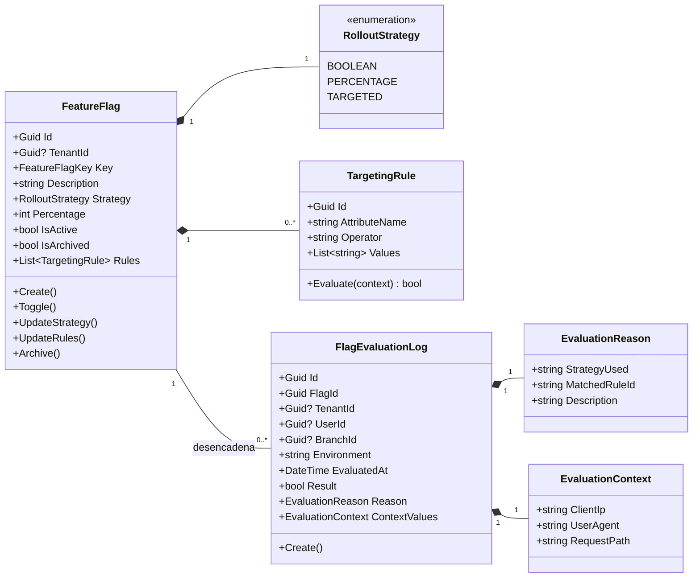
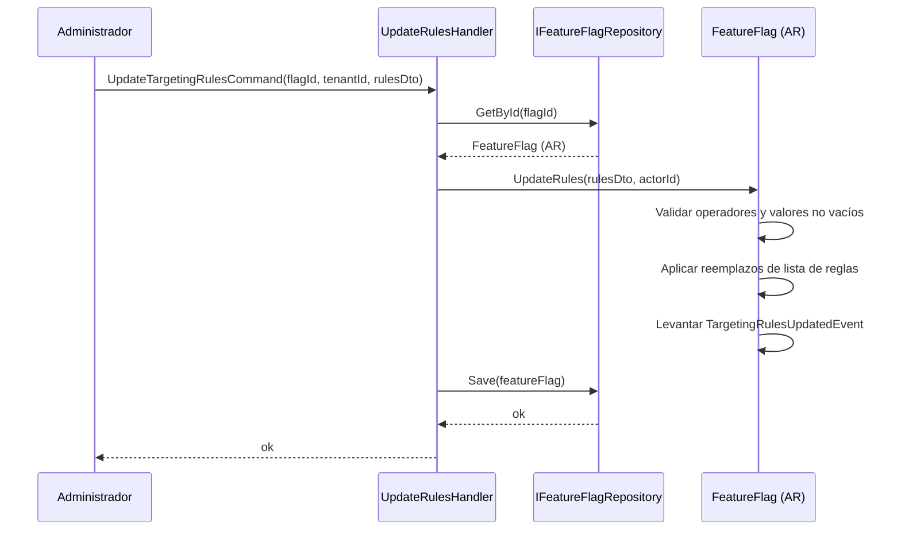
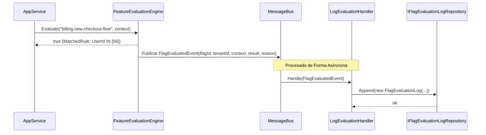
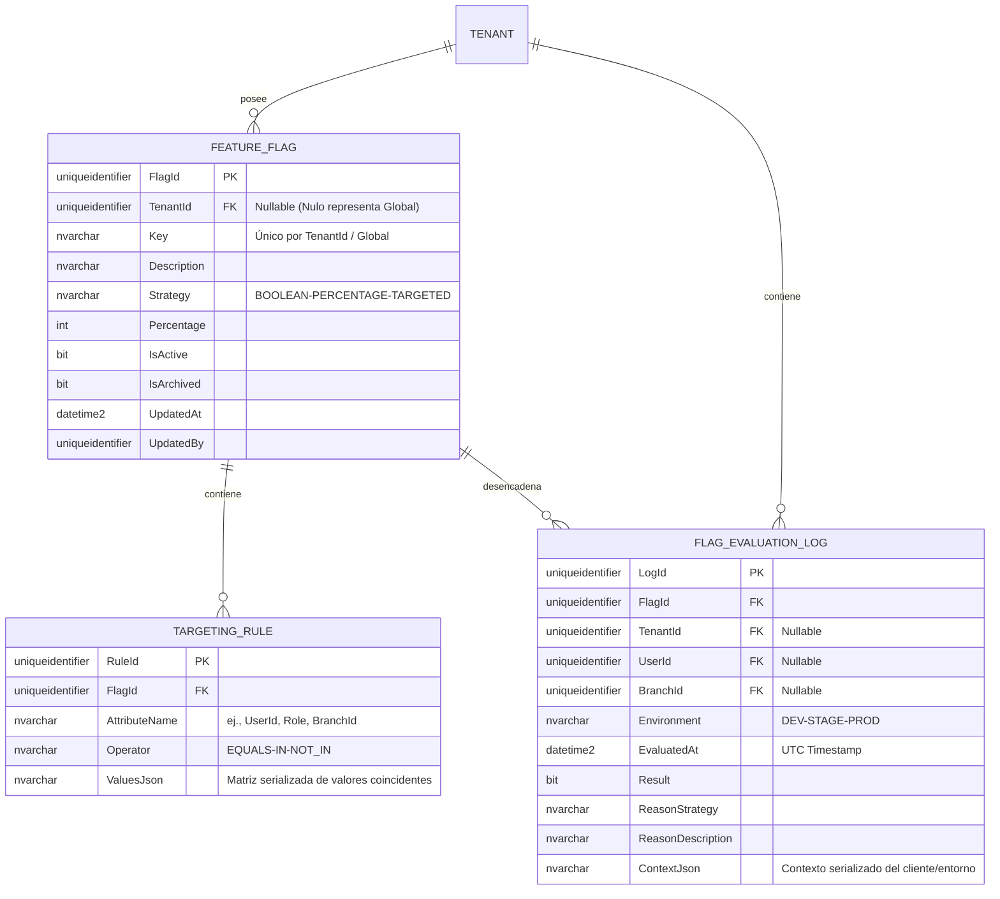

# FeatureFlag — Arquitectura de Agregados

**Contexto Delimitado:** Configuración  
**Raíz de Agregado:** `FeatureFlag`  
**Módulo:** `Ums.Domain.Configuration.FeatureFlag`  
**Estado:** Producción

---

## 1. Visión General del Agregado

### Propósito
El agregado `FeatureFlag` es el interruptor de control operativo del sistema. Define banderas de características (feature flags) y reglas a nivel de plataforma (globales) o específicas del inquilino. Estas banderas controlan rutas de código dinámicas, habilitando características como lanzamientos silenciosos (dark launches), versiones canario (canary releases), despliegues basados en porcentaje y segmentación granular. Adicionalmente, consolida la bitácora de evaluación de banderas (`FlagEvaluationLog`), sirviendo como un registro operativo inmutable y listo para auditoría que detalla por qué una bandera específica se evaluó de cierta manera en tiempo de ejecución.

### Responsabilidad de Negocio
- Registrar y definir banderas de características con identificadores únicos.
- Configurar estrategias de despliegue dinámico (alternadores booleanos, asignación de porcentajes, reglas de segmentación).
- Permitir el control administrativo (habilitar, deshabilitar, pausar) sobre las características en tiempo de ejecución.
- Mantener estados de alternancia específicos por entorno (Desarrollo, Staging, Producción).
- Aplicar segmentación basada en roles de usuario, ubicaciones de sucursales y suites del sistema.
- Registrar los valores exactos de entrada y salida de las evaluaciones de banderas en tiempo real.
- Capturar la razón técnica de la evaluación de la bandera y proveer flujos de datos para auditoría y herramientas de seguridad.

### Raíz de Agregado
`FeatureFlag` es la raíz del agregado. Todas las actualizaciones de los estados de alternancia o las reglas de evaluación dinámica deben fluir a través de los comandos de la raíz del agregado para garantizar la consistencia y validar las invariantes. El `FlagEvaluationLog` actúa como una entidad alojada en este contexto que funciona con patrón de adición exclusiva (append-only) de forma asincrónica.

### Invariantes y Reglas de Consistencia
1. Una clave de Feature Flag debe ser única. Las banderas globales (`TenantId IS NULL`) deben ser únicas en toda la plataforma. Las banderas delimitadas por inquilino deben ser únicas dentro de ese `TenantId`.
2. La clave debe seguir el formato kebab-case estricto (ej. `billing.new-checkout-flow`).
3. Para una estrategia de despliegue `PERCENTAGE` (porcentaje), el porcentaje de despliegue debe ser un número entero entre 0 y 100 inclusive.
4. Para una estrategia `TARGETED` (segmentada), debe existir al menos una regla de segmentación activa.
5. Las banderas de características activas en un entorno de producción no se pueden eliminar de forma permanente; deben archivarse.
6. `FlagEvaluationLog` es estrictamente **inmutable** y de **adición exclusiva (append-only)**. No se exponen operaciones de actualización ni eliminación.
7. Cada registro de bitácora debe hacer referencia a un `FlagId` válido y el `TenantId` del registro debe coincidir con el contexto solicitado.
8. `EvaluatedAt` en la bitácora debe representar la marca de tiempo UTC precisa.

### Entidades Relacionadas / Objetos de Valor
| Entidad / VO | Tipo | Propietario |
|---|---|---|
| `FeatureFlagId` | Objeto de Valor | Identificador de raíz de agregado basado en Guid |
| `FeatureFlagKey` | Objeto de Valor | Cadena de identificador kebab-case única y validada |
| `RolloutStrategy` | Enumerado | BOOLEAN · PERCENTAGE · TARGETED |
| `TargetingRule` | Entidad | Entidad hija propia que contiene criterios de coincidencia de reglas |
| `AuditValueObject` | Objeto de Valor | Rastrea metadatos de creación y modificación |
| `FlagEvaluationLogId` | Objeto de Valor | Identificador único de registro basado en Guid |
| `FlagEvaluationLog` | Entidad | Entidad inmutable de adición exclusiva para auditoría |
| `EvaluationContext` | Objeto de Valor | Metadatos serializados del entorno del actor solicitante |
| `EvaluationReason` | Objeto de Valor | Texto estructurado que describe la regla o lógica que desencadenó el resultado |

### Eventos de Dominio
| Evento | Desencadenante |
|---|---|
| `FeatureFlagCreatedEvent` | Se registra una nueva bandera de característica en el sistema |
| `FeatureFlagToggledEvent` | Se cambia el estado activo de una bandera (Habilitado/Deshabilitado) |
| `RolloutStrategyChangedEvent` | Se modifican los parámetros de la estrategia o del porcentaje de despliegue |
| `TargetingRulesUpdatedEvent` | Se añade, actualiza o limpia la lista de reglas segmentadas |
| `FeatureFlagArchivedEvent` | Se archiva una bandera y queda no disponible para nuevas evaluaciones |
| `FlagEvaluationLoggedEvent` | Se ha confirmado un resultado de evaluación en el almacén de bitácoras persistente |

### Comandos / Casos de Uso
| Comando / Consulta | Descripción |
|---|---|
| `CreateFeatureFlagCommand` | Registrar una nueva bandera de característica con valores predeterminados |
| `ToggleFeatureFlagCommand` | Habilitar o deshabilitar una bandera instantáneamente |
| `UpdateRolloutStrategyCommand` | Cambiar el tipo de estrategia o ajustar el porcentaje de despliegue |
| `UpdateTargetingRulesCommand` | Modificar reglas específicas para la segmentación de usuarios/sucursales |
| `ArchiveFeatureFlagCommand` | Archivar una bandera activa para evitar nuevas evaluaciones |
| `LogFlagEvaluationCommand` | Escribir un nuevo registro de evaluación inmutable en la base de datos |
| `GetFlagEvaluationLogsQuery` | Recuperar bitácoras de evaluación filtradas por Bandera, Inquilino o Usuario |

### Límites de Repositorio / Servicio
- `IFeatureFlagRepository` — Maneja la recuperación y persistencia de banderas.
- `IFlagEvaluationLogRepository` — Maneja la inserción de bitácoras de adición exclusiva y consultas de lectura.
- Los filtros de consulta añaden automáticamente el `TenantId` para aislar las banderas y bitácoras delimitadas por inquilino. Las banderas globales (`TenantId IS NULL`) son de lectura para inquilinos y exclusivas para administradores de plataforma.

---

## 2. Modelo de Dominio

### Clases / Entidades / Objetos de Valor
```text
FeatureFlag (Raíz de Agregado)
├── Props: FeatureFlagProps
│   ├── Id: FeatureFlagId
│   ├── TenantId?: TenantId
│   ├── Key: FeatureFlagKey
│   ├── Description: string
│   ├── Strategy: RolloutStrategy
│   ├── Percentage: int (0..100)
│   ├── IsActive: bool
│   ├── IsArchived: bool
│   └── Audit: AuditValueObject
└── Hijos
    └── IReadOnlyList<TargetingRule>

FlagEvaluationLog (Entidad de Auditoría)
└── Props: FlagEvaluationLogProps
    ├── Id: FlagEvaluationLogId
    ├── FlagId: FeatureFlagId
    ├── TenantId?: TenantId
    ├── UserId?: UserId
    ├── BranchId?: BranchId
    ├── Environment: string (DEV|STAGE|PROD)
    ├── EvaluatedAt: DateTime
    ├── Result: bool
    ├── Reason: EvaluationReason
    └── ContextValues: EvaluationContext
```

### Reglas de Validación
- `Key`: Expresión regular que coincide con `^[a-z0-9]+(?:-[a-z0-9]+)*(?:\.[a-z0-9]+(?:-[a-z0-9]+)*)*$`.
- `Percentage`: Requerido si la estrategia es `PERCENTAGE`, debe estar entre 0 y 100.
- `TargetingRule`: Deben tener operadores válidos (EQUALS, IN, NOT_IN) y listas no vacías.
- `FlagId` de bitácora: No debe estar vacío.
- `Environment` de bitácora: Código válido (`DEV`, `STAGE`, `PROD`).
- `EvaluatedAt`: Debe ser UTC y no futura.

---

## 3. Diagramas de Modelo de Objetos



---

## 4. Diagramas de Secuencia

### Flujo de Actualización de Reglas de Segmentación


### Flujo de Registro de Evaluación de Bandera (Evento Asíncrono)


---

## 5. Modelo ER



### Reglas de Aislamiento de Inquilinos
- Las banderas globales (`TenantId IS NULL`) son de solo lectura para los inquilinos.
- Las banderas delimitadas están aisladas por `TenantId`.
- Las bitácoras asociadas o evaluadas dentro de un contexto de inquilino se particionan estrictamente por `TenantId`. Ninguna operación puede eliminar o actualizar estos registros inmutables.

---

## 6. Integración de Contexto Delimitado
- **Aguas Arriba**: Opcionalmente recupera identificadores de Usuario, Sucursal o Rol de los contextos de Identidad y Autorización para evaluar segmentación.
- **Aguas Abajo**: Consultado por capas de enrutamiento, componentes de React y controladores de API. Alimenta a plataformas de telemetría y análisis con las bitácoras generadas para monitorear el uso de características.

---

## 7. Capa de Aplicación
- `CreateFeatureFlagCommand` -> Entradas: `TenantId?, Key, Description, Strategy, Percentage?` -> Retorna: `Guid`
- `ToggleFeatureFlagCommand` -> Entradas: `FlagId, TenantId?, IsActive` -> Retorna: `void`
- `UpdateTargetingRulesCommand` -> Entradas: `FlagId, TenantId?, List<RuleDto>` -> Retorna: `void`
- `EvaluateFeatureFlagQuery` -> Entradas: `TenantId?, Key, UserContext` -> Retorna: `EvaluationResultDto`
- `LogFlagEvaluationCommand` -> Entradas: `FlagId, TenantId?, UserId?, BranchId?, Environment, Result, Reason, Context` -> Retorna: `Guid`
- `GetFlagEvaluationLogsQuery` -> Entradas: `TenantId?, FlagId?, PageIndex, PageSize` -> Retorna: `PagedList<FlagEvaluationLogDto>`

---

## 8. Infraestructura/Persistencia
- **Índices**: Único en `TenantId, Key` para banderas de inquilino; único en `Key` para banderas globales. Índice no agrupado en `TenantId, EvaluatedAt` y `FlagId, EvaluatedAt` para consultas de registro rápidas.
- **Transacciones**: Actualizaciones de reglas son atómicas.
- **Almacenamiento (Log)**: Optimizado para alta escritura (ej., particionamiento o índice columnstore) al manejar gran volumen de bitácoras `FLAG_EVALUATION_LOG`.

---

## 9. Seguridad y Cumplimiento
- **Control de Accesos**: Banderas globales limitadas a `Platform:Admin`. Banderas de inquilino a `Tenant:Admin`.
- **Auditoría y Manipulación**: Todas las acciones se registran. La prevención de manipulación en bitácoras se aplica deshabilitando permisos `UPDATE` y `DELETE` en `FLAG_EVALUATION_LOG`.
- **Privacidad**: Atributos de contexto en el log (`ContextJson`) deben omitir información personal (PII) o datos confidenciales en texto claro.

---

## 10. Decisiones Técnicas
- Almacenar los valores de segmentación como una matriz JSON serializada (`ValuesJson`) permite emparejadores extensibles sin exceso de uniones.
- Escribir bitácoras de manera asíncrona a través de un bus de mensajes (Event-driven) protege los tiempos de latencia de las transacciones principales contra bloqueos, aislando el rendimiento del motor de evaluación.

---

**[Volver al Índice de Configuración](./index.md)**
