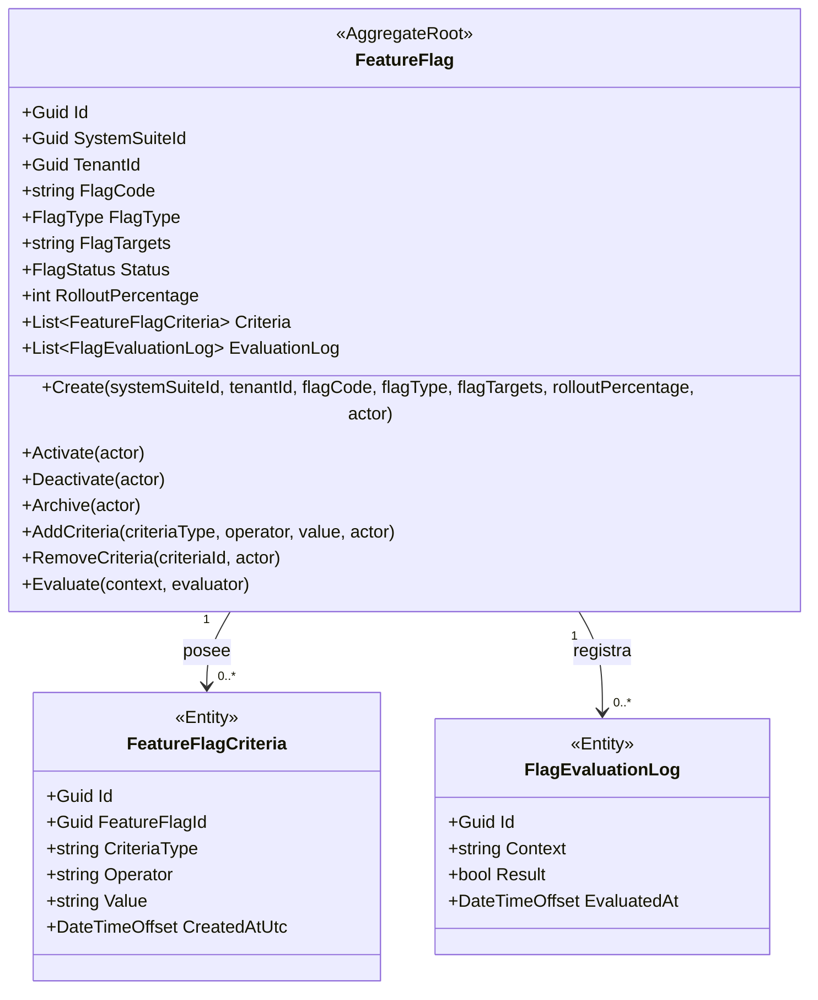
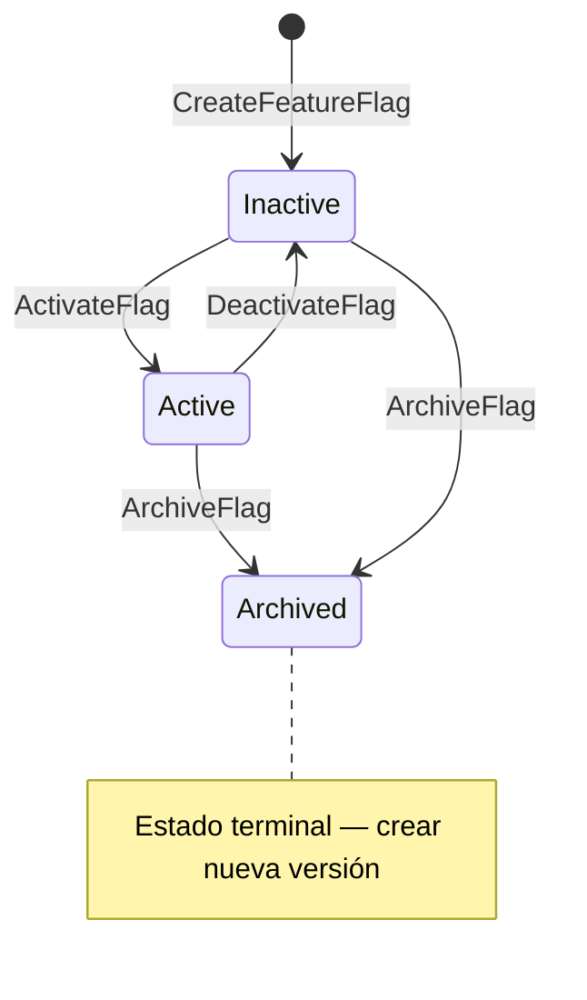
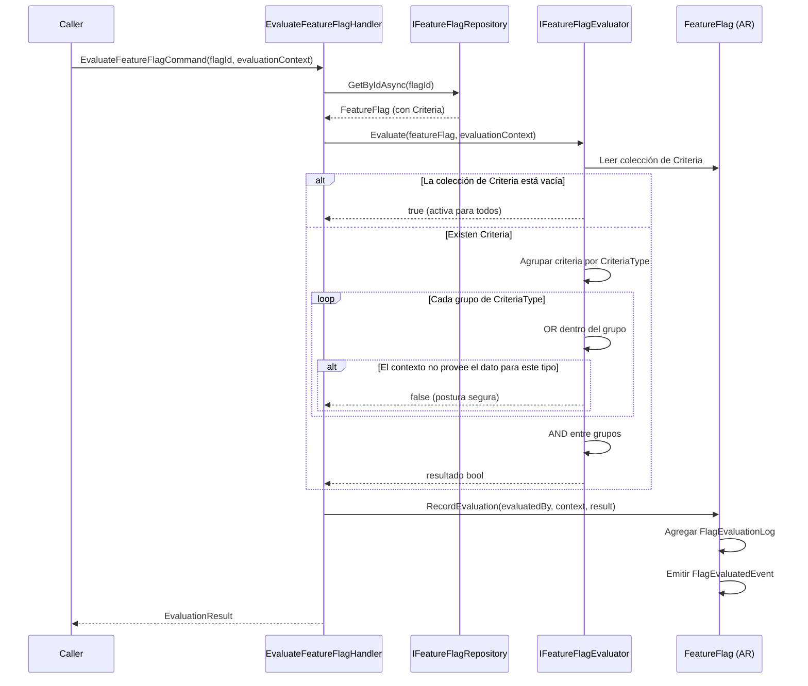
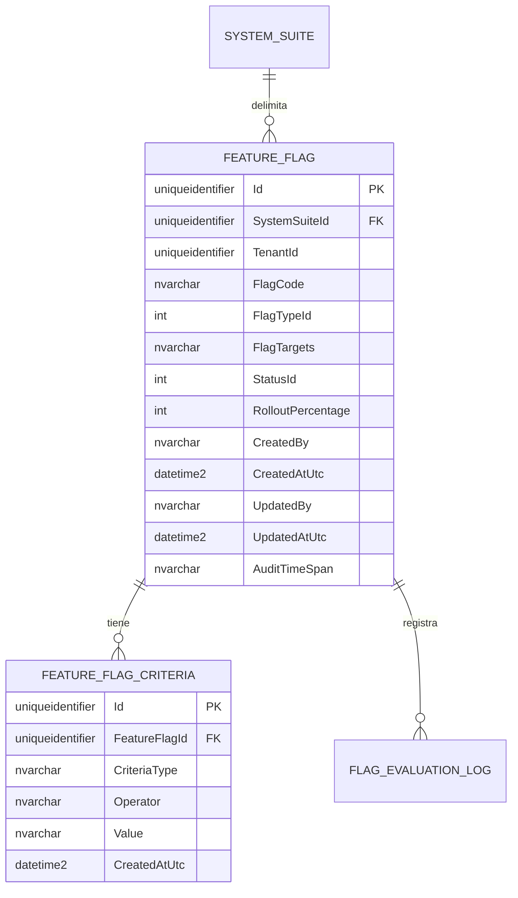

# FeatureFlag — Arquitectura de Agregado

> **Idioma:** [English](../../domain/configuration/feature-flag.md) | [Español](./feature-flag.md)

**Contexto Delimitado:** Configuración (`Ums.Domain.Configuration`)
**Raíz de Agregado:** `FeatureFlag`
**Módulo:** `Ums.Domain.Configuration.FeatureFlag`
**Estado:** Producción

---

## 1. Visión General del Agregado

### Propósito

El agregado `FeatureFlag` controla la habilitación de funcionalidades en runtime en el ámbito de un `SystemSuite` específico. Almacena un código técnico de bandera, tipo de bandera, definición de targets, una colección dinámica opcional de criterios de evaluación, porcentaje de rollout y transiciones de estado entre inactive, active y archived. Las banderas nunca son globales — cada bandera pertenece exactamente a un `SystemSuite`.

### Responsabilidad de Negocio

- Registrar switches de funcionalidades acotados a un `SystemSuite`.
- Controlar el ciclo de vida de activación, desactivación y archivado.
- Soportar semánticas de bandera booleana, por targeting o por porcentaje.
- Gestionar una colección dinámica de criterios de evaluación que determinan cuándo la bandera está activa para un contexto dado.
- Registrar historial de evaluaciones en memoria dentro de la instancia del agregado.

### Raíz de Agregado

`FeatureFlag` es la raíz del agregado. Es un agregado independiente en BC-C (Configuración). Referencia a `SystemSuite` (BC-B, Autorización) mediante la clave foránea `SystemSuiteId`, pero no es hijo del agregado `SystemSuite`. Las transiciones de estado, la gestión de criterios y el comportamiento de evaluación se coordinan a través de este agregado.

### Invariantes y Reglas de Consistencia

| ID | Regla | Fuente |
|----|-------|--------|
| INV-FF1 | `FlagCode` es único dentro de `(SystemSuiteId, FlagCode)` — no globalmente | ADR-0068 |
| INV-FF2 | Las banderas de tipo porcentaje requieren `RolloutPercentage` entre `0` y `100` | FS-08 |
| INV-FF3 | Las banderas archivadas no pueden reactivarse, desactivarse ni tener sus criterios modificados | FS-08 |
| INV-FF4 | `SystemSuiteId` es obligatorio e inmutable una vez creada la bandera | ADR-0068 |
| INV-FF5 | Los criterios de tipo `DateRange` requieren que la fecha de inicio sea estrictamente anterior a la de fin | ADR-0068 |
| INV-FF6 | No se permite una combinación duplicada de `(CriteriaType, Operator, Value)` dentro de la misma bandera | ADR-0068 |

### Entidades Relacionadas / Objetos de Valor

| Entidad / VO | Tipo | Propiedad |
|---|---|---|
| `FeatureFlagId` | Objeto de Valor | Identificador del agregado |
| `SystemSuiteId` | Objeto de Valor (ref BC-B) | Scope obligatorio; inmutable |
| `TenantId` | Objeto de Valor | Scope de tenant opcional |
| `FlagType` | Enumeración | `BOOLEAN / VARIANT / PERCENTAGE` |
| `FlagStatus` | Enumeración | `Inactive`, `Active`, `Archived` |
| `FeatureFlagCriteria` | Entidad | Criterios de evaluación pertenecientes al agregado |
| `FlagEvaluationLog` | Entidad | Historial de evaluación perteneciente al agregado |

### Eventos de Dominio

| Evento | Disparador |
|---|---|
| `FeatureFlagCreatedEvent(Guid FlagId, string FlagCode, Guid SystemSuiteId)` | Nueva bandera creada |
| `FeatureFlagActivatedEvent` | Bandera activada |
| `FeatureFlagDeactivatedEvent` | Bandera desactivada |
| `FeatureFlagArchivedEvent` | Bandera archivada |
| `FeatureFlagStateChangedEvent` | Transición de estado emitida |
| `FeatureFlagTargetingRulesUpdatedEvent(Guid FlagId, string FlagCode, Guid SystemSuiteId)` | Colección de criterios reemplazada |
| `FeatureFlagCriteriaAddedEvent(Guid FlagId, string FlagCode, string CriteriaType)` | Criterio individual agregado |
| `FeatureFlagCriteriaRemovedEvent(Guid FlagId, string FlagCode, Guid CriteriaId)` | Criterio individual eliminado |
| `FlagEvaluatedEvent` | Evaluación ejecutada en runtime |

---

## 2. Modelo de Dominio

```text
FeatureFlag (Raíz de Agregado)
├── Props: FeatureFlagProps
│   ├── Id: IdValueObject
│   ├── SystemSuiteId: IdValueObject          [NUEVO — obligatorio, inmutable]
│   ├── TenantId: IdValueObject?              [NUEVO — opcional]
│   ├── FlagCode: string                      [único dentro de SystemSuiteId]
│   ├── FlagType: FlagType
│   ├── FlagTargets: string
│   ├── Status: FlagStatus
│   ├── RolloutPercentage?: int
│   └── Audit: AuditValueObject
└── Hijos
    ├── IReadOnlyCollection<FeatureFlagCriteria>   [NUEVO]
    └── IReadOnlyCollection<FlagEvaluationLog>
```

---

## 3. Diagramas del Modelo de Objetos



---

## 4. Ciclo de Vida



**Resumen de transiciones permitidas:**

| Desde | Hacia | Comando |
|---|---|---|
| — | `Inactive` | `CreateFeatureFlagCommand` |
| `Inactive` | `Active` | `ActivateFlagCommand` |
| `Active` | `Inactive` | `DeactivateFlagCommand` |
| `Active` | `Archived` | `ArchiveFlagCommand` |
| `Inactive` | `Archived` | `ArchiveFlagCommand` |

Los criterios pueden agregarse o eliminarse mientras la bandera está en estado `Inactive` o `Active`. Las banderas archivadas rechazan todas las mutaciones.

---

## 5. Diagramas de Secuencia

### Flujo de Evaluación de Bandera



---

## 6. Modelo ER



**Restricciones de base de datos:**

- `FEATURE_FLAG`: Restricción única en `(SystemSuiteId, FlagCode)` reemplaza la restricción global anterior sobre `FlagCode`.
- `FEATURE_FLAG.SystemSuiteId`: FK hacia `ums_authorization.SystemSuites.Id`.
- `FEATURE_FLAG_CRITERIA`: Sin restricción única sobre `CriteriaType` solo — una bandera puede tener múltiples criterios del mismo tipo. Un duplicado de `(FeatureFlagId, CriteriaType, Operator, Value)` es rechazado por INV-FF6.

---

## 7. Integración entre Contextos Delimitados

`FeatureFlag` (BC-C, Configuración) referencia a `SystemSuite` (BC-B, Autorización) a través de una relación Customer-Supplier:

- **Proveedor (Supplier):** BC-B publica `SystemSuite.Id` como identificador externo estable.
- **Cliente (Customer):** BC-C almacena `SystemSuiteId` como FK y valida su existencia en el momento de la creación.
- No hay acoplamiento en tiempo de evaluación. El `SystemSuiteId` se resuelve una vez en la creación; la evaluación no llama a BC-B.

El puerto `IFeatureFlagEvaluator` se define en la capa de dominio y se implementa en la capa de infraestructura, manteniendo la lógica de evaluación libre de dependencias externas.

---

## 8. Capa de Aplicación

### Comandos

| Comando | Descripción |
|---|---|
| `CreateFeatureFlagCommand(systemSuiteId, tenantId, flagCode, flagType, flagTargets, rolloutPercentage, actor)` | Crea una nueva bandera acotada a un SystemSuite |
| `UpdateFeatureFlagCommand(flagId, flagTargets, rolloutPercentage, actor)` | Actualiza las propiedades mutables de una bandera existente |
| `ActivateFlagCommand(flagId, actor)` | Transiciona la bandera de Inactive a Active |
| `DeactivateFlagCommand(flagId, actor)` | Transiciona la bandera de Active a Inactive |
| `ArchiveFlagCommand(flagId, actor)` | Archiva la bandera (terminal) |
| `AddFeatureFlagCriteriaCommand(flagId, criteriaType, operator, value, actor)` | Agrega un único criterio de evaluación |
| `RemoveFeatureFlagCriteriaCommand(flagId, criteriaId, actor)` | Elimina un único criterio de evaluación |
| `EvaluateFeatureFlagCommand(flagId, evaluationContext, evaluatedBy)` | Evalúa la bandera contra un EvaluationContext tipado |

### Queries

| Query | Descripción |
|---|---|
| `GetFeatureFlagsBySystemSuiteQuery(systemSuiteId)` | Devuelve todas las banderas de un SystemSuite |
| `GetFeatureFlagCriteriaQuery(flagId)` | Devuelve todos los criterios de una bandera específica |
| `GetFeatureFlagByIdQuery(flagId)` | Devuelve una única bandera por identificador |

---

## 9. Infraestructura / Persistencia

Todas las tablas residen en el esquema `ums_configuration`.

| Tabla | Notas |
|---|---|
| `ums_configuration.FeatureFlags` | Almacena la raíz de agregado; FK `SystemSuiteId` referencia `ums_authorization.SystemSuites`; UK sobre `(SystemSuiteId, FlagCode)` |
| `ums_configuration.FeatureFlagCriteria` | Almacena las entidades de criterios propias; FK a `FeatureFlags.Id` con eliminación en cascada |
| `ums_configuration.FlagEvaluationLogs` | Almacena el historial de evaluaciones; FK a `FeatureFlags.Id` |

FK entre esquemas: `ums_configuration.FeatureFlags.SystemSuiteId → ums_authorization.SystemSuites.Id`. Esta FK refuerza la integridad referencial a nivel de base de datos mientras los agregados se mantienen en contextos delimitados separados.

---

## 10. Seguridad y Permisos

| Código de Permiso | Descripción |
|---|---|
| `FEATURE_FLAG_VIEW` | Leer banderas y sus criterios para un SystemSuite dado |
| `FEATURE_FLAG_CREATE` | Crear una nueva bandera dentro de un SystemSuite |
| `FEATURE_FLAG_UPDATE` | Actualizar las propiedades mutables y criterios de una bandera existente |
| `FEATURE_FLAG_TOGGLE` | Activar o desactivar una bandera (cambiar estado) |
| `FEATURE_FLAG_ARCHIVE` | Archivar una bandera (terminal; irreversible) |

---

**[Volver al Índice de Configuración](./index.md)** | **[FeatureFlagCriteria](./feature-flag-criteria.md)**
