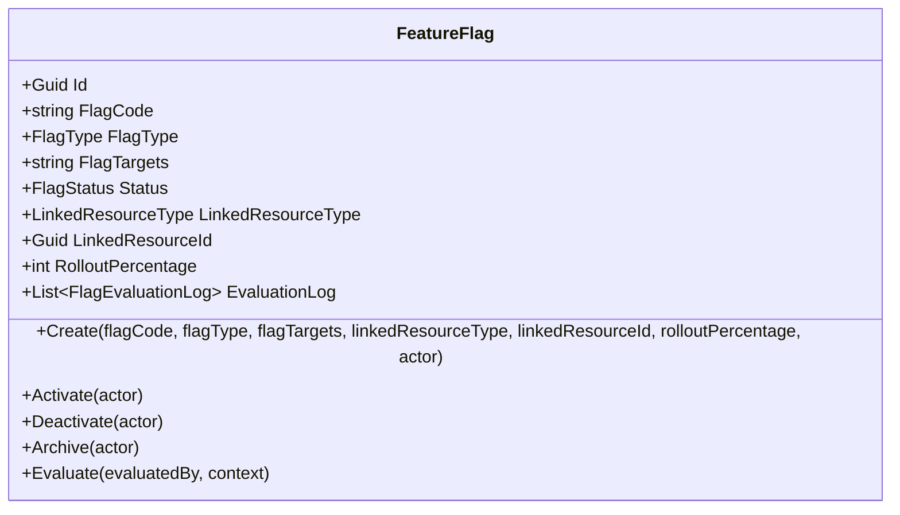
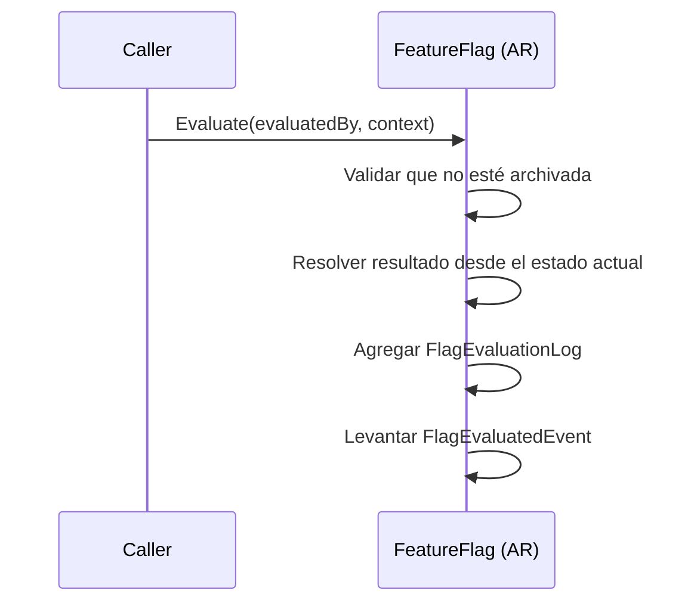
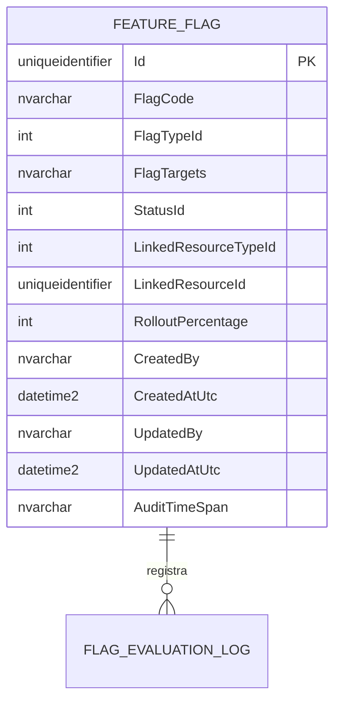

# FeatureFlag — Arquitectura de Agregado

**Contexto Delimitado:** Configuración  
**Raíz de Agregado:** `FeatureFlag`  
**Módulo:** `Ums.Domain.Configuration.FeatureFlag`  
**Estado:** Producción

---

## 1. Visión General del Agregado

### Propósito
El agregado `FeatureFlag` controla la habilitación de funcionalidades en runtime de una forma simplificada pero operativamente útil. Almacena un código técnico de bandera, tipo de bandera, definición de targets, targeting opcional por recurso enlazado, porcentaje de rollout y transiciones de estado entre inactive, active y archived.

### Responsabilidad de Negocio
- Registrar switches de funcionalidades.
- Controlar el ciclo de vida de activación, desactivación y archivado.
- Soportar semánticas de bandera booleana, por targeting o por porcentaje.
- Registrar historial de evaluaciones dentro de la instancia del agregado.

### Raíz de Agregado
`FeatureFlag` es la raíz del agregado. Las transiciones de estado y el comportamiento de evaluación se coordinan a través del agregado.

### Invariantes y Reglas de Consistencia
1. Las banderas por porcentaje requieren `RolloutPercentage` entre `0` y `100`.
2. Las banderas archivadas no pueden volver a activarse ni desactivarse.
3. Activar una bandera ya activa es inválido.
4. Desactivar una bandera ya inactiva es inválido.
5. Las nuevas banderas nacen en `Inactive`.

### Entidades Relacionadas / Objetos de Valor
| Entidad / VO | Tipo | Propiedad |
|---|---|---|
| `FeatureFlagId` | Objeto de Valor | Identificador del agregado |
| `FlagType` | Enumeración | Categoría actual del rollout |
| `FlagStatus` | Enumeración | `Inactive`, `Active`, `Archived` |
| `LinkedResourceType` | Enumeración | Targeting contextual opcional |
| `FlagEvaluationLog` | Entidad | Historial de evaluación perteneciente al agregado |

### Eventos de Dominio
| Evento | Disparador |
|---|---|
| `FeatureFlagCreatedEvent` | Nueva bandera creada |
| `FeatureFlagActivatedEvent` | Bandera activada |
| `FeatureFlagDeactivatedEvent` | Bandera desactivada |
| `FeatureFlagArchivedEvent` | Bandera archivada |
| `FeatureFlagStateChangedEvent` | Transición de estado emitida |
| `FlagEvaluatedEvent` | Evaluación ejecutada en runtime |

---

## 2. Modelo de Dominio

```text
FeatureFlag (Raíz de Agregado)
├── Props: FeatureFlagProps
│   ├── Id: IdValueObject
│   ├── FlagCode: string
│   ├── FlagType: FlagType
│   ├── FlagTargets: string
│   ├── Status: FlagStatus
│   ├── LinkedResourceType?: LinkedResourceType
│   ├── LinkedResourceId?: IdValueObject
│   ├── RolloutPercentage?: int
│   └── Audit: AuditValueObject
└── Hijos
    └── IReadOnlyCollection<FlagEvaluationLog>
```

---

## 3. Diagramas del Modelo de Objetos



---

## 4. Diagramas de Secuencia

### Flujo de Evaluación


---

## 5. Modelo ER



### Reglas de Aislamiento por Tenant
- El modelo de dominio actual no porta `TenantId` directamente en el agregado.
- El targeting multi-tenant se expresa mediante recursos enlazados y cadenas de targets en la implementación presente.

---

## 6. Integración entre Contextos Delimitados
- Puede enlazarse a recursos contextuales mediante `LinkedResourceType` y `LinkedResourceId`.
- La evaluación usa una cadena de contexto libre en la implementación actual.

---

## 7. Capa de Aplicación
- El agregado de dominio existe, pero la implementación de API/aplicación sigue pendiente en la base de código actual.

---

## 8. Infraestructura / Persistencia
- La persistencia y la exposición de modelos de lectura siguen pendientes para este agregado.

---

## 9. Seguridad y Cumplimiento
- Las banderas archivadas son terminales desde la perspectiva operativa.
- Los logs de evaluación ayudan a preservar observabilidad en runtime, aunque la implementación actual los mantiene a nivel del agregado y no como modelo analítico externo.

---

## 10. Decisiones Técnicas
- El modelo implementado actualmente es intencionalmente más simple que la documentación antigua que describía árboles avanzados de targeting y logs por ambiente.
- Este documento ahora refleja la forma implementada del dominio como verdad autoritativa.

---

**[Volver al Índice de Configuración](./index.md)**
