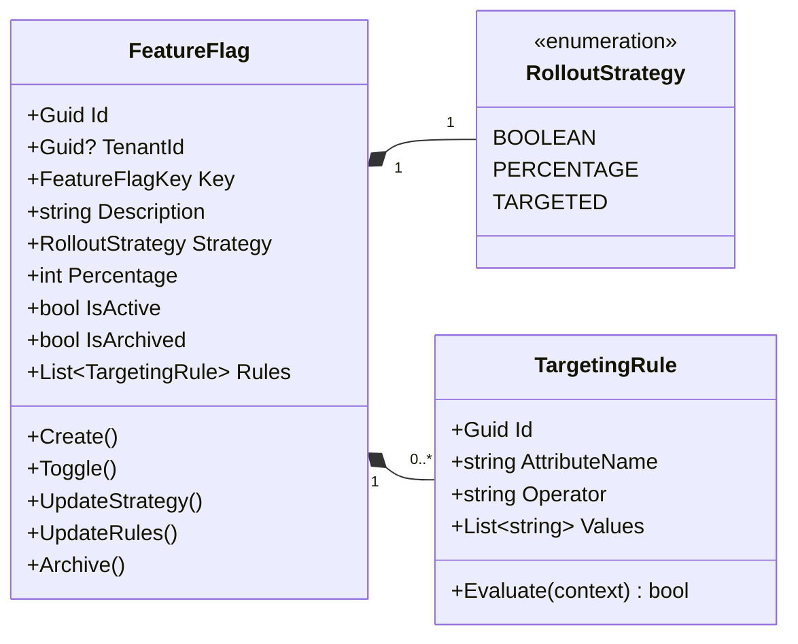
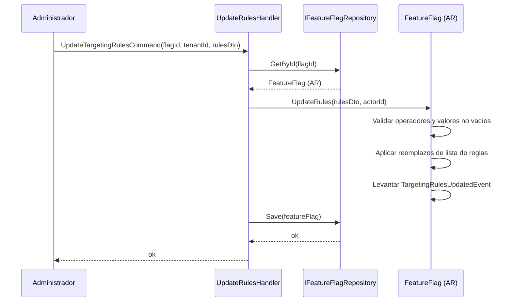
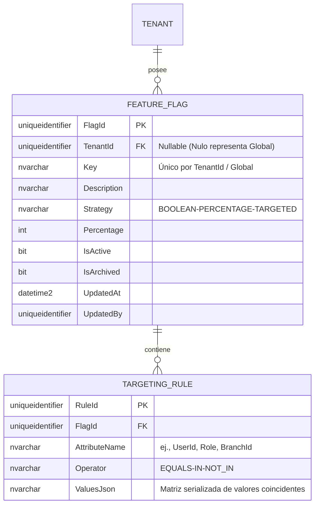

# FeatureFlag — Arquitectura de Agregados

**Contexto Delimitado:** Configuración  
**Raíz de Agregado:** `FeatureFlag`  
**Módulo:** `Ums.Domain.Configuration.FeatureFlag`  
**Estado:** Producción

---

## 1. Visión General del Agregado

### Propósito
El agregado `FeatureFlag` es el interruptor de control operativo del sistema. Define banderas de características (feature flags) y reglas a nivel de plataforma (globales) o específicas del inquilino. Estas banderas controlan rutas de código dinámicas, habilitando características como lanzamientos silenciosos (dark launches), versiones canario (canary releases), despliegues basados en porcentaje y segmentación granular por usuario o sucursal sin necesidad de redistribuir código.

### Responsabilidad de Negocio
- Registrar y definir banderas de características con identificadores únicos.
- Configurar estrategias de despliegue dinámico (alternadores booleanos, asignación de porcentajes, reglas de segmentación).
- Permitir el control administrativo (habilitar, deshabilitar, pausar) sobre las características en tiempo de ejecución.
- Mantener estados de alternancia específicos por entorno (Desarrollo, Staging, Producción).
- Aplicar segmentación basada en roles de usuario, ubicaciones de sucursales y suites del sistema.

### Raíz de Agregado
`FeatureFlag` es la raíz del agregado. Todas las actualizaciones de los estados de alternancia o las reglas de evaluación dinámica deben fluir a través de los comandos de la raíz del agregado para garantizar la consistencia y validar las invariantes.

### Invariantes y Reglas de Consistencia
1. Una clave de Feature Flag debe ser única. Las banderas globales (`TenantId IS NULL`) deben ser únicas en toda la plataforma. Las banderas delimitadas por inquilino deben ser únicas dentro de ese `TenantId`.
2. La clave debe seguir el formato kebab-case estricto (ej. `billing.new-checkout-flow`).
3. Para una estrategia de despliegue `PERCENTAGE` (porcentaje), el porcentaje de despliegue debe ser un número entero entre 0 y 100 inclusive.
4. Para una estrategia `TARGETED` (segmentada), debe existir al menos una regla de segmentación activa (ej. lista de usuarios específica, lista de sucursales o lista de roles).
5. Las banderas de características activas en un entorno de producción no se pueden eliminar de forma permanente; deben archivarse o desactivarse para mantener el contexto histórico para las bitácoras de evaluación.

### Entidades Relacionadas / Objetos de Valor
| Entidad / VO | Tipo | Propietario |
|---|---|---|
| `FeatureFlagId` | Objeto de Valor | Identificador de raíz de agregado basado en Guid |
| `FeatureFlagKey` | Objeto de Valor | Cadena de identificador kebab-case única y validada |
| `RolloutStrategy` | Enumerado | BOOLEAN · PERCENTAGE · TARGETED |
| `TargetingRule` | Entidad | Entidad hija propia que contiene criterios de coincidencia de reglas |
| `AuditValueObject` | Objeto de Valor | Rastrea metadatos de creación y modificación |

### Eventos de Dominio
| Evento | Desencadenante |
|---|---|
| `FeatureFlagCreatedEvent` | Se registra una nueva bandera de característica en el sistema |
| `FeatureFlagToggledEvent` | Se cambia el estado activo de una bandera (Habilitado/Deshabilitado) |
| `RolloutStrategyChangedEvent` | Se modifican los parámetros de la estrategia o del porcentaje de despliegue |
| `TargetingRulesUpdatedEvent` | Se añade, actualiza o limpia la lista de reglas segmentadas |
| `FeatureFlagArchivedEvent` | Se archiva una bandera y queda no disponible para nuevas evaluaciones |

### Comandos / Casos de Uso
| Comando | Descripción |
|---|---|
| `CreateFeatureFlagCommand` | Registrar una nueva bandera de característica con valores predeterminados |
| `ToggleFeatureFlagCommand` | Habilitar o deshabilitar una bandera de característica instantáneamente |
| `UpdateRolloutStrategyCommand` | Cambiar el tipo de estrategia o ajustar el porcentaje de despliegue |
| `UpdateTargetingRulesCommand` | Modificar reglas específicas para la segmentación de usuarios/sucursales |
| `ArchiveFeatureFlagCommand` | Archivar una bandera activa para evitar nuevas evaluaciones |

### Límites de Repositorio / Servicio
- `IFeatureFlagRepository` — Maneja la recuperación y persistencia de banderas.
- Los filtros de consulta añaden automáticamente el `TenantId` para banderas delimitadas por inquilino, permitiendo acceso de lectura a banderas globales (`TenantId IS NULL`).
- No se permiten operaciones de escritura entre límites de inquilinos.

---

## 2. Modelo de Dominio

### Clases / Entidades / Objetos de Valor
```
FeatureFlag (Raíz de Agregado)
├── Props: FeatureFlagProps
│   ├── Id: FeatureFlagId
│   ├── TenantId?: TenantId
│   ├── Key: FeatureFlagKey
│   ├── Description: string
│   ├── Strategy: RolloutStrategy
│   ├── Percentage: int (0..100)
│   ├── IsActive: bool
│   ├── IsArchived: bool
│   └── Audit: AuditValueObject
└── Hijos
    └── IReadOnlyList<TargetingRule>
```

### Reglas de Validación
- `Key`: Expresión regular que coincide con `^[a-z0-9]+(?:-[a-z0-9]+)*(?:\.[a-z0-9]+(?:-[a-z0-9]+)*)*$` (kebab-case estándar con anidación por puntos opcional).
- `Percentage`: Requerido si la estrategia es `PERCENTAGE`, debe estar entre 0 y 100.
- `TargetingRule`: Las reglas de coincidencia deben tener operadores válidos (EQUALS, IN, NOT_IN) y listas de criterios no vacías.

---

## 3. Diagramas de Modelo de Objetos



---

## 4. Diagramas de Secuencia

### Flujo de Actualización de Reglas de Segmentación


---

## 5. Modelo ER



### Reglas de Aislamiento de Inquilinos
- Las banderas globales (`TenantId IS NULL`) son definiciones a nivel de sistema, de solo lectura para los administradores de inquilinos.
- Las banderas delimitadas por inquilinos están aisladas por `TenantId`. Cualquier comando de modificación verifica la propiedad del inquilino.

---

## 6. Integración de Contexto Delimitado
- **Aguas Arriba**: Opcionalmente recupera identificadores de Usuario, Sucursal o Rol de los contextos delimitados de Identidad y Autorización para evaluar las reglas de segmentación.
- **Aguas Abajo**: Consultado por capas de enrutamiento, componentes de React y controladores de API.
- Los resultados de la evaluación activan entradas en `FlagEvaluationLog` dentro del mismo contexto.

---

## 7. Capa de Aplicación
- `CreateFeatureFlagCommand` -> Entradas: `TenantId?, Key, Description, Strategy, Percentage?` -> Retorna: `Guid`
- `ToggleFeatureFlagCommand` -> Entradas: `FlagId, TenantId?, IsActive` -> Retorna: `void`
- `UpdateTargetingRulesCommand` -> Entradas: `FlagId, TenantId?, List<RuleDto>` -> Retorna: `void`
- `EvaluateFeatureFlagQuery` -> Entradas: `TenantId?, Key, UserContext` -> Retorna: `EvaluationResultDto`

---

## 8. Infraestructura/Persistencia
- Índice: Índice único en `TenantId, Key` cuando `TenantId IS NOT NULL`. Índice único en `Key` cuando `TenantId IS NULL` (para banderas globales).
- Transacción: Las actualizaciones de reglas y alternancia son atómicas; guardan tanto `FEATURE_FLAG` como sus registros `TARGETING_RULE` asociados en una única transacción de base de datos.

---

## 9. Seguridad y Cumplimiento
- Banderas globales (`TenantId IS NULL`): Restringido a los roles de `Platform:Admin`.
- Banderas delimitadas por inquilino: Modificable por `Tenant:Admin` para su propio inquilino.
- Cumplimiento de Auditoría: Todas las acciones de alternancia o ediciones de reglas se registran permanentemente con identificadores de actor para satisfacer los protocolos de auditoría regulatoria.

---

## 10. Decisiones Técnicas
- Almacenar los valores de segmentación como una matriz JSON serializada (`ValuesJson`) permite emparejadores de segmentos complejos y extensibles sin sobrecargar el esquema relacional con tablas de unión excesivas.

---

**[Volver al Índice de Configuración](./index.md)**
