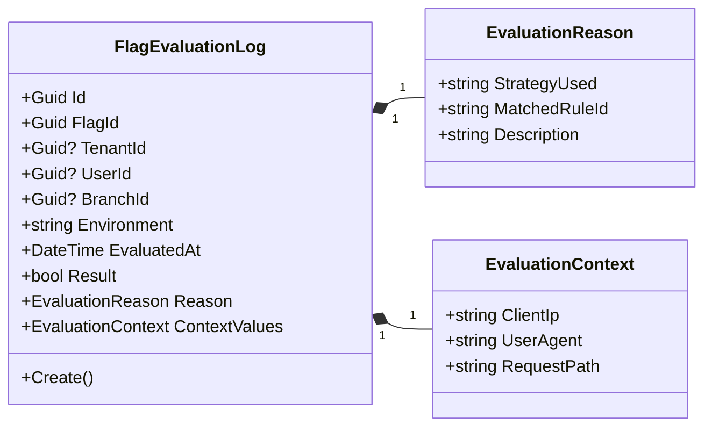
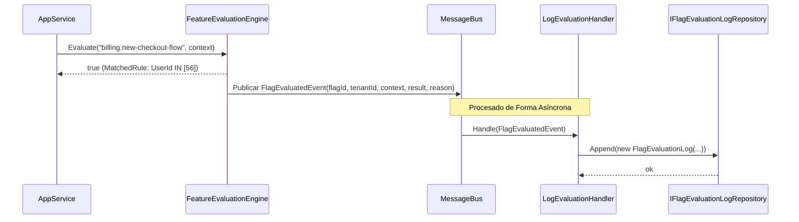
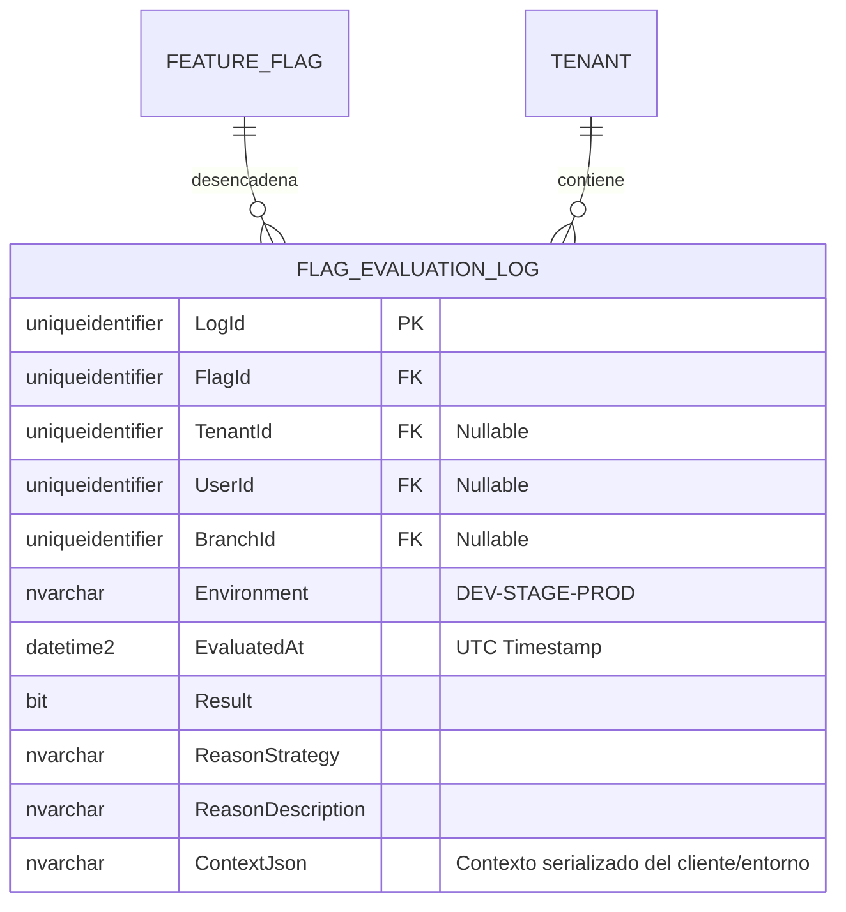

# FlagEvaluationLog — Arquitectura de Agregados y Entidades

**Contexto Delimitado:** Configuración  
**Raíz de Agregado:** `FeatureFlag` (Contenida/Propiedad física)  
**Módulo:** `Ums.Domain.Configuration.FeatureFlag.FlagEvaluationLog`  
**Estado:** Producción

---

## 1. Visión General del Agregado

### Propósito
El `FlagEvaluationLog` representa el rastro persistente de un evento de evaluación de bandera de característica (feature flag) en tiempo de ejecución. Sirve como un registro operativo inmutable y listo para auditoría que detalla por qué una bandera específica se evaluó como `true` o `false` para un usuario, sucursal o inquilino en particular. Es vital para depurar condiciones de despliegue complejas, verificar el cumplimiento del sistema y realizar auditorías de seguridad.

### Responsabilidad de Negocio
- Registrar los valores exactos de entrada y salida de las evaluaciones de banderas de características en tiempo real.
- Capturar la razón técnica de la evaluación (ej., coincidencias de reglas, cálculos de porcentaje o valores predeterminados de contingencia).
- Mantener un libro contable de adición exclusiva (append-only) de las modificaciones dinámicas del estado del sistema.
- Entregar flujos de datos para herramientas SIEM de seguridad o paneles de telemetría.

### Raíz de Agregado
En términos de DDD, `FlagEvaluationLog` es una entidad propia que pertenece al límite del contexto delimitado de `FeatureFlag`, pero se comporta como un agregado independiente de adición exclusiva para optimizar el rendimiento de la persistencia. Para maximizar el rendimiento de escritura y evitar bloqueos por concurrencia en la raíz del agregado principal `FeatureFlag`, las bitácoras de evaluación se escriben mediante un patrón asíncrono dirigido por eventos.

### Invariantes y Reglas de Consistencia
1. `FlagEvaluationLog` es estrictamente **inmutable** y de **adición exclusiva (append-only)**. No se exponen operaciones de actualización ni eliminación.
2. Cada registro de bitácora debe hacer referencia a un `FlagId` válido y existente.
3. El `TenantId` del registro de bitácora debe coincidir con el contexto de `TenantId` en el que se solicitó la evaluación.
4. `EvaluatedAt` debe representar la marca de tiempo UTC precisa en la que se resolvió la evaluación.

### Entidades Relacionadas / Objetos de Valor
| Entidad / VO | Tipo | Propietario |
|---|---|---|
| `FlagEvaluationLogId` | Objeto de Valor | Identificador único de registro basado en Guid |
| `EvaluationContext` | Objeto de Valor | Metadatos serializados del entorno del actor solicitante |
| `EvaluationReason` | Objeto de Valor | Texto estructurado que describe la regla o lógica que desencadenó el resultado |

### Eventos de Dominio
| Evento | Desencadenante |
|---|---|
| `FlagEvaluationLoggedEvent` | Se ha confirmado un resultado de evaluación en el almacén de bitácoras persistente |

### Comandos / Casos de Uso
| Comando / Consulta | Descripción |
|---|---|
| `LogFlagEvaluationCommand` | Escribir un nuevo registro de evaluación inmutable en la base de datos |
| `GetFlagEvaluationLogsQuery` | Recuperar bitácoras de evaluación filtradas por Bandera, Inquilino o Usuario |

### Límites de Repositorio / Servicio
- `IFlagEvaluationLogRepository` — Maneja la inserción de bitácoras de adición exclusiva y operaciones de consulta de solo lectura.
- Las consultas directas de inquilino se aíslan por `TenantId`. Las evaluaciones globales (`TenantId IS NULL`) son visibles por los administradores de la plataforma.

---

## 2. Modelo de Dominio

### Clases / Entidades / Objetos de Valor
```
FlagEvaluationLog (Agregado/Entidad)
└── Props: FlagEvaluationLogProps
    ├── Id: FlagEvaluationLogId
    ├── FlagId: FeatureFlagId
    ├── TenantId?: TenantId
    ├── UserId?: UserId
    ├── BranchId?: BranchId
    ├── Environment: string (DEV|STAGE|PROD)
    ├── EvaluatedAt: DateTime
    ├── Result: bool
    ├── Reason: EvaluationReason
    └── ContextValues: EvaluationContext
```

### Reglas de Validación
- `FlagId`: No debe estar vacío.
- `Environment`: Debe ser un código de entorno válido (`DEV`, `STAGE`, `PROD`).
- `EvaluatedAt`: Debe ser una fecha y hora UTC en el pasado o presente.

---

## 3. Diagramas de Modelo de Objetos



---

## 4. Diagramas de Secuencia

### Flujo de Registro de Evaluación de Bandera (Evento Asíncrono)


---

## 5. Modelo ER



### Reglas de Aislamiento de Inquilinos
- Las bitácoras asociadas con una bandera delimitada por inquilino o evaluadas dentro de un contexto de inquilino se particionan estrictamente por `TenantId`.
- Ninguna operación puede eliminar o actualizar estos registros; están protegidos por restricciones estructurales y restricciones del usuario de la base de datos.

---

## 6. Integración de Contexto Delimitado
- **Aguas Arriba**: Las banderas se consultan desde el agregado `FeatureFlag` dentro del mismo contexto.
- **Aguas Abajo**: Alimenta a plataformas de telemetría y análisis para monitorear el uso de características y las tasas de error.

---

## 7. Capa de Aplicación
- `LogFlagEvaluationCommand` -> Entradas: `FlagId, TenantId?, UserId?, BranchId?, Environment, Result, Reason, Context` -> Retorna: `Guid`
- `GetFlagEvaluationLogsQuery` -> Entradas: `TenantId?, FlagId?, PageIndex, PageSize` -> Retorna: `PagedList<FlagEvaluationLogDto>`

---

## 8. Infraestructura/Persistencia
- Índice: Índice no agrupado en `TenantId, EvaluatedAt` y `FlagId, EvaluatedAt` para consultas de diagnóstico de alta velocidad.
- Almacenamiento: En sistemas de alto volumen, esta entidad se optimiza para tablas de alta escritura (ej., tablas particionadas o índices de almacenamiento de columnas).

---

## 9. Seguridad y Cumplimiento
- Cumplimiento: La prevención de manipulación de bitácoras se aplica deshabilitando los permisos SQL de `UPDATE` y `DELETE` para el usuario de la aplicación en la tabla `FLAG_EVALUATION_LOG`.
- Datos Personales: Los atributos de contexto dinámico (`ContextJson`) deben excluir información de identificación personal (PII) como tarjetas de crédito o contraseñas en texto claro.

---

## 10. Decisiones Técnicas
- Escribir bitácoras de manera asíncrona a través de un bus de mensajes protege los tiempos de latencia de las transacciones de usuario para que no se vean afectados por la sobrecarga de telemetría al evaluar las banderas.

---

**[Volver al Índice de Configuración](./index.md)**
