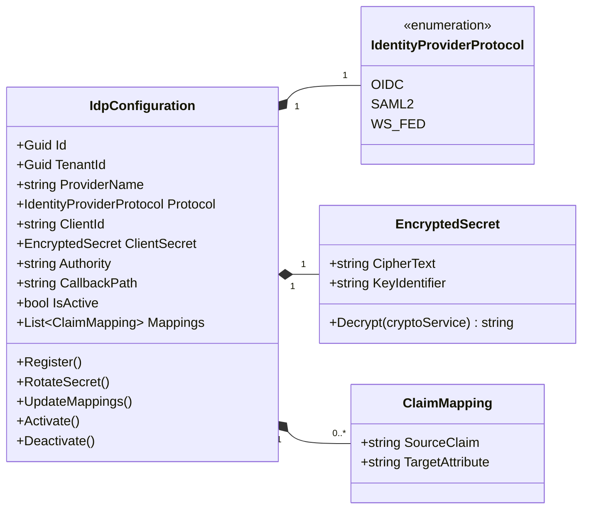
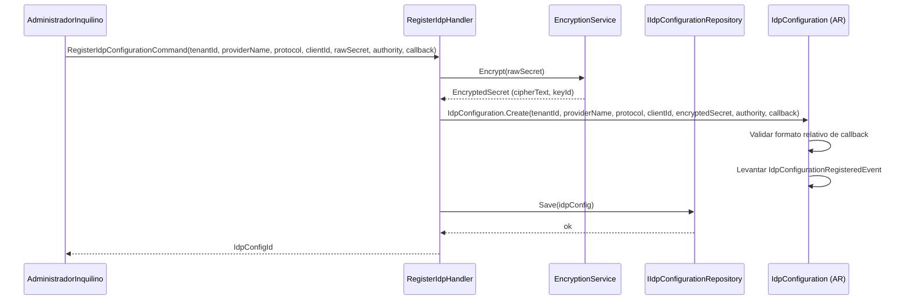
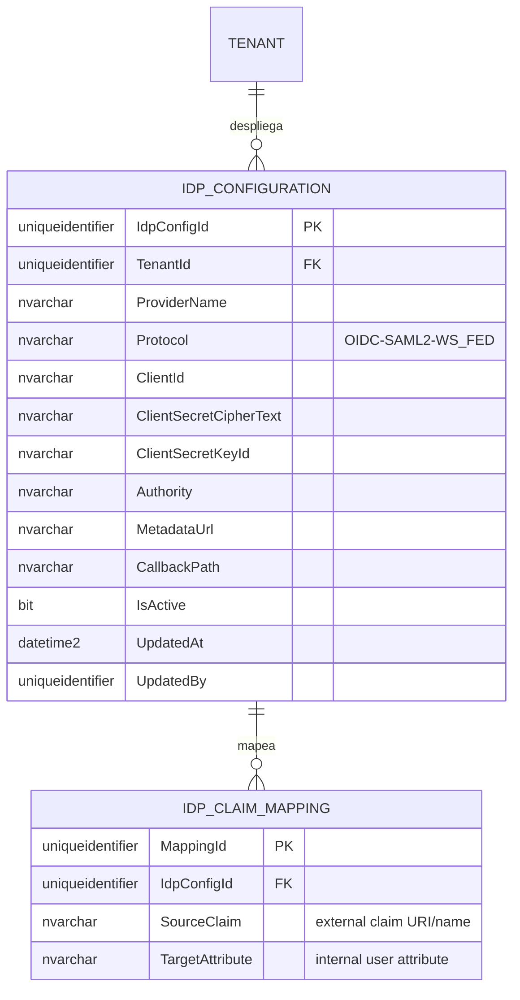

# IdpConfiguration — Arquitectura de Agregados

**Contexto Delimitado:** Configuración  
**Raíz de Agregado:** `IdpConfiguration`  
**Módulo:** `Ums.Domain.Configuration.IdpConfiguration`  
**Estado:** Producción

---

## 1. Visión General del Agregado

### Propósito
El agregado `IdpConfiguration` establece integraciones de autenticación federada para inquilinos específicos. Almacena detalles de configuración, certificados criptográficos, endpoints de redirección (callbacks) y mapeos de notificaciones (claims) personalizados para Proveedores de Identidad (IdPs) de terceros mediante estándares de la industria como OpenID Connect (OIDC) y SAML 2.0.

### Responsabilidad de Negocio
- Registrar Proveedores de Identidad de terceros (ej., Azure Active Directory, Okta, Google, Auth0) para un inquilino.
- Almacenar identificadores de cliente y cifrar de forma segura los secretos del proveedor.
- Mapear notificaciones externas (ej., correo electrónico, grupos, nombres) en perfiles y atributos internos de UMS.
- Administrar claves de certificado para la verificación de firmas en integraciones SAML.
- Controlar los canales activos de autenticación federada por inquilino.

### Raíz de Agregado
`IdpConfiguration` es la raíz del agregado. Todos los registros de proveedores, rotaciones de claves o ajustes de mapeo de notificaciones deben coordinarse a través de sus comandos.

### Invariantes y Reglas de Consistencia
1. Cada `IdpConfiguration` debe estar vinculada a un `TenantId` válido y activo. No se permite compartir configuraciones entre inquilinos.
2. El `CallbackPath` debe ser una ruta relativa válida que comience con `/` (ej., `/signin-oidc-azure`).
3. Para el protocolo `OIDC`, la URL de la autoridad (`Authority`) y el `ClientId` son obligatorios.
4. Para el protocolo `SAML2`, se requiere una URL de metadatos (`MetadataUrl`) o un certificado de firma válido.
5. Todos los secretos (`ClientSecret`, claves privadas) deben almacenarse en un formato cifrado utilizando estándares de seguridad avanzados.
6. Los mapeos de notificaciones no deben mapear múltiples notificaciones externas al mismo atributo interno del sistema para evitar conflictos de identidad.

### Entidades Relacionadas / Objetos de Valor
| Entidad / VO | Tipo | Propietario |
|---|---|---|
| `IdpConfigurationId` | Objeto de Valor | Identificador de raíz de agregado basado en Guid |
| `IdentityProviderProtocol` | Enumerado | OIDC · SAML2 · WS_FED |
| `EncryptedSecret` | Objeto de Valor | Cadena doblemente cifrada que encierra las credenciales de IdP |
| `ClaimMapping` | Objeto de Valor | Tupla de mapa que vincula notificaciones externas con atributos internos |
| `AuditValueObject` | Objeto de Valor | Rastrea metadatos de creación y modificación |

### Eventos de Dominio
| Evento | Desencadenante |
|---|---|
| `IdpConfigurationRegisteredEvent` | Una nueva integración de IdP se ha configurado con éxito |
| `IdpConfigurationActivatedEvent` | Se habilita una configuración de IdP para flujos de inicio de sesión activos |
| `IdpConfigurationDeactivatedEvent` | Se deshabilita una configuración de IdP, bloqueando inicios de sesión federados |
| `IdpConfigurationSecretRotatedEvent` | El secreto de cliente ha sido rotado y cifrado |
| `ClaimMappingsUpdatedEvent` | Se alteran los mapas de atributos de notificaciones externas a internas |

### Comandos / Casos de Uso
| Comando | Descripción |
|---|---|
| `RegisterIdpConfigurationCommand` | Configurar una nueva integración de proveedor de identidad federado |
| `RotateIdpSecretCommand` | Volver a cifrar y actualizar el Secreto de Cliente o las claves de firma |
| `UpdateClaimMappingsCommand` | Modificar el mapeo entre las notificaciones del proveedor y las propiedades de usuario internas |
| `ActivateIdpConfigurationCommand` | Establecer el estado de una integración como activo, exponiéndolo en el inicio de sesión |
| `DeactivateIdpConfigurationCommand` | Terminar inicios de sesión activos a través del proveedor específico |

### Límites de Repositorio / Servicio
- `IIdpConfigurationRepository` — Persiste y administra las configuraciones de IdP. Todas las lecturas y escrituras están estrictamente restringidas por la sesión activa de `TenantId`.

---

## 2. Modelo de Dominio

### Clases / Entidades / Objetos de Valor
```
IdpConfiguration (Raíz de Agregado)
├── Props: IdpConfigurationProps
│   ├── Id: IdpConfigurationId
│   ├── TenantId: TenantId
│   ├── ProviderName: string
│   ├── Protocol: IdentityProviderProtocol
│   ├── ClientId: string
│   ├── ClientSecret: EncryptedSecret
│   ├── Authority: string
│   ├── MetadataUrl?: string
│   ├── CallbackPath: string
│   ├── IsActive: bool
│   └── Audit: AuditValueObject
└── Objetos de Valor
    └── IReadOnlyList<ClaimMapping>
```

### Reglas de Validación
- `ProviderName`: Requerido, no vacío, alfanumérico (ej., `AzureAD`).
- `Authority`: Debe ser una URL HTTPS absoluta válida.
- `ClaimMapping`: Tanto `SourceClaim` como `TargetAttribute` deben estar poblados.

---

## 3. Diagramas de Modelo de Objetos



---

## 4. Diagramas de Secuencia

### Flujo de Registro de Configuración de IdP


---

## 5. Modelo ER



### Reglas de Aislamiento de Inquilinos
- Cada registro en `IDP_CONFIGURATION` y `IDP_CLAIM_MAPPING` está vinculado a un `TenantId` (R-10).
- Las consultas entre inquilinos están estrictamente impedidas por filtros de repositorio para evitar fugas de datos.

---

## 6. Integración de Contexto Delimitado
- **Aguas Arriba**: Depende del `TenantId` registrado en el contexto de Identidad.
- **Aguas Abajo**: Durante los inicios de sesión federados, el middleware de autenticación recupera la configuración del proveedor activo para construir el flujo de inicio de sesión externo. Las notificaciones se convierten basándose en `ClaimMapping` antes de generar los tokens JWT internos.

---

## 7. Capa de Aplicación
- `RegisterIdpConfigurationCommand` -> Entradas: `TenantId, ProviderName, Protocol, ClientId, ClientSecret, Authority, CallbackPath` -> Retorna: `Guid`
- `RotateIdpSecretCommand` -> Entradas: `IdpConfigId, TenantId, NewSecret` -> Retorna: `void`
- `UpdateClaimMappingsCommand` -> Entradas: `IdpConfigId, TenantId, List<ClaimMappingDto>` -> Retorna: `void`
- `ActivateIdpConfigurationCommand` -> Entradas: `IdpConfigId, TenantId` -> Retorna: `void`

---

## 8. Infraestructura/Persistencia
- Índice: Índice único en `TenantId, ProviderName` (un inquilino no puede tener proveedores duplicados con el mismo nombre).
- Seguridad: Las credenciales se cifran mediante AES-GCM o integraciones KMS (AWS KMS / Azure Key Vault / HashiCorp Vault) antes de persistir en SQL Server.

---

## 9. Seguridad y Cumplimiento
- Ajustar endpoints de IdP federado: Restringido a los roles de `Tenant:Admin` o superiores.
- Auditoría de cumplimiento: El enrutamiento de autenticación externa es altamente crítico. Un cambio en la autoridad emisora, los endpoints de metadatos o los mapeos de notificaciones genera alertas obligatorias y requiere verificación multifactor del administrador.

---

## 10. Decisiones Técnicas
- Persistir el mapeo de notificaciones dentro de `IDP_CLAIM_MAPPING` desacopla las estructuras de autenticación externa de las entidades principales del dominio de `UserAccount`, salvaguardando la pureza relacional.

---

**[Volver al Índice de Configuración](./index.md)**
