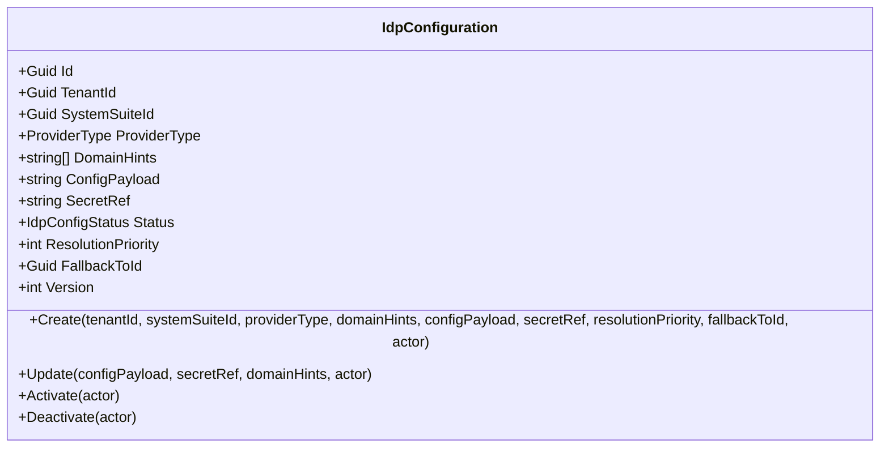
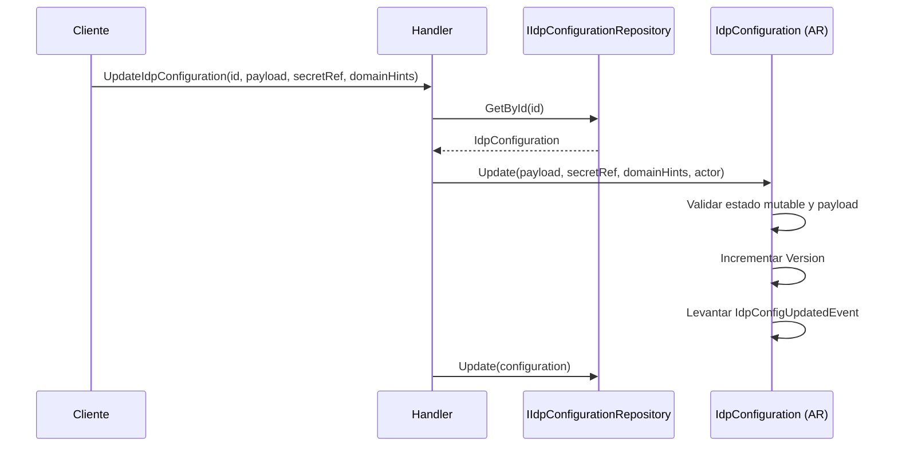
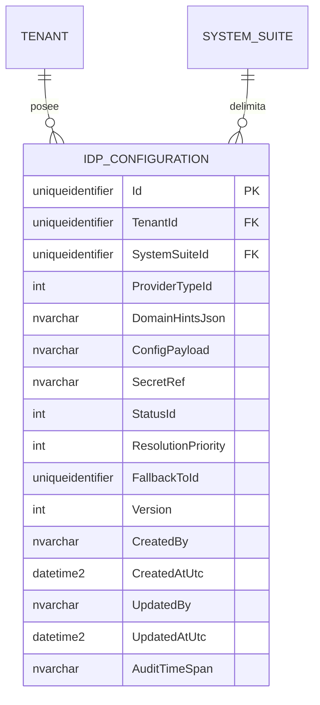

# IdpConfiguration — Arquitectura de Agregado

**Contexto Delimitado:** Configuración  
**Raíz de Agregado:** `IdpConfiguration`  
**Módulo:** `Ums.Domain.Configuration.IdpConfiguration`  
**Estado:** Producción

---

## 1. Visión General del Agregado

### Propósito
El agregado `IdpConfiguration` almacena una regla de resolución de proveedor de identidad asociada a un tenant y a una suite. Encapsula tipo de proveedor, domain hints, payload externo de configuración, referencia de secreto, estado de activación, encadenamiento por fallback, prioridad de resolución y versionado.

### Responsabilidad de Negocio
- Registrar entradas de configuración de proveedores de identidad por tenant y por suite.
- Almacenar metadata de resolución del proveedor y referencias de payload.
- Controlar el ciclo de vida de activación y desactivación.
- Permitir actualizaciones mientras la configuración siga siendo mutable.
- Soportar comportamiento de resolución ordenada con fallback.

### Raíz de Agregado
`IdpConfiguration` es la raíz del agregado. Las referencias de secreto, cambios de payload, domain hints y transiciones de ciclo de vida se coordinan a través de ella.

### Invariantes y Reglas de Consistencia
1. `TenantId`, `SystemSuiteId` y `ProviderType` son obligatorios.
2. `ConfigPayload` no puede estar vacío.
3. Las nuevas configuraciones nacen en `Draft`.
4. Solo las configuraciones `Draft` e `Inactive` pueden actualizarse.
5. Activar una configuración ya activa es inválido.
6. La desactivación solo es válida desde `Active`.
7. Toda actualización incrementa la `Version` numérica.

### Entidades Relacionadas / Objetos de Valor
| Entidad / VO | Tipo | Propiedad |
|---|---|---|
| `IdpConfigurationId` | Objeto de Valor | Identificador del agregado |
| `TenantId` | Objeto de Valor | Límite de pertenencia del tenant |
| `SystemSuiteId` | Objeto de Valor | Límite de pertenencia de la suite |
| `ProviderType` | Enumeración | Clasificación del proveedor |
| `IdpConfigStatus` | Enumeración | `Draft`, `Active`, `Inactive` |

### Eventos de Dominio
| Evento | Disparador |
|---|---|
| `IdpConfigRegisteredEvent` | Nueva configuración creada |
| `IdpConfigActivatedEvent` | Configuración activada |
| `IdpConfigDeactivatedEvent` | Configuración desactivada |
| `IdpConfigUpdatedEvent` | Configuración mutable actualizada |

---

## 2. Modelo de Dominio

```text
IdpConfiguration (Raíz de Agregado)
└── Props: IdpConfigurationProps
    ├── Id: IdValueObject
    ├── TenantId: TenantId
    ├── SystemSuiteId: SystemSuiteId
    ├── ProviderType: ProviderType
    ├── DomainHints: string[]
    ├── ConfigPayload: string
    ├── SecretRef: string
    ├── Status: IdpConfigStatus
    ├── ResolutionPriority: int
    ├── FallbackToId?: Guid
    ├── Version: int
    └── Audit: AuditValueObject
```

---

## 3. Diagramas del Modelo de Objetos



---

## 4. Diagramas de Secuencia

### Flujo de Actualización de Configuración IdP


---

## 5. Modelo ER



### Reglas de Aislamiento por Tenant
- Pertenece estrictamente al tenant mediante `TenantId`.
- Además se acota a un `SystemSuiteId` concreto.

---

## 6. Integración entre Contextos Delimitados
- Une la configuración de identidad del tenant con el comportamiento de resolución a nivel de suite.
- Puede participar en ruteo multi-proveedor mediante `ResolutionPriority` y `FallbackToId`.

---

## 7. Capa de Aplicación
- El agregado de dominio se expone mediante comandos de aplicación y endpoints REST para los flujos de creación, actualización, activación, desactivación y resolución.

---

## 8. Infraestructura / Persistencia
- La persistencia ya está implementada en SQL Server, y la capa de presentación expone los endpoints REST de este contexto.

---

## 9. Seguridad y Cumplimiento
- `SecretRef` es la referencia sensible de integración y debe resolverse mediante infraestructura segura de gestión de secretos.
- `ConfigPayload` es autoritativo para el comportamiento runtime del proveedor y debe controlarse administrativamente.

---

## 10. Decisiones Técnicas
- El modelo implementado es un agregado de resolución de proveedor consciente de la suite, no el modelo documental antiguo centrado en client-id/authority/claim-mappings.
- Este documento ahora refleja el agregado implementado actualmente como fuente de verdad.

---

**[Volver al Índice de Configuración](./index.md)**
