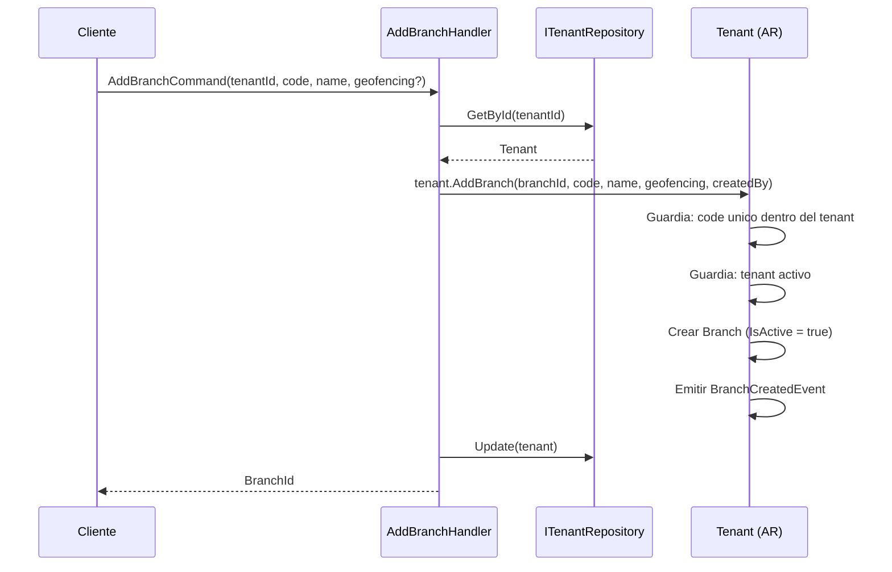
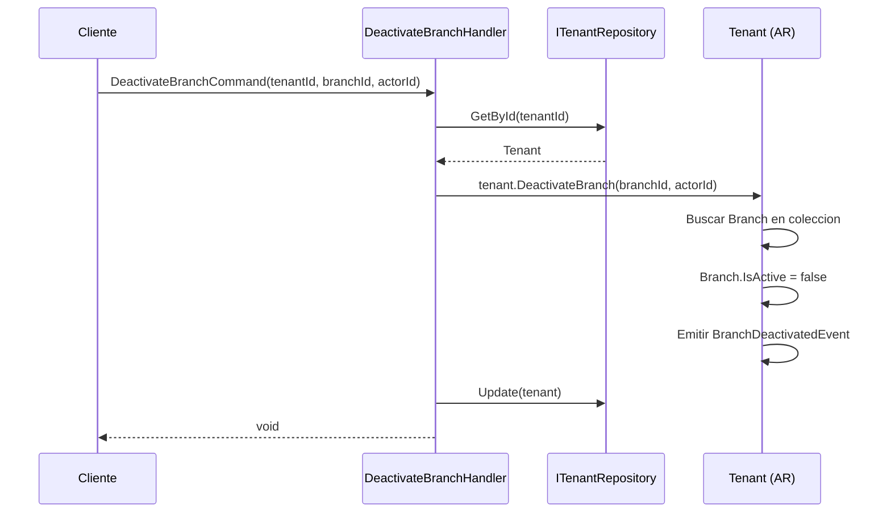
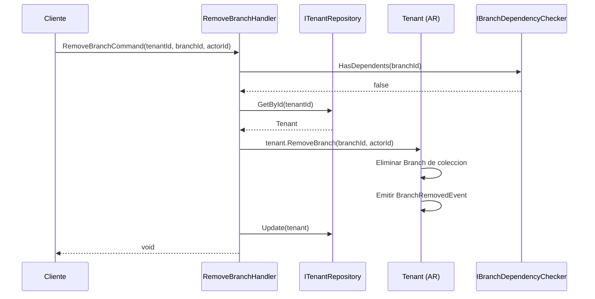
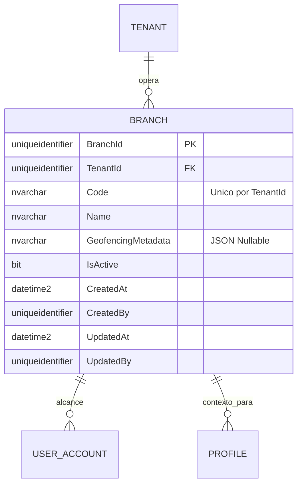
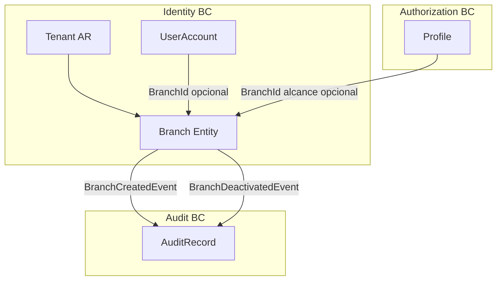

# Branch — Arquitectura del Agregado

> **Idioma:** [English](../../domain/identity/branch.md) | [Español](./branch.md)

**Bounded Context:** Identity  
**Aggregate Root:** `Tenant` (Branch es una entidad propia dentro del agregado Tenant)  
**Modulo:** `Ums.Domain.Identity.Tenant.Branch`  
**Estado:** Produccion

> **Nota DDD:** `Branch` no tiene su propio aggregate root. Es una entidad propia gestionada exclusivamente a traves del agregado `Tenant`. Se documenta por separado por tener ciclo de vida propio, tabla de persistencia propia y porque es referenciada por `UserAccount` y `Profile` via `BranchId`.

---

## 1. Descripcion del Agregado

### Proposito
Una `Branch` representa una unidad de ubicacion fisica o logica dentro de un Tenant. Provee un ambito geografico u organizacional para las asignaciones de `UserAccount` y el contexto de `Profile`. Opcionalmente incluye metadatos de geocercado para restringir o controlar el acceso por ubicacion.

### Responsabilidad de Negocio
- Agrupar usuarios y perfiles bajo un ambito basado en ubicacion.
- Aplicar opcionalmente reglas de geocercado en el acceso.
- Habilitar la delegacion de administracion a nivel de rama.
- Participar en escenarios `ProfileScope = BRANCH` en Authorization.

### Invariantes y Reglas de Consistencia
1. `Code` debe ser unico dentro del `Tenant` propietario.
2. Una `Branch` no puede ser eliminada si existen registros activos de `UserAccount` o `Profile` asociados.
3. `GeofencingMetadata` debe ser JSON valido cuando se proporciona.
4. La desactivacion no elimina; los registros se conservan para trazabilidad historica.

### Eventos de Dominio
| Evento | Disparador |
|---|---|
| `BranchCreatedEvent` | Nueva rama agregada al tenant |
| `BranchDeactivatedEvent` | Rama desactivada |
| `BranchReactivatedEvent` | Rama reactivada |
| `BranchRemovedEvent` | Rama eliminada definitivamente (sin dependientes) |

### Comandos / Casos de Uso
| Comando | Descripcion |
|---|---|
| `AddBranchCommand` | Crear nueva rama en un tenant |
| `DeactivateBranchCommand` | Desactivar (soft) una rama |
| `ReactivateBranchCommand` | Reactivar una rama desactivada |
| `RemoveBranchCommand` | Eliminar definitivamente una rama sin dependientes |
| `UpdateBranchCommand` | Actualizar nombre o metadatos de geocercado |

---

## 2. Modelo de Objetos

```
Tenant (Aggregate Root)
└── Branch (Entidad Propia)
    └── Props: BranchProps
        ├── Id: IdValueObject
        ├── TenantId: TenantId
        ├── Code: Code
        ├── Name: Name
        ├── GeofencingMetadata?: Value (JSON)
        ├── IsActive: bool
        └── Audit: AuditValueObject
```

### Atributos Principales
| Atributo | Tipo | Notas |
|---|---|---|
| `Id` | `Guid` | PK |
| `TenantId` | `Guid` | FK al tenant padre |
| `Code` | `string` | Unico por tenant |
| `Name` | `string` | Nombre para mostrar |
| `GeofencingMetadata` | `string?` | Poligono JSON / coordenadas |
| `IsActive` | `bool` | Indicador de activacion (soft) |

### Ciclo de Vida
```
Activo (IsActive = true) ──► Desactivado (IsActive = false) ──► Activo
                                     └──► Eliminado (si no tiene dependientes)
```

---

## 3. Diagramas de Secuencia

### Flujo: Crear Rama


### Flujo: Desactivar Rama


### Flujo: Eliminar Rama


---

## 4. Modelo Entidad-Relacion



---

## 5. Modelo de Bounded Context



---

## 6. Contrato de Capa de Aplicacion

### Comandos
| Comando | Entrada | Salida |
|---|---|---|
| `AddBranchCommand` | `tenantId, code, name, geofencingMetadata?, createdBy` | `Guid branchId` |
| `UpdateBranchCommand` | `tenantId, branchId, name?, geofencingMetadata?, updatedBy` | `void` |
| `DeactivateBranchCommand` | `tenantId, branchId, actorId` | `void` |
| `ReactivateBranchCommand` | `tenantId, branchId, actorId` | `void` |
| `RemoveBranchCommand` | `tenantId, branchId, actorId` | `void` |

### Casos de Error
| Codigo | Condicion |
|---|---|
| `BRANCH_CODE_DUPLICATE` | Code ya existe en el tenant |
| `BRANCH_NOT_FOUND` | branchId desconocido en el tenant |
| `BRANCH_HAS_DEPENDENTS` | Eliminacion bloqueada por usuarios o perfiles activos |
| `BRANCH_ALREADY_INACTIVE` | Desactivar una rama ya inactiva |

---

## 7. Notas de Persistencia

### Indices
| Indice | Columnas | Tipo |
|---|---|---|
| `IX_Branch_TenantId` | `TenantId` | No unico |
| `IX_Branch_TenantId_Code` | `TenantId, Code` | Unico |
| `IX_Branch_IsActive` | `IsActive` | No unico |

---

## 8. Seguridad y Auditoria

### Reglas de Autorizacion
| Operacion | Rol Requerido |
|---|---|
| Agregar / Eliminar Branch | Tenant:Admin |
| Desactivar / Reactivar | Tenant:Admin |
| Listar Branches | Tenant:Admin · Tenant:UserManager |

### Eventos de Auditoria
- `BRANCH_CREATED`, `BRANCH_DEACTIVATED`, `BRANCH_REACTIVATED`, `BRANCH_REMOVED`
