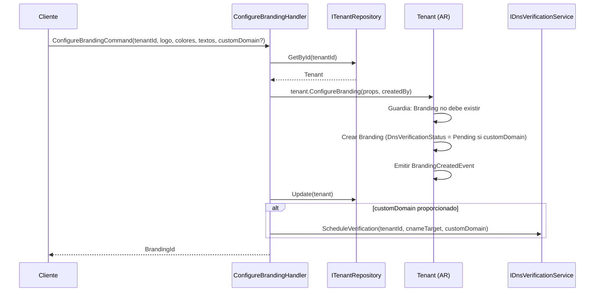
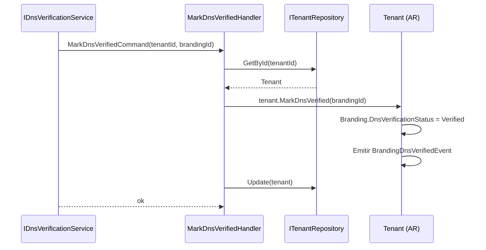
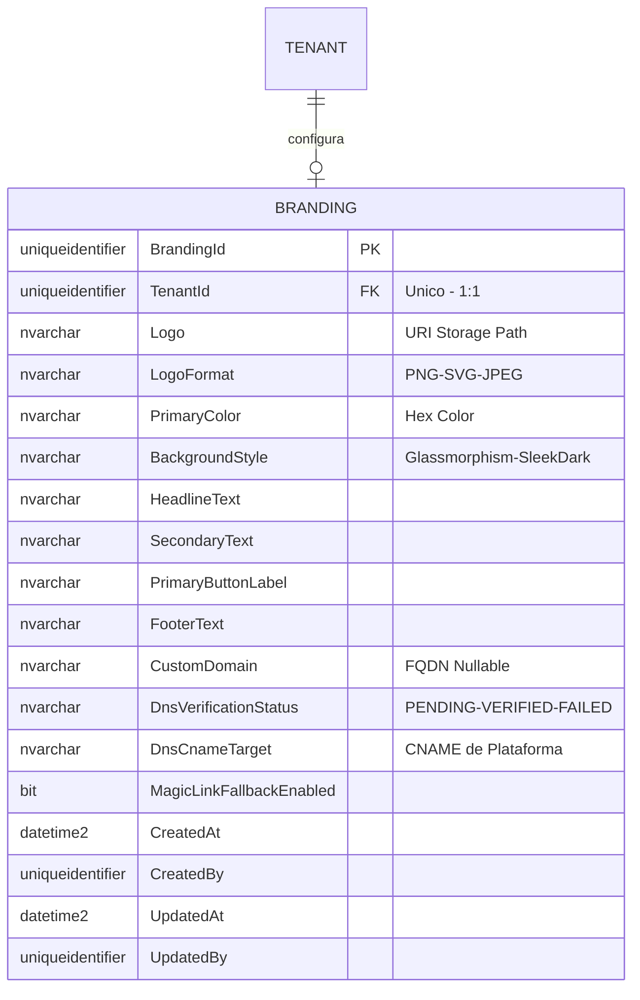
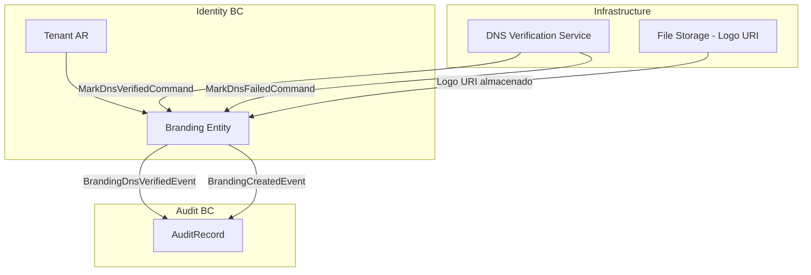

# Branding — Arquitectura del Agregado

> **Idioma:** [English](../../domain/identity/branding.md) | [Español](./branding.md)

**Bounded Context:** Identity  
**Aggregate Root:** `Tenant` (Branding es una entidad propia dentro del agregado Tenant)  
**Modulo:** `Ums.Domain.Identity.Tenant.Branding`  
**Estado:** Produccion

> **Nota DDD:** `Branding` es una entidad propia 1:1 de `Tenant`. Se documenta por separado por su responsabilidad de dominio distinta (identidad visual y gestion de dominio personalizado), su ciclo de vida de verificacion DNS y su impacto en la experiencia de login de todos los clientes.

---

## 1. Descripcion del Agregado

### Proposito
La entidad `Branding` contiene la configuracion de identidad visual para un Tenant: logo, colores, textos de login personalizados y opcionalmente un dominio personalizado con verificacion DNS basada en CNAME. Controla como se renderiza el portal de login especifico del tenant para todas las aplicaciones cliente.

### Responsabilidad de Negocio
- Definir y persistir la marca visual del tenant para la experiencia de login.
- Gestionar la propiedad del dominio personalizado via verificacion DNS CNAME.
- Controlar `MagicLinkFallbackEnabled` para flujos de login sin contrasena.
- Emitir eventos cuando la verificacion DNS tiene exito o falla.

### Invariantes y Reglas de Consistencia
1. Un Tenant puede tener a lo sumo un registro `Branding`.
2. `CustomDomain` debe ser un hostname valido cuando se proporciona.
3. `DnsVerificationStatus` comienza en `PENDING` cuando se establece `CustomDomain`.
4. `DnsVerificationStatus` no puede establecerse manualmente a `VERIFIED` — solo el servicio de verificacion DNS puede hacerlo.
5. `LogoFormat` debe coincidir con el formato real del URI de `Logo` subido.

### Eventos de Dominio
| Evento | Disparador |
|---|---|
| `BrandingCreatedEvent` | Branding configurado por primera vez |
| `BrandingUpdatedEvent` | Cualquier atributo de branding actualizado |
| `BrandingRemovedEvent` | Configuracion de branding eliminada |
| `BrandingDnsVerifiedEvent` | DNS CNAME del dominio personalizado verificado |
| `BrandingDnsFailedEvent` | Intento de verificacion DNS fallido |

### Comandos / Casos de Uso
| Comando | Descripcion |
|---|---|
| `ConfigureBrandingCommand` | Configurar branding por primera vez |
| `UpdateBrandingCommand` | Actualizar atributos visuales o textos |
| `SetCustomDomainCommand` | Agregar o reemplazar el dominio personalizado |
| `RemoveBrandingCommand` | Eliminar la configuracion de branding |
| `MarkDnsVerifiedCommand` | Interno — llamado por el servicio de verificacion DNS |
| `MarkDnsFailedCommand` | Interno — llamado por el servicio de verificacion DNS |

---

## 2. Modelo de Objetos

```
Tenant (Aggregate Root)
└── Branding (Entidad Propia, 0..1)
    └── Props: BrandingProps
        ├── Id: IdValueObject
        ├── TenantId: TenantId
        ├── Logo: Logo
        ├── LogoFormat: LogoFormat
        ├── PrimaryColor: HexColor
        ├── BackgroundStyle: BackgroundStyle
        ├── HeadlineText: LoginText
        ├── SecondaryText: LoginText
        ├── PrimaryButtonLabel: LoginText
        ├── FooterText: LoginText
        ├── CustomDomain?: CustomDomain
        ├── DnsVerificationStatus: DnsVerificationStatus
        ├── DnsCnameTarget: DnsCnameTarget
        ├── MagicLinkFallbackEnabled: bool
        └── Audit: AuditValueObject
```

### Atributos Principales
| Atributo | Tipo | Notas |
|---|---|---|
| `Logo` | `string` | URI al logo subido |
| `LogoFormat` | `LogoFormat` | PNG / SVG / JPEG |
| `PrimaryColor` | `string` | Color hex (ej. `#1A2B3C`) |
| `BackgroundStyle` | `BackgroundStyle` | Glassmorphism / SleekDark |
| `HeadlineText` | `string` | Titulo de la pagina de login |
| `CustomDomain` | `string?` | FQDN opcional |
| `DnsVerificationStatus` | `DnsVerificationStatus` | Pending / Verified / Failed |
| `DnsCnameTarget` | `string` | Valor CNAME que el tenant debe apuntar |
| `MagicLinkFallbackEnabled` | `bool` | Habilita magic link en fallo del IdP |

### Ciclo de Vida — Verificacion DNS
```
(CustomDomain establecido) -> DnsVerificationStatus = Pending
                                 ├──► Verified  (CNAME DNS coincide)
                                 └──► Failed    (CNAME faltante o incorrecto)
                                         └──► Pending (en reintento)
```

---

## 3. Diagramas de Secuencia

### Flujo: Configurar Branding


### Flujo: Verificacion DNS


---

## 4. Modelo Entidad-Relacion



---

## 5. Modelo de Bounded Context



---

## 6. Contrato de Capa de Aplicacion

### Comandos
| Comando | Entrada | Salida |
|---|---|---|
| `ConfigureBrandingCommand` | `tenantId, logo, logoFormat, primaryColor, backgroundStyle, headlineText, secondaryText, primaryButtonLabel, footerText, customDomain?, cnameTarget, magicLinkFallback, createdBy` | `Guid brandingId` |
| `UpdateBrandingCommand` | `tenantId, brandingId, campos..., updatedBy` | `void` |
| `SetCustomDomainCommand` | `tenantId, brandingId, customDomain, updatedBy` | `void` |
| `RemoveBrandingCommand` | `tenantId, brandingId, actorId` | `void` |
| `MarkDnsVerifiedCommand` | `tenantId, brandingId` | `void` |
| `MarkDnsFailedCommand` | `tenantId, brandingId, reason` | `void` |

### Casos de Error
| Codigo | Condicion |
|---|---|
| `BRANDING_ALREADY_EXISTS` | ConfigureBranding llamado dos veces |
| `BRANDING_NOT_FOUND` | Sin branding configurado para el tenant |
| `DNS_ALREADY_VERIFIED` | Intento de re-verificar un dominio ya verificado |
| `INVALID_CUSTOM_DOMAIN` | No es un formato FQDN valido |

---

## 7. Notas de Persistencia

### Indices
| Indice | Columnas | Tipo |
|---|---|---|
| `IX_Branding_TenantId` | `TenantId` | Unico |
| `IX_Branding_CustomDomain` | `CustomDomain` | Unico (parcial - no nulo) |

### Restricciones Unicas
- `TenantId` unico (impone 1:1 con Tenant).
- `CustomDomain` unico entre todos los tenants (un dominio no puede ser reclamado por dos tenants).

---

## 8. Seguridad y Auditoria

### Reglas de Autorizacion
| Operacion | Rol Requerido |
|---|---|
| Configurar / Actualizar Branding | Tenant:Admin |
| Establecer Dominio Personalizado | Tenant:Admin |
| Marcar DNS Verificado/Fallido | Solo servicio interno (sin rol de usuario) |

### Eventos de Auditoria
- `BRANDING_CONFIGURED`, `BRANDING_UPDATED`, `BRANDING_REMOVED`
- `DNS_VERIFIED`, `DNS_FAILED`
