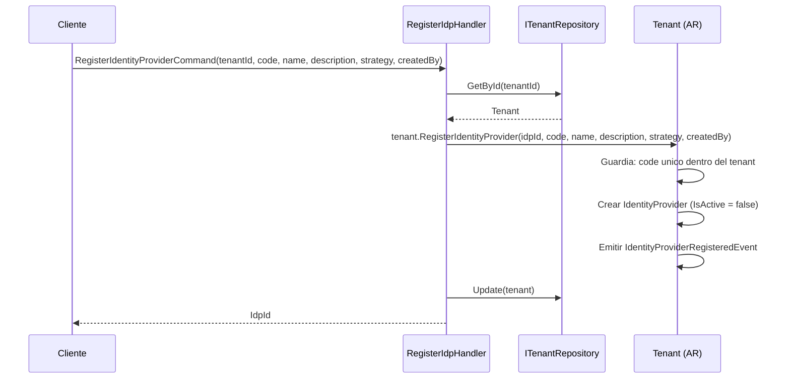
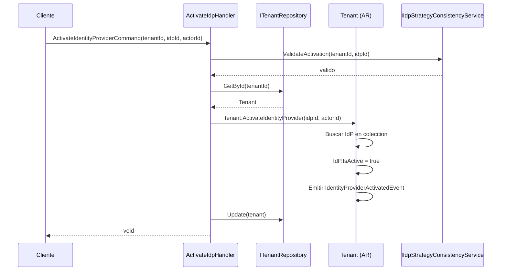
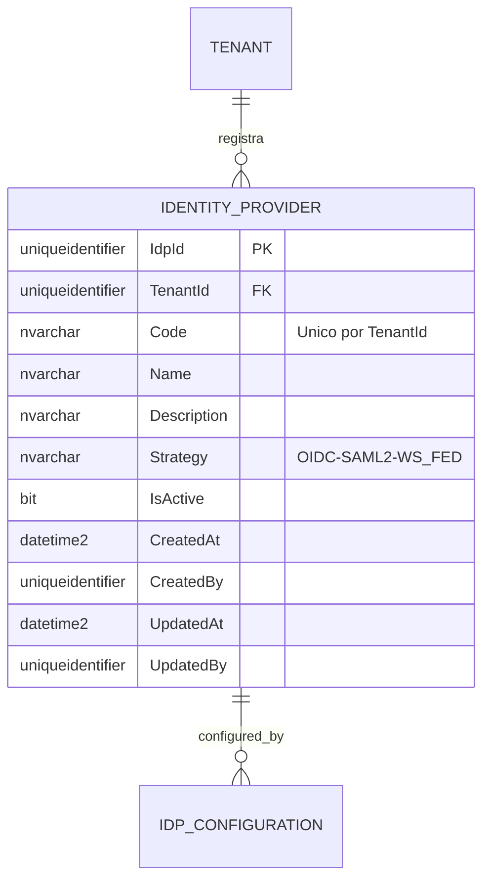
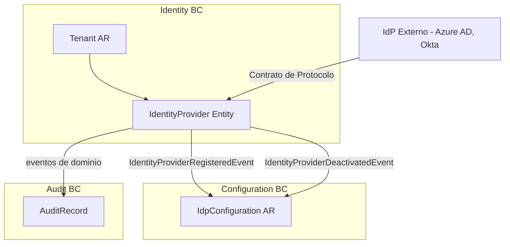

# IdentityProvider — Arquitectura del Agregado

> **Idioma:** [English](../../domain/identity/identity-provider.md) | [Español](./identity-provider.md)

**Bounded Context:** Identity  
**Aggregate Root:** `Tenant` (IdentityProvider es una entidad propia dentro del agregado Tenant)  
**Modulo:** `Ums.Domain.Identity.Tenant.IdentityProvider`  
**Estado:** Produccion

> **Nota DDD:** `IdentityProvider` es una entidad propia dentro del agregado `Tenant`. Se documenta por separado por tener ciclo de vida propio, semantica de estrategia distinta (OIDC/SAML/WS-FED) y ser el registro a nivel de dominio de un contrato IdP para un tenant — distinto de la `IDP_CONFIGURATION` a nivel de protocolo en el Configuration BC.

---

## 1. Descripcion del Agregado

### Proposito
La entidad `IdentityProvider` representa un proveedor de autenticacion externo registrado para un Tenant. Registra la intencion estrategica (que protocolo) y el contrato a nivel de negocio (nombre, codigo, descripcion) para ese IdP. La configuracion tecnica (endpoints, secretos, certificados) vive en `IDP_CONFIGURATION` en el Configuration BC.

### Responsabilidad de Negocio
- Registrar un Proveedor de Identidad externo para un Tenant.
- Rastrear el ciclo de vida de activacion/desactivacion del IdP.
- Definir la estrategia de autenticacion (`OIDC`, `SAML2`, `WS_FED`) a nivel de dominio.
- Servir como referencia de dominio a la que apunta `IDP_CONFIGURATION`.

### Invariantes y Reglas de Consistencia
1. `Code` debe ser unico dentro del Tenant propietario.
2. Un `IdentityProvider` debe ser desactivado antes de ser eliminado.
3. Desactivar un `IdentityProvider` que es el unico IdP activo para un tenant Federado no esta permitido a menos que se cambie primero el `IdpStrategy` del tenant.
4. `Strategy` no puede cambiarse despues del registro — es inmutable una vez establecida.

### Eventos de Dominio
| Evento | Disparador |
|---|---|
| `IdentityProviderRegisteredEvent` | Nuevo IdP registrado bajo un tenant |
| `IdentityProviderActivatedEvent` | IdP activado y disponible para enrutamiento de auth |
| `IdentityProviderDeactivatedEvent` | IdP desactivado (enrutamiento de auth suspendido) |
| `IdentityProviderRemovedEvent` | IdP eliminado definitivamente despues de desactivacion |

### Comandos / Casos de Uso
| Comando | Descripcion |
|---|---|
| `RegisterIdentityProviderCommand` | Registrar nuevo IdP bajo un tenant |
| `ActivateIdentityProviderCommand` | Marcar un IdP como activo |
| `DeactivateIdentityProviderCommand` | Desactivar un IdP activo |
| `RemoveIdentityProviderCommand` | Eliminar definitivamente un IdP inactivo |

---

## 2. Modelo de Objetos

```
Tenant (Aggregate Root)
└── IdentityProvider (Entidad Propia, 0..N)
    └── Props: IdentityProviderProps
        ├── Id: IdValueObject
        ├── TenantId: TenantId
        ├── Code: Code
        ├── Name: Name
        ├── Description: Description
        ├── Strategy: IdpStrategy
        ├── IsActive: bool
        └── Audit: AuditValueObject
```

### Atributos Principales
| Atributo | Tipo | Notas |
|---|---|---|
| `Id` | `Guid` | PK |
| `TenantId` | `Guid` | FK al Tenant padre |
| `Code` | `string` | Unico dentro del tenant |
| `Name` | `string` | Nombre legible por humanos |
| `Description` | `string` | Protocolo y proposito |
| `Strategy` | `IdpStrategy` | OIDC / SAML2 / WS_FED — inmutable |
| `IsActive` | `bool` | Disponibilidad de enrutamiento |

### Ciclo de Vida
```
Registrado (IsActive = false) ──► Activado (IsActive = true) ──► Desactivado ──► Eliminado
```

---

## 3. Diagramas de Secuencia

### Flujo: Registrar IdP


### Flujo: Activar IdP


---

## 4. Modelo Entidad-Relacion



---

## 5. Modelo de Bounded Context



---

## 6. Contrato de Capa de Aplicacion

### Comandos
| Comando | Entrada | Salida |
|---|---|---|
| `RegisterIdentityProviderCommand` | `tenantId, code, name, description, strategy, createdBy` | `Guid idpId` |
| `ActivateIdentityProviderCommand` | `tenantId, idpId, actorId` | `void` |
| `DeactivateIdentityProviderCommand` | `tenantId, idpId, actorId` | `void` |
| `RemoveIdentityProviderCommand` | `tenantId, idpId, actorId` | `void` |

### Casos de Error
| Codigo | Condicion |
|---|---|
| `IDP_CODE_DUPLICATE` | Code existe en el tenant |
| `IDP_NOT_FOUND` | idpId desconocido en el tenant |
| `IDP_STRATEGY_IMMUTABLE` | Intento de cambiar Strategy |
| `IDP_SOLE_ACTIVE_PROVIDER` | Desactivacion dejaria al tenant sin autenticacion |
| `IDP_NOT_INACTIVE` | Eliminacion intentada en IdP activo |

---

## 7. Notas de Persistencia

### Indices
| Indice | Columnas | Tipo |
|---|---|---|
| `IX_IdentityProvider_TenantId_Code` | `TenantId, Code` | Unico |
| `IX_IdentityProvider_TenantId_IsActive` | `TenantId, IsActive` | No unico |

---

## 8. Seguridad y Auditoria

### Reglas de Autorizacion
| Operacion | Rol Requerido |
|---|---|
| Registrar / Eliminar IdP | Tenant:Admin |
| Activar / Desactivar IdP | Tenant:Admin |

### Datos Sensibles
- `IdentityProvider` en si no almacena credenciales. Los secretos viven en `IDP_CONFIGURATION.SecretRef` (ruta al vault).

### Eventos de Auditoria
- `IDP_REGISTERED`, `IDP_ACTIVATED`, `IDP_DEACTIVATED`, `IDP_REMOVED`
