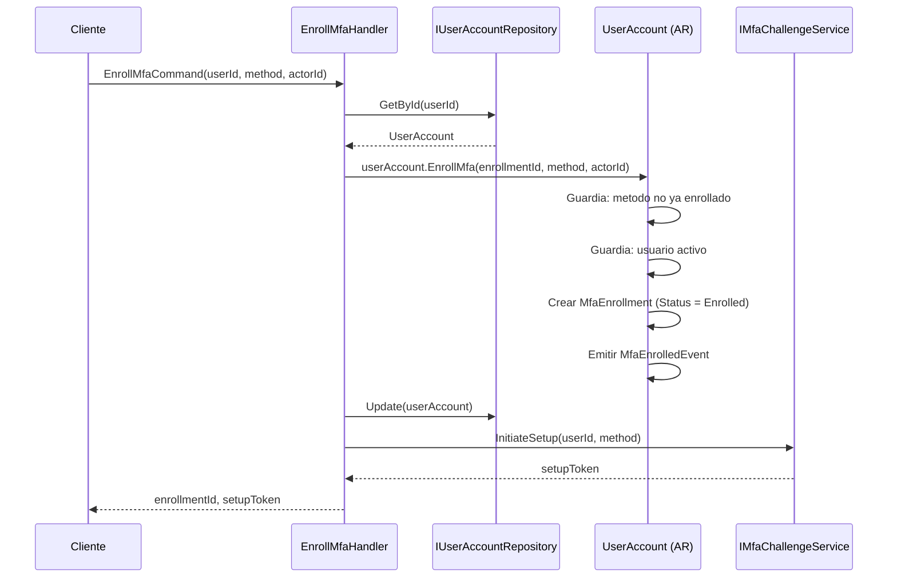
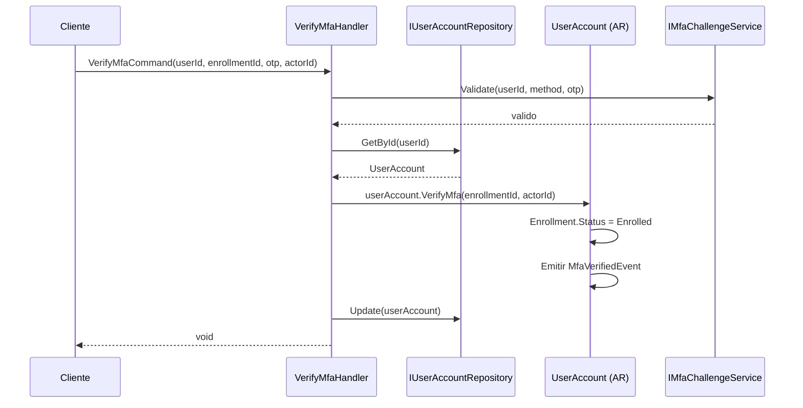
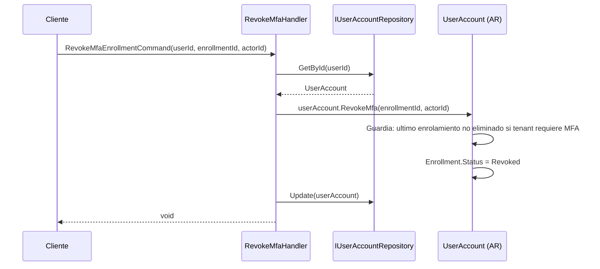
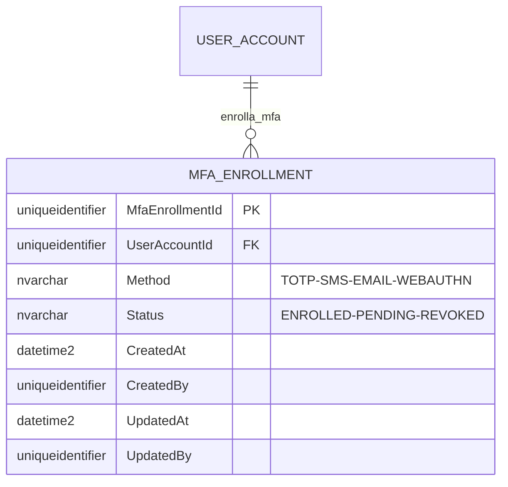
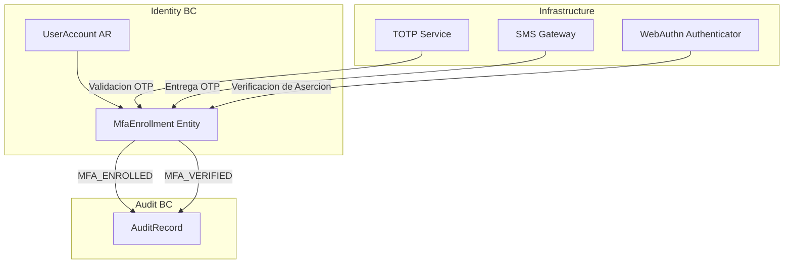

# MfaEnrollment — Arquitectura del Agregado

> **Idioma:** [English](../../domain/identity/mfa-enrollment.md) | [Español](./mfa-enrollment.md)

**Bounded Context:** Identity  
**Aggregate Root:** `UserAccount` (MfaEnrollment es una entidad propia)  
**Modulo:** `Ums.Domain.Identity.UserAccount.MfaEnrollment`  
**Estado:** Produccion

---

## 1. Descripcion del Agregado

### Proposito
`MfaEnrollment` registra el enrolamiento de un usuario en un metodo MFA especifico (TOTP, SMS, Email, WebAuthn). Se pueden enrolar multiples metodos por usuario. Cada enrolamiento tiene su propio ciclo de vida (Enrolled, Pending, Revoked), permitiendo a los usuarios gestionar sus opciones de segundo factor de forma independiente.

### Responsabilidad de Negocio
- Rastrear que metodos MFA ha enrollado un usuario.
- Gestionar el ciclo de vida del enrolamiento: Pending -> Enrolled -> Revoked.
- Asegurar un registro de enrolamiento por metodo por usuario.
- Alimentar los flujos de autenticacion con la lista de segundos factores disponibles.

### Invariantes y Reglas de Consistencia
1. Un usuario puede enrolar cada `MfaMethod` a lo sumo una vez — sin metodos duplicados.
2. Transiciones de estado del enrolamiento: `Pending -> Enrolled -> Revoked`.
3. `UserAccount.Status` debe ser `Active` para enrolar un nuevo metodo.
4. Al menos un metodo enrollado debe permanecer si el tenant requiere MFA.

### Eventos de Dominio
| Evento | Disparador |
|---|---|
| `MfaEnrolledEvent` | Nuevo metodo MFA enrollado |
| `MfaVerifiedEvent` | Desafio MFA completado exitosamente |

### Comandos / Casos de Uso
| Comando | Descripcion |
|---|---|
| `EnrollMfaCommand` | Enrolar nuevo metodo MFA |
| `RevokeMfaEnrollmentCommand` | Revocar un metodo enrollado |
| `VerifyMfaCommand` | Confirmar desafio MFA (transicion Pending -> Enrolled) |

---

## 2. Modelo de Objetos

```
UserAccount (Aggregate Root)
└── MfaEnrollment (Entidad Propia, 0..N)
    └── Props: MfaEnrollmentProps
        ├── Id: IdValueObject
        ├── UserAccountId: UserAccountId
        ├── Method: MfaMethod
        ├── Status: MfaEnrollmentStatus
        └── Audit: AuditValueObject
```

### Atributos Principales
| Atributo | Tipo | Notas |
|---|---|---|
| `Id` | `Guid` | PK |
| `UserAccountId` | `Guid` | FK a UserAccount |
| `Method` | `MfaMethod` | TOTP / SMS / EMAIL / WEBAUTHN |
| `Status` | `MfaEnrollmentStatus` | Enrolled / Pending / Revoked |

### Ciclo de Vida
```
Pending ──► Enrolled ──► Revoked
```

---

## 3. Diagramas de Secuencia

### Flujo: Enrolar MFA


### Flujo: Verificar MFA


### Flujo: Revocar MFA


---

## 4. Modelo Entidad-Relacion



---

## 5. Modelo de Bounded Context



---

## 6. Contrato de Capa de Aplicacion

### Comandos
| Comando | Entrada | Salida |
|---|---|---|
| `EnrollMfaCommand` | `userId, method, actorId` | `Guid enrollmentId, setupToken` |
| `VerifyMfaCommand` | `userId, enrollmentId, otp, actorId` | `void` |
| `RevokeMfaEnrollmentCommand` | `userId, enrollmentId, actorId` | `void` |

### Consultas
| Consulta | Retorna |
|---|---|
| `GetUserMfaEnrollmentsQuery(userId)` | `List<MfaEnrollmentDto>` |

### Casos de Error
| Codigo | Condicion |
|---|---|
| `MFA_METHOD_ALREADY_ENROLLED` | Mismo metodo enrollado dos veces |
| `MFA_ENROLLMENT_NOT_FOUND` | enrollmentId desconocido |
| `MFA_LAST_ENROLLMENT` | Revocar dejaria al usuario sin MFA (requerido) |
| `MFA_VERIFICATION_FAILED` | OTP invalido |

---

## 7. Notas de Persistencia

### Indices
| Indice | Columnas | Tipo |
|---|---|---|
| `IX_MfaEnrollment_UserAccountId_Method` | `UserAccountId, Method` | Unico (solo activos) |

### Restricciones Unicas
- `(UserAccountId, Method)` — solo un enrolamiento por metodo por usuario.

---

## 8. Seguridad y Auditoria

### Reglas de Autorizacion
| Operacion | Rol Requerido |
|---|---|
| Enrolar MFA | Usuario mismo |
| Revocar MFA | Usuario mismo o Tenant:Admin |
| Verificar MFA | Usuario mismo |

### Eventos de Auditoria
- `MFA_ENROLLED`, `MFA_VERIFIED`, `MFA_REVOKED`

### Cumplimiento
- Los registros de enrolamiento MFA deben conservarse para trazabilidad de auditoria incluso despues de la revocacion.
- Las credenciales WebAuthn (passkeys) nunca deben almacenar datos raw de atestigamiento FIDO en el modelo de dominio — eso pertenece a la capa de infraestructura.
